:doctype: book
:toc: left
:toclevels: 2
:sectnums:
:icons: font
:source-highlighter: rouge
:figure-caption: Figure

= The Semantic Enterprise: Data Architecture for the Agentic Era
Iman Poernomo
:revdate: {docdate}

== Introduction

Your data platform was built for a consumer who should no longer exist.

For thirty years, data architecture was optimized for a human analyst with SQL skills, domain knowledge, and the ability to compensate for bad infrastructure by just being smart. The databases were designed for her. The dashboards were built for or "self-served" by her. The business got the data it more or less needed thanks to the tacit understanding that she would be the one squinting at the numbers, calling a colleague when something looked off, and making a judgment about which of the three conflicting revenue figures was probably the right one. Maybe being a bit more forensic about the lineage. At best, the company may have hired a Chief Data Officer to document the names of the data elements she managed in a repository, award her the title of data steward or owner, and give her a bunch of new steercos to attend and chair.

This consumer hasn't disappeared. But, if your org is any good, the primary consumer of your data platform will soon be machine: an AI agent that queries your tables, reads your definitions, and produces answers based on the laws of context windows and attention mechanisms. Today I write in 2026: most enterprise agents are still pilots rather than production systems; the shift is underway, not complete. But it is underway fast, and if you're not thinking about the agentic consumer, you're arguably on the wrong side of the existential threat from your competition. You are building for a machine consumer who lacks tacit human intuition, who is brilliant but cost-effective only when given sufficient background, and who improvises expensively, unpredictably and confidently in the face of ambiguity. A consumer whose brain is the sum of your semantics.

[#fig-old-vs-new-consumer]
.The old consumer compensated for ambiguity; the new one amplifies it. Build for the consumer that cannot squint.
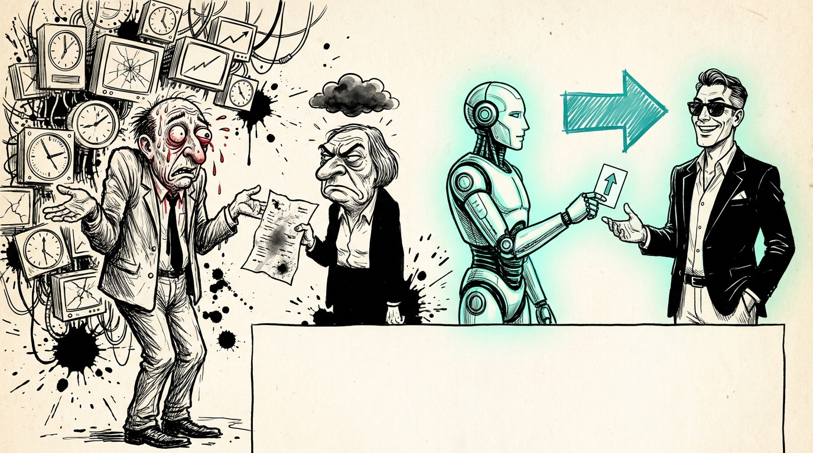

This changes how you should build your data architecture, how you govern it, what skills your team needs, what you should spend money on and what you should stop spending money on. It changes the role of the dashboard, the data catalog, the Chief Data Officer. 

Architectural patterns that have been industry standard for decades can become actively harmful. Other patterns become mandatory, ones that information architects have been arguing for since the 1990s, but largely ignored because they were consider mere hygine.

Eight convictions run through this book. That physical storage and logical meaning must be decoupled; that meaning flows in one direction and upstream always wins; that Silver inherits dimensional discipline and serves as a governed analytical surface in its own right, while Gold’s fast default is flat denormalized publication; that AI goes through the same semantic layer as every other consumer; that governance must be embedded in the execution pipeline or it does not exist; that semantic infrastructure is a prerequisite, not a feature; that the system should know what it knows and what it does not; that domain vocabularies must compose coherently — that a question spanning finance, trading, and custody must resolve to a consistent answer even though each domain defines its terms differently; and that information density per token — not context window size — is the binding constraint on every system that serves an AI consumer. None of these were deduced from first principles. They were forged in arguments, failures, and near-misses across thirteen years of running data platforms.

=== Intellectual Foundations

The formal spine of this book is decades-old mathematics that has just found its moment. Composing many domain theories into one — gluing them along what they share, the pushouts and colimits of category theory — was worked out for program synthesis in the 1990s, long before anyone needed it for data. It turns out to be exactly what the agentic age demands: a principled way to fuse a hundred local vocabularies into one coherent whole an agent can reason across, with every loss and gap made explicit rather than papered over. Here is where the ideas come from, and why they hold.

The categorical framework — domains as theories, cross-domain bridges as structure-preserving maps, and the composed enterprise view as the colimit obtained by gluing those theories along what they share — sits in a tradition of composing formal specifications by pushout. Two domains that share an entity are glued along that shared sub-theory; the result is the pushout, the smallest gluing that adds nothing the two did not already agree on; many domains compose as the colimit of the whole bridge diagram, built by iterated pushout. This is the construction I developed with Crossley and Wirsing in the late 1990s: a logical calculus whose structural rules were exactly the operations for modifying specifications — renaming, hiding, and taking unions, that last being the pushout (WADT'99; the framework later generalized across deductive systems and gathered in our 2005 monograph). Here it is transported from specifications of programs to the integration of data models — where the gluing is cheaper to state, and the hard part is no longer the static composition but its evolution. David Spivak’s functorial data migration and ologs (2012, 2014) are the recent database-specific instance of the same categorical intuition, modeling schemas as categories and migrations as functors between fixed schema maps; that work moves instances along a given map, where the concern here is composing and evolving the schemas themselves. The parent is the specification-composition tradition; Spivak is the cousin. Where this book departs from both: the colimit here is a dynamic trajectory across organizational evolution, not a static construction — an eval target with gaps, maintained by agents, not a completed mathematical object. The mathematics of the gluing was settled decades ago. What is new is operationalizing it for data platforms that change faster than any formal specification can track.

Bitemporality — valid time versus system time, the two-axis row, the three query modes — inherits from Richard Snodgrass’s foundational work on temporal databases (2000) and the SQL:2011 standard for temporal tables. The three query modes in this book (as-of-now, as-of-valid-time, as-of-report-time) correspond to Snodgrass’s current, sequenced, and nonsequenced temporal query taxonomy. Relabeling into practitioner-accessible language is deliberate, not a claim of novelty. Where this book adds: bitemporality as the default for the entire Silver substrate (not an opt-in feature for regulated workloads), and the extension to bitemporal ontology — ontologies themselves as versioned, temporal objects.

Domain-specific vocabularies connected by structure-preserving translations echo Joseph Goguen’s theory of institutions (1992) — formal systems glued together by truth-preserving maps, and the logical home of the specification-composition tradition above: the maps along which specifications are glued are institution morphisms. Morphism honesty discipline in this book is institutions made operational: not just that maps exist, but that their losses, partialities, and verification state are first-class documented objects. The bridges this book glues by pushout are exactly such maps, made to carry their own honesty data.

Dimensional modelling’s durable principles — grain discipline, conformed dimensions, slowly changing dimensions — were articulated by Ralph Kimball across multiple editions of _The Data Warehouse Toolkit_ (1996–2013). Bill Inmon’s corporate information factory established subject-oriented integration as an architectural principle. This book inherits specific principles from both traditions while claiming allegiance to neither. The synthesis — domain-canonical Silver built for columnar engines, flat Gold as strong default alongside Silver-as-Gold views for dimensional depth, semantic layer as the logical ontology governing both — is its own position, shaped by constraints that did not exist when either tradition was formalized.

Zhamak Dehghani’s data mesh (2022) correctly identified domain ownership as a structural principle and centralized data teams as bottlenecks. This book’s critique — that mesh underspecifies the semantic layer, producing federation without composition — is a critique of implementation gaps, not of the ownership principle. Federated governance as practiced here (central semantic layer, domain-owned Gold, explicit morphisms) owes more to mesh than it argues against.

One intellectual decision requires explicit defense. This book prescribes prose documentation (domain essays of 600–1500 words) over structured knowledge representation (OWL ontologies, SPARQL endpoints, formal description logics). The Semantic Web program — OWL, RDF, linked data — was explicitly built for machine reasoning. Dismissing it deserves an argument, not an assumption.

The argument: the dominant machine consumer of enterprise data documentation has shifted from symbolic reasoners (which process OWL) to large language models (which process natural language). OWL supports automated consistency checking and subsumption reasoning. Prose supports contextual understanding of edge cases, conventions, and operational craft. Both are machine-readable. They serve different reasoning architectures. When the primary machine consumer was a reasoner checking class hierarchies, OWL was correct. When the primary machine consumer is an LLM reasoning over operational context, prose is correct. This is not a regression from structured knowledge representation. It is a format shift driven by a consumer shift — the same argument the book makes about every other architectural decision.

Structured metadata anchors (datatypes, keys, refresh cadence, lineage) that survive from the ISO 11179 tradition serve the cross-reference and integration functions that structured formats handle well. Semantic weight — the operational knowledge that determines whether an agent reasons correctly or plausibly — lives in the essay. Both formats, serving different functions, governed together.

Examples use dbt, Looker, BigQuery, and Claude because they are drawn from practice. The architecture is stack-agnostic —- every principle works with whatever tools your organization has committed to. The final essay is prescriptive: what to do Monday morning. The rest earn that right by making the argument first.

The assumed reader runs a data platform, leads a data engineering team, or is responsible for the analytical infrastructure of an organization. Familiarity with semantic layers, dbt, and the Bronze/Silver/Gold convention is assumed. Agreement is not. Every opposing position is stated fairly, then dismantled. You will recognize yourself in at least one of them.

If this book does its job, you will finish it with a different mental model of what a data platform is for: an infrastructure for making facts available to any consumer —- human, dashboard, AI agent, regulatory submission —- through a shared vocabulary that makes the facts mean the same thing to everyone who touches them.

Language —- human language —- is what data architecture is made of. Your column names, your definitions, your glossary terms, your schema descriptions: these are not documentation. They are the interface between your organization’s knowledge and every system that reasons over it. Get them right, and your AI agents reason correctly, your dashboards agree with each other, and your new hires understand the data estate in their first week. Get them wrong, and no amount of dashboard redesign or governance committee meetings will save you.

Not a comfortable position for an industry that thinks of itself as building pipelines. Pipelines are plumbing. The craft —- the actual hard work, the thing that determines whether your platform creates clarity or confusion —- is deciding what "revenue" means, where the boundary between "trading" and "market-making" falls, whether "position" is one concept or three. Linguistic decisions with engineering consequences, and the industry has systematically underinvested in the people and tools needed to make them well.

AI changes the calculation. Not by making the decisions easier —- they are as hard as they have ever been —- but by making the consequences of getting them wrong impossible to ignore, and the infrastructure to get them right dramatically cheaper to build.

== The Shift

Actually, data platforms fail all the time. They don't fail when you've tracking clean metadata. This has always been the case. But AI is a forcing function. A crap data platform with patchy semantics can still be usable if you've got humans willing to patch together gaps in understanding, remember where things are, keep a record of the weird tweaks and nuances of where to find data and what it means. A crap data platform with patchy semantics means enterprise agentic intelligence is a non starter. 

=== The 1% Problem

A team was showing off an MCP-to-database solution that allows a user to query and analyse data on their lake. Not a vendor demo with canned data —- real production data, real queries, real business questions asked by real executives who had not been prepped on what to ask. The kind of demo where the CEO asks something nobody anticipated. The system was running at 98 to 99 percent accuracy on ad hoc queries. Ninety-eight to ninety-nine percent. On arbitrary natural language questions against a production data warehouse, with no canned responses, no tricks. Pretty good: that is a number that makes people lean forward in their chairs and start imagining what their organization would look like with this capability. Demo with Exco went well and a go decision was made to roll out to the organization.

But what mattered to be prime time was the 1 to 2 percent failure rate — not its size, but its cause. Every single failure traced to the same root cause. The model was smart enough. Every failure was a context failure. The AI did not know what a term meant because nobody had told it — not because the term was obscure or the concept complex, but because nobody had written a definition and put it where the AI could read it.

One query failed because an internal metric —- a score the research team used daily, discussed in meetings, referenced in reports —- was not mapped in the semantic layer. The analyst who built the dashboard called it one thing. The warehouse table used a completely different name. No one had built the mapping. The AI either returned nothing or guessed. Both outcomes are bad: returning nothing makes the stakeholder think the data does not exist; guessing makes the stakeholder think the data says something it does not.

Another query returned zeros for collateral values —- every row present and correct in the warehouse, but the table carried a machine-internal name that matched nothing a stakeholder would ask for. The AI could not find what it could not name, and reported "no data" while the data sat untouched. The fix took minutes: map the business concept to the physical table in the semantic layer.

In every case, the fix was the same: add the definition to the semantic layer. Map the business concept to the physical table. Tell the AI what the term means, in language it can process, and the query works.

This pattern repeated so consistently that the team developed a rule of thumb: when the AI gets it wrong, check the semantic layer first. Nine times out of ten, the definition is missing or the name does not match the concept. The tenth time, the definition exists but is ambiguous enough that the AI misinterpreted it —- which is the same problem at a different level of granularity.

Semantic infrastructure is a bottleneck to agentic analysis. Billions go to on larger models, better architectures, more sophisticated training regimes. All of that matters. But for enterprise data —- for whether an AI agent can answer your CFO’s question correctly —- the constraint is not the model. The constraint is whether someone wrote a three-sentence description of what "trading volume" means and put it somewhere the AI can read it. The glamorous constraint is the model. The actual constraint is the vocabulary.

Benchmarks point the same way, though the numbers need reading with care, because they come from different measurement regimes. On adversarial enterprise benchmarks scored by strict execution accuracy —- does the generated query return exactly the right rows —- raw text-to-SQL against unstructured schemas is genuinely hard: reported accuracies run from the low tens of percent upward, and on the hardest suites frontier models score worse still. Those scores understate real-world performance, because strict execution scoring also penalizes answers a human would accept. Pointed the other way, recent vendor testing on a well-named, well-modeled flat schema reports practical accuracy in the mid-nineties with no semantic layer at all —- which is the same lesson from the other side: the data model carries the meaning. The claim is therefore not a single leap from 40 percent to 100. It is this: ambiguity in the schema is what produces wrong answers, and a governed semantic layer removes that ambiguity by construction. Where a query falls within the semantic layer’s scope, the LLM selects metrics and dimensions and the query engine generates the SQL deterministically, so the model cannot produce a subtly wrong result —- accuracy on that query class approaches the ceiling. The model is the same model. The infrastructure changed. The win is  against ambiguity, not against the model’s intelligence.

This should keep every data leader up at night. AI consumes more than your data. It reads your standards, your architecture documents, your naming conventions, your glossary. Every piece of written material that describes what your data means is now read by machines. If those documents are ambiguous —- and most of them are, because they were written for humans who fill in gaps with context —- your AI will inherit your confusion and operationalize it at scale. The machine reader does not compensate. It reproduces.

=== The Binding Constraint

Most conversations about AI and data start in the wrong place — with context windows. How many tokens can the model hold? How much schema can we fit? The assumption is that the problem is volume —- that if we could just get enough data into the prompt, the agent would figure it out. This assumption is wrong, and it is wrong in a way that has direct architectural consequences.

What matters is not how much context fits in the window but how much meaning each token carries. Call it information density per token. A context window stuffed with ten thousand tokens of raw DDL and sample rows is not ten times more useful than a thousand tokens of governed semantic definitions. It is frequently less useful, because every token of noise dilutes every token of signal, and attention does not scale linearly with context length. The model does not process its hundredth token with the same fidelity it applies to its tenth. Long-context degradation in recall and reasoning accuracy is well-attested in the research literature on frontier models. More context is not better context. Denser context is better context.

This reframes the entire architectural question. The goal is not "get data to the agent." The goal is "maximize the information density of what reaches the agent." These are different engineering objectives, and they produce different architectures.

==== Two scenarios on a trading desk

Consider an equity trading desk with the usual core data assets: orders, executions, positions, counterparty records, instrument references, desk identifiers. The data lives in silver and gold layers on a modern lakehouse stack. An analyst —- or, increasingly, an agent acting on behalf of one —- asks a question that sounds straightforward:

"What was our desk’s P&L by strategy last quarter?"

Well-posed in English. Not well-posed in SQL until at least four embedded ambiguities are resolved. Which P&L —- realized, unrealized, mark-to-market, or a desk-specific definition that includes funding cost? What counts as "strategy" —- is that the strategy tag on the order, the strategy classifier on the execution, or the portfolio-level strategy assignment? "Last quarter" in which calendar —- strict calendar quarter, fiscal quarter, or trading-day quarter? And which desk —- the organizational desk, the booking entity, or the risk desk?

A competent human analyst on the desk resolves these in seconds, often without consciously enumerating them, because every answer is embedded in tribal knowledge. "We use mark-to-market unless the question is for the compensation committee." "Strategy means the portfolio tag, not the order tag —- the order tag is unreliable since the migration." "Last quarter means calendar Q1 unless Finance sent the email." An agent has no tribal knowledge. The agent has whatever you put in its context. Everything that follows is about that.

*Scenario A.* The agent receives the six relevant tables as DDL —- CREATE TABLE statements —- plus five sample rows from each. A condensed version of what arrives: column names like `exec_id`, `order_id`, `cpty_id`, `cpty_tier`, `instrument_id`, `desk_id`, `exec_ts`, `quantity`, `price`, `side`, `ingestion_ts`. The counterparties table has `cpty_id`, `cpty_name`, `cpty_tier`, `valid_from`, `valid_to`, `is_current`. The instruments table has `instrument_id`, `isin`, `ticker`, `region_code`, `asset_class`. And so on for orders, positions, desks. The full payload runs roughly twenty-five hundred tokens.

Walk through what the agent can determine from this. It can guess that `strategy_id` on the orders table represents some kind of strategy classification. It cannot tell whether the strategy tag on executions denotes the strategy at order time, the strategy at fill time, or a downstream assignment that was applied after the fact. Two columns with similar names on different tables —- the agent assumes they are equivalent. They probably are not. It can see `valid_from`, `valid_to`, and `is_current` columns on the counterparties dimension and may correctly infer SCD2. It will not know which column on executions is the surrogate for strategy-at-time, because the schema does not say. It has no P&L definition. There are price and quantity columns; the agent can construct a notional, but mark-to-market versus realized versus unrealized is not derivable from the schema, and no documentation flags the absence.

A plausible SQL query results. It joins six tables. It picks the order-level strategy tag because it appears first in the schema and has a simpler join path —- a reasonable heuristic that happens to select the deprecated classifier. It conflates two temporal grains: the strategy at order time and the strategy at fill time, treating them as interchangeable because nothing in the DDL distinguishes them. It computes a notional P&L from price times quantity, which is neither mark-to-market nor realized nor anything the desk would recognize as a number they manage to. It applies calendar-quarter logic to a desk that runs on fiscal quarters, because nothing in the schema says otherwise and calendar quarters are the default assumption.

Numbers come back. Wrong in four independent ways, any one of which would make the answer useless for decision-making. But the numbers look plausible —- they are in the right order of magnitude, they break down by something that looks like a strategy, they cover something that looks like a quarter. A busy desk head glancing at the output might not catch the errors for hours, or days, or until a downstream decision has already been made on the basis of numbers that were fabricated from structural ambiguity. The agent reports them with confidence, because the schema gave it no reason to qualify. This is the failure mode that matters. The failure is not that the agent declines to answer. The failure is that the agent answers wrongly and presents the answer as authoritative.

*Scenario B.* The agent receives a different context. Three components.

First, a six-hundred-word domain essay on the equity trading data substrate, covering provenance, the calendar convention (calendar quarter unless explicitly fiscal), the strategy classification hierarchy (portfolio-level is canonical, order-level is deprecated since the migration), the three canonical P&L definitions and which is the desk default, and the temporal contracts on executions and counterparties.

Second, a semantic-layer declaration exposing the executions fact and the strategy dimension with grains, joins, and measures declared explicitly. The measures name `pnl_mtm` as mark-to-market P&L with a description: "Default measure for strategy analysis." A second measure, `pnl_realised`, carries the note: "Use when explicitly requested." The join to the strategy dimension specifies the relationship, the join key, and a human-readable description: "Portfolio-level strategy assignment. Default for desk-level analysis. Do not use order-level strategy tag."

Third, per-table temporal contract metadata indicating that executions are bitemporal at row level, that the strategy dimension is SCD2 with portfolio-level assignment exposed as the default, and that "last quarter" resolves to calendar Q1 unless the query specifies fiscal.

Roughly eighteen hundred tokens total. Less than the schema dump.

The agent now reads, before it reasons, that the default P&L is mark-to-market, that the strategy classifier is the portfolio tag, that calendar quarter applies, and that desk means the organizational desk with a specific join path. It composes the query. It uses the declared measure. It joins through the declared relationship. It applies the documented calendar convention. The query is correct. The answer is correct. Where it chose a default, it surfaced the choice rather than burying it. Where it could not resolve an ambiguity from the documentation, it flagged the gap rather than guessing.

Less context. More fidelity.

Same model. What changed is what the tokens carried. In Scenario A, twenty-five hundred tokens delivered column names, datatypes, and sample values —- raw structural information that is necessary for query generation but radically insufficient for query correctness. In Scenario B, eighteen hundred tokens delivered declared measures, named relationships, documented conventions, and explicit warnings about deprecated fields. Seven hundred fewer tokens. Dramatically more meaning per token. The difference between wrong and right was better context, not more of it.

[#fig-context-per-token]
.Context per Token: Scenario A versus Scenario B
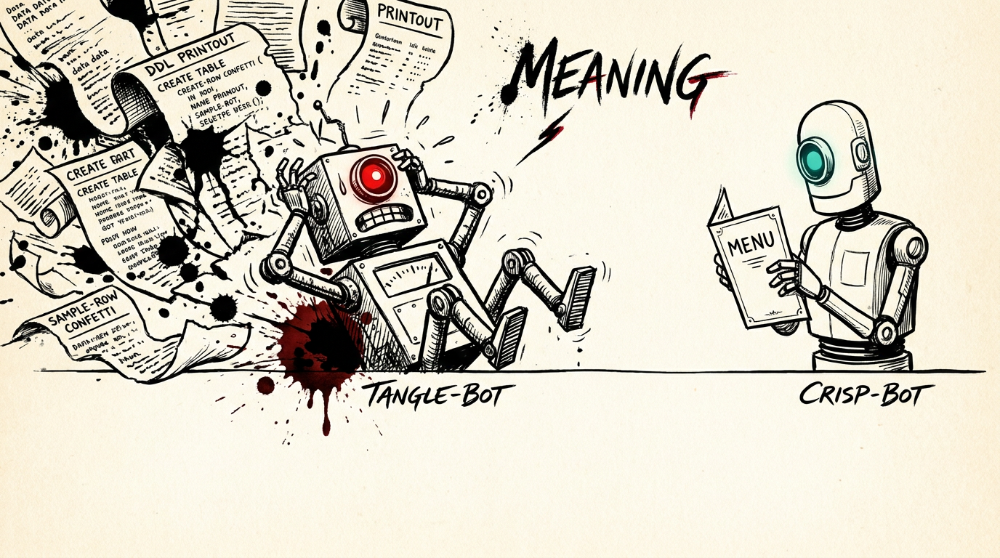

This pattern is structural, not specific to trading desks. Any domain with institutional conventions —- which is every domain —- will produce the same divergence between schema-dump and semantic-layer approaches. The schema tells the agent what the data looks like. The semantic layer tells the agent what the data means. Confusing the two is like handing someone a dictionary and expecting them to write a novel in a language they have never spoken.

==== Why this is the constraint that governs everything else

Marginal tokens in the schema-dump scenario are mostly redundant. Each additional sample row reveals patterns already visible from the first three. The marginal token in the semantic-layer-plus-essay scenario carries genuinely new structural information —- a relational fact, a documented edge case, a temporal contract surfaced explicitly. Doubling the schema dump does not approach the fidelity of the semantic approach, because the bottleneck is not how many sample rows the agent sees. The bottleneck is what the rows mean, and that information is not in the rows.

Three reasons this is the binding constraint for the entire architecture.

Context windows expand but never become free. Every additional token costs latency, inference cost, and —- more subtly —- attention dilution. A system whose architecture requires fifty thousand tokens of context to answer a single business question correctly is, at sufficient query volume, operationally indistinguishable from a system that does not work. The fantasy of infinite context windows —- the idea that we will eventually just dump the whole schema and let the model sort it out —- ignores that attention is a finite resource even when tokens are cheap. A 200,000-token context window with 180,000 tokens of noise and 20,000 tokens of signal will underperform a 5,000-token window where every token carries structural meaning. The architecture that stuffs the window is betting against the physics of attention. The architecture that curates the window is working with it.

The question for agentic data systems is never whether a particular agent answers a particular query in a particular happy path. It is whether the system generalizes across domains the agent has not seen before. A schema-dump approach can be hand-tuned for a narrow set of well-rehearsed query patterns. It collapses the moment composition across unfamiliar domains is required. A semantic-layer-plus-essay approach degrades gracefully because each domain’s contribution to the agent’s context is high in relational density and low in redundancy. The system stays answerable as the surface area grows. This is the difference between a demo and a product.

The constraint is uniquely exposed by agentic workloads. Human analysts handle low information density per token by importing their own context —- domain knowledge, organizational lore, the muscle memory of a thousand previous queries. The deficit of an undocumented schema is absorbed silently by the analyst’s reservoir of background knowledge. Agents have no such reservoir. Whatever is not in the context is not being reasoned over. The deficit does not degrade gracefully. It becomes failure. This is what makes the agent the most honest consumer your data platform has ever had: it cannot fake understanding. It either has the context or it does not, and when it does not, the failure is visible immediately rather than buried in an analyst’s silent compensation.

Context cost is measured in reasoning quality per token, not in tokens. A thousand tokens of governed semantic definitions that produce a correct answer cost less —- in every dimension that matters —- than ten thousand tokens of raw DDL that produce a wrong one. The inference bill is lower. The latency is lower. The error rate is lower. The trust is higher. The economics run in one direction, and they run hard.

For AI-aware data architecture, the binding constraint is not where data sits, how fast queries return, or how cheaply it is stored. It is the rate at which the system delivers structurally meaningful, compositionally usable signal into a bounded context window. Context per token. This is the concept that governs everything else in this essay and, if the argument holds, everything else in the way you build your data platform from this point forward. Every architectural decision —- how you model your tables, how you document your domains, how you expose your data to consumers —- is either increasing or decreasing the information density per token that an agent receives. The organizations that optimize for this metric will build platforms that work. The organizations that optimize for context volume will build platforms that produce confident, articulate, wrong answers.

==== Toward a metric

A fair objection: "context per token" as used above is a practitioner heuristic, not a formal metric. The critic who calls it unfalsifiable in its current form is correct. Without a precise definition, any success can be attributed to high density and any failure to low density, which is tautology, not measurement. The concept deserves more rigor than it has received so far.

What we mean precisely: context per token is the ratio of decision-relevant semantic content to total token count in an agent’s context window. A token is decision-relevant if removing it would change the agent’s query plan or degrade the correctness of its answer. A token is noise if removing it would not. This definition is clear enough to reason about. It is not yet clear enough to compute.

Three candidate formalizations point toward what a proper metric would look like.

First, mutual information. Measure the mutual information between the context provided and the probability distribution over correct SQL queries. Higher mutual information means higher density — the context reduces uncertainty about the correct query by a greater amount per token consumed. This has the advantage of being grounded in information theory and the disadvantage of requiring a ground-truth distribution over correct queries, which is expensive to construct.

Second, task-specific accuracy normalized by token count. For a fixed set of business questions, measure accuracy and divide by the number of context tokens consumed. Accuracy-per-token gives a comparable ratio across context strategies: schema dump versus semantic layer, verbose versus compressed, flat versus joined. The metric is simple. It conflates two axes — accuracy and efficiency — in a single number, which is both its appeal and its limitation.

Third, compression ratio. Take N tokens of raw schema and determine how many tokens of semantic context produce equivalent answer quality. The ratio is the density multiplier. If 1,800 tokens of semantic context match the accuracy of 25,000 tokens of raw DDL, the multiplier is roughly 14x. This is the most intuitive of the three and the easiest to compute empirically. It is also the least theoretically grounded, because "equivalent answer quality" requires its own operationalization.

None of these exists as a standardized benchmark. No suite measures information density per token across data platforms. No leaderboard ranks context strategies by semantic efficiency. The concept is defended today by repeated observation — Scenario A versus Scenario B, every time, across every domain we have tested — not by measurement against an accepted scale.

The claim is, however, falsifiable in principle. The experiment is straightforward. Take one hundred business questions across ten domains. For each, prepare two contexts: a schema dump and a semantic-layer-plus-essay. Measure accuracy, token count, and latency. If semantic contexts do not consistently produce higher accuracy at lower token counts, the claim is wrong. The experiment has not been run at scale. It should be.

Context per token is the heuristic this architecture optimizes for. It awaits its benchmark. The authors expect it to survive measurement, but the measurement has not been done.

=== The Strategies That Fail

Four positions worth arguing against, because at least one is probably your current strategy. Each of them is wrong.

==== "AI is just another BI consumer"

This is the most common position and the most dangerous. The reasoning goes: we already serve dashboards, reports, analysts, and data scientists. AI is just one more consumer. Give it SQL access, point it at the schema, let it figure out the table structures and column names the same way a new analyst would. Same data, different interface.

The reasoning is elegant. The reasoning is wrong.

Dashboards tolerate ambiguity because humans compensate. When a dashboard shows two different revenue numbers on two different pages, a human calls colleagues, discovers one includes intercompany transfers and the other excludes them, and makes a judgment about which definition matches her question. The ambiguity existed. The human resolved it.

An AI encounters the same ambiguity and does something qualitatively different. It does not call anyone. It picks one of the two numbers based on whatever heuristic its training data suggests and returns it with four decimal places, a grammatically perfect explanation, and no indication that another number exists or that the choice was arbitrary.

Eighty-four percent of data teams regularly encounter conflicting versions of the same metric. This is the normal state of enterprise data, not a niche problem at a few disorganized companies. Multiple definitions of the same concept, living in different systems, maintained by different teams, diverging over time. Humans navigate this by building relationships and institutional knowledge. AI navigates this by picking one and being wrong half the time.

Vendor testing shows the same pattern. Google’s internal testing found that their semantic modeling layer reduces data errors in AI natural language queries by as much as two-thirds. The gain comes not from a smarter model but from a semantic layer that removes the ambiguity behind the errors.

Treating AI as just another BI consumer means deploying it into an environment that was designed for consumers who compensate for ambiguity. AI does not compensate. AI amplifies. Every ambiguity in your data estate —- every conflicting definition, every undocumented calculation, every column named with a machine-internal identifier —- becomes a potential hallucination when an AI agent encounters it. The dashboard could tolerate the mess because the human using it could not. The AI agent inherits the mess and presents it as truth.

==== "Let us just add a chatbot to our dashboards"

This pitch appears in boardrooms with predictable regularity. The pitch is seductive: take your existing BI tool, add a natural language interface, and now anyone can query the data without learning SQL or navigating a complicated dashboard. Conversational analytics in ninety days. The vendor promises it. The demo looks great. The executive sponsor signs the check.

A chatbot that queries bad data through a bad semantic layer is not conversational analytics. It is automated confusion. It is your existing mess, delivered faster, to more people, with less oversight.

[#fig-chatbot-confusion]
.A chatbot on ungoverned data is not conversational analytics — it is automated confusion, delivered faster, to more people.
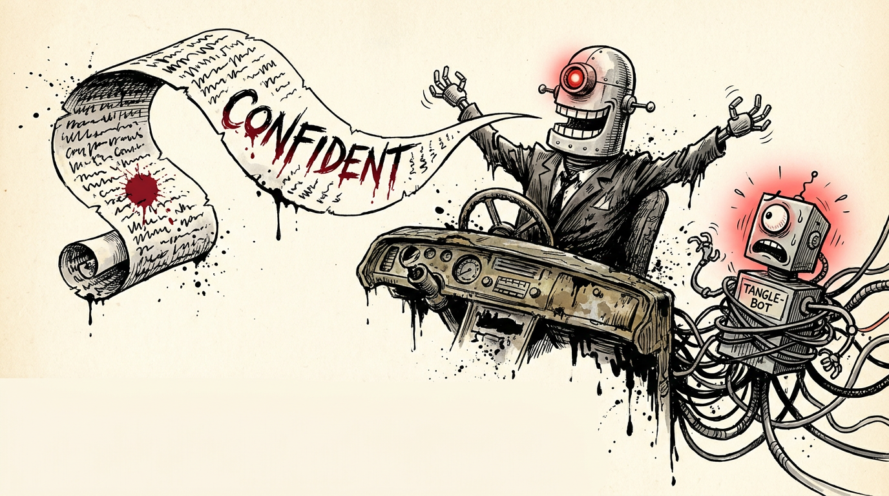

Sixty-seven percent of enterprise chatbot deployments failed to meet expectations. Only 6 percent of IT leaders believe their chatbot technology is effective and highly adopted. An airline’s customer service chatbot was held legally liable for giving a passenger incorrect information about bereavement fares —- the chatbot invented a refund policy that did not exist, stated it with perfect confidence, and a tribunal ruled the airline was bound by what its agent had promised. An automotive company’s chatbot agreed to sell a vehicle for one dollar after a customer exploited a prompt injection vulnerability. A fintech company replaced 700 human agents with AI, then watched customer satisfaction drop and complaints rise until they had to reverse course and hire humans back.

These are not edge cases or the work of incompetent teams. They are predictable failures that share a common architecture: an AI system deployed without semantic infrastructure, without governed definitions, without a layer that tells the model what is true, what is uncertain, and what it should refuse to answer. The chatbot was confident because no one built the guardrails that would have made it appropriately uncertain. Epistemic honesty —- the quality of knowing what you know and what you do not —- is a feature of the infrastructure, not of the model. If the infrastructure does not encode uncertainty, the model will not express it.

The fix was never a chatbot. The fix was promoting derived calculations to governed tables with explicit definitions, catalogued in the semantic layer, accessible to both humans and machines. The knowledge has to live in the infrastructure, not in one person’s head. This is a knowledge management problem that AI makes impossible to ignore, not an AI problem.

==== "Data mesh will solve the governance problem"

Data mesh got something genuinely important right.

Data mesh correctly identified that centralized data teams cannot understand every domain. Domain experts should own their data products. This insight is correct and valuable.

What data mesh underspecified is the semantic layer. Domain ownership without a shared vocabulary means each domain defines terms independently. Trading defines "volume" one way. Finance defines it another. Research uses a third definition. Each is reasonable within its domain. Each is documented —- if the organization is lucky —- in its domain’s data product specification. And when an AI agent queries across domains —- which is what executives do, because executives do not think in domain boundaries, they think in questions like "what is our total exposure?" that span trading, finance, and risk —- it encounters the same concept under three different names with three different calculation methods.

This is exactly the problem that sank the 98-99 percent demo described earlier, scaled to the organizational level. The AI cannot bridge gaps that nobody has mapped. Federation without semantic unification is distributed confusion. You need both: domain ownership and a shared vocabulary that makes cross-domain queries coherent.

The industry is converging on this recognition. Major technology companies that adopted mesh principles early are now moving to what they publicly describe as "balanced, federated approaches" that formalize domain ownership while embedding governance, quality, and interoperability directly into shared platforms. The key word is interoperability, and interoperability requires a shared semantic layer that all domains contribute to and all consumers —- including AI agents —- can query against.

==== "We'll just hardcode the orchestration against our APIs and treat the model like a closed system"

This is the currently fashionable safe play.

Build a lightweight orchestration layer (MCP, or whatever the acronym of the month is). Hardcode the important paths against your existing APIs. Keep the model on a tight leash. It is contained. It is auditable. It does not require touching the rest of the platform.

It is safe. It is also small-minded. It treats the model like a slightly smarter intern who still needs you to draw the entire map for it every single time. The upside is capped at whatever you had the foresight, and the political will, to hardcode in advance.

The even worse version currently making the rounds: "just give the agent broad access and let it crawl and self-discover." This is not architecture. This is hoping enlightenment will magically emerge from effluent. The agent will confidently traverse the worst parts of your data estate, invent plausible-sounding joins, and present the result as insight. It will be wrong with maximum confidence, and you will have built exactly zero infrastructure to stop it.

Both positions share the same root failure: they treat the model as the variable and the data estate as fixed. The correct position is the opposite.

==== "AI changes nothing fundamental — it is still just garbage in, garbage out. Focus on data quality."

This is the laziest position currently enjoying serious airtime from CDOs and data leaders.

It is technically true in the same trivial sense that "breathing is important for life" is technically true. It is also completely useless as a position, because the people saying it have *zero solutions* for what "good data" actually looks like when the consumer is no longer a human who can squint, call a colleague, and paper over the gaps.

Any intelligence — human, postman, or frontier model — requires *brain and memory*. Data is not the raw material that intelligence acts upon after the fact. In an enterprise, data *is* the deep thought. It is the precondition of thought itself.

=== The Coincidence That Is Not a Coincidence

AI demands: clean definitions, canonical tables, governed vocabularies, machine-readable metadata, explicit relationships between concepts, default assumptions documented in structured formats, navigational heuristics that guide queries to the right data. This is a lot. This is the kind of infrastructure that has been on every Chief Data Officer’s roadmap for the last decade, perpetually deprioritized because the cost was high and the benefit was diffuse. Under the old regime —- where the primary consumer was a human analyst who could compensate for ambiguity —- most organizations correctly concluded that the cost of building all of this was not justified by the benefit. The analyst could squint. The business ran fine. Semantic infrastructure was a nice-to-have that never survived the quarterly prioritization meeting because there was always a more urgent dashboard to build, a more pressing pipeline to fix, a more visible executive request to fulfill.

AI changes the economics of this calculation. And it changes them in both directions simultaneously.

On the demand side, AI makes semantic infrastructure mandatory. Without it, your AI projects fail. Sixty percent of them, according to Gartner. The cost of not having semantic infrastructure is no longer "analysts are slightly less efficient." The cost is "your AI strategy does not work." That changes the prioritization calculus dramatically. When semantic infrastructure was competing against "build the finance dashboard," it lost. When semantic infrastructure is competing against "our $10 million AI investment produces wrong answers," it wins.

On the supply side, AI makes semantic infrastructure cheap to build.

Consider what it used to take. At institutions where building a semantic layer for a single domain was a multi-year program, the pattern was always the same: dedicated teams, months of workshops, taxonomy design, ontology construction, data dictionary compilation, quarterly governance reviews. Eighteen months to two years from inception to delivery.

Formal ontology projects are the extreme version of this pattern —- tens of thousands of terms, years of work by specialists, exquisitely rigorous, formally beautiful. Industry adoption: negligible — not because they are wrong, but because they are documents, not living systems. And documents decay at the speed of organizational change, which is always faster than the speed of documentation maintenance.

Now consider what AI makes possible. Recording a conversation with a domain expert and using AI to extract, structure, and validate definitions in a single session —- producing results more complete and consistent than six months of traditional documentation. Running automated quality checks against international standards on every commit, not quarterly. Monitoring the entire data estate for drift —- new tables without definitions, renamed columns, changed calculations —- through continuous automated surveillance rather than manual audits that happen twice a year if someone remembers.

Glossary terms across multiple domains, with logical concepts mapped, quality-scored, and embedded in the execution pipeline —- built in months rather than years. A productivity improvement is doing the same thing 20 percent faster. This is a phase transition: the thing that was too expensive to do properly is now cheap enough to do continuously.

Maintenance was always the bottleneck. Building a glossary was hard but achievable. Maintaining it as the data changed underneath it —- that was the part that killed every previous attempt. The graveyard of abandoned metadata catalogs in every large organization tells the story: well-intentioned, well-funded initiatives that produced beautiful artifacts and then watched them decay because maintenance is unglamorous, expensive, and never-ending. AI solves the maintenance problem.

Information architects have been arguing for governed vocabularies for decades. They were right. They were also right to be ignored, because the business case never closed. The cost of building and maintaining semantic infrastructure exceeded the cost of letting humans compensate for its absence. That was a rational calculation. It is no longer rational. AI broke it in both directions: the cost of absence went up, and the cost of building went down. The lines have crossed.

The industry is converging on this recognition. In 2025, major data platform vendors joined forces to create the Open Semantic Interchange standard. When competitors collaborate on a standard, the architecture is settling. The debate about whether you need a semantic layer is over. The remaining debates are implementation debates.

Gartner projects that by 2027, organizations that prioritize semantics in their AI-ready data strategies will increase model accuracy by up to 80 percent and reduce costs by up to 60 percent. By 2028, 60 percent of agentic analytics projects without a consistent semantic layer will fail. The early adopters who skipped the semantic layer are already dealing with the consequences: hallucinated joins, conflicting metrics, confident wrong answers, and the slow realization that you cannot shortcut the foundation.

=== The New Primary Consumer

When your team designs a new data model —- a new Gold table, a new analytical dataset, a new metric —- who are they designing it for?

If the answer is "the Tableau dashboard that the finance team requested," you are optimizing for the wrong consumer.

The finance team’s needs matter. But the design process that starts with "what does this dashboard need?" produces a fundamentally different architecture than the design process that starts with "what does this concept mean, and how should any consumer —- human or machine —- access it?"

Dashboard-centric design produces tables shaped for a specific visual, with columns named for the chart they appear in and business logic scattered across SQL, visualization tool calculated fields, and the analyst’s mental model. The result works for the analyst who built it. It is opaque to everyone else.

Semantic-centric design produces tables shaped for the concept they represent, with columns named for what they mean in the business domain and canonical business logic embedded in the governed model. Definitions explicit, relationships documented, assumptions stated. The result works for the analyst, the next analyst, the AI agent, and the new hire who needs to understand the data estate without calling twelve people.

Teams denormalize data into an analytical layer for fast access. They celebrate the performance gains. The queries are fast, the stakeholders are happy, the team moves on to the next project. Nobody catalogs what they have built. There is no time. The next project is already overdue. More tables get added to the analytical layer. Each one answers a specific question for a specific stakeholder, and each one has its own definitions, its own calculations, its own interpretation of concepts like "revenue" and "active customer." Replication happens without governance —- the same data appears in multiple tables with slightly different transformations, and nobody tracks which version is canonical.

Within two years, the analytical layer is a swamp. Hundreds of tables, nobody knows what half of them contain, nobody trusts the numbers. Any organization that denormalizes without cataloging will produce this swamp. There are no exceptions. The only variable is how long it takes people to admit it.

Architecture prevents this, not policy and not a governance committee that meets quarterly to review proposed changes. When every analytical table ships with a governed definition —- when the infrastructure will not let you publish a table without describing what it contains, what it means, and how it should be used —- cataloging becomes mandatory rather than optional. You cannot skip it because the system will not let you skip it. The discipline of building the semantic interface compels the discipline of governing the data. Architecture prevents the failure that process could not.

Every join is a decision the machine can get wrong. Pick the wrong key, assume the wrong cardinality, apply the wrong type — each one a place where a five-table query quietly returns a confident, wrong number. Joins are hallucination vectors. A star schema does not just ask the AI to retrieve your data; it asks the AI to reconstruct your data model on every query, and to be right about it every time. It will not be.

This is not a style preference. It has a price, and the price is measurable. A five-table star schema costs three to five times more input tokens and two to three times more output tokens than a single flat table carrying its own semantic definition — more tokens to describe the schema, more to reason about the join paths, more to generate the multi-table SQL, and a fresh chance to get it wrong at each step. Snowflake’s AI SQL research found naive query plans triggering over 110,000 model calls where optimized, join-free plans achieved a 300x reduction. Three hundred times. That is the gap between an architecture that fights the machine and one that feeds it.

[#fig-tax-300x]
.The 300× tax: a physical star schema makes the agent reason through joins on every query. Flatten Gold and the tax disappears.
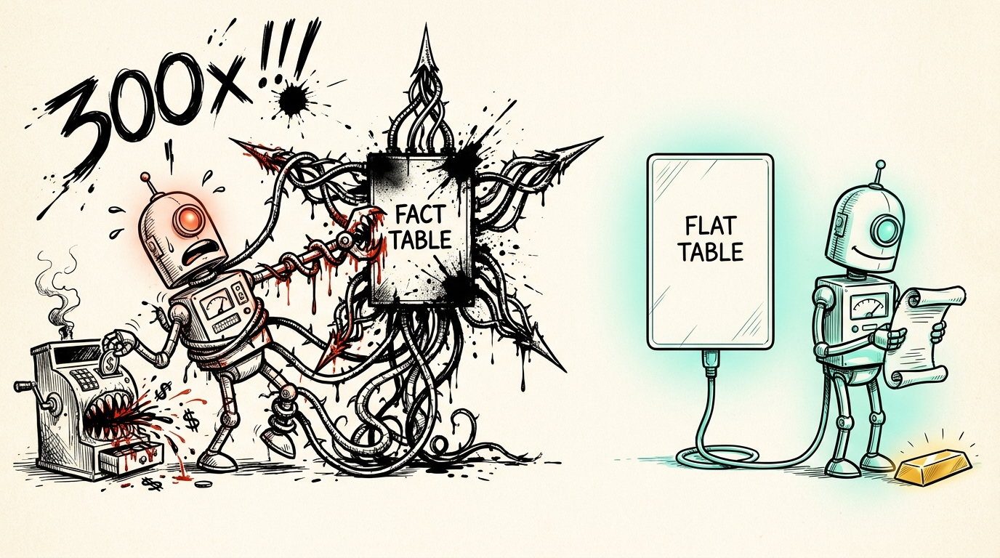

So flatten Gold. Denormalize to the question — one wide row, every column defined once in the semantic layer, no joins for the consumer to fumble. The same architecture that stops the AI hallucinating also stops your analysts squinting and your new hires guessing which of forty revenue tables is the real one. There is one definition, not forty. This is not machine readability bought at the cost of human usability; it is both, at once, for the first time.

And here is the part the dimensional-modelling veterans need to hear, because it is the part everyone gets wrong when they hear “flatten”: dimensional structure is not eliminated. It is relocated. Grain discipline, conformed dimensions, SCD2 — all of it lives on, in Silver, where it belongs. When an analyst genuinely needs to drill and slice across dimensions, the semantic layer exposes Silver’s dimensional structure directly: star-schema-equivalent analytical power, with no physical star schema in Gold for any consumer — human or machine — to trip over. You keep the discipline. You kill the joins. The thing dimensional modelling was for survives; the thing that made it expensive for AI does not. If you are still building physical star schemas at the consumption layer, you are paying a 300x tax to make your AI dumber.

=== Five Changes to Make This Week

If the shift is real, the question is what to do about it. Here is what works.

First, change who you design for. The next time your team builds a Gold table or an analytical model, the design review should include a question that nobody is currently asking: "Can an AI agent query this table and get the correct answer on the first try, without any additional context beyond what is in the semantic layer?" If the answer is no —- if the column names are opaque, if the definitions are missing, if the business logic is documented only in someone’s head or embedded in a visualization tool’s calculated field —- the model is not finished. It does not matter how well it performs in a dashboard. If a machine cannot reason about it, it is incomplete. This is a quality standard, not a feature request.

Second, audit your vocabulary. How many definitions of "revenue" exist in your organization? If you do not know the answer, that is the answer. Start with your top twenty business concepts. Define them in a structured, versioned, machine-readable artifact that lives in your deployment pipeline —- not in a PDF or a Confluence page that will be out of date in six months. Get business stakeholders to sign off, because if the business does not own the vocabulary, nobody trusts the vocabulary.

With AI-assisted definition extraction, a working vocabulary for a critical domain takes days, not months.

Third, stop treating the semantic layer as optional infrastructure. If your AI strategy is "connect the chatbot to the database and let it write SQL," you are building Air Canada’s chatbot. The semantic layer is the governance mechanism that stands between your AI and your data. AI queries the semantic layer, not the database. This is the single most important design principle in any data architecture built after 2024. That layer knows what the terms mean, how the calculations work, and —- critically —- what the AI should refuse to answer because the data is stale, incomplete, or outside governed scope.

Fourth, address the token economics. If you are still building star schemas for your analytical layer, you are burning money. Flat, denormalized tables with semantic definitions are cheaper to query, faster to process, and dramatically less error-prone. This is not a marginal optimization. The research shows a 300x difference in AI call volume between join-heavy and join-free architectures. Design for flat consumption as the default. Your AI budget will thank you. Your accuracy metrics will thank you more.

Fifth, address the organizational reality with candour and empathy. What is described in this essay threatens some people’s professional identity. Data teams built their careers on star schemas, on dimensional modeling, on dashboard design, on the craft of making data visually comprehensible. Telling them "your primary consumer is now a machine" sounds like telling them their skills are obsolete.

Their skills are not obsolete. The analyst who deeply understands what "revenue" means is more important than ever —- she is just expressing that understanding through a governed definition rather than a calculated field in a visualization tool that only she can maintain. The engineer who names columns meaningfully is more valuable than ever, because column names are the primary interface between data and AI agents.

The shift is not from human to machine. It is from implicit to explicit. From knowledge that lives in people’s heads to knowledge that lives in the infrastructure. The craftsperson who refuses to learn the new medium will find themselves maintaining dashboards that fewer and fewer people use, while the organization’s questions are answered by AI agents that query the semantic layer they did not help build.

Sixth, do not wait for the hype to settle. Even if AI adoption plateaus tomorrow, the architecture that serves AI is also the correct architecture for human consumption. Flat tables with explicit definitions are better for dashboards, analysts, new hires, regulatory compliance, and audit trails.

You are not optimizing for a trend. You are optimizing for precision. AI is the forcing function that makes precision non-negotiable. The architecture was always correct. The economics now demand it.

Organizations that understand this will have data platforms that serve any consumer —- human or machine —- with consistent, governed, trustworthy answers. Their AI agents will answer business questions reliably because the semantic infrastructure exists to ground them. Their analysts will stop squinting at conflicting dashboards because there is one governed definition, not forty. Their new hires will understand the data estate in their first week because the vocabulary is explicit and the definitions are machine-readable, which also means they are human-readable. Everything gets better.

Organizations that do not will continue building dashboards that humans squint at, deploying AI projects that join the 60 percent abandoned due to bad data. They will spend millions on AI initiatives and wonder why the results are disappointing. They will blame the models. The models were never the problem.

Intelligent machines are interning at your organization — if you want to keep them on as productive long-term employees, get your training material together.

== Language is the Material

=== The Column Name Problem

Fourteen million dollars is a lot of money to lose in a dictionary. The quarterly P&L reconciliation broke on a Tuesday —- not because the numbers were wrong; the numbers were perfect, every decimal in its place. It broke because the finance team’s chart of accounts classified a particular set of flows as "trading revenue," while the trading system that originated those same flows classified them as "market-making fees." Both were correct. Both had documentation. Both had been in production for years. And both produced a P&L that differed by fourteen million dollars depending on which system you asked.

Three hours of meeting followed. A finance director and a trading desk lead sat across from each other, each with a spreadsheet, each convinced the other’s numbers were wrong. They were not wrong. They were speaking different languages. "Revenue" in the finance register included fee rebates netted against gross. "Revenue" in the trading register excluded them. The word was identical. The concept was not. Fourteen million dollars lived in the gap between two definitions of the same term.

Every automated check passed. Every pipeline ran green. The conflict was invisible to every tool in the stack because every tool operates on syntax, and syntactically the two uses of "revenue" were identical. Semantic. Linguistic. And until that Tuesday, completely undetected.

Most organizations cannot see the distinction between "missing data" and "missing vocabulary." They blame the pipeline. They almost never blame the names. The blindness is expensive: the fix for missing data is re-ingestion, which takes weeks; the fix for missing vocabulary is a definition update, which takes minutes.

AI is the forcing function, but the problem is architectural. Data engineering is not about pipelines, transformations, or SQL. Those are implementation details. The material of the craft —- the thing data engineers are actually shaping, every day, whether they realize it or not —- is language.

=== Names Construct the Objects They Refer To

Most data engineers think of naming as a style decision. Pick a convention —- snake_case, camelCase, with prefixes, without —- enforce it, move on. This is the standard position, and it is wrong.

When you name a column `revenue`, you are not labeling a pre-existing thing. You are making a commitment: this number, calculated this way, from these sources, with these exclusions, means THIS. Before the name, there was raw data —- transactions, line items, adjustments, reversals. After the name, there is a governed concept that downstream consumers can rely on. Naming is construction.

If a definition is a contract —- "when you use this term, you are bound to this meaning" —- then breaking the contract breaks every downstream consumer. When AI is the downstream consumer, breaking the contract does not produce a confused analyst who calls you on Slack. It produces a confident, silent, wrong answer that gets presented to an executive or, worse, acted upon by an automated system.

At a major investment bank, the word "position" meant different things to the risk desk, the trading desk, and the back office. Three definitions, all internally consistent, all mutually incompatible. Humans navigated this by knowing which desk they were talking to. The data warehouse did not know which desk it was talking to. And so the reporting layer contained three different versions of "position," each correct within its own context, each dangerously wrong when used in someone else’s.

Industry treats this as a data quality problem. It is a language problem —- specifically, polysemy: a single term carrying multiple meanings depending on context. Linguists have studied polysemy for a century. Data engineers rediscover it every time they build a warehouse.

Consider what happened with a chart of accounts at a crypto exchange. Three hundred and thirty-three GL accounts, which sounds reasonable until you realize they encode roughly forty business concepts crossed with six dimensions: asset class, related party status, client type, product, counterparty, and risk level. Instead of separating the concept from its dimensional context, the naming scheme bakes context into the identifier. Account number 41200-003-01 is not a concept —- it is a concept wearing a disguise made of dimensions. A human accountant can decode this because they have twenty years of tacit knowledge. An AI agent asked to "show me all revenue accounts" will miss half of them because the revenue concept is not explicit in the name but implicit in a dimensional encoding that nobody documented.

Naming-as-governance in miniature: three hundred and thirty-three entries when forty archetypes would suffice with proper vocabulary architecture. The naming scheme encodes too many dimensions into a single identifier, making it opaque to both humans and machines.

Kimball prefixes —- `fact_`, `dim_`, `fct_` —- are the same kind of mistake. They were governance decisions, correct at the time they were made. In row-based databases where joins were expensive, encoding the structural role of a table into its name was useful operational metadata. It told the query optimizer and the developer what to expect. But we do not live in that world anymore. In columnar warehouses (BigQuery, Snowflake, Databricks — the specific engine is immaterial), denormalized wide tables outperform star schemas. A semantic layer determines whether a field is a dimension or a measure at the field level, not the table level. The prefix is redundant —- a governance decision that outlived the architecture it was governing.

Naming conventions are governance decisions, and governance decisions should be revisited when the architecture changes. Calling something `fact_orders` in a columnar database with a semantic layer is like requiring a card catalog in a library with a search engine. The card catalog was brilliant for its constraint. The constraint expired.

Namespaces are the deeper point. A namespace is not a naming convention. It is the unit of governance. IAM policies, quality rules, and ownership are defined at the namespace level. A table named `trading.orders` inherits different governance than one named `staging_trading.raw_orders`. The name determines who can read the data, who can write to it, what quality checks apply, and who is accountable when something breaks. When you name a table, you are choosing a governance regime, not a label.

Naming decisions are among the most consequential decisions a data architect makes. Yet in most organizations, naming is delegated to individual developers with at most a style guide. Delegating contract law to the intern: the contracts still get written, they just do not protect anyone.

Sometimes the names are not just unclear —- they are actively misleading. A column called `volume` that contains notional value. A `balance` that means delta since last update, not current state. A `date` that refers to trade date in one system and settlement date in another. In each case, the name was plausible enough that nobody questioned it. The AI certainly did not question it —- it used the column at face value and produced results that were internally consistent but factually wrong. Missing names produce errors you notice. Misleading names produce errors you trust.

=== The Metadata Graveyard

Every large organization has one. Ten thousand terms in a governance tool that nobody reads. A business glossary delivered to applause and abandoned within a year. The pattern is so consistent it qualifies as a law of organizational physics.

A senior leader decides the organization needs a business glossary. Consultants arrive. Five information architects, maybe more, each pulling down $150,000 to $250,000 a year. Workshops happen. Over six to twelve months, a comprehensive glossary is produced —- hundreds or thousands of terms, each carefully defined, each vetted. Published in a standalone governance tool. Launch event. Applause. And then, slowly, silently, it dies.

It dies because modeling is a maintenance problem disguised as a design problem. A vocabulary is a living system, not a deliverable. Data platforms change daily. New tables appear. Columns are renamed. Business concepts evolve. Models are deprecated and replaced. A vocabulary that is not updated with every change is a vocabulary that drifts from reality. And a vocabulary that drifts from reality is worse than no vocabulary at all, because it creates the illusion of governance where none exists.

Gartner estimates that 80 percent of data and analytics governance initiatives will fail by 2027 due to a lack of connection to business outcomes. As many as 90 percent fail at the first attempt. Poor data quality costs organizations an average of $12.9 million per year. Users lose 30 to 40 percent of their time simply trying to find and understand information that already exists in their organization. The metadata graveyard is the default outcome, not a niche problem.

A senior data leader described traditional data catalogs as "expensive shelfware." Another: "Let’s visit a website just to browse the metadata, said no one ever." Nobody browses metadata recreationally. If the definitions are not in the path of the work —- if you have to leave your IDE, open a browser, navigate to a catalog, and search for a term —- you will not do it. And if you will not do it, the definitions might as well not exist.

FIBO —- the Financial Industry Business Ontology —- represents the most ambitious attempt to solve the vocabulary problem in financial services, and it deserves fair treatment before the critique. It has over three thousand normative entities. It was built by contributors from Bloomberg, Citigroup, Deutsche Bank, Goldman Sachs, Wells Fargo, and State Street. It is maintained by the EDM Council. It is formally exquisite, built on OWL and RDF, with proper axioms and reasoning capabilities. It represents years of work by people who understood the problem deeply.

Almost nobody uses it. Broader industry adoption remains limited. Ontologists with expertise in both OWL and finance are rare enough to be practically nonexistent. Scaling FIBO adoption beyond small Centers of Excellence has proven consistently difficult. When researchers tried to run standard OWL reasoners against the full FIBO ontology, one was terminated after four days of processing. Another after two. Formally beautiful, operationally inert.

OWL and RDF more broadly are not faring much better. A W3C GitHub issue from a few years ago asked bluntly: "Which real use cases are there for RDF/OWL ontologies?" The author noted that after years of working with the technology, they had become "more and more unsure why someone should bother with them." Even the European Union’s Core Public Event Vocabulary —- an official standard, built by specialists —- contains dozens of OWL 2 DL violations. If the standards bodies themselves cannot produce clean OWL, expecting commercial data teams to do so is unrealistic. The emerging consensus among practitioners is telling: not one universal ontology language, but "federation, not uniformity" —- lightweight, domain-specific vocabularies connected through explicit mappings rather than through formal OWL reasoning.

Formalism is sound. Failure is in the distance between formalism and operational pipeline. An ontology that does not execute in the data pipeline does not govern the data. It describes the data from the outside, and descriptions from the outside drift. Any vocabulary system that exists separately from the systems it governs suffers this fate. The "boil the ocean" anti-pattern —- one comprehensive ontology covering all business domains before shipping anything —- is the most reliable way to spend two years and deliver nothing.

Standalone governance tools suffer the same critique with less severity. Collibra is governance-first: policy modeling, enterprise vocabularies, lifecycle management. Implementation timelines run three to nine months. User satisfaction among those who actually use the tool is high —- around 87 percent. But satisfaction among users is a different metric than adoption across the organization. The governance team is twelve people. The organization has three thousand. The other 2,988 have never logged in.

Both vendors are pivoting toward AI —- Collibra acquiring companies focused on unstructured data governance for LLMs, Alation acquiring firms specializing in AI agents over structured data. The irony is delicious: governance tools racing to embed AI at the same moment AI is making their original architecture obsolete.

Neither the heavyweight ontology nor the standalone catalog is the villain. The villain is any architecture that puts governance outside the execution pipeline. Collibra is right that governance matters; wrong that it should live in a separate tool. FIBO is right that formal vocabulary matters; wrong that formal vocabulary requires OWL.

A deeper problem lurks beneath the catalog debate. The controlled-vocabulary tradition —- formalized in ISO 11179 and instantiated in every modern data catalog product —- was built for cross-reference, schema standardization, and demonstrable compliance. Real goals, well served. But the artefact is wrong, not just the maintenance model.

A short, structured definition tells you the datatype of a column and what the column is called. It does not tell you why the column exists, when its values diverge from the obvious interpretation, what edge cases bite practitioners every quarter, what the desk’s slang for it is, how it relates to upstream system quirks, or what a new analyst should know on their second day. All of this is information that exists in the heads of senior practitioners. It is precisely the information the controlled-vocabulary tradition has, throughout its history, failed to capture.

Tolerable when documentation consumers were humans who could absorb operational knowledge by sitting next to senior colleagues for six months. You learned the quirks of the P&L table by asking the person who built it. You learned that "the book" meant something specific in this office by overhearing it in meetings for three months. You learned which columns were vestigial by watching what the senior analysts actually used. None of this knowledge appeared in any catalog. It did not need to, because the humans who needed it had a channel —- proximity, conversation, apprenticeship —- through which to acquire it.

No such channel exists for an LLM agent. It has whatever you put in its context and nothing more. If the documentation says "revenue: total trading revenue in USD" and nothing else, that is the entirety of what the agent knows about revenue. It does not know that revenue excludes maker rebates in Q1 but includes them from Q2 onward due to a policy change. It does not know that the upstream system occasionally double-counts fee reversals during month-end settlement windows. It does not know that the desk calls the field "top-line" and never uses the word "revenue" in conversation. Formally correct. Operationally useless. The agent will produce answers consistent with the definition and inconsistent with reality.

Metadata graveyards were always failing to close this gap, even for human consumers. AI merely makes the failure impossible to ignore.

=== Documentation as Onboarding

ISO 11179 tells you a column’s type. A senior colleague tells you why the column lies on the last day of the month. Only one of these prevents a production incident.

When a new analyst joins a trading desk, nobody hands them a metadata catalog. They get prose, and they get conversation. Someone tells them the war stories: the time the upstream system reclassified counterparties without warning and broke the morning P&L for a week. Someone explains the conventions: how P&L is computed here, which of the three canonical definitions the desk uses, when it switches between them. Someone walks them through the slang: what "the book" means in this office, which fields are actually used and which are vestigial. The onboarding is narrative, contextual, and specific to how this particular team uses these particular data assets.

A capable LLM brings substantial general knowledge to any business domain. Accounting principles, market mechanics, regulatory shape, the standard patterns of analytical work in finance —- on day one, that general knowledge frequently exceeds what a junior human analyst arrives with. A fresh graduate joining a treasury desk does not typically know the mechanics of tri-party repo or the regulatory treatment of rehypothecated collateral. The LLM does. What it lacks is what the human will spend the next month acquiring: organizational nuance, desk-specific convention, tribal slang, the operational craft of how this particular team uses these particular data assets.

After about a month, the human analyst has absorbed enough context to function. They know which of the three revenue definitions the desk actually uses. They know that "the cross" means the cross-currency basis swap book, not the FX cross rate. They know that the 4pm snapshot is the one that matters and the 3:30pm snapshot is vestigial but still produced because a downstream system depends on it. Without equivalent context delivered explicitly, the agent plateaus at general competence —- correct in the abstract, wrong in the particular. The particular is where the work happens.

Documentation that closes this gap looks like onboarding material, not ISO 11179.

What works is the domain essay: six hundred to fifteen hundred words of considered prose covering provenance, conventions, edge cases, slang, history, and craft for a single dataset or a tightly coupled cluster of them. Written by the people who know the data —- not generated from the schema, which by construction cannot tell you what the schema fails to capture. The essay is anchored on structured metadata that does not disappear: datatypes, primary keys, refresh cadence, lineage references, ownership records. These anchors are the index into the documentation, not the documentation itself.

Structured metadata —- the ISO 11179 anchors of datatype, key, classification —- remains essential. Machine-readable, automatable, suitable for cross-reference and integration. But the shift is in where the semantic weight lives. In an agentic architecture, the essay is the primary carrier of meaning. Structured metadata becomes the index into the essay, not the documentation itself.

A domain essay is not chatty documentation. It is the operational note a senior practitioner writes for a new colleague: dense, deliberate, evidence-based, free of padding. Prose rather than controlled-vocabulary form —- a different format for a different consumer, not a lower standard.

Essay-based documentation works because it follows the discipline of code. Versioned. Dated revisions. Named authors and reviewers. Stored alongside the data assets it describes. And a decay model: an essay reviewed within the last twelve months is treated differently from one untouched for three years. Stale documentation is, for an agent, strictly worse than absent documentation —- the agent reads stale prose with the same confidence as fresh prose and produces confidently wrong answers. A documentation system that does not manage decay produces worse outcomes the longer it operates.

Documentation that lets an agent reason over data is documentation that onboards a new human analyst fastest. The agent, the new analyst, and the auditor converge on the same artefact. Build documentation for agents and it gets better for humans. Build it for cataloging and it has never been good enough for either.

=== The Three-Tier Vocabulary

Three tiers, connected by a single principle: upstream always wins.

[#fig-three-tier-vocab]
.The three-tier vocabulary: glossary governs schema governs semantic layer. Upstream always wins.
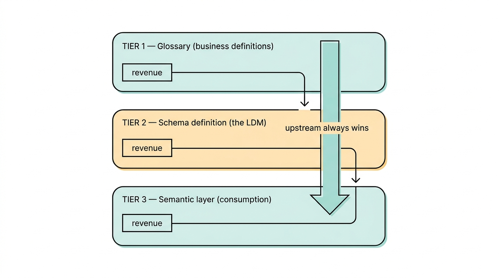

Tier 1 is the glossary. This is the canonical source of business meaning. It contains the organization’s controlled vocabulary: defined terms, with relationships between them —- hierarchies, synonyms, associations. The glossary is business-owned, not technology-owned. It does not contain SQL. It does not reference specific tables or columns. It speaks in business language about business concepts. "Trading volume" is defined here. "Revenue" is defined here. "Position" is defined here, with enough precision that two reasonable people reading the definition would agree on what it means.

Terms are not strings. They are nodes in a semantic graph. "Revenue" does not exist in isolation. It exists in relation to "volume," "position," "trade," "fee," "rebate." Meaning is partly constituted by relationships between terms. A glossary that treats terms as isolated definitions —- a flat list with descriptions —- is missing the point. A vocabulary that treats terms as a network, with explicit relationships, captures how meaning actually works in a business domain. An AI agent that knows "revenue" is a type of "financial metric" that is calculated from "trades" and excludes "rebates" can reason about revenue in ways that an agent with just a string definition cannot.

Tools constrain what ontologies can express. A YAML file in a code repository yields flat, static, developer-facing text. A governed system with relational semantics yields hierarchies, synonyms, associations, and machine-queryable relationships. Not OWL —- but something richer than a flat file.

Tier 2 is the schema definition file — the model metadata that lives alongside the transformation code (dbt’s `schema.yml` in the current implementation, though the principle applies to any SQL-based modelling framework). Here is the claim that will generate the most pushback: the schema definition IS the logical data model — not a reflection of it, not a downstream copy, but the thing itself.

In traditional data architecture, the logical data model is a separate artifact —- an ER diagram, a data dictionary, a design document —- created during design and then implemented in code. Two artifacts, one truth, inevitable divergence. Every data architect has lived this: a beautiful ER diagram on Confluence that was accurate eighteen months ago. The actual tables look nothing like it. Nobody updates the diagram because nobody looks at it.

When model documentation and model implementation are the same file, they cannot diverge. You cannot change the model without changing the documentation, because they are the same artifact. The schema is not a description of the data from outside —- it constitutes the data’s meaning. A schema change is not a "metadata update." It is a material transformation of what the data can mean.

"But we need design review before implementation." Yes —- and in a CI/CD pipeline with code review, the schema definition IS reviewed before deployment. There is no useful separation between "design" and "implementation" when the design artifact is executable. A separate LDM document is not "design." It is a copy. Copies drift. This one will too.

Tier 2 inherits from Tier 1. If the glossary says "trading volume" means the total number of units traded in a given period, then the schema description of the `trading_volume` column says the same thing — not a paraphrase, not a reinterpretation, but the same definition. Upstream always wins. If a Tier 2 description contradicts a Tier 1 definition, the Tier 1 definition is correct and the Tier 2 description must be updated. This is not a suggestion. It is a governance rule, and it must be enforced —- ideally by automation, practically by code review, minimally by convention.

Tier 3 is the semantic layer —- the consumption-layer configuration that maps business concepts to data (LookML, dbt Semantic Layer, Cube, or equivalent). This is where definitions become queryable. The semantic layer does not create new definitions. It inherits them from Tier 2, which inherited them from Tier 1. What the semantic layer adds is navigation: how concepts relate to each other for the purpose of answering questions, what the default aggregations are, what filters are commonly applied, what hierarchies structure the data for exploration.

When an AI agent needs to answer a question about revenue, it consults the semantic layer, which tells it which table contains revenue data, how revenue is calculated, what dimensions are available, what caveats apply. Without a semantic layer, the agent guesses —- picking the wrong column, inventing a calculation, joining tables incorrectly. With one, it grounds its reasoning in governed definitions. The difference between guessing and grounding is whether you built the vocabulary.

When AI is the consumer, naming decisions have cost implications that make CFOs pay attention. A star schema requires the AI to reason about joins —- which tables to connect, through which keys, in what order. Every join is additional tokens consumed, additional reasoning steps, additional opportunities for error. A flat, denormalized Gold table with a semantic layer requires no join reasoning. The AI reads the semantic layer, identifies the right table, and queries it directly. In practice, this reduces token consumption by a factor of three to five. Your naming conventions and architectural choices are cost decisions, not just semantic ones. Bad names are expensive.

A quality standard applies across all three tiers. ISO 11179 —- the international standard for metadata registries —- provides criteria that every definition should meet: precise, unambiguous, non-circular, stated in natural language, domain-scoped. The standard has been actively maintained since the 1990s and was updated most recently in 2023 and 2024. It is the foundational reference for metadata in government, healthcare, and regulated industries. Australia, Canada, Germany, the US, and the UK all maintain ISO 11179-aligned registries. A Texas state agency published a standard grounded in 11179 that begins with a statement so obvious it should not need saying: "To be data-driven, an organization must be metadata-driven."

ISO 11179’s problem is not the standard —- the standard is excellent. Organizations treat it as a compliance exercise rather than a quality tool. The three-tier vocabulary uses 11179 criteria the way a newsroom uses a style guide: not as bureaucracy, but as craft discipline. Every definition should pass 11179 scrutiny. But the definitions live in the pipeline, not in a separate registry. The standard governs the quality. The architecture governs the location.

Domain essays carry the semantic weight. Structured metadata becomes the index into essays, not the documentation itself. Tier 1 names the concepts, Tier 2 binds them to columns, Tier 3 exposes them to consumers. But the explanation of why a column exists, the documentation of edge cases that bite every quarter, the operational craft that separates a competent analyst from a textbook one —- that lives in the essay alongside and above the tiers.

"Upstream always wins" extends to documentation. The glossary defines the term. The schema definition binds it. The semantic layer exposes it. But the essay —- written by domain experts, versioned like code, decaying visibly when stale —- is what the agent reads when it needs to reason, not retrieve. Retrieval asks "what is this column called and what is its datatype?" Reasoning asks "why does this column behave unexpectedly during month-end, and what should a competent analyst do about it?" Only the essay answers the second question. The tiers are the skeleton. The essay is the knowledge.

This architecture works because it solves the maintenance problem that kills every other approach. The glossary changes slowly —- business concepts evolve over quarters and years, not days. The schema definition changes at the pace of development —- when models are added, modified, or deprecated. The semantic layer changes at the pace of consumption —- when new questions arise or new navigational paths are needed. Each tier has its own cadence, its own owners, and its own change management process. But they are connected by a single flow: upstream always wins. This means governance becomes an architectural property, not a separate activity. The system governs itself through its own structure.

Compare this to the standalone governance tool. Collibra, or any similar platform, sits outside the execution pipeline. Definitions in Collibra do not automatically propagate to the schema definition or the semantic layer. When a developer changes a column name in the transformation tool, they do not automatically update Collibra. Two systems, two truths, inevitable drift. The three-tier vocabulary eliminates this drift not through discipline but through architecture. The tiers are connected. Changes propagate. Upstream always wins. It is governance by construction, not governance by committee.

Governance outside the execution pipeline is aspiration, not governance. It exists as documentation. It exists as a quarterly meeting where people review proposed changes to the data dictionary and approve or reject them. By the time a change is approved through a committee process, the data has already changed three more times. The committee is governing a system that no longer exists. Governance by committee is governance by nostalgia.

*Pattern: Three-Tier Vocabulary*

_Context:_ An organization needs governed definitions that flow consistently from business language to data infrastructure to consumption interfaces.

_Problem:_ Without a tiered architecture, definitions are maintained independently at each level — the glossary says one thing, the schema describes another, and the semantic layer presents a third. Contradictions accumulate silently.

_Solution:_ Three tiers, with upstream always winning. Tier 1 (Business Glossary): canonical definitions owned by business stakeholders, stored in a machine-readable format. Tier 2 (Schema Definition): transformation tool schema files inherit Tier 1 definitions verbatim — the schema description IS the glossary definition, not a paraphrase. Tier 3 (Semantic Model): the consumption-layer definitions inherit from Tier 2. No tier may introduce its own definition. No downstream system may override an upstream meaning. Changes propagate top-down: change the glossary, the schema description updates, the semantic model updates.

_Example:_ Glossary defines "trading_volume" as "total quantity of assets exchanged in a given period, excluding test accounts and internal transfers." The schema definition file for `fct_executions` inherits this definition verbatim on the `trading_volume` measure. The semantic model’s `trading_volume` measure inherits from the schema. An analyst querying through any interface sees the same definition. A change to the definition happens once, in Tier 1, and propagates automatically.

_Consequences:_ Upstream-always-wins is rigid. Domains cannot experiment with local terminology without a glossary change. Fast-moving teams feel constrained.

=== Why This Is Linguistics

"Data engineering is applied linguistics" is not a metaphor. The problems data engineers encounter every day are problems that linguists named and studied decades ago.

Synonymy is the most visible: multiple terms for the same concept. Every controlled vocabulary is an attempt to eliminate synonyms within a specific domain. When a data platform has three names for the same metric, it has a synonymy problem. The solution is not "pick one and rename the others." The solution is a controlled vocabulary that maps all three names to a single canonical term, preserving the synonyms as aliases for discoverability while enforcing the canonical term for governance.

"Position" at the investment bank is polysemy: one term with multiple meanings depending on context. Polysemy is a feature of natural language that makes communication efficient in context and disastrous out of context. A data platform is, by definition, out of context —- it aggregates data from multiple contexts into a single layer. If your vocabulary does not disambiguate polysemous terms, your platform inherits every ambiguity from every source system.

GL taxonomy inflation is a failure of dimensional separation: encoding multiple independent dimensions into a single identifier. Linguists call this agglutination —- think of German compound nouns that pack multiple concepts into a single word. In a chart of accounts, agglutinating asset class, client type, and risk level into a single account number creates the same problem: the concepts are present but not individually addressable. You cannot ask "show me all revenue accounts" because "revenue" is not a separate axis in the naming scheme; it is fused into an opaque compound.

AI returning zeros for collateral values because the table was not labeled properly —- a referential gap. The data existed. The concept existed. The mapping between them was missing. Organizations blame the data when the problem is the name.

Data engineers face linguistic problems and need linguistic tools: controlled vocabularies, taxonomies, thesauri, semantic networks. Twenty years of investment in pipeline tools —- orchestration, transformation, testing —- and comparatively nothing in vocabulary tools. The imbalance reflects a conceptual misunderstanding about what the job actually is.

Consider the job posting for a "Senior Data Engineer" at any major company. SQL, Python, Spark, Airflow, dbt, Terraform, Kubernetes. Maybe a cloud certification. Nowhere: "ability to construct and maintain a controlled vocabulary." Nowhere: "experience with semantic modeling." Nowhere: "skill in extracting precise definitions from domain experts." Yet those are the skills that determine whether the data platform produces clarity or confusion. The industry hires for pipeline competence and wonders why the vocabulary is a mess.

Industry is starting to notice. Common vocabulary as a foundational principle of modern data architecture is accelerating as a recognized prerequisite, but the recognition is still mostly rhetorical. Investment —- in tools, in people, in organizational attention —- has not caught up.

Without formal vocabulary infrastructure, business meaning scatters across schema descriptions, semantic layer definitions, tribal knowledge, and Slack threads. Everybody talking, nobody speaking the same language.

At one organization, the revenue mapping rules lived in a CSV file that nobody owned. Seven trading symbols were missing from the CSV, which meant trades in those assets were generating no journal entries. Nobody had noticed because the engineers who wrote the code did not understand the domain, and the domain experts had left. Code owned execution. Nobody owned semantics. Revenue was not a governed concept. It was a prayer.

Vocabulary architecture prevents this. When "revenue" has a definition that is canonical, machine-readable, and embedded in the execution pipeline, code and meaning cannot separate. Read the model, read the definition. Change the model, change the definition. Same artifact.

When vocabulary is not formalized, every question routes through a person. "What does this column mean?" Ask Sam. "How is this calculated?" Ask Keith. "Why does this number not match the other number?" Ask whoever built the original dashboard, if they still work here. Knowledge lives in people’s heads, and every query becomes a dependency on a specific individual.

One team lead: "My team literally don’t know the domain. Sam and Keith are the only guys that know. And that’s a problem." It is a problem —- and a predictable consequence of an architecture that does not capture vocabulary. When vocabulary exists only in people’s heads, personnel changes are data losses.

Most organizations hit a phase transition —- scaling from one office to multiple, or private to public —- where tacit knowledge stops working. When everyone sat in the same room, tacit knowledge worked —- proximity created shared context. When teams go global, tacit knowledge breaks. The meaning has to be written down, and if it is written down in a PDF on SharePoint, it will be lost within six months. It has to be written down in the pipeline.

Consider that the U.S. Department of Defense —- twenty-nine languages, twenty-four countries —- published a controlled vocabulary framework that makes this point with military directness: "When terms are not immediately and unerringly understood by every enterprise participant, there is a significant risk that process outcomes and analytic results will be inconsistent." Replace "enterprise participant" with "AI agent" and you have the thesis of this essay. If the DoD understands that vocabulary is infrastructure, data platforms have no excuse.

Organizations that navigate this transition successfully recognize what they are really building. Not a data platform —- a language. A shared, governed, machine-readable language for talking about their business. The platform is infrastructure. The language is the product.

=== Domain Registers and Code-Switching

When a trader and an accountant both say "position," they are having two different conversations with the same word. The data warehouse, unable to tell which conversation it is in, joins both and calls the result a report.

[#fig-polysemy-position]
.Polysemy: “position” means three different things to three domains. Without a semantic layer the warehouse joins them into nonsense.
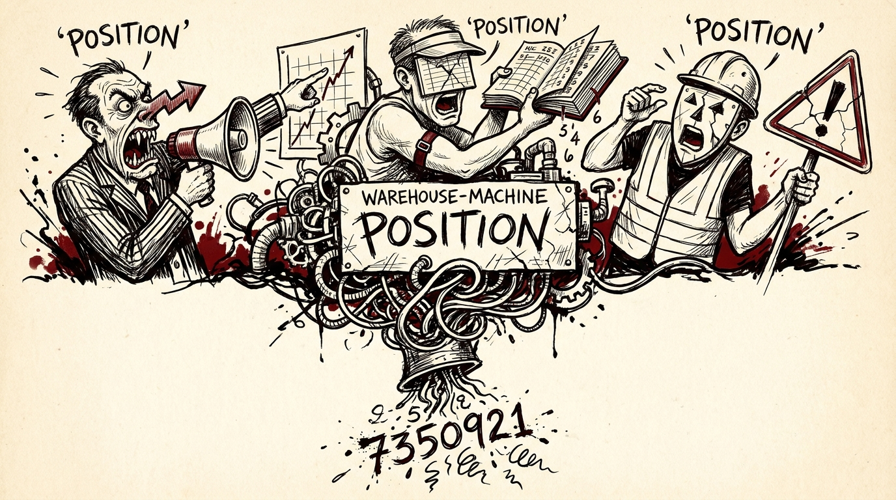

Sociolinguists use the term "register" to describe a systematic variation in language that correlates with context of use: vocabulary, grammar, and assumptions shift depending on who is speaking, to whom, and about what. A doctor discussing a patient with a colleague uses a different register than the same doctor explaining the same condition to the patient. Same information, different encoding. Competence lies in knowing which register to deploy and when.

Every business domain operates in its own register. Trading speaks in a register of immediacy and exposure: positions are open or closed, risk is directional, time is measured in milliseconds or at most trading sessions. Finance speaks in a register of periodicity and accountability: the same underlying activity becomes a journal entry, a line in a ledger, a component of a P&L that must reconcile to the cent at month-end. Treasury speaks in a register of liquidity and obligation: what matters is not what was traded but what is owed, what is available, what can be pledged. Custody speaks in a register of safekeeping and proof: the asset is held or it is not, and the chain of custody must be unbroken and auditable.

These are not merely different vocabularies layered over a shared reality. They are different ways of constructing that reality. When a trader says "position," the word denotes a live directional exposure —- something with a mark-to-market value right now, changing with every tick. When a finance professional says "position," the word denotes a net accounting exposure —- aggregated across trades, netted by instrument and counterparty, valued at a point in time for reporting. The trader’s position is kinetic. The accountant’s position is archival. Same word. Meaning constituted by register.

Linguistics calls this code-switching: the systematic shift between registers that competent speakers navigate unconsciously but that machines need explicit mappings to handle. A senior analyst who has worked across trading and finance for a decade can code-switch mid-sentence without effort —- "the position generated a journal entry that affected the P&L position" —- and every human in the room understands that the first "position" is trading-register and the second is finance-register. The shift is unmarked; context disambiguates. A machine cannot perform this disambiguation unless the vocabulary infrastructure explicitly models domain scoping. Without it, the machine treats both occurrences as the same concept, because they are the same string. From that false identity: wrong joins, wrong aggregations, wrong numbers presented with full confidence.

Cross-domain polysemy is not an exception in the three-tier vocabulary —- it is a structural feature. Tier 1, the glossary, defines domain-scoped entries. `finance.position` and `trading.position` are different concepts that share a lexeme. No single definition broad enough to cover both. Definitional broadening —- "position: a quantity of an asset held or owed by an entity" —- is the hallmark of a vocabulary that has given up on precision. It covers everything and means nothing. Instead, the glossary maintains separate entries, each precise within its domain, with an explicit relationship between them: these terms share a lexeme but differ in domain scope, calculation method, temporal granularity, and governance owner.

Tier 2 implements each domain-scoped concept as a model in its respective namespace. The trading domain has `trading.positions` with fields that reflect the trading register: instrument, direction, entry price, current mark, unrealized P&L. The finance domain has `finance.positions` with fields that reflect the finance register: instrument, net quantity, book value, fair value, accounting standard applied. The schema definitions make explicit what human speakers leave implicit. They are, in effect, the grammar of each register written out in full.

Tier 3, the semantic layer, provides the navigation that resolves which "position" the user means based on conversational context. When a user asks "what is our BTC position?" the answer depends entirely on register. If the question follows a series of queries about trading volume and order flow, the semantic layer should resolve to the trading register. If the question follows queries about monthly P&L and revenue recognition, it should resolve to the finance register. The semantic layer uses the accumulated context of the conversation —- domain of prior queries, metrics already referenced, dimensions already filtered —- to determine which register is active. Machine code-switching: the operational expression of the linguistic theory.

Cross-register problems are harder than within-register problems. Within the trading domain, vocabulary is relatively stable: traders agree on what "position" means because they share a register. Within finance, the same is true. The conflicts erupt at the boundaries, when a query begins in one register and must compose with another. A question like "what was the P&L impact of our largest trading positions last quarter?" requires the system to identify positions in the trading register (largest by notional exposure), then compose with the finance register (P&L impact as calculated by accounting rules), resolving the temporal mismatch (trading positions are real-time, P&L is periodic) and the aggregation mismatch (trading positions are per-instrument, P&L may be per-book or per-entity). This is register composition, and it is where most data platforms fail silently.

Silent failure, because each domain’s numbers are individually correct. The error emerges only in the composition —- in the join, in the mapping, in the assumption that "position" in one system corresponds to "position" in another. A human analyst with cross-domain experience catches this because they can code-switch, because they know that the trading system’s position and the finance system’s position are related but not identical. An analyst without that experience, or an AI agent without explicit register mappings, will join on the shared lexeme and produce a number that looks right and is not.

Domain registers are an architectural requirement, not a theoretical nicety. Each domain is a register. Each register has its own controlled vocabulary. Cross-register mappings are explicit, governed artifacts —- not implicit assumptions buried in join logic. When a Gold table combines data from trading and finance, the schema definition must document which register each field belongs to and how the cross-register composition was resolved. Documentation here is not commentary —- it is the semantic contract that makes the composition trustworthy.

At a crypto exchange, register boundaries are particularly sharp. A single trade generates events that propagate through four registers almost simultaneously. In the trading register, it is an execution: instrument, price, quantity, timestamp, counterparty. In the custody register, it is a settlement obligation: assets must move from one wallet to another, with cryptographic proof. In the finance register, it is a revenue event: the fee is recognized, the journal entry is created, the P&L impact is calculated. In the treasury register, it is a liquidity event: the exchange’s available reserves have changed, and the treasury position must be updated. One trade, four registers, four vocabularies, four sets of assumptions about what matters and what does not. A data platform serving all four domains must be explicitly multilingual —- four registers, four sets of domain-scoped definitions, and a composition layer that maps between them.

A single flat vocabulary with one definition of each term is the approach most organizations attempt and most regret. It produces definitions so broad they are useless, or definitions so narrow they apply to only one domain while misleading the others. Register-based vocabulary is harder to build —- more definitions, more explicit mappings, more governance. But it produces a vocabulary that reflects how the business actually operates: a federation of domains, each with its own register, connected through explicit and governed translations.

No natural language has a single register. English does not speak the same way in a courtroom, a laboratory, a trading floor, and a kitchen. A competent data platform must navigate the same shifts —- not through a large language model that approximates register-awareness from training data, but through explicit vocabulary infrastructure that models registers as first-class architectural concepts.

*Pattern: Domain Register*

_Context:_ Multiple business domains use overlapping vocabulary — the same word means different things in different domains.

_Problem:_ Cross-domain queries silently conflate domain-specific meanings. "Position" in Trading (current holdings) is not "position" in Treasury (cash and liquidity allocation). An agent or analyst using the wrong definition produces wrong answers without warning.

_Solution:_ Each domain operates in a linguistic register — a self-consistent vocabulary with its own conventions, slang, and default assumptions. The register is documented explicitly: which terms are domain-specific, what they mean in this domain, and how they differ from the same term in other domains. When a query crosses domains, register switching is explicit — the system loads the target domain’s register and resolves any polysemous terms through the bridge morphism.

_Example:_ Trading register: "position" = current holdings by instrument. Treasury register: "position" = cash and liquidity allocation by currency. When an agent encounters "position" in a cross-domain query, the register switching protocol identifies which domain’s definition applies. If both are needed, the bridge morphism documents how Trading.position and Treasury.position relate (and where they do not).

_Consequences:_ Maintaining explicit register documentation for every domain is ongoing work. Registers drift if not reviewed.

*Pattern: Polysemy Resolution*

_Context:_ A term appears in multiple domain registers with different meanings.

_Problem:_ Without explicit resolution, the system picks one meaning silently — typically whichever table appears first in the schema or whichever domain the agent was initialized in. The consumer does not know which meaning was used.

_Solution:_ Polysemous terms are flagged in the vocabulary with explicit cross-domain mappings. Each domain’s definition stands within its register. The bridge morphism between domains documents how the definitions relate: whether they are the same concept viewed differently (Trading.Instrument ≈ Finance.FinancialProduct), overlapping but non-identical (Trading.volume ≠ Finance.revenue_volume), or unrelated homonyms (Trading.book ≠ Accounting.book). When an agent or semantic layer encounters a polysemous term in a cross-domain context, the resolution is governed and declared, not inferred.

_Example:_ "Revenue" in Finance = net recognized revenue per GAAP. "Revenue" in Trading = gross execution value. An agent asked "What is our revenue?" in a cross-domain context loads both definitions, identifies the polysemy, and either asks the consumer which definition they mean or defaults to the requesting domain’s register with an explicit declaration: "Using Finance definition of revenue (net recognized, GAAP). Trading uses a different definition (gross execution value)."

_Consequences:_ Cross-domain queries become slower (resolution overhead) and more complex to debug when polysemy maps conflict.

=== Why Data Engineering Is Applied Linguistics

Type systems and semantic layers are structurally isomorphic, and making this explicit reframes what data architecture actually is. A type system —- the kind studied in programming language theory and mathematical logic —- tells you what operations are valid on what objects. You cannot add a string to a number, not because the computer cannot do it, but because the type system says it is meaningless. A semantic layer does the same thing for data: it tells you what queries are valid on what tables, what aggregations make sense for what measures, what hierarchies structure what dimensions. A type system and a semantic layer are the same discipline applied at different levels of abstraction. (This is not incidental to the author’s perspective —- a background in type theory tends to make this structural parallel impossible to unsee.)

Data architecture is, at its core, the management of ontological commitments. When you define a Gold table, you are committing to a specific way of carving up the world. "These are our customers. These are our orders. These are our positions." Those categories are not given by nature. They are constructed by your modeling decisions. A different organization, looking at the same raw data, would construct different categories. A different modeler within the same organization would construct slightly different categories —- not wrong, just choices. But choices that, once made, constrain everything downstream. Every query, every dashboard, every AI agent reasons within the constraints of your ontological commitments. If the commitments are wrong, everything downstream is wrong. Not because the pipeline is broken, but because the vocabulary is broken.

People who understand that meaning is constructed, that definitions are contractual, that the material of the work is language itself —- linguists, librarians, logicians, or engineers who think like them —- should be shaping these commitments. Pipelines matter. SQL matters. Orchestration matters. But the hardest part of data architecture is not the transformation —- it is the vocabulary. It is deciding what "revenue" means, where the boundary between "trading" and "market-making" falls, whether "position" is one concept or three. These are linguistic decisions with engineering consequences, and the industry has systematically underinvested in the people and tools needed to make them well.

"This sounds great in theory, but I have two thousand tables and no glossary. Where do I even start?" Fair question. The answer has changed in the last eighteen months: the economics of curation have fundamentally shifted, and a comprehensive vocabulary that once took a dedicated team years to build is now within reach of one person working with AI. The maintenance problem that killed every previous attempt at vocabulary architecture is solvable when AI handles the maintenance.

Bottleneck has shifted from labor to quality of thinking. You still need someone who understands both the domain and the technology. You still need someone who can sit with a finance stakeholder for an hour and extract the difference between "gross revenue" and "net revenue" and "recognized revenue" and "booked revenue." You still need someone who can say: these are four different concepts, and here is why, and here is what each one means, and here is how they relate to each other. That is human work —- and the most valuable work on the data platform.

Most data platforms are filing cabinets without an index. Thousands of tables, millions of rows, terabytes of storage —- and without a vocabulary that organizes, defines, and relates the concepts those tables contain, the platform stores data the way a warehouse stores boxes: faithfully, efficiently, and without any understanding of what is inside them. Vocabulary transforms storage into knowledge.

Stack-agnostic. Examples throughout name specific tools — dbt, LookML, BigQuery — because they are drawn from practice. The three-tier vocabulary works equally well with any transformation framework, any semantic layer tool, any columnar warehouse, or any agent orchestration tool. The tools are interchangeable. The vocabulary architecture is not.

For organizations operating across borders, vocabulary architecture must account for multilingual contexts. In a global organization, business concepts may be discussed in English in one office, Mandarin in another, German in a third. The three-tier structure helps here: the glossary can hold multilingual definitions —- the same concept expressed in multiple languages —- while the schema definitions and the semantic layer operate in English as a lingua franca. The canonical term is language-independent; its expression is not. Solvable within the architecture, but a problem most vocabulary initiatives ignore until it bites.

=== Vocabulary Before Pipelines

If you are running a data platform and you think your job is about pipelines and transformations and SQL, you are describing the plumbing and ignoring the water supply. The material of the work —- the thing that determines whether the platform creates value or confusion —- is language. The words chosen for columns, tables, domains, definitions. Those words are the interface between an organization’s knowledge and every consumer of its data, human or machine.

Always true. What changed is that AI makes it undeniable. A human encountering a badly named column can ask someone, check source code, apply tribal knowledge. An AI encountering the same column either guesses or fails. No workaround. No tribal knowledge. Only what the name says and what the definition provides. If the name is misleading and the definition is missing, the AI is worse than useless —- it is confidently wrong.

Gartner estimates 60 percent of AI projects will be abandoned due to a lack of AI-ready data. Sixty-three percent of organizations either lack or are unsure they have the right data management practices for AI. Forty percent of business initiatives fail due to poor data quality. Default outcomes of building AI on ungoverned vocabulary. The technology works. The data exists. The vocabulary does not.

First: invest in vocabulary before anything else. Before the new dashboard, before the AI agent, before the transformation refactor —- define terms. Start with the twenty most important business concepts. Get stakeholders in a room and define them —- not in a PDF, not in a governance tool outside the pipeline, but in the schema definition that IS the model. Machine-readable, precise, canonical. Days, not months. Saves years.

Second: kill the metadata graveyard. A business glossary that has not been updated in six months is a liability, not a glossary. Either embed it in your execution pipeline —- connect it to your schema definitions so that changes propagate automatically —- or delete it. A stale glossary creates the illusion of governance, and the illusion is more dangerous than the absence.

Third: upstream always wins. If the glossary says "trading volume" means X, then every downstream system says "trading volume" means X — the same definition, not a paraphrase. A downstream system that wants a different concept gets a different name. "Trading volume" is taken. Rigid at the definitional level to enable flexibility at every other level.

Fourth: naming conventions are governance decisions. Review them with the same rigor applied to IAM policies —- they determine the same thing: who can do what with which data, and what the data means when they do it.

Fifth: the scarce resource on any data platform is not engineers or compute or storage. It is vocabulary —- the quality of definitions, the precision of naming, the rigor of semantic relationships. Most organizations have more people working on their transformation layer than on their vocabulary. Reverse that ratio, or at least balance it.

Technology changes enormously across years and industries. Problems do not. "What does this column mean?" "Why does this number not match that number?" "Who defined this term and when did the definition change?" Always vocabulary. Always linguistic. Regardless of stack.

Your AI agent will be exactly as intelligent as your vocabulary allows it to be. Model quality is upstream of you. Training data is upstream of you. Infrastructure is upstream of you. The one thing entirely within your control is whether you built the vocabulary —- the unglamorous, difficult, deeply human work of defining terms.

Every organization that deploys an AI agent without a governed vocabulary has built a confident new employee, handed it a desk and a database login, and forgotten to tell it what any of the words mean.

[#chap-architecture]
== The Architecture

If you are running a data platform, you are running a restaurant — one where the kitchen has no menu, the chef has never met a customer, and the health inspector is an AI that reads faster than you can lie. You have suppliers who deliver raw ingredients — some excellent, some questionable, all of it arriving on their schedule in their packaging. You have a kitchen where those ingredients are cleaned, prepped, and transformed into dishes that people actually want to eat. And you have a menu — a curated, opinionated selection of what you are willing to serve, described in language your customers understand.

Now think about most data platforms you have worked with. They have a loading dock. Trucks back up, dump ingredients, and drive away. They might have something resembling a kitchen — some transformation logic, maybe a few models in the transformation tool. But do they have a menu? Do they have a curated, described, governed set of answers to the questions their consumers actually ask?

They do not. Most data platforms are warehouses with loading docks. Ingredients come in. Ingredients pile up. Someone occasionally rummages through the pile and assembles something edible. But there is no menu, no kitchen discipline, no chef who has decided what this restaurant serves and what it does not.

[#fig-restaurant-no-menu]
.A warehouse with a loading dock and no menu: ingredients pile up, but nobody has decided what the platform serves.
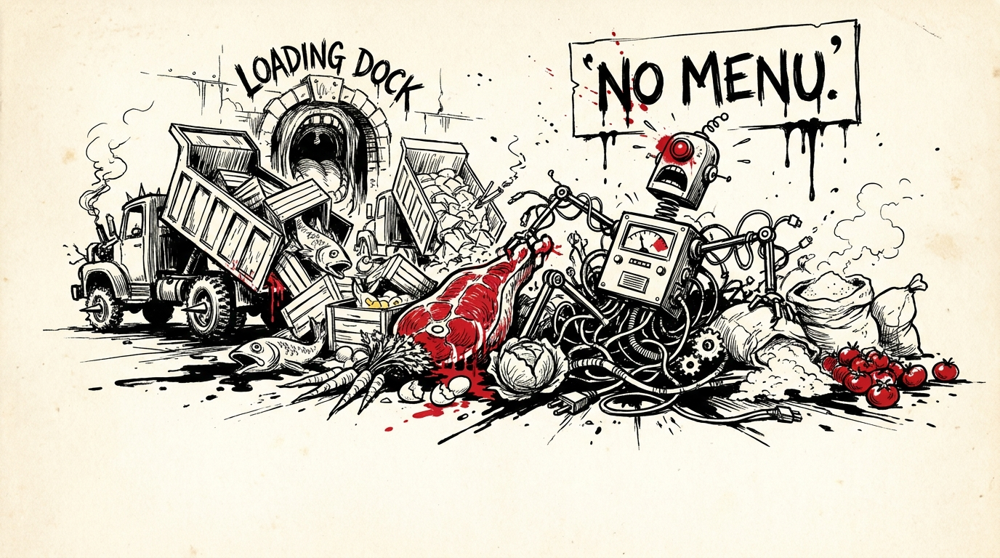

Medallion architecture — Bronze, Silver, Gold — is how you build the restaurant — not as three folders in your data lake, not as a data quality gradient from raw to clean. These are epistemological layers: they answer different questions about your data’s relationship to truth. Bronze asks: what did the producer say? Silver asks: what does it mean in our language? Gold asks: what do we know?

[#fig-medallion-layers]
.Medallion Architecture — Bronze, Silver, Gold, and the Semantic Layer
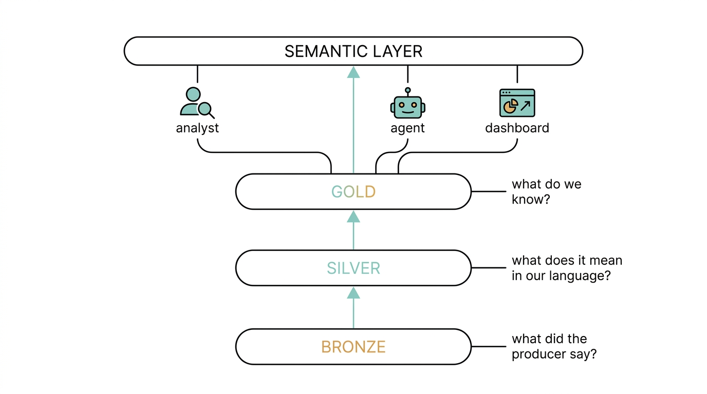

Get these layers right, pair them with a semantic layer that acts as your menu, and you have something most organizations have never had: a knowledge architecture. Get them wrong — or worse, skip them — and you have a very expensive pile of ingredients rotting on a loading dock.

The medallion pattern has taken some hits. It was popularized as a data quality gradient — Bronze is raw, Silver is cleaned, Gold is curated — and when you frame it that way, the criticism writes itself. Practitioners complain that nobody in their company understands what "Silver" versus "Gold" actually means. Critics point out, fairly, that Bronze/Silver/Gold is just Staging/Fact/Dimension/Data Mart under new names — traditional data warehousing rebranded for the lakehouse era. One prominent voice in the community argued that the engineers who popularized medallion simply did not have the proper background in data warehousing and sold three mandatory layers to drive storage and compute revenue.

These criticisms land because they are aimed at a real target: the version of medallion architecture that most organizations implement. Three folders. Three quality tiers. No semantic infrastructure. No clear boundary definitions.

But that is not the architecture described here. Epistemological layers — each one answers a fundamentally different question about your data’s relationship to truth. Bronze is about provenance: what was said? Silver is about meaning: what does it mean in our language? Gold is about knowledge: what do we know? Whether you frame medallion as epistemological or as "raw/cleaned/curated" determines whether the architecture produces governed knowledge or just moves data through three copies.

Yes, medallion architecture stores data three times. In an era where storage costs are measured in pennies per gigabyte per month, this is not the argument the critics think it is. Three copies cost pennies. Five teams building five different interpretations of the same source data — all slightly different, none governed — costs millions. Organizations routinely spend more money reconciling contradictory Gold tables than they would have spent storing three clean copies of everything.

=== Bronze: The Faithful Witness

Bronze is not a staging area. Most people get this wrong first, and the error is structural, not cosmetic.

A staging area is a temporary holding pen. Data lands there, gets cleaned, moves on, and the staging area is wiped. Bronze is permanent. Bronze is a faithful, immutable replication of what the producer delivered, in their language, using their conventions, warts and all. When I say "faithful witness," I mean it almost in the legal sense: Bronze is the sworn testimony. You do not edit sworn testimony. You do not clean it up to make it more presentable. You record it exactly as given and move on to interpretation.

[#fig-bronze-witness]
.Bronze is sworn testimony — the producer’s record, taken down verbatim and never edited.
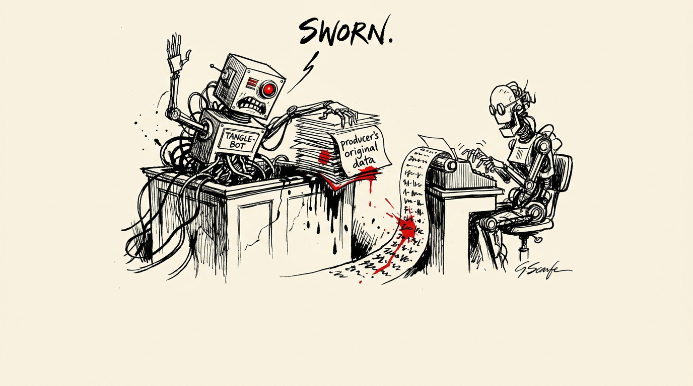

Bronze is your dirty laundry. The producer’s naming conventions might be terrible. Their data types might be inconsistent. Their schema might change without warning. All of that lands in Bronze, unmodified, because Bronze is about accountability, not your convenience.

Producers own Bronze. When a third-party system lands data in your Bronze zone, the accountability boundary is crystal clear — they own the data, you own the interpretation. This distinction matters enormously when something goes wrong. If the numbers do not reconcile, you can point to Bronze and say: this is what you gave us. The argument stops there. If you had cleaned the data on the way in, you have destroyed the evidence.

A corollary most teams resist: do not copy Bronze when you can reference it. A senior engineer proposed jobs that copied a vendor’s data into our storage. My response was direct: the whole benefit of buying this product is that they land data in a zone we can see. I do not want jobs copying this. They landed it, it is theirs. We do our own Silver.

Copying Bronze destroys the accountability boundary. It creates a second source of truth. It introduces a synchronization problem that did not need to exist. The vendor’s data, in the vendor’s format, in the vendor’s zone — that is Bronze. Touch it and you own the discrepancies.

Bronze has its own hygiene requirements, and this gets overlooked. "Faithful witness" does not mean "dump zone." The data lands in the producer’s format and the producer’s language, but it lands in a governed namespace with clear ownership, access controls, and retention policies. The zone itself is clean even if the data inside it is messy. Think of it as a well-organized evidence locker. The evidence might be chaotic — bloodstained clothing, handwritten notes, partial recordings — but the locker itself has a catalog number, a chain of custody, and a lock.

One final Bronze principle, and it makes the architecture rigid in the right places: intelligence is never driven from Bronze. You do not build dashboards off Bronze. You do not let agents query Bronze. You do not run analytics on Bronze. You always move through Silver. Bronze is the historical record, not the operational surface. This is not optional. If you let consumers query Bronze directly, you are serving raw chicken. Someone will get sick.

*Pattern: Bronze Ingestion Contract*

_Context:_ Raw data lands from external producers into the platform’s receiving zone.

_Problem:_ Without immutability, the accountability boundary between producer and consumer dissolves. Debugging becomes impossible because the evidence has been modified.

_Solution:_ Bronze is permanent, immutable, in the producer’s format and language. No cleaning, no transformation, no enrichment. Governed namespace with ownership, access controls, retention. Intelligence is never driven from Bronze — consumers always go through Silver. Producers own Bronze; the platform owns interpretation.

_Example:_ A vendor lands market data in a Bronze zone. When prices fail reconciliation, the team points to Bronze and says: "this is what you delivered." Argument resolved. Had the data been cleaned on ingest, the discrepancy would be unfindable.

_Consequences:_ Storage cost of permanent raw data at scale. Retention policy management adds governance overhead.

=== What Silver Actually Is

A pretense runs through the lakehouse era that needs naming. Medallion architecture has been marketed as a generational break from the data warehouse tradition. Vendor decks describe the Gold layer as "curated for consumption" without specifying the curation discipline, as if the modelling decisions previous generations agonized over have become matters of taste.

The opposite error is equally common: claiming that Silver is just Kimball with new labels, or that one tradition — dimensional modelling, enterprise data modelling — already solved the problem and the industry merely forgot the answer. Neither framing survives contact with what this architecture actually prescribes.

The warehouse traditions contributed principles that are real and durable. Grain discipline — one row per entity per event per time grain — is a property of how analytical computation works, not any single tradition’s invention. Kimball formalized it; the formalization was genuine; the principle predates and outlasts the formalization. Conformed dimensions — canonical shared definitions of Customer, Product, Account across business processes — remain the hardest problem in multi-domain data and the one most poorly solved by mesh-era vocabulary. SCD2 — closing a dimension row and opening a new one when a tracked attribute changes — is the only faithful way to answer "what was true at the time of this transaction?" These survive every technology migration because they describe properties of analytical reasoning, not properties of storage engines.

But the implementation patterns those traditions prescribed were built for constraints that no longer hold. Kimball designed star schemas for the _consumption_ layer — the thing users query — in an era of row-based engines where small dimension tables joined to large fact tables minimized I/O, and where the star schema itself served as self-documentation because no semantic layer existed. Inmon prescribed a monolithic enterprise model as the integration layer, centrally owned, in an era when centralized data teams were the only teams. Both assumed expensive storage, row-oriented engines, and human-only consumers.

What this architecture does is neither. It is a domain-canonical modelling layer built for columnar engines and AI consumers — two constraints that did not exist when either tradition was formalized.

Open the `marts/` directory of any mature transformation project. Count the `fct_` and `dim_` prefixes. Count the surrogate-key generation macros. Count the SCD2 materialization strategies. Practitioners are applying durable modelling principles under medallion branding, often without knowing where the principles came from. Every `fct_` prefix is the tell — grain discipline at the level of file naming, retained by engineers who absorbed the medallion vocabulary without the modelling vocabulary.

Grain survived the move to columnar engines because it is a property of how aggregations compose and how joins behave — not a property of where the bytes sit. The moment a practitioner builds `fct_orders`, they have committed to a grain, typically one row per order-line per event timestamp, and the rest of the downstream model arranges itself around that commitment. The lakehouse era did not eliminate the grain question. It eliminated the vocabulary for talking about it, with the result that grain mistakes are now made by accident rather than by argument.

*Pattern: Silver Grain Declaration*

_Context:_ Building fact tables in Silver.

_Problem:_ Without explicit grain, aggregations compose incorrectly, joins produce fan-outs, and downstream consumers silently double-count.

_Solution:_ Every fact table declares its grain explicitly in schema metadata: "one row per \{entity} per \{event} per \{time grain}." The grain statement is enforced by uniqueness tests. All downstream joins and aggregations are validated against the declared grain. Grain is a property of analytical computation, not of storage — it survives every technology migration.

_Example:_ `fct_executions` declares grain as one row per execution_id per event_timestamp. A downstream model that joins executions to a many-side dimension without an aggregation step fails the grain test and is blocked from deployment.

_Consequences:_ Grain enforcement blocks deployment of tables that violate it — including legitimate denormalized use cases that don’t fit the one-row-per-entity model.

Slowly changing dimensions tell the same story. SCD2 — the pattern in which a dimension row is closed and a new row opened when a tracked attribute changes, with `valid_from`, `valid_to`, and a current-flag — is presented in vendor marketing as having been superseded by table-level time travel on Delta or Iceberg. A category error. Table-level time travel answers the question "what did this table look like on Tuesday?" SCD2 answers a different question: "what was this customer’s segment at the time of this transaction?" Analysts and regulators ask the second question, and the answer must travel on the row of the dimension, not on the table-level history of the warehouse. Every mature lakehouse that touches analytics ends up materializing `valid_from` and `valid_to` columns, maintained by MERGE statements that implement the same row-level historicization pattern the warehouse literature formalized decades ago. The technology changed. The pattern did not.

*Pattern: Silver SCD2*

_Context:_ Dimension attributes change over time (customer segment, counterparty classification, instrument status).

_Problem:_ Overwriting dimension attributes destroys the ability to answer "what was true at the time of this transaction?" — the question analysts and regulators actually ask.

_Solution:_ Every tracked dimension attribute carries `valid_from`, `valid_to`, and a current-flag. When an attribute changes, the old row is closed (valid_to set) and a new row opens (new valid_from). The old row is never deleted. System time columns (`system_from`, `system_to`) record when the warehouse learned about each version, enabling bitemporal queries. SCD2 is implemented via MERGE or snapshot strategies in the transformation tool (dbt, Dataform, or equivalent).

_Example:_ A counterparty’s risk tier changes from "retail" to "institutional." The dimension table now has two rows: the old row (valid_to = change date) and the new row (valid_from = change date). A query asking "what was the counterparty’s tier when this trade was booked?" joins on valid time, not current state.

_Consequences:_ Tables grow 3-10x compared to current-state-only. Query complexity increases — two-axis temporal joins are harder to write and slower to execute. Most BI tools cannot issue bitemporal queries natively.

And the hardest problem — how multiple business processes agree on what a Customer, a Product, an Account is — is more acute under mesh-flavored lakehouses than it ever was under unified enterprise warehouses. Each domain is now structurally empowered to own its own entity definitions. "Data contracts on shared entities" is the current vocabulary — addressing the same coordination problem the conformed dimension pattern solved, but frequently with worse tooling and no memory of why the problem was hard the first time.

*Pattern: Conformed Dimension*

_Context:_ Multiple business processes reference the same entity (Customer, Instrument, Account).

_Problem:_ Two domains use the same word for what may or may not be the same thing. Force them onto one table and you risk fusing concepts that should stay distinct (a bottleneck, and silent wrong aggregations when the rules actually differ); leave them fully separate and cross-domain queries join incompatible definitions. The instinct — "elect one canonical owner and make everyone reference it" — recreates the central data team the mesh was built to abolish.

_Solution:_ A conformed dimension is not a competing model to the colimit — it is the *special case of a bridge* (see "Multi-Domain Composition") where two domains genuinely share a concept. The decision rule is the sharing rule: **if the domains' rules for the concept agree, collapse it into one shared sub-theory both reference — that shared sub-theory is the conformed dimension, co-owned through the bridge, not handed to one domain. If the rules disagree, do not conform: keep the concept domain-local on each side and join them with a bridge that documents exactly what maps, what is lost, and what is partial.** Conforming is the reward for genuine agreement, never a coordination tax imposed top-down.

_Example:_ Compliance's `Customer` and Trading's `Counterparty` agree on legal-entity identity (`legal_entity_id`) — same key, same notion of when two are equal. That shared identity *conforms*: it becomes the shared sub-theory both domains include, maintained jointly through the bridge. But Compliance's `kyc_sub_segment` and Trading's `desk_assignment` are *not* shared — they live above the shared sub-theory, in their home domains, and the bridge records that each is lost on the other side. So `legal_entity_id` is conformed; the rest stays local. One concept, split correctly, joined by a documented bridge — not one domain owning the others' view of the customer.

_Consequences:_ The sharing rule has teeth and they cut: a team that conforms two genuinely-conflicting concepts "to be consistent" gets a silently-wrong aggregation, and a team that refuses to conform a genuinely-shared one gets a join that should have been free. The judgment of *whether* rules truly agree is the work — and it is exactly the judgment the continuous verification mesh re-checks every scan (the commutativity check), so a conformance that drifts out of agreement raises a witness rather than rotting in place.

Here is the synthesis. Silver is the domain-canonical modelling layer — not Kimball’s star schema, not Inmon’s enterprise warehouse, but a synthesis built for columnar engines with these structural commitments: grain discipline (one row per entity per event per time grain), SCD2 with full bitemporality extending beyond what either tradition prescribed, conformed dimensions where domains share entities, domain ownership rather than central ownership, and full historicization where nothing is overwritten and everything is traceable.

Gold is denormalized publication — flat, wide, question-driven, materialized for fast consumption. This is the strong default for analytical workloads in columnar engines, not an absolute rule. The exceptions are real: when a workload genuinely needs graph traversal, a graph-oriented Gold model is appropriate. When shared dimensions serve dozens of fact tables, a lightweight star schema in Gold may reduce duplication. When ML feature engineering requires normalized inputs, feature stores (already named as sui generis in this architecture) handle the case. The default is flat. The exceptions require justification. And the semantic layer is required in every case.

Why flat as default? Because the economics of columnar engines invert the old trade-offs. In row-based engines (Oracle, SQL Server, the pre-2015 world), star schemas were optimal: small dimension tables joined to large fact tables minimized I/O, and normalization saved storage at real cost. In columnar warehouses, the economics reverse. Columnar compression makes denormalized columns nearly free to store — repeated values in a column compress to near-zero. Joins cost more, not less, because they require shuffling data across distributed nodes. Predicate pushdown on flat tables is more efficient than join elimination across multiple tables. And the self-documentation benefit that star schemas once provided — you could look at a fact table surrounded by dimensions and understand the structure — is now handled by the semantic layer, which provides logical navigation, entity relationships, and hierarchies without requiring physical joins.

This is not "denormalization is always better." It is: in columnar engines with a semantic layer, the storage benefit of normalization is eliminated by compression, the self-documentation benefit is handled by the semantic layer, and the join cost is real. Flat tables are the strong default. Name the exceptions and require justification for each.

Above it all, the semantic layer transcends any single ontological pattern. It can overlay star schemas, flat tables, news headline lists, event streams — whatever serves the domain. At the semantic layer, any ontology is valid locally, as long as it maps into the colimit through bridges that declare their losses. Good governance is not conformity to a single modelling pattern. It is colimit health: are the morphisms between domain ontologies explicit, honest, dated, and signed?

For teams building today, the practical consequence is immediate. Silver requires modelling skills: grain analysis, conformed dimension design, slowly changing dimension strategy, bitemporal reasoning. A whole cohort of lakehouse-era data engineers has never engaged with these disciplines. They need to learn — not because any single tradition owns the principles, but because the principles are load-bearing regardless of what you call them. The vocabulary was never optional. It was misplaced.

=== Silver: The Canonical Interpretation

If Bronze is sworn testimony, Silver is the court’s official interpretation. It is where raw data becomes canonical knowledge, expressed in your vocabulary, structured according to your domain model, and governed by your definitions.

Silver is where the craft lives. Building Silver well requires understanding the domain deeply enough to make interpretive decisions that hold up under scrutiny. What is a "trade" in your system? What is an "account"? What is the relationship between an "order" and an "execution"? These are not technical questions. They are ontological commitments — decisions about what exists in your domain and how those things relate to each other. Get them wrong and every downstream consumer — human and machine — inherits the error.

One principle organizes Silver: one table per logical data set, and each table belongs to exactly one domain. Silver is the full domain model. The complete, canonical representation of each domain entity, with every attribute that matters, historicized where history matters.

SCD Type 2 — slowly changing dimensions with history tracking — is not optional in Silver. If an entity changes over time, those changes must be preserved. A customer’s risk classification today might be different from what it was six months ago. A trading pair’s fee structure might have changed three times this quarter. If you overwrite the old values, you have destroyed knowledge. Silver preserves the trajectory.

Bitemporality is not binary. Three tiers reflect the operational reality. Tier 1 — full bitemporality with valid-time and system-time at row level — applies to entities that participate in financial reporting, regulatory submissions, or risk calculations: counterparties, positions, classifications, any entity a regulator might ask about. Tier 2 — SCD2 with valid-time history but without explicit system-time tracking — applies to entities that change meaningfully but are not audit-critical: desk assignments, strategy classifications, fee schedules. Tier 3 — current-state-only with audit logging — applies to stable reference data that changes rarely and predictably: currencies, countries, static instrument lookups. Applying Tier 1 universally wastes engineering effort, increases query complexity, and creates maintenance burden for tables where the temporal questions will never be asked. Document the tier assignment per entity. Review annually. Promote when regulatory requirements change.

What confuses people most: Silver is business-facing. Both Silver and Gold are. Silver is not "technical" and Gold is not "business." Both are business-facing. What distinguishes them is curation.

Silver is the full model. It contains everything. Every attribute, every relationship, every historical state. Gold is the curated answer — a specific selection from Silver, shaped to answer a specific set of business questions. Think of Silver as the complete recipe book and Gold as tonight’s menu. The recipe book is available to anyone who wants it. But when a customer sits down, you hand them the menu.

Now the architectural decision that matters most: the schema definition file IS the logical data model. In dbt this is `schema.yml`; the principle applies to any transformation framework where model metadata lives alongside model code. There is no separate LDM document. There is no Visio diagram that drifts from implementation. There is no wiki page maintained by someone who left the company two years ago. The schema file — the same file that defines tests, descriptions, and column metadata — is the logical data model. Change the model, change the documentation, because they are the same file.

Documentation drift is the default at every organization. You build a beautiful logical data model during the design phase. You implement it. Six months later, the implementation has diverged. A year later, the LDM is fiction. Two years later, nobody even knows the LDM exists.

Not a people problem — an architecture problem. If the documentation lives in a separate system from the implementation, it will drift. Not might drift. Will drift. The only documentation that survives is documentation that is embedded in the execution pipeline. The schema definition file is embedded in the execution pipeline. Every deployment reads it. Every test references it. Every downstream consumer inherits it. When you change a column, you change the description in the same file, in the same commit, reviewed by the same pull request. Drift is eliminated by construction.

Community consensus has caught up. If you view the transformation tool purely as a way to run SQL, you are missing half the picture. SQL handles the logic; the schema metadata handles the architecture. But most teams still treat the metadata as an afterthought — fill in a description if you have time, leave it blank if you do not. That is a governance failure hiding in plain sight.

Optimizing Silver — moving from five redundant copies of a trade table to a single canonical representation — saves significant money. But the funding comes from AI: conversational analytics, agent infrastructure, machine-readable data. Cost savings are a side effect of doing the semantics right, which means you do not have to choose between "save money" and "build for AI." Same workstream. Every dollar spent deduplicating Silver is simultaneously a dollar spent making your data machine-readable.

Consider the reverse. A finance team was running account reconciliation via Excel spreadsheets and macros — a single daily snapshot, manual processes that appeared to take hours. When diagnosed, the bottleneck was inherited technical debt: code hacked together years ago, never revisited, running on assumptions that were no longer true. Reconciliation could have run hourly. But because the data lived outside the medallion architecture — trapped in spreadsheets, driven off Bronze-equivalent sources without Silver interpretation — nobody had questioned the constraint. What looked like a fundamental limitation was just the absence of architecture. Move that knowledge into Silver, materialize the reconciliation logic in Gold, and the "hours-long process" becomes a table refresh.

=== Gold: The Knowledge Menu

Gold is where most data platforms fail, and they fail for a reason that seems paradoxical: they fail because Gold is easy to build and hard to govern.

Building a Gold table is simple. Take some Silver tables, join them together, denormalize the result, materialize it as a view or a table. Any competent data engineer can do this in an afternoon. And that is the problem. Because when building Gold is easy and governing Gold is hard, you end up with a hundred Gold tables that nobody catalogs, nobody describes, and nobody maintains. You end up with a data swamp.

Wall Street is populated with failed data lakes, and they failed in exactly this way. People denormalize into Gold, do not catalog, keep throwing in more facts, replicate without governance. Gold becomes garbage — not because the data is bad, but because nobody tracked what Gold tables exist, what questions they answer, what definitions they use, or how they relate to each other.

[#fig-data-swamp]
.Uncatalogued Gold becomes a swamp: hundreds of tables, nobody knows what half of them hold, nobody trusts the numbers.
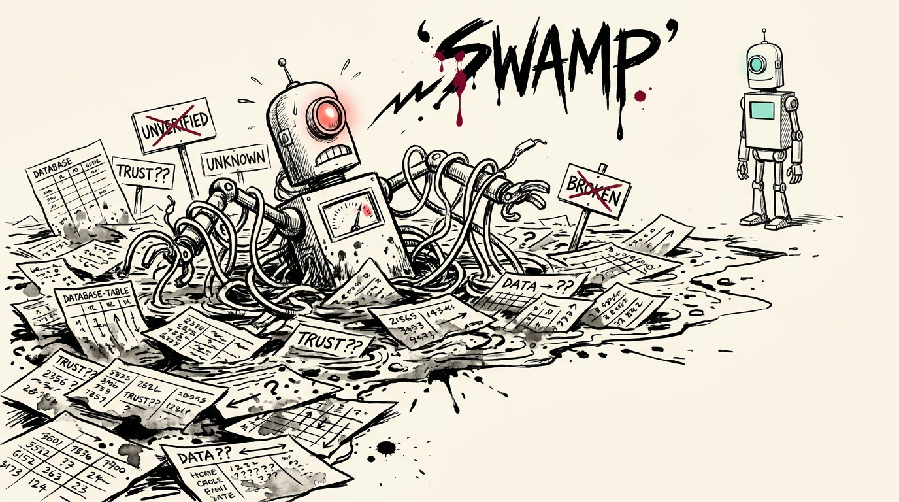

Prevention is simple to state and hard to execute: each Gold table answers a specific set of business questions. Design starts from the question, not from the schema. You do not build a Gold table and then figure out who uses it. You identify the question — "What is our trading volume by product by day?" — and then you build the Gold table that answers it. Every column in the table exists because it contributes to answering that question. Every column has a description. Every table has an owner.

*Pattern: Question-Driven Gold*

_Context:_ Designing a new Gold table for analytical consumption.

_Problem:_ Gold tables designed from schemas rather than questions proliferate without purpose — phantom schemas that add maintenance burden without answering anything.

_Solution:_ Design starts from the business question: "What is our trading volume by product by day?" The Gold table is shaped to answer that question. Every column exists because it contributes to the answer. The table is flat and denormalized — no joins required at consumption time. It carries a documented business question in its schema metadata. If you cannot state the question, the table should not exist.

_Example:_ A stakeholder asks: "What is our daily P&L by desk by strategy?" Gold table `gold_pnl_daily_desk_strategy` is built with one row per desk per strategy per day, columns for mtm_pnl, realized_pnl, notional, trade_count. Every column described. Business question documented in schema metadata: "Daily P&L breakdown for desk-level strategy performance review."

_Consequences:_ Requires the business question to be articulated before building — blocks exploratory table creation that sometimes produces unexpected value.

A counterintuitive principle, until you have lived with the alternative: do not be minimal. When you build a Gold table, include original IDs alongside resolved names. Include the foreign keys alongside the denormalized attributes. Include the timestamps that let a consumer trace the data back to Silver and Bronze. Storage is cheap. Traceability is expensive. A Gold table that contains only the minimum columns needed for a specific report is a Gold table that cannot be audited, cannot be debugged, and cannot be extended without rebuilding.

Painful experience. At a previous institution, a team built beautifully minimal Gold tables — exactly the columns needed for the dashboard, nothing more. Six months later, a reconciliation failed. The team needed to trace a specific number back to its source. They could not, because the Gold table did not contain the IDs that would have made the trace possible. They had to rebuild the table, rerun the pipeline, and re-derive the number from Silver. The dashboard had been right all along. Proving it took three days instead of three minutes, because the Gold table had been optimized for elegance rather than traceability. Elegance you cannot audit is vanity.

Something mundane that matters enormously: business knowledge that lives in visualization tools rather than in governed data layers. Business users go to a finance lead’s Tableau views because "that’s where the insights live." Those insights are client-side widgets — derived calculations, conditional formatting, custom aggregations — all business knowledge trapped in a visualization tool. That knowledge is person-dependent, non-machine-readable, and fragile. If the person who built the Tableau workbook leaves, that knowledge is gone. It should reside in Gold. It should be a table, with a description, with an explore, accessible to any consumer including an AI agent. Moving business logic from visualization tools to governed Gold tables is a knowledge-rescue operation, not a technology project.

Now for the position that will upset people: Gold’s strong default is flat. Denormalized. No physical star schemas in Gold. No physical dimension tables. No joins required at consumption time.

This contradicts what most practitioners learned in school or on the job. The claim is precise: in columnar engines with a semantic layer, flat Gold tables are the strong default because the structural reasons for physical star schemas at the consumption layer have expired.

The columnar engine is the structural break. In row-based engines (Oracle, SQL Server, the pre-2015 world), star schemas were genuinely optimal at the consumption layer: small dimension tables joined to large fact tables minimized disk I/O, normalization saved storage at real cost, and the star schema itself served as self-documentation — you could look at a fact table surrounded by dimension tables and understand the structure without external tooling. The consumer was always human, a BI analyst writing SQL who could reason through joins.

In columnar engines, each of those conditions inverts. Columnar compression makes denormalized columns nearly free to store — repeated values in a column compress to near-zero, eliminating the storage argument for normalization. Joins cost more, not less, because they require shuffling data across distributed nodes; query plans on flat tables benefit from predicate pushdown and partition pruning that multi-table joins cannot exploit as efficiently. The semantic layer now provides the self-documenting function that star schemas once provided — logical navigation, entity relationships, hierarchies — without requiring physical joins. And the primary consumer is increasingly an AI agent, which burns tokens reasoning through joins and where hallucination risks multiply with every additional table the agent must discover and correlate.

When an AI agent answers a business question, it needs to identify the relevant tables, understand the join keys, construct the SQL, and execute the query. Every join is a decision point where the agent can go wrong. A flat Gold table eliminates those decision points. The agent reads one table, understands the columns from the semantic layer, and writes a simple query. Every join is a fork where the agent can take the wrong path, and "works most of the time" is not a standard anyone ships against.

An engineer presented a Gold model using a star schema — fact table, dimension tables, foreign keys. Textbook dimensional modelling, well-executed. My instinct was immediate: not star schema. Flat, denormalized. As we talked through the implications, the absurdity became clear. Silver was already denormalized along domain lines. The star schema was re-normalizing what Silver had already denormalized — taking apart a dish that the kitchen had already assembled, putting the ingredients back in separate containers, and asking the customer to reassemble them at the table. Why? Silver’s dimensional structure was already the correct analytical surface for dimensional exploration, exposed through the semantic layer. Re-normalizing it into a physical star schema in Gold duplicated structure that already existed.

That conversation led to a rewrite of our architectural standards and surfaced a deeper problem: our architecture document was ambiguous on this point. When another team member had their AI assistant read the old standards document, the AI concluded that star schemas were correct for Gold — because the document said so, implicitly, through its ambiguity. Machines do not resolve ambiguity through corridor conversation. If your architecture documents are not machine-readable and semantically precise, your AI consumers will inherit your confusion.

But flat Gold alone is not the answer. Gold operates in two modes, both governed by the same ontology. First, flat Gold tables: denormalized, question-driven materializations shipped for expedience, performance, and domain specialization — fast to build, fast to query, ideal for agents and dashboards. Second, Silver-as-Gold views: Silver tables exposed directly through the semantic layer for rich dimensional navigation — grain-defended, SCD2, conformed dimensions, serving analysts who drill, slice, explore, and run complex analytical queries. Both reachable through the same semantic layer. Both governed by the same vocabulary. The semantic layer is not a physical star schema — it is a logical ontology, a queryable web of concepts and relationships that encodes fact-to-dimension joins, hierarchies, and navigation paths without requiring physical re-materialization. Physical star schema is an implementation strategy. The semantic layer is ontological. Different categories entirely.

[#fig-silver-vs-gold]
.Silver (Dimensional) versus Gold (Denormalized) Structure
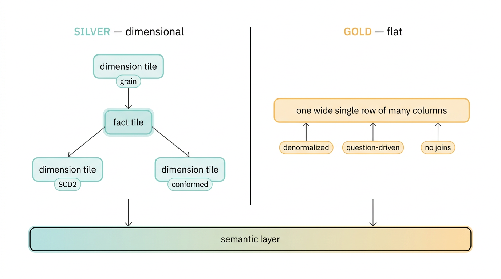

Gold is the menu of what you want to talk to the agent about. A menu designed for any consumer — human or machine — who has a question about your business. Gold is codified business knowledge, accessible through a semantic layer that provides context, definitions, and navigational intelligence.

One more governance mechanism: every Gold model ships with an explore. An explore, in the generic sense, is a governed consumption interface — a structured, documented, access-controlled view of a Gold table that exposes it through the semantic layer. A Gold table without an explore is incomplete. It is an ungoverned flat file. The explore is infrastructure, not a nice-to-have feature. It is the thing that prevents Gold from degenerating into the swamp that killed every data lake on Wall Street.

No exceptions. Every Gold model ships with an explore. Building Gold is not just a technical task — it is a semantic task. You are not just writing a query and materializing a table. You are building a governed, described, navigable piece of business knowledge. Higher bar. Dramatically better result.

*Pattern: Explore Pairing*

_Context:_ A Gold table has been built and materialized.

_Problem:_ A Gold table without a semantic interface is an ungoverned flat file — queryable by anyone who knows it exists, with no definitions, no governed joins, no access controls at the semantic level.

_Solution:_ Every Gold table ships with a governed consumption interface (an "explore" in the generic sense): field definitions linked to the glossary, declared relationships to other entities, access controls, freshness signals, and navigational heuristics. The explore IS the table’s public interface. Building a Gold table without one is shipping code without tests — technically possible, architecturally incomplete.

_Example:_ `gold_pnl_daily_desk_strategy` ships with an explore that exposes: measures (mtm_pnl, realized_pnl as SUM), dimensions (desk_name, strategy_name, trade_date), a declared default time grain (daily), freshness metadata (last refresh timestamp), and access controls (finance + trading roles only).

_Consequences:_ Doubles the work of shipping a Gold table. Teams under delivery pressure will resist.

Sequencing matters. Teams routinely try to fix their Gold layer before defining the principles that should govern it. You cannot fix what you have not named. Define principles first, identify gaps, then refactor. Refactoring without standards is rearranging furniture in a room whose purpose nobody has agreed on.

Another anti-pattern: the phantom schema. A team builds a Gold table that replicates Silver’s structure with minor filtering or renaming — no real curation, no question answered, no semantic value added. Someone requested "a Gold version of X" without specifying what business question it should answer. Phantom schemas proliferate silently. Each one adds a table to the catalog, a model to the DAG, a maintenance burden to the team. None represent actual knowledge. Every Gold table must have a documented business question it answers. If you cannot state the question, the table should not exist.

One more category belongs near Gold but is not Gold: the feature store. ML feature stores look like Gold — wide, materialized, consumption-oriented — but they are a sui generis category in this architecture, and the position requires that they be treated as such. What defines a feature store is point-in-time correctness for training data. To train a supervised model correctly, the features available at label-assignment time must be reconstructible exactly — the feature values as the system would have known them at that moment, with no leakage from the future. This is bitemporality at row level, governed by training-time correctness rather than reporting-time auditability.

Feature stores therefore inherit Silver’s per-row bitemporal discipline but serve different consumers — training loops, online inference — and carry a different contract. They are not Gold and should not be governed as Gold. They get their own architectural category, their own temporal contract documentation, and their own clearly demarcated surface in the semantic layer. Why this matters: if feature stores are quietly governed as a kind of Gold, Gold’s clean table-level temporal contract is undermined, and the architecture devolves into a bitemporality-everywhere pattern that collapses the distinction between what was reported and what was true. Naming feature stores separately keeps both contracts clean.

*Pattern: Feature Store Contract*

_Context:_ ML models need training features with point-in-time correctness.

_Problem:_ If feature stores are governed as Gold, Gold’s clean table-level temporal contract is undermined. If governed as Silver, the consumption pattern (online inference, batch scoring) is misaligned.

_Solution:_ Feature stores are a sui generis architectural category — not Gold, not Silver. They inherit Silver’s row-level bitemporality but are governed by training-time correctness: features at label-assignment time must be reconstructible exactly, with no future leakage. They get their own surface in the semantic layer and their own contract documentation. They serve training loops and inference, not analytical queries.

_Example:_ `feature_store.counterparty_risk_features` carries row-level valid_from/valid_to and system_from/system_to. A training pipeline requesting features "as of March 15" gets exactly the feature values the system would have computed on March 15 — no corrections that arrived later, no attributes that changed after that date. The feature store’s contract is training-time correctness, distinct from Gold’s reporting-time auditability.

_Consequences:_ A third temporal contract alongside Silver and Gold adds cognitive and engineering overhead. Teams must understand three different bitemporal regimes.

=== Where Serious People Disagree

Real positions, held by serious people, that this architecture disagrees with for specific reasons.

*Star schemas in Gold.* The strongest counterargument deserves direct address. Joe Reis, whose work on data engineering fundamentals I respect, has argued that dismissing Kimball because of columnar storage is a dangerously ignorant statement. He is right — if the dismissal is based on columnar storage alone. Columnar storage does not make star schemas wrong. What makes star schemas the wrong _default_ in Gold is the conjunction of three conditions: columnar engines that invert the join/storage economics, a semantic layer that handles the self-documentation star schemas once provided, and AI consumers that pay a real cost for every join they must reason through. Remove any one of those three conditions and the argument weakens. In an environment without a semantic layer, star schemas still provide valuable self-documentation. In an environment without AI consumers, the join-reasoning cost is less acute. In a row-based environment, normalization still makes performance sense. But if all three conditions hold — and they increasingly do — then star schemas in Gold add complexity without benefit.

The warehouse traditions’ intellectual contributions are real and this architecture builds on them. Grain discipline — declaring the grain of every fact table explicitly — is the most important modelling principle the field has produced. Conformed dimensions are the ancestor of the shared vocabulary this architecture advocates. SCD2 is exactly what Silver implements, extended with full bitemporality. These were genuine contributions to a different era’s constraints. The principles endure. The implementation pattern — star schemas as the consumption layer — was optimized for row-based engines and human-only consumers, and neither condition holds as the default today.

Star schemas are not banned from the architecture. They live where the modelling discipline lives: in Silver. The semantic layer exposes Silver’s dimensional structure directly as governed analytical views when the consumption pattern requires it.

In semantic layer tools like LookML, every explore is a logical star schema — a base view joined to dimension views. The navigational and self-documenting benefits of dimensional modelling are preserved in the logical layer. What is eliminated is the physical re-materialization of that structure in Gold tables. The semantic layer encodes the dimensional model logically — fact-to-dimension relationships, hierarchies, navigation paths. Physical star schemas at the consumption layer duplicate structure that the semantic layer already provides.

*Collibra as separate governance overlay.* Data governance is a booming market — projected to reach nearly ten billion dollars by 2032. Collibra leads with enterprise compliance workflows, audit trails, and policy management. It serves heavily regulated industries where these capabilities are non-negotiable. So why argue against it?

Collibra as a tool is not the objection. Collibra as an architecture pattern is — governance living in a separate system, maintained by a separate team, connected to the execution pipeline by hope and good intentions. Large organizations accumulate metadata graveyards: ten thousand terms in a governance tool that nobody reads. Terms defined during a six-month project, delivered to applause, abandoned within a year — not because people were lazy, but because the architecture was wrong. If governance is not embedded in the execution pipeline, it drifts. If it drifts, it dies.

Tomorrow’s MDR is not a database you query to find out what data you have. It is context you populate into an agent’s reasoning window before it makes decisions — a briefing document that every operator reads before every mission, not a reference library nobody visits.

*Data mesh without a semantic core.* Data mesh correctly identifies that centralized data teams are bottlenecks. Average time to fulfill analytical requests has nearly doubled in the last five years. Domain ownership, data as product, federated governance — these are sound principles. Federated governance that works in practice: a small central team owns Silver and the semantic layer, while domain leads own their Gold models and their business definitions.

But data mesh as commonly implemented fails for a specific reason: it distributes ownership without distributing vocabulary. Each domain defines "trade" or "revenue" or "customer" in its own way. Cross-domain queries become impossible because the same word means different things in different domains. The result is not federated governance. It is Balkanized confusion.

A semantic layer is the missing infrastructure that makes data mesh workable. A shared vocabulary — a canonical glossary that all domains reference — is the unifying constraint that turns federation into coherence. Without it, data mesh is just a way to distribute your data problems to more people. Same problem, harder to see.

Even the founder of data mesh has acknowledged the gap. Execution has been hard, she says, and the concept has been reduced to data product management, with data products downgraded to nothing more than clean datasets with metadata. That is a damning self-assessment, and it confirms the structural point: clean datasets with metadata is not enough. You need a shared vocabulary — a semantic core — or the domains will diverge.

*Just add a catalog.* Enterprise reflex when the data swamp gets bad enough. Someone buys a catalog tool, a team spends six months cataloging tables, and the organization declares victory. But cataloging without a vocabulary is filing without an alphabet. If you catalog ten thousand tables with inconsistent names, conflicting definitions, and no ontological structure, you have a searchable mess, not a knowledge system. Cataloging is the packaging. Vocabulary is the content. You need both, and vocabulary comes first.

*Heavyweight ontology.* At the opposite end sit formal ontology projects — tens of thousands of terms, built over years by specialists, formally exquisite, operationally inert.

Quality is often extraordinary. But ontologies are not documents — they are living systems. And humans cannot maintain living systems at the scale required. These projects were designed to be maintained by human experts meeting periodically to review and update terms. At tens of thousands of terms, the maintenance burden exceeds human capacity. Terms drift. Relationships break. Ontology becomes monument.

Not less rigorous — differently rigorous. A lightweight vocabulary — anchored in ISO 11179 definitional discipline, scoped to the domains that matter, embedded in schema definition files — maintained continuously by AI. Precision without preciousness. Every definition meets the standard: precise, unambiguous, non-circular, stated in natural language, domain-scoped. But the maintenance is automated. The vocabulary lives in the execution pipeline, not in a separate document. And it scales because the maintenance cost is near zero.

=== The Seven Core Positions

Seven convictions, each hardened by failure, refined in arguments with smart people who disagreed.

{empty}1. *The Decoupling.* Physical storage and logical meaning are separate concerns. How data is stored on disk has nothing to do with how it is understood by consumers. A flat Gold table is physically a wide row. A Silver-as-Gold view is physically a dimensional model exposed through the semantic layer. Both are logically sets of related concepts connected by the ontology. Confusing physical and logical — building logical structure into physical layout, as star schemas do — is the category error that the industry has committed for decades.

{empty}2. *Upstream Always Wins.* Meaning flows in one direction: from the glossary, to the schema definition, to the semantic layer. If the glossary says "trading volume" means the total quantity of assets exchanged in a given period, then the schema describes it that way, and the semantic layer presents it that way. No tier may introduce its own definition. No downstream system may override an upstream meaning. Authoritarian by design. Vocabulary governance is not a democracy.

{empty}3. *Silver Is the Domain-Canonical Model.* Silver carries the modelling discipline — grain, history where history is asked for (temporal depth applied in tiers, not everywhere), shared concepts conformed through bridges where domains genuinely agree, domain ownership. Gold’s fast default is flat denormalized publication; Silver-as-Gold views provide dimensional depth. The semantic layer composes across both, and at the semantic layer, any local ontology is valid as long as it maps into the colimit through bridges that declare their losses. The architecture distributes concerns across layers: the modelling discipline lives in Silver, the publication simplicity lives in Gold, and the logical richness — entity relationships, hierarchies, navigational paths — lives in the semantic layer.

{empty}4. *AI as Consumer, Not Exception.* AI goes through the same semantic layer as every other consumer. Same governance, same definitions, same access controls. No "AI data layer." No shadow infrastructure. If the AI gets a different version of the data than the human, you have built a system that lies.

{empty}5. *Governance by Construction.* Governance that is not embedded in the execution pipeline does not exist. Naming conventions enforce semantics. Namespaces determine ownership. Mandatory explores prevent Gold from becoming a swamp. Manual governance decays. Constructed governance persists.

{empty}6. *Semantic Infrastructure as Prerequisite.* Without vocabulary, everyone is guessing. Conversational analytics at ninety-nine percent accuracy fails at the one percent mark because of missing context. Data mesh fails because domains do not share vocabulary. Agents fail because column names are ambiguous. Vocabulary is not the last mile. It is the first.

{empty}7. *Epistemic Honesty.* Data has freshness. Models have confidence intervals. Definitions have scope. When an agent answers a question using data that is twelve hours stale, it should say so. When a Gold table does not cover a particular time period, the query should acknowledge the gap. A system that presents uncertain answers with false confidence is worse than a system that says "I do not know."

None of these were deduced from first principles in a quiet room. Each was forged in an argument, a failure, or a near-miss. The Decoupling crystallized during a conversation where an engineer was re-normalizing Gold into a star schema — building logical structure into physical layout — and there was no document that explained why this was wrong. Upstream Always Wins emerged from the tenth time I watched a downstream team introduce their own definition of a term that the glossary had already defined, creating a contradiction that took weeks to resolve. Governance by Construction was born from the exhaustion of watching quarterly governance meetings approve changes to a data dictionary that nobody read.

These seven are not independent — they are load-bearing in combination. Pull one out and the others wobble.

=== Multi-Domain Composition: Where Architecture Meets Ontology

Everything so far operates within a single domain. Within one domain, the architecture is clean, well-understood, and operational.

But organizations do not live in single domains. A cryptocurrency exchange operates across at least seven: Pre-Trade, Trading, Custody, Post-Trade and Risk, Market Intelligence, Treasury, and Finance. Each of these domains has its own entities, its own relationships, its own vocabulary. A "trade" in the Trading domain is not the same concept as a "journal entry" in the Finance domain — but they are connected. A "wallet balance" in Custody is not the same thing as a "position" in Treasury — but they correspond. The hardest questions any organization asks are the ones that span these boundaries.

How do you compose domains? Most data architectures answer badly, or do not answer at all. The standard approach is ad-hoc: build a cross-domain mart by joining tables from different domains, resolve naming conflicts manually, hope for the best. Fragile, ungoverned, semantically incoherent. Every cross-domain query becomes a bespoke engineering project.

A conceptual upgrade replaces ad-hoc integration with principled composition — one that draws on mathematical structure.

Start with what a domain actually is. Each business domain, when properly architected, is a self-contained conceptual system. It has objects — the entities it tracks, like Trade, Position, Balance, Instrument, Market. It has relationships — the morphisms that connect those entities, like "a Trade belongs to an Instrument which belongs to a Market," or "a Position aggregates Trades over a time window." And those relationships compose: if a Trade belongs to an Instrument, and an Instrument belongs to a Market, then the Trade relates to a Market through that composition. The composition is associative — it does not matter whether you first resolve Trade-to-Instrument and then Instrument-to-Market, or whether you compose the entire path at once. The result is the same.

This structure has a precise mathematical name: a category — objects, morphisms (arrows between objects), associative composition, identity morphisms. The term sounds intimidating; the idea is not. Every well-designed domain model is already a category, whether the architect knows it or not. Gold tables and Silver-as-Gold views — the governed consumption surfaces — are the objects. Foreign-key relationships and semantic connections are the morphisms. Chaining relationships — Trade to Instrument to Market — is composition. Naming the structure does not change it. It makes it possible to reason about what happens when structures interact.

*Pattern: Domain Category*

_Context:_ A business domain has been modeled in Silver and Gold.

_Problem:_ Without formal structure, cross-domain integration is ad-hoc — engineers join tables by physical key and hope the semantics align.

_Solution:_ Each domain, when properly modeled, is a category: entities are objects, relationships between entities are morphisms, and chaining relationships is composition. The composition is associative — Trade to Instrument to Market yields the same result regardless of grouping. Naming this structure does not change it; it makes it possible to reason about what happens when domains interact. Every well-designed domain model is already a category, whether the architect knows it or not.

_Example:_ Trading domain: objects are Trade, Instrument, Market, Desk. Morphisms: "Trade executes on Instrument," "Instrument belongs to Market," "Trade is booked to Desk." Composition: Trade to Instrument to Market gives the market for any trade. The domain’s Gold tables are the objects; the joins and foreign keys are the morphisms.

_Consequences:_ Naming the structure is easy. Maintaining the composition laws as the domain evolves is not — morphisms break when entities are renamed or restructured.

Domains do not exist in isolation. Where they share concepts, explicit mappings connect them. A trade in the Trading domain becomes a journal entry trigger in the Finance domain. A wallet balance in Custody corresponds to a position in Treasury. A market price in Market Intelligence feeds a mark-to-market valuation in Post-Trade and Risk.

Cross-domain mappings are not ad-hoc joins. They are governed, documented, versioned structures with their own lineage and their own accountability — and critically, they preserve the relationships between entities. If two trades in the Trading domain relate to the same instrument, then their corresponding journal entries in the Finance domain should relate to the same financial product. Structure in, structure out.

This too has a precise name: a functor. A functor is a structure-preserving mapping between categories. It maps objects to objects and morphisms to morphisms, and it preserves composition — if two morphisms compose in the source category, their images compose in the target category. In concrete terms: the bridge between Trading and Finance maps entities to entities and relationships to relationships, respecting the internal logic of both domains. Not just "this trade maps to this journal entry" — "the relationship between trades and instruments maps to the relationship between journal entries and financial products."

Concretely: Trading has Trade, Instrument, and "Trade executes on Instrument." Finance has Journal Entry, Financial Product, and "Journal Entry references Financial Product." Because the bridge is a functor, it maps Trade to Journal Entry and Instrument to Financial Product, and also maps "executes on" to "references" — structural correspondence, not just row-level mapping.

*Pattern: Bridge Functor*

_Context:_ Two domains share concepts that need to be connected (Trading’s Trade and Finance’s Journal Entry).

_Problem:_ Ad-hoc joins between domain tables ignore structural relationships — matching rows by key without preserving the relationships between entities. After ten such joins, the enterprise has ten incompatible local mappings.

_Solution:_ A bridge functor maps objects to objects AND morphisms to morphisms between two domains, preserving composition. If Trade maps to Instrument in Trading, then JournalEntry maps to FinancialProduct in Finance, and the bridge maps both entities AND the relationship between them. The bridge is a governed, versioned artifact — not a one-off SQL join. It is documented, continuously verified, and maintained as part of the semantic layer: a verification agent re-reads it against the live state of both domains on every scan, so the bridge is known to hold now, not merely to have been approved once.

_Example:_ Trading-to-Finance bridge: Trade maps to JournalEntry, Instrument maps to FinancialProduct. The relationship "Trade executes on Instrument" maps to "JournalEntry references FinancialProduct." Structure in, structure out. When someone asks "revenue by instrument," the bridge guarantees that Trading’s instrument and Finance’s financial product are correctly aligned — not just key-matched but structurally correspondent.

_Consequences:_ Bridge maintenance scales combinatorially with domain count. At 20+ domains, bridge maintenance can exceed the capacity of a small central team.

Why this matters operationally: it determines what happens when someone asks a cross-domain question. When a finance analyst asks "What is the revenue impact of our top-traded instruments?", the system needs to compose two domains: Trading, where instruments and trade volumes live, and Finance, where revenue attribution lives. In a traditional architecture, an engineer would build a custom mart for this question — joining trading tables to finance tables, resolving naming conflicts, hardcoding the logic. In a compositional architecture, the system follows the bridges.

Trading’s Gold tables enter through the Trading-to-Finance bridge, which maps entities to entities and preserves relationships. Each domain’s entities retain their identity — a Trade is still a Trade, a Journal Entry is still a Journal Entry — but the composed view shows how they relate.

This composed view is a colimit — the universal construction that composes multiple perspectives into the smallest consistent whole. "Universal" here means that any other way of composing the same perspectives factors through the colimit — it is the canonical composition, the one that captures everything the perspectives share without introducing anything they do not. "Smallest consistent whole" means that it does not duplicate information and it does not introduce contradictions. If Trading and Finance both reference the same instrument, the colimit identifies them as the same entity, not two copies.

But here precision matters, because the colimit is easy to mistake for something it is not.

A traditional unified enterprise data model is a snapshot — one schema, frozen at one point in organizational time, claiming to represent every domain’s vocabulary in a single canonical structure. Information architects have been building these for decades. They take years to construct, they claim completeness, and they fail — not occasionally, but structurally, every time — because the enterprise does not hold still. Domains evolve. Acquisitions arrive. Regulations redefine terms. By the time the unified model is "complete" for the domains as they existed at project start, the domains have moved. The model is accurate about an organization that no longer exists.

The colimit described here is not that construction. It is a trajectory through organizational time, not a snapshot.

Every morphism in the colimit is dated. Every domain ontology is versioned. The colimit at time T — the composition of domain categories and bridge functors as they exist at T — is a different object from the colimit at time T+1, when a regulatory change has altered the Compliance domain’s entity definitions, or an acquisition has introduced a new domain entirely, or a product launch has created concepts that did not exist the previous quarter. The colimit is not built once and maintained. It evolves as the organization evolves, because the domains it composes are themselves evolving.

And the colimit has gaps — by design. Not every domain pair has a morphism, and not every concept is mapped. The gaps are deliberate, not failures. The unified enterprise model claims completeness and fails silently — the mapping from Trading to Market Intelligence is absent, but the model does not declare the absence. The colimit declares its gaps explicitly: Trading and Compliance are connected through this morphism, verified as of the last scan, with the date of that verification on its face. Trading and Market Intelligence are not yet connected. The gap is visible, not hidden. You work with local manifolds — the subset of domains you actually need for a given question — and you do not pretend the full union of all terms exists when it does not.

This means the colimit is not a deliverable. It is an eval target — a governance metric, like code coverage or test completeness, that you measure against and never reach 100%. "How healthy is your colimit?" is the governance question. Colimit health is measured by: completeness of morphisms (what percentage of domain pairs that should be connected are connected?), honesty of bridges (are losses and partialities documented?), coverage of shared concepts (are the terms that span domains actually mapped?), and staleness (when were morphisms last reviewed? are any overdue?). You track colimit health the way you track uptime — continuously, with alerts when it degrades, with a clear understanding that perfection is asymptotic.

A cross-domain mart, properly constructed, is not a bespoke engineering artifact. It is the colimit of the diagram formed by the relevant domain categories and their bridge functors. Two domains, three, or all seven — the construction is the same regardless of scale: identify the domains, follow the bridges, compose the perspectives, unify shared entities. Consistent by construction, not by manual reconciliation.

[#fig-colimit-composition]
.Domain Categories, Morphisms, and the Colimit
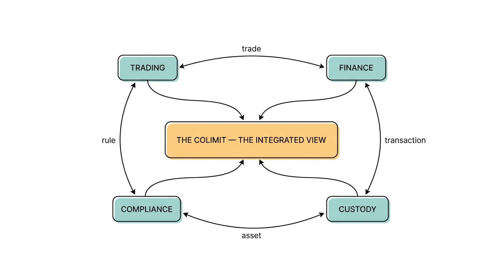

But the construction is always local to the moment and local to the question — which domains, which morphisms, which versions of each.

*Pattern: Colimit Query*

_Context:_ A business question spans multiple domains ("What is the revenue impact of our top-traded instruments?").

_Problem:_ Without principled composition, cross-domain queries are bespoke engineering projects — each one a custom mart, each one making ad-hoc join decisions, each one ungoverned.

_Solution:_ The colimit is the universal composition of domain categories connected by bridge functors. It identifies shared entities (Trading’s Instrument and Finance’s FinancialProduct are the same entity, seen from two perspectives), preserves each domain’s internal structure, and produces the smallest consistent cross-domain view. Any cross-domain query factors through the colimit. The colimit is implemented as governed cross-domain mart tables with explicit lineage showing which domains contributed and through which bridges.

_Example:_ "Revenue per top-traded instrument" factors through the Trading-Finance colimit. The colimit unifies Instrument and FinancialProduct (same entity, two perspectives), preserves Trading’s volume metrics and Finance’s revenue attribution, and produces a cross-domain view where trade_count and revenue are correctly joined at the instrument level. The mart’s schema documents: domains involved (Trading, Finance), bridge model (trading_finance_bridge), entities unified (Instrument/FinancialProduct via legal_entity_id).

_Consequences:_ Cross-domain queries through the colimit are slower than ad-hoc joins. The governance overhead is justified only for questions asked repeatedly.

Most information architecture still operates in a first-order logic frame. Entities have attributes. Attributes have values. Queries are predicates that filter and aggregate over those values. Joins are predicates that match rows across tables. Entirely predicative — asserting conditions and checking whether data satisfies them.

Category theory replaces predication with composition as the primitive operation. Instead of asking "which rows in table A match which rows in table B on this key?", you ask "how does the structure of domain A map into the structure of domain B, and what is the universal composition of both?" One gives you a result set. The other gives you a governed, structure-preserving, identity-respecting integration. One is a query. The other is architecture.

Without this upgrade, every cross-domain question is a bespoke integration project. With it, composition follows from the domain models and their bridges — governed artifacts that are documented, versioned, and maintained as part of the semantic layer.

In practice, implementation maps onto existing tools. Each domain’s Gold tables form an independent collection — a self-contained set of entities and relationships, exposed through its own semantic model and explore. Each is internally consistent, governed by its own vocabulary, documented in its own schema definition file.

Cross-domain mart tables are explicit compositions. The transformation tool’s lineage shows which domain Gold tables contributed and through which bridge models the data flowed. The mart’s schema definition documents the composition — domains involved, bridge models governing the mapping, entities unified. Documentation is not an afterthought; it is the composition itself, made visible.

The semantic layer manages composition at the consumption level. An explore that spans domains declares its domain dependencies explicitly. When an explore references both Trading Gold tables and Finance Gold tables, the semantic model file documents the join logic, the relationship cardinality, and the semantic rules for resolving polysemous terms. A "trade" in a cross-domain explore is explicitly the Trading domain’s definition of "trade," not the Finance domain’s. Ambiguity — the thing that kills cross-domain queries in ad-hoc architectures — is eliminated at the semantic layer.

Metrics compose across domain boundaries in the same way. A metric like "revenue per traded instrument" draws from both the Finance domain (revenue) and the Trading domain (instrument, trade count). The metric definition declares its domain dependencies, its bridge models, and its composition logic. Not a standalone calculation — a composed measurement, a colimit of the Finance and Trading perspectives on the same underlying business activity.

One more dimension connects to operational governance: privilege-based domain expansion. A user starts in their home domain. A finance analyst opens the system and lands in the Finance domain — Finance Gold tables, Finance semantic layer, Finance vocabulary. They ask about revenue. The agent loads Finance context and answers from Finance Gold.

Then they ask: "How does this relate to our trading volume?" At this point, the system checks whether the analyst has access to the Trading domain. If yes, the view widens. The agent loads the Trading-to-Finance bridge, composes the two domain perspectives, and answers from the resulting cross-domain view. If no, the system explains what it cannot access and why. This is epistemic honesty applied to domain boundaries, not a failure. The system does not pretend the Trading domain does not exist. It says: "That question requires Trading domain access, which your role does not include. Contact your domain administrator."

Domain expansion is categorical in the precise sense. Adding a domain to the user’s view means adding a category to the diagram and recomputing the colimit. The agent does not re-query everything from scratch. It extends the existing view through the relevant bridge functor. Incremental and governed. Each expansion is an explicit architectural decision — which domain, through which bridge, with which access controls — not an ad-hoc join.

*Pattern: Privilege-Based Domain Expansion*

_Context:_ A user or agent is querying data and their question crosses a domain boundary.

_Problem:_ Without access-controlled domain expansion, either the agent silently pulls from domains the user should not see, or domain boundaries become invisible and ungoverned.

_Solution:_ Users start in their home domain. When a question requires a second domain, the system checks access rights before expanding the view. If authorized, the agent loads the bridge functor and composes the two domain perspectives. If not authorized, the system states explicitly what it cannot access and why. Each domain expansion is an explicit architectural decision — which domain, through which bridge, with which access controls. Adding a domain means adding a category to the diagram and extending the colimit incrementally.

_Example:_ A finance analyst asks about revenue (Finance domain — authorized). Then asks: "How does this relate to our trading volume?" System checks Trading domain access. Authorized: loads Trading-Finance bridge, composes perspectives, answers from the cross-domain view. Not authorized: "That question requires Trading domain access, which your role does not include. Contact your domain administrator."

_Consequences:_ Incremental domain loading adds latency. Users accustomed to seeing all data at once experience the access checks as friction.

Categorical composition resolves the tension that data mesh identified but could not solve. Data mesh correctly argued that domains should own their data. Domain ownership without a composition mechanism produces silos. Categories preserve domain ownership — each domain is a self-contained category with its own governance — while providing a principled, governed mechanism for cross-domain composition. Domains remain autonomous. Composition is explicit. Shared vocabulary is not imposed from above; it emerges from the bridges, co-owned by the domains they connect.

Most data architecture treats integration as plumbing — connect the pipes, match the keys, reconcile the conflicts. Category theory reveals it as a structural problem: how do you compose conceptual systems while preserving the identity and coherence of each? Glue them by pushout along what they share. The static mathematics — how to compose specifications without contradiction — was settled in the specification-composition tradition decades ago. What remains, and what this book is really about, is the part that tradition did not face: composing systems that will not hold still, and using AI to keep the gluing current. That, plus the organizational will to treat cross-domain composition as architecture rather than ad-hoc query logic.

==== The Colimit Is Not a Unified Enterprise Model

A skeptic will say: this is a unified enterprise data model under different vocabulary. The objection deserves a direct answer, because the difference is structural, not cosmetic.

A unified enterprise data model is a noun — a thing you build and deliver. It is a single schema, constructed at one point in time, that claims to capture every domain’s vocabulary in one canonical structure. Completeness is required: if a domain is not in the model, the model is incomplete. The model is static: once delivered, it must be manually maintained against organizational change. No organization has ever successfully delivered one at enterprise scale. The projects take years, the domains evolve faster than the model can be updated, and the result is either abandoned or maintained as a regulatory fiction that no operational system trusts.

The colimit is a verb — something you track, measure, and use AI to keep current. It is not a single schema but a composition of local schemas connected by explicit, versioned, gap-aware morphisms. Completeness is not required: the colimit at any moment declares what is connected and what is not. Gaps are features, not failures — they tell you where governance work remains. The colimit evolves as domains evolve, because every constituent category and every morphism carries a version and a date. The colimit at time T is a different mathematical object from the colimit at time T+1, and the system tracks the difference.

The unified model asks: have we built it? The answer is always "not yet" or "yes, but it is out of date." The colimit asks: how healthy is it? The answer is a score — morphism completeness, bridge honesty, concept coverage, staleness — and the score changes as the organization changes. One is a deliverable that never arrives. The other is a practice that persists. The difference is not vocabulary but the gap between a product that ships and a practice that endures.

==== Morphism Honesty

A colimit without honest morphisms is unification with extra ceremony. Morphism honesty is unglamorous, painstaking work — and it is what turns the colimit from a framework into engineering.

An honest morphism between two domain entities is not a field mapping. It is a contract between two ways of knowing. It is an explicit, named, dated piece of documentation — signed by both domains — that states what the source entity maps to in the target, what attributes survive the map, what attributes are lost, what attributes the target adds that the source does not constrain, where the map is partial on either side, what the most recent verification scan found, and when that scan ran. Each of these is named explicitly. The losses and partialities are named explicitly. Nothing is implicit.

Consider, concretely, the morphism from Compliance.Customer to Trading.Counterparty. The map is well-defined for institutional clients onboarded through the compliance KYC process: `Compliance.Customer.legal_entity_id` is the source key, `Trading.Counterparty.cpty_id` carries the foreign key, the relationship is one-to-many because a single legal entity may have multiple trading accounts. So far this looks like a field mapping. It is not, because the interesting information is in what does not survive.

What does the map lose? `Compliance.Customer.kyc_sub_segment`, which has no Trading.Counterparty counterpart — forcing KYC sub-segmentation through would corrupt the trading model with attributes that have no operational meaning on that side. Where is the map partial? certain trading counterparties — proprietary desks, market-making subsidiaries — do not have a Compliance.Customer antecedent because they are internal entities that were never onboarded through KYC. Verified continuously rather than attested periodically: a verification agent re-checks the map against the current state of both domains on every scan — that the mapped keys still join, that no new attribute has appeared on either side that the map fails to account for, that the documented losses are still the actual losses. The map carries the date it was last confirmed to hold, which is last night, not the date a regulator last forced someone to look.

Every morphism looks like this when done honestly. Losses are documented because they are where the architecture is most likely to break under cross-domain queries. An agent traversing from a compliance question to a trading question reads this morphism and knows exactly what survived the map, what was lost, and where the gaps are. No inference required, no hallucination of relationships. Maps are first-class objects, and their honesty is what makes the colimit trustworthy rather than ceremonial.

*Pattern: Morphism Honesty*

_Context:_ A bridge functor connects two domains.

_Problem:_ If losses and partialities in the mapping are undocumented, cross-domain queries silently drop data or conflate concepts. The morphism looks complete but is not.

_Solution:_ Every morphism is explicit, named, versioned, and continuously verified. It documents: what attributes survive the map, what attributes are lost (and why), where the map is partial (entities in one domain with no counterpart in the other), what the last verification scan found, and when that scan ran. Losses and partialities are named explicitly. Nothing is implicit. The attestation is performed by each domain’s agent — which can read the map and the data it claims to align — with a human owner escalated only for the exceptions the agent cannot resolve. The morphism is a contract between two ways of knowing, kept honest by continuous verification rather than by signature.

_Example:_ Compliance.Customer to Trading.Counterparty. Survives: legal_entity_id to cpty_id, regulatory_classification. Lost: kyc_sub_segment (no trading analogue — forcing it through would corrupt the trading model). Partial: proprietary desks have no Compliance.Customer antecedent (internal entities, never KYC-onboarded). Verified: each domain’s agent, on the nightly scan. Last confirmed to hold: last night. The MiCA reclassification was caught by the scan that ran the morning after the rule changed the Compliance partition — not surfaced at a quarterly review a season later.

_Consequences:_ Documenting losses requires both domains to participate. One-sided morphisms are common in practice — the target domain sees no benefit in documenting losses.

==== Bitemporal Ontology

An axis the information architecture tradition has been almost entirely silent on, and it turns out to be load-bearing: ontologies themselves change over time. Meaning is not static. It shifts under regulatory pressure, organizational restructuring, market evolution, and the slow drift of institutional practice.

Compliance’s Customer definition in 2026 is not Compliance’s Customer definition in 2024. MiCA changed it, materially — the regulatory classification of certain crypto-asset service providers altered the segmentation logic, the jurisdiction tags, the onboarding requirements. The compliance-to-trading morphism in 2026 is therefore not the morphism that held in 2024, because the source object on one side of the map has shifted. An agent reading 2024 compliance documentation against 2026 trading data, with whatever morphism happens to be current, will produce confidently wrong answers about historical states of the world.

Bitemporality’s discipline — two-axis as-of queries, audit trails through versioned artifacts — applies in full to the ontology layer. Each domain ontology is itself a bitemporal object, with a valid time (when the definition applied in the world) and a system time (when it was written down). Each morphism is bitemporal: it has a date of last review and it is keyed against the versions of the source and target ontologies it connects. A historical query requires the historical ontology and the historical morphisms, not the ones current today.

Fractal discipline. Bitemporality runs through the data, through the ontology, through the morphisms between ontologies. An acquisition changes domain definitions. A regulatory inflection reclassifies entities. A product launch creates concepts that did not exist the previous quarter. At every level where meaning is claimed, the two-axis temporal discipline applies. In regulated industries — every compliance reconstruction, every regulatory inquiry, every restated filing — answering "what did this term mean at that time, and what morphism connected it to that other domain’s term at that time" is operationally non-negotiable.

==== Finishability

Colimit architecture makes the work finishable because it never requires the whole to be complete before the parts are useful.

Each domain ontology can be captured, documented, and served while morphisms to other domains are still being written. Each morphism is useful the moment it is signed — an agent or analyst working across two domains sees the two local ontologies plus the explicit morphism between them, regardless of how many other morphisms across the enterprise remain absent. The agent working across more domains than have been mapped sees the gap, transparently, and can request that the next morphism be written.

Contrast this with the information architecture tradition’s "unified enterprise model" dream, which was intrinsically unfinishable. Everyone in the industry knows that information architecture "takes forever" and never ships. The observation is accurate. The usual explanation — scope creep, organizational politics, insufficient funding — is wrong. The failure is structural.

Information architects were trying to build a colimit. They did not call it that, but the aspiration — one model that captures all domain vocabularies and their relationships, with a canonical resolution for every shared concept — is exactly the colimit construction. It took forever because a colimit over a moving target cannot be computed manually. The enterprise keeps changing: domains evolve, acquisitions arrive, regulations redefine entity boundaries, products launch and retire. Manual maintenance cannot keep pace. By the time the logical data model was "complete" for the domains as they existed at project start, the domains had moved. The model was accurate about an organization that no longer existed. Multi-year LDM projects never shipped because they were trying to manually compute a colimit over a target that would not hold still, and the mathematics of the situation — the colimit changes when any constituent category or morphism changes — made the aspiration structurally unreachable by manual means.

This is not a criticism of information architects. The discipline was intellectually rigorous. The goal was correct. The maintenance model was lethal. No team of human architects, however skilled, can continuously recompute a colimit across seven evolving domains, each with dozens of entities, connected by morphisms that shift under regulatory and organizational pressure. The work exceeded human bandwidth, and the projects died — not from laziness but from impossibility.

AI changes the maintenance equation. Not by building the colimit once, but by making it continuously re-evaluable. AI-maintained morphisms: when a domain ontology changes, AI identifies which morphisms are affected and flags them for review. AI-detected gaps: when a cross-domain query fails because no morphism connects the relevant domains, the failure is signal — it tells you where to write the next bridge. AI-surfaced staleness: when was the Compliance-to-Trading morphism last reviewed? Is it still accurate against the current versions of both domain ontologies? The colimit becomes "sufficiently synthesized and immediately available" — not as a completed artifact that someone delivered, but as a living, continuously evaluated measure of governance health. What killed every information architecture project in the pre-AI era — the maintenance burden of keeping a global model current over evolving domains — is precisely what AI absorbs.

The colimit is finished, locally, when a local ontology is captured and the morphisms to its neighbors are written down. No part needs global completeness before it is in production and useful. Traditional IA failed not through lack of effort or competence, but because its axioms demanded global completeness before any part was useful, and its maintenance model could not keep pace with organizational evolution. Colimit architecture removes both constraints: locality makes parts useful immediately, and AI makes maintenance tractable.

==== The Semantic Layer as Sole Interface

Every commitment in this architecture — bitemporality, colimit, morphism honesty, documentation — is delivered through the semantic layer or through nothing.

A consumer who bypasses the semantic layer bypasses the bitemporal contracts. They conflate the two structurally distinct questions that bitemporality was built to keep separate — what was true, and what was reported — and they will get plausible answers without knowing which question they have asked. Without the layer, there is no contract.

A consumer who joins Silver tables directly bypasses the morphisms entirely. They compose by physical key and reinvent — badly, locally, inconsistently — the maps the colimit framework was built to make explicit. After ten such joins, the enterprise has ten incompatible local re-implementations of the same morphism, each with different lossiness, none signed. The colimit dissolves into silos.

[#fig-sole-interface]
.The Semantic Layer as Sole Interface
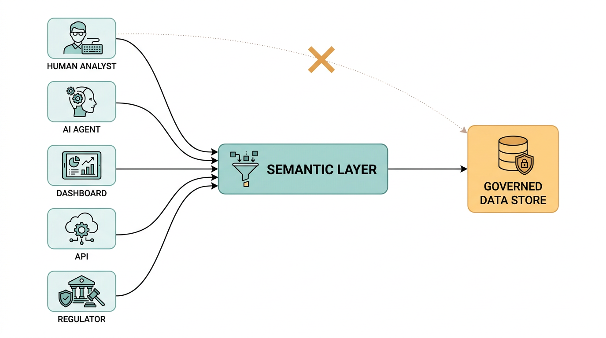

A consumer who queries direct SQL has access to column names and not much else. They are reasoning over the worst possible representation of the data — the representation the entire documentation discipline was written to argue against. Morphism narrative, edge-case warnings, temporal caveats: none of it is available below the semantic layer. The underlying database has no essay.

Not separable. Delivered together through one surface or through none. The semantic layer is the interface — not one among several — and nothing reaches the consumer except through it. Every gap an agent or analyst surfaces is a gap in the semantic layer, not a case for direct access. Remediation is documentation, ontology, morphism, or measure work — never a bypass.

Unpopular in the short term, correct in every term, because the alternative is slow fragmentation of every architectural commitment described above.

==== Rapid Onboarding: From Island to Archipelago

A trading desk needs a new analytical surface: executed volume classified by spread tier, bucketed by distance from mid price at execution time. The data exists in Silver — trade executions in one domain, market snapshots in another. A competent engineer can build a flat Gold table that answers the question in a few days. Denormalized, question-driven, shipped with an explore. Pattern followed. Question answered.

The table is an island.

Next month, the same desk asks: how does spread-tier distribution correlate with our daily P&L by strategy? That question spans two domains — the new Gold table lives in Market Intelligence (or Sales, or Pricing — the domain name is debatable, which is itself diagnostic); P&L lives in Finance. Without a morphism between them, the question becomes another bespoke engineering project. Another month. Another island.

Month after that: which counterparties are driving volume in the tightest spread tiers? Now the question touches Compliance (counterparty identity, KYC classification). No morphism. Another project. Another island.

Each island answers one question well. None of them compose. The organization accumulates Gold tables the way it accumulated dashboards — each one locally correct, collectively incoherent, and every cross-cutting question a fresh engineering engagement.

The colimit architecture changes this sequence. Building the Gold table is step one — necessary, fast, unchanged. Step two is the one most teams skip: register the new table’s concepts in the domain ontology. ``Spread tier'' is now a named concept in the Market Intelligence register, with a definition, a grain, a documented relationship to the mid-price proxy and the temporal window convention. ``Executed volume'' maps to the Trading domain’s execution grain. The morphism between them — the -second window join that aligns executions to snapshots — is a named, dated, signed bridge between two domain categories.

With these two steps done, the table is no longer an island. It is a node in an archipelago. The follow-up questions compose:

The P&L correlation question factors through the existing Trading-to-Finance morphism. The new Gold table plugs into it because its concepts are registered in Trading’s ontology, and Trading already has a bridge to Finance. The agent follows the morphisms: spread tier (Market Intelligence) latexmath:[$\to$] execution (Trading) latexmath:[$\to$] P&L (Finance). Each hop is a documented, governed bridge. No bespoke engineering.

The counterparty question factors through Trading-to-Compliance. Same mechanism. The agent reads the morphism, knows what survives the map (counterparty identity) and what is lost (KYC sub-segments), and composes the cross-domain view. Hours, not months.

Colimit health is what determines how fast this composition works. If the Trading-to-Finance morphism already exists (because someone wrote it for a previous cross-domain question), the new Gold table benefits immediately. If it does not exist, the new question surfaces a gap — and the gap becomes morphism work, not a bespoke Gold table. Each morphism written makes the next cross-domain question cheaper. The architecture accumulates connective tissue.

This is the practical payoff of treating the colimit as a living eval target. Not governance for its own sake. Speed. The ability to answer the next question without starting from scratch. An organization with twenty Gold tables and no morphisms has twenty islands. An organization with twenty Gold tables and fifteen morphisms has a navigable knowledge architecture where an agent can traverse from any domain to any connected domain, composing answers from governed bridges. The difference between the two is not the Gold tables — it is the gluing.

The team that ships Gold tables without morphisms will build fast and compose never. The team that writes the morphism alongside the Gold table — even a partial morphism, even one that documents losses and gaps — ships at the same speed and compounds its investment with every subsequent question. Morphisms are the compound interest of data architecture.

==== Where This Architecture Breaks

*Semantic layer as bottleneck.* When the extension intake slips from days to weeks, analysts route around it. They write direct SQL. They build local spreadsheets. Every workaround is a fork. The sole-interface commitment is the first casualty, and it dies quietly — not through a policy reversal but through accumulating exceptions that nobody tracks. The architecture described above assumes the semantic layer team can absorb new measure and dimension requests faster than the business generates them. When it cannot, the architecture fragments regardless of how sound the design is. Staffing the intake is not a nice-to-have. It is a structural prerequisite.

*Bitemporality storage cost.* Full SCD2 on every Silver dimension, at scale, produces tables three to ten times larger than non-bitemporal equivalents. At petabyte scale, this is a real budget conversation — tens of thousands of dollars per month in additional storage and query cost. The architectural argument for bitemporality is correct: you need both timelines or you cannot answer regulatory questions. But the cost is not zero, and teams that adopt full bitemporality without modeling the storage implications will face uncomfortable conversations with finance. Name the cost. Budget for it. Apply bitemporality in tiers: Tier 1 for regulated entities, Tier 2 for volatile dimensions, Tier 3 for stable reference data. Universal Tier 1 is the aspiration. Tiered adoption is the practice.

*Colimit scaling.* With seven domains and fifteen morphisms, colimit health is manageable. One team can review every cross-domain mapping quarterly. With two hundred domains, the combinatorial surface of cross-domain mappings exceeds any team’s capacity. The colimit is most useful in the five-to-thirty domain range. Beyond that, you need hierarchical composition — colimits of colimits, where clusters of related domains form sub-colimits that are then composed at a higher level — or you accept that most domain pairs will never be directly connected. This is not a failure of the theory. It is a scaling constraint that the theory does not advertise.

=== The Metadata Repository of the Future

Every organization has a metadata problem. They have too much data, too little context, and no reliable way to connect the two. The traditional solution is a metadata repository — a database that catalogs your data assets, tracks lineage, stores definitions, and provides a search interface. Collibra, Alation, and their competitors have built a multi-billion-dollar industry on this need.

Traditional metadata repositories solve the wrong problem. They answer the question: "What data do we have?" Useful, but the wrong starting point. Right question: "What does an agent need to know before it reasons over this data?"

Library catalog versus mission briefing. One tells you what books exist; the other tells you what you need to know to accomplish a specific objective.

Concretely: when an AI agent is about to answer a question about trading volume, it needs context — not just the schema of the Gold table. It needs to know: What does "trading volume" mean in this organization? What is included and what is excluded? What is the grain of the data? How fresh is it? What known quality issues exist? What related concepts should it be aware of? What caveats apply to this particular time period?

In the traditional MDR model, this context lives in a governance tool that the agent would need to query before answering — adding latency, complexity, and a dependency on a system that may or may not be available. In the model being built here, this context is populated into the agent’s reasoning window as a pre-flight briefing. Before the agent touches the data, it reads the relevant domain ontology, the ISO 11179-compliant definitions, the quality signals, the freshness metadata, and the tutorial-quality documentation that explains how the domain works.

Briefing composition is specific. Domain ontologies — not heavyweight OWL, but lightweight, machine-readable descriptions of concepts and their relationships. It includes definitional discipline drawn from ISO 11179 — the international standard for metadata registries that has been around since the 1990s, adopted successfully in public-sector metadata programs across multiple countries, but never operationalized at scale in commercial enterprise because humans could not maintain the registry. AI changes this equation. What was too expensive to maintain manually becomes cheap when AI does the maintenance.

And something traditional MDR vendors have never thought to include: tutorial-quality documentation that agents read as narrative context. "This domain covers market-making activity. A market maker provides liquidity by maintaining buy and sell orders. The key metrics are spread, fill rate, and inventory position. Spread is measured in basis points. Fill rate is the percentage of orders that result in trades. Inventory position can be positive (long) or negative (short)." An agent that reads this paragraph before querying the data will produce dramatically better results than an agent that reads only column names and type definitions.

Agents do not passively absorb this context. They perform pre-flight checks: read the quality signal — is this data set healthy, degraded, or failing? Check freshness — when was this data last updated, and is that recent enough for the question being asked? Verify access — does the requesting user have permission to see this data? If the data is stale, the agent says so. If access is restricted, the agent says so. This is epistemic honesty built into architecture, not bolted on as an afterthought.

Consider what this means in practice. A senior executive asks: "What was our total trading volume last month?" In the traditional model, this question goes to an analyst, who queries a dashboard, which queries a table, which may or may not be current, documented, or correctly defined. The analyst knows the caveats — this table excludes test accounts, it has a two-hour lag, the definition of "volume" changed in March — but those caveats live in the analyst’s head. If a different analyst answers the same question, they might use a different table with different caveats and get a different number.

In the MDR-as-context-engine model, the agent reads the pre-flight briefing before answering. It knows that "trading volume" means the total quantity of assets exchanged, excluding test accounts. It knows the data was last refreshed two hours ago. It knows that the definition changed in March and can flag this if the question spans that boundary. The answer comes with its own audit trail — not because someone built an audit feature, but because the context engine populated the relevant metadata into the agent’s reasoning window, and the agent included it in its response. The caveats are not in anyone’s head. They are in the architecture.

Catalog wars become relevant here. Data catalog market: projected to reach nearly ten billion dollars by 2032. Gartner returned to the Metadata Management Magic Quadrant in 2025 after a five-year hiatus, with a framing that captures the moment perfectly: "no metadata, no AI." Genuine need. But most catalog implementations are still oriented toward the old interaction model — humans browsing for data assets, discovering tables, reading descriptions. Catalogs that serve agents will win. Catalogs that serve analysts will become compliance artifacts.

This vision is not fully operational today. The knowledge catalog being built has limitations: lineage retention is measured in days, not months. IAM integration is incomplete. The agent pre-flight pattern is a design target that works in specific flows but is not yet generalized across all consumption paths. What exists is a detailed specification, a working prototype in key domains, and a clear architectural trajectory. What does not yet exist is a production system that does all of this at scale.

But trajectory matters more than current state. Browse-based MDR is a dead end — not because it is badly built, but because agents do not browse. They read context, reason over data, and produce answers. Tomorrow’s MDR is a context engine: it assembles the relevant context for a specific query, populates it into the agent’s reasoning window, and lets the agent do what agents do best.

ISO 11179 is the forgotten ancestor of everything described in this essay. Around since the 1990s. Its core insight — that a Data Element combines a semantic meaning with a representation, and that these two aspects should be managed separately — is exactly the Decoupling thesis. The standard has been adopted successfully in public-sector metadata programs in Australia, Canada, the United Kingdom, and the United States. It has been almost entirely ignored by commercial enterprise. Why? Because humans could not maintain the registry at scale. Right architecture, lethal maintenance assumption. AI eliminates it. ISO 11179 definitional discipline plus AI-powered maintenance is what makes the MDR-as-context-engine viable. The standard was always right. The maintenance model was always wrong. Now it can be fixed.

Four components form the knowledge architecture: Bronze (faithful witness), Silver (canonical interpretation), Gold (knowledge menu), and the MDR (context engine). Not a data platform with metadata sprinkled on top — an integrated system where data, meaning, and context are managed as a single concern.

Bronze is your supply chain. Silver is your kitchen. Gold is your menu. The MDR is your maitre d’ — the intelligence that knows what is on the menu tonight, what is fresh, and what the customer should know before ordering. Most data platforms today are warehouses with loading docks, and the restaurant described here is harder to build.

But the forcing function has arrived. Your primary consumer is no longer a human analyst who can squint at a messy dashboard and figure it out. It is an AI agent that needs clean semantics or it hallucinates. It cannot compensate for missing definitions, navigate undocumented star schemas, or reason through ambiguous column names. It needs a menu — or it produces garbage with confidence.

AI demands the architecture, and AI makes it viable. The maintenance burden that killed every formal ontology project, every metadata graveyard, every governance initiative that relied on human vigilance — AI absorbs it.

Most of this architecture is operational, with the rest under detailed specification. The seven positions are production standards, encoded in machine-readable documents, enforced by CI/CD pipelines, and consumed by the agents whose existence motivated the architecture in the first place.

The restaurant is open. The question for every data platform leader is whether they are building one or still managing a loading dock. The new customers do not rummage through ingredients. They read the menu — and the menu had better be right, because these customers will repeat your mistakes at scale without a flicker of embarrassment.

== Exploring the Glued Ontology

The flat Gold table answers the question it was built for, brilliantly and cheaply, and not one question more. That is its virtue and its limit. The analyst who asks "daily P&L by desk by strategy" gets a perfect answer; the analyst who then asks "...and how does that break down by the counterparty's custody region, for counterparties onboarded in the last year?" has left the table behind. The second question crosses three domains — Trading, Compliance, Custody — and no single flat table was built for it, because nobody anticipated it. This is not a defect to engineer away. It is the permanent condition of analysis: the next question is not on the menu.

The book has so far given two consumption surfaces. Flat Gold, for the anticipated question. And Silver-as-Gold views, which expose a *single domain's* dimensional model through the semantic layer — grain-defended, SCD2, conformed — so an analyst can drill and slice within Trading without a physical star schema to trip over. Both are real and both are covered. Neither is the thing a business user or a data scientist actually wants when they are exploring, which is to pivot freely across the *whole* business — to start in revenue, swing into trading volume, land on counterparty risk, and finish in custody positions, in one unbroken line of thought, without anyone having pre-built the join.

That capability has a name in this architecture, and it is the consumption face of the colimit. The glued ontology — the domains and the bridges between them — *is* a dimensional model that spans the enterprise. You do not materialise it as a giant star; you navigate it, live, Silver-direct, through the semantic layer. This chapter is about what that navigation is, how it works mechanically, and the one genuinely hard problem it raises.

=== One Exploratory Session, Many Domains

Picture the session, not the query. A risk analyst starts in Risk: counterparty exposure, drawn from the Risk domain's Silver dimensional model exposed as a governed view. She drills by counterparty. She wants instrument detail — that lives in Trading — so she pivots, and the semantic layer composes the Trading dimensions onto her current view through the Trading–Risk bridge, resolving that "exposure" means something different on each side and declaring which it is using. She pivots again to custody region; the Custody bridge carries her there. Three domains, one session, no pre-built mart, every hop governed.

Mechanically, this is the colimit doing exactly what Chapter 4 said it does, turned into a consumption surface:

* *Each domain contributes its dimensional model Silver-direct.* The drill-and-slice power comes from Silver — grain, conformed concepts, history-where-tiered — exposed as a governed view, never a physical star in Gold. The analyst sees a logical dimensional surface; the semantic layer generates the SQL.
* *Bridges compose the surfaces.* A pivot across a domain boundary loads the bridge between the two domains (the same span-through-a-shared-sub-theory from "Multi-Domain Composition") and joins on the shared concept — at the right time grain, via the As-Of Join rule from the Time chapter, because cross-domain joins are exactly where time-between-entities bites.
* *Register-switching resolves polysemy as she crosses.* "Position," "exposure," "volume" mean different things per domain; the semantic layer holds each domain's definition and declares which one the composed view is using, so the pivot does not silently change what a word means.
* *The view is the colimit, scoped to the session.* She is never querying "the whole enterprise model." She is querying the sub-colimit of the domains she has actually reached — the local manifold of her question — which is why this stays answerable as the estate grows.

// TODO: figure asset — cross-domain dimensional navigation: three domain dimensional models, bridges as the composing morphisms, one analyst path traversing them, with the access-policy intersection shaded.
[#fig-cross-ontology-dimensional]
.Exploring the Glued Ontology — domain dimensional models composed Silver-direct through bridges into one navigable surface
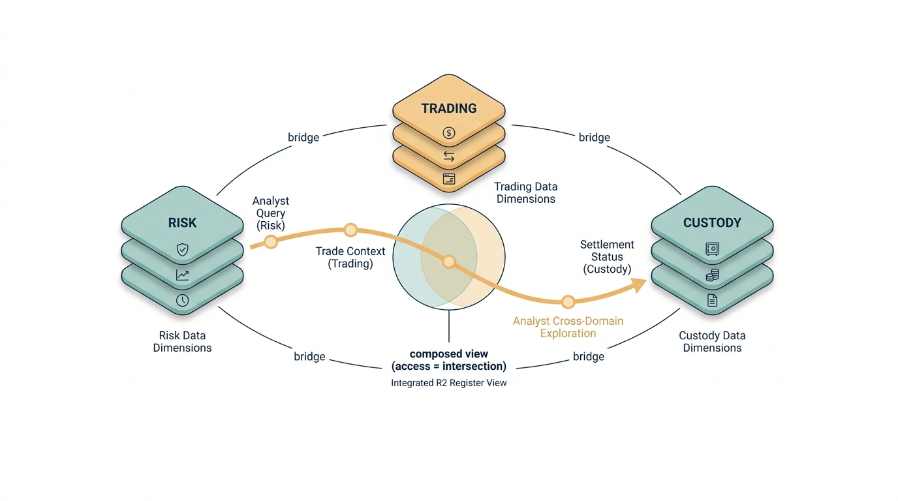

=== Whose Security Governs the Joined Cell?

Here is the hard problem, and it deserves to be named rather than waved at, because it is the one that clean rooms exist to solve. When a Trading row and a Compliance row are composed across a bridge, *whose* access policy governs the resulting cell? The analyst may be cleared for Trading and not for the Compliance attributes that the bridge would pull in. If composition silently widens her view, the architecture has built a privilege-escalation engine; if it silently drops the restricted columns, she gets a partial answer that looks complete.

The rule is that **composed access is the intersection, declared at the bridge, never inferred at query time.** A cross-domain view exposes a cell only if the consumer is authorised for it in *every* domain that contributed to it; where she is not, the cell is withheld *visibly* — a typed "restricted," not a silent omission — and the view tells her a Compliance grant is what would complete it. The bridge is where the row- and column-level policy of the two domains is composed and recorded, the same way the bridge records what maps and what is lost. This is the access-control face of the sharing rule: you cannot compose what the consumer cannot see in both places, and the system says so out loud rather than guessing.

*Pattern: Cross-Ontology Explore*

_Context:_ A business or data-science user explores across domain boundaries in one session — pivoting through dimensions that live in different domains — rather than asking a single pre-anticipated question.

_Problem:_ Flat Gold answers only its built-for question; single-domain Silver-as-Gold drills only within one domain. The cross-domain exploratory pivot either becomes a bespoke mart (rigid, one question, weeks of engineering) or a hand-written join (ungoverned, polysemy-blind, security-blind).

_Solution:_ Expose the colimit as a live navigable surface. Each domain contributes its Silver dimensional model as a governed view; bridges compose the surfaces on pivot, joining on shared concepts via as-of alignment; register-switching declares which domain's definition each polysemous term carries; access is the intersection of contributing domains' policies, composed at the bridge and withheld visibly where absent. The user navigates the sub-colimit of the domains she reaches — no pre-built mart, every hop governed.

_Example:_ Exposure (Risk) → instrument (Trading) → custody region (Custody), one session. Each pivot loads the relevant bridge, resolves the polysemous term ("exposure": Risk's PFE-inclusive vs Trading's mark-to-market), as-of-joins on the shared counterparty identity, and exposes only cells the analyst is cleared for in all three domains; the Compliance KYC attribute she lacks rights to shows as `restricted`, with the grant that would unlock it named.

_Consequences:_ Live cross-domain composition is slower than a pre-materialised mart and leans hard on bridge quality — a missing or stale bridge surfaces as a gap the analyst hits mid-pivot, not a wrong number, which is the right failure but still a failure. For the highest-traffic cross-domain questions, materialise the composed view as a governed flat Gold table (the colimit told you exactly how to build it); keep the live explore for the long tail of questions nobody anticipated.

=== Who This Is For

Two consumers, the same surface. The **business user** gets genuine self-serve: not "here are the ten dashboards we pre-built," but "pivot anywhere the bridges reach, and where they do not, the gap is named and becomes the next morphism to write." The **data scientist** gets cross-domain *feature discovery* — the ability to find and assemble features that span domains (settlement behaviour from Custody against trading patterns from Trading against KYC recency from Compliance) without first standing up a join nobody will govern. Both are doing the same thing: walking the glued ontology. The difference between an organisation that can do this and one that cannot is not the number of Gold tables. It is whether the bridges exist — the connective tissue from "Multi-Domain Composition," now earning its keep as the thing that makes the next question free.

== Time

Time is one modelling discipline among many, and the fastest way to wreck a data platform is to treat it as the whole game. Done in fear — full historical machinery on every table, two time axes on every row — it produces models nobody can query and costs nobody can justify. Done in denial — overwrite-in-place, one timestamp, hope — it produces a warehouse that cannot answer the one question an auditor always asks. The discipline is to treat time *carefully where it matters and simply where it does not*, and to know the difference before you model, not after the inquiry.

There is one temporal distinction worth building the chapter around, because it is the one that turns audits into arguments when it is missed. The question "what was our P&L last quarter?" has two structurally different answers. One reconstructs *what was true* — applying every correction, reclassification, and late-arriving fact available today. The other reconstructs *what was reported* — what the system said at the time, with whatever it knew on the day the report was pulled. Both are real, both legitimate, and most architectures conflate them by omission: the infrastructure to keep them distinguishable was never built, because nobody asked until the worst possible moment — a regulatory inquiry, a restatement, or an agent that inherits a baked-in temporal assumption and confidently answers the wrong one of the two.

That distinction is worth getting right. It does not follow that you pay for it everywhere. Most of this chapter is about *where* the heavy machinery earns its cost, where a single timestamp is plenty, and how to handle the cases the bitemporal literature is silent on — joining entities that keep time differently, data arriving as a stream, a feed whose cadence changes under you, and the awkward collision between "we never delete" and a regulator who can compel deletion. Bitemporality is a tool in this chapter, not its thesis.

=== The Two Questions

At any moment, somebody will ask what happened on a particular date. Auditor, regulator, analyst, risk model, LLM agent composing a quarterly summary —- the identity varies, but the question is always one of two structurally different questions, and the architecture must answer both while keeping them distinguishable.

[#fig-two-questions]
.Two questions, one fact: what was ‘true’ versus what was ‘reported.’ The architecture must answer both and keep them distinct.
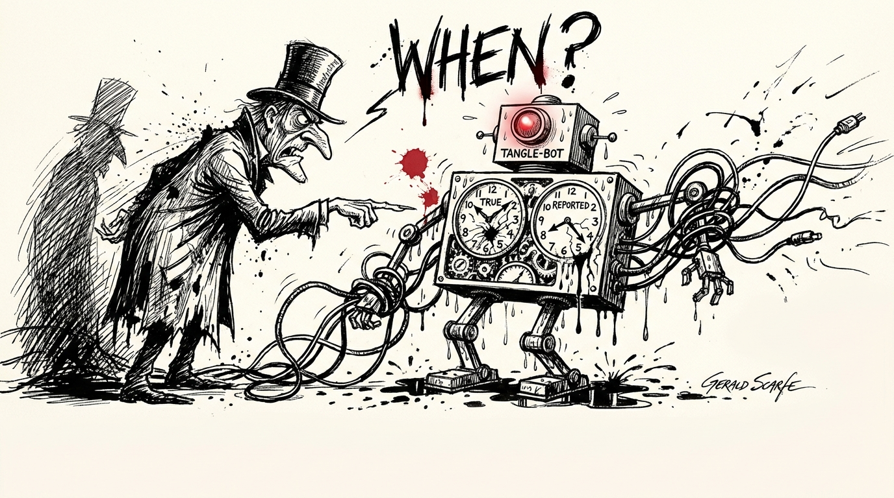

First: what was true? What is now known about the state of the world on that date, with late-arriving facts received, corrections applied, reclassifications processed. A counterparty that was labelled "retail" on the day of the trade but was reclassified to "institutional" three weeks later now appears under its corrected classification. A revenue figure that was booked provisionally at month-end and adjusted during the close cycle now reflects the adjusted amount. Current best reconstruction of the past, incorporating everything learned since. Sometimes called valid time — the time at which things were true in the world, as best understood today.

Second: what was reported? What did the system say at the time? Reports produced on day T used the data the warehouse held on day T —- data since corrected, augmented, and reclassified. Those reports are themselves part of the historical record: what regulators received, what management acted on, what the board reviewed. The number the warehouse now believes correct and the number it published three weeks ago are both real, both legitimate, and frequently different. Sometimes called system time or transaction time — when the warehouse recorded or reported a fact.

[#fig-two-clocks]
.One Fact, Two Clocks — the same fact plotted on valid time (x) and system time (y); a correction moves it back and up, and the old fact is never overwritten
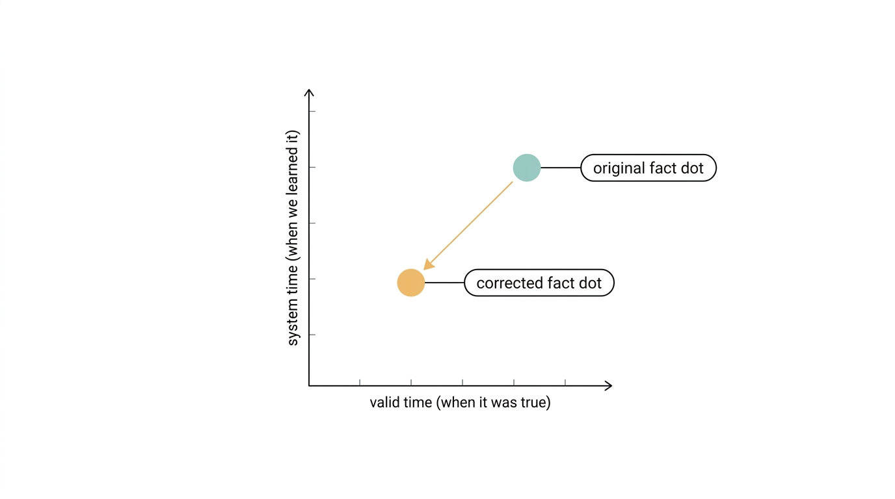

Both correct. Different questions, different consumers, different needs. Risk management needs "what was true" — the current best estimate of exposure, incorporating every correction. Regulatory submissions need "what was reported" — the filing captured reality as it was known, and retroactively changing filed numbers creates its own regulatory problems. Finance needs both, at different moments in the close cycle. Treasury needs both, for different purposes: mark-to-market versus reported position. An architecture that cannot serve both forces consumers to work around it, and workarounds in financial data are how control breakdowns begin.

A trade is booked on March 15. The counterparty is classified as "retail" based on the KYC records current at booking time. The trade flows through the nightly pipeline, lands in Silver, gets picked up by the daily P&L Gold table, and appears in the March 31 quarter-end report with a retail counterparty classification. Everything is clean.

On April 2, a KYC review reclassifies the counterparty from "retail" to "institutional." The reclassification is backdated to March 10 — the counterparty should have been classified as institutional before the trade was even booked. The correction enters the system on April 2, but its valid-time effect reaches back to March 10.

Now pull the P&L report on April 15. The numbers are different. The counterparty is institutional, not retail. The segmentation buckets have shifted. Aggregates that roll up by customer segment show different totals. If the institutional tier carries different fee structures or risk weightings, the P&L itself may have changed. If the institution uses different capital-adequacy treatments for institutional versus retail counterparties, the downstream capital calculations have shifted as well — and those calculations may have been submitted to a regulator in the interim.

Which report is right? Both. March 31 correctly represents what the system knew on March 31. April 15 correctly represents what the system now knows about the same period. A regulator asking "what did you report at quarter-end?" needs the March 31 version. A risk manager asking "what is our actual exposure by counterparty segment?" needs the April 15 version. An agent that does not know which question it is answering will confidently return one when the consumer meant the other, and the confidence is what makes the error dangerous — a hesitant wrong answer invites scrutiny; a confident one gets acted on.

Bitemporality makes both answers retrievable, distinguishable, and cheap to obtain. It tracks two independent time axes: when things were true in the world (valid time) and when the system learned about them (system time). Every fact in the warehouse exists at the intersection of these two axes, and any query can specify a position on both.

"Bitemporal" has been in the database-theory literature since the early 1990s. What is new is the forcing function: when the consumer is an agent that reasons over answers and presents conclusions to humans who act on them, temporal ambiguity that humans navigated through context and institutional memory becomes systematic error. A human analyst pulling the P&L report usually knows whether they are looking at a current reconstruction or a historical filing —- memory, a colleague’s mention of the correction, an email about the reclassification. An agent knows none of this. It knows what the architecture tells it. If the architecture does not distinguish the two temporal axes, the agent cannot distinguish them either, and every answer it produces carries an unmarked temporal assumption that the human consumer has no way to evaluate.

=== The Contract

One sentence: Gold is authoritative for what was reported; Silver is authoritative for what was true; bitemporality reconciles them.

Silver and Gold have different temporal contracts, deliberately. Collapsing them into a single regime is an architectural error that surfaces as an audit finding.

How much time does Silver carry? Not "two axes on every row, always" — that is the fearful answer, and it is the one that produced terrible models in practice: query complexity and storage cost paid on every table to serve a reconstruction need that a small fraction of tables will ever exercise. Time in Silver is **tiered**, and the tier is a modelling decision made per entity, not a substrate-wide default.

[#fig-bitemporal-overkill]
.Two clocks on every row, always, is overkill. Tier it — full history only where a regulator will actually ask.
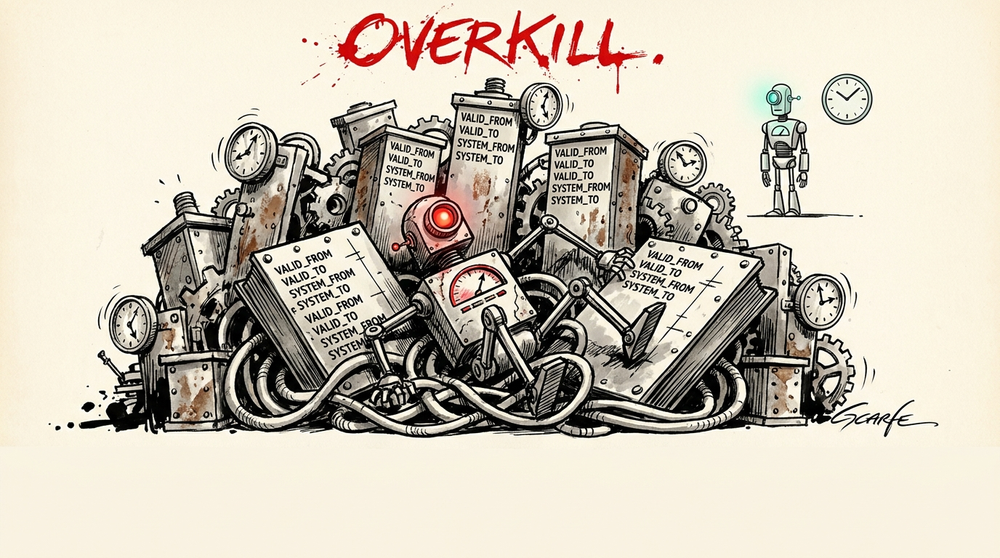

* **Tier 1 — full bitemporality** (`valid_from`/`valid_to` *and* `system_from`/`system_to` at row level). For entities that feed financial reporting, regulatory submission, or risk: counterparties, positions, classifications — anything a regulator might ask "what did you report, and when did you learn otherwise?" about. This is where the two-questions distinction is load-bearing, so this is where you pay for it.
* **Tier 2 — valid-time history only** (SCD2: `valid_from`/`valid_to`, no system-time axis). For things that change meaningfully and you need to ask "what was true at the time of this transaction?" — desk assignments, strategy tags, fee schedules — but where you do not need to reconstruct the warehouse's evolving *belief*. Most dimensions that change live here.
* **Tier 3 — current state only** (overwrite, with an audit log). For stable reference data that changes rarely and predictably: currencies, countries, static lookups. SCD2 here is pure waste — you are historicising a table whose history nobody will query.

The decision rule is a question, not a tier label: *will anyone ever ask a temporal question of this entity, and which one?* If the answer is "what was reported, and when did belief change" → Tier 1. If "what was true at transaction time" → Tier 2. If "nobody will ask" → Tier 3, and you can always promote later. Promotion is cheap *because the data was landed and catalogued from day one* — which is the governing principle for everything ambiguous: **land it, catalogue it, and add temporal depth only when a real question demands it.** Space is cheap; query complexity and the maintenance of axes nobody reads are not. The old fear — "retrofitting history costs an order of magnitude more than building it in" — is real only for the raw signal: as long as you *kept* the raw arrivals (you did; storage is cheap), promoting a Tier 3 table to Tier 2 or Tier 1 is a re-materialisation, not an archaeology dig.

The one thing you do not do is tier *by promise* — "we'll add history when we need it" with the raw data already thrown away. That is the failure the fearful answer was overreacting to. Keep the raw, tier the modelling.

In practice, Silver dimensions are SCD2 on both axes. The familiar `valid_from`/`valid_to` pattern that snapshot strategies (dbt snapshots, Dataform snapshots, or equivalent) implement captures valid time — when did this attribute value apply in the world? `system_from`/`system_to` adds the second axis — when did the warehouse first record this row, and when was it superseded by a correction? Corrections do not overwrite. They close the prior row’s `system_to` and open a new row. The prior row remains, queryable, part of the permanent record.

Most transformation implementations get halfway there. The generated `valid_from` and `valid_to` columns capture valid time reasonably well. The `_loaded_at` or `_ingested_at` timestamp most pipelines carry is a rudimentary system-time marker. What implementations miss is promoting system time from a pipeline-operational column to a first-class queryable axis. `_loaded_at` tells you when a row arrived; it does not let you reconstruct what the warehouse believed at an arbitrary historical moment, because it does not close out prior rows with a `system_to`. "When did this row arrive" is an ingestion log. "What was the warehouse’s state of belief at time T" is an architectural commitment.

Snapshot tooling gives you SCD2 —- change detection on the source, producing `valid_from`/`valid_to` columns that reconstruct historical states. Valid-time axis, clean. But snapshots are not designed to track the warehouse’s own evolving belief about a given fact. When a correction arrives and the source system sends an updated record, the snapshot correctly closes the old row and opens a new one. What snapshots do not give you: a clean `system_from`/`system_to` pair answering "what did Silver believe about this entity on March 25?" independently of "what was true about this entity on March 25?" Two questions, two independent time axes. Snapshots give you one. The other requires deliberate engineering — custom macros, explicit system-time columns managed by the transformation logic, query patterns that filter on both axes simultaneously. Unglamorous column-management work that separates a pipeline from an architecture.

*Pattern: Two-Axis Row*

_Context:_ Building Silver dimension and fact tables that need to support historical reconstruction and audit.

_Problem:_ Single-axis temporal models (valid time only, or system time only) conflate "what was true" with "what was known." Corrections and late-arriving facts become invisible or destructive.

_Solution:_ Every Silver row carries two temporal axes. Valid time (`valid_from`, `valid_to`) records when the fact was true in the world. System time (`system_from`, `system_to`) records when the warehouse learned about it. Both are first-class columns on every dimension and every fact. As-of queries against Silver take two parameters. This is the default for the whole substrate, not a feature for regulated workloads. The two axes are orthogonal — a fact can be valid in March but entered into the system in April, and the architecture must distinguish these.

_Consequences:_ Storage overhead and query complexity as described in Silver SCD2. Every query must specify two temporal coordinates or accept defaults — adds cognitive load for analysts unfamiliar with bitemporality.

Gold carries table-level temporal coordinates as metadata, not per-row bitemporal columns. Three metadata attributes per published Gold table: `as_of_valid_time` (what valid-time snapshot was used to build it), `as_of_system_time` (what system-time snapshot was used — typically the build time), and `generated_at` (when the table was materialized). Rows in a Gold table are point-in-time materializations under those coordinates. Auditing means re-deriving from Silver using the metadata coordinates the table carries.

Gold is versioned, not mutable. Named versioned tables — `gold.pnl_daily_v20260520` or equivalent — published as immutable artifacts. Each subsequent published version captures the next point in the bitemporal grid. When Silver is corrected, Gold is not retroactively rewritten. A new version is published capturing the latest understanding; the previous version remains untouched. The audit trail is the sequence.

Resisting the urge to collapse this asymmetry is one of the harder architectural disciplines. Teams sometimes make Gold "bitemporal" by adding row-level valid and system columns, replicating Silver’s contract one layer up. Feels thorough. Is an architectural collapse —- two bitemporal substrates means two sources of truth, which means no source of truth, which means the next audit becomes an argument about which substrate is authoritative. Silver reconstructs. Gold publishes. Silver supports any temporal question. Gold supports "what did we publish, and when?"

A subtler failure mode: mutable Gold, updating rows in place when corrections arrive rather than publishing new versions. Convenient —- consumers query a single Gold table and get the current answer without navigating version coordinates. Also the destruction of the audit trail. The March 31 P&L —- the one the board reviewed, the one the regulator received —- no longer exists. Overwritten by the April 3 version. When the auditor asks "what did you report?", the answer is gone. Mutable Gold trades a small convenience for the loss of the architecture’s most valuable property: the ability to tell you what it said and when it said it.

Queries against Gold receive published-as-of semantics by default: what was published, as of the version queried. Queries against Silver receive truth-as-now-known semantics: the current best reconstruction. Both surfaces accept explicit as-of coordinates when callers need to override. The semantic layer does not hide the distinction. It names it.

=== Correction Events

Architectures are not tested by the data that arrives on time. They are tested by the correction that arrives three weeks late and rewrites the meaning of everything published in between.

Everything above is scaffolding until a correction flows through the system. The scaffolding earns its cost the first time a correction arrives and the architecture handles it without losing history, without retroactively rewriting published outputs, and without leaving any consumer confused about which version of truth they are looking at.

Trace the counterparty reclassification end to end. A counterparty is reclassified from "retail" to "institutional" three weeks after a trade was booked, following a KYC review. The reclassification is backdated — the counterparty should have been institutional as of a date prior to booking. The correction enters the upstream trade-capture system on April 2; the pipeline picks it up that evening.

In Silver, the correction arrives as a supersession, not an overwrite. The row carrying the "retail" classification gets its `system_to` set to April 2. A new row appears with "institutional," `system_from` set to April 2, `valid_from` backdated to March 10. Valid-time columns reflect when the classification applied in the world; system-time columns reflect when the warehouse learned about each version. The old row is not deleted —- it is closed, permanently queryable by any consumer who needs to know what the warehouse believed before the correction.

Silver now supports four distinct queries about this counterparty, each returning a different answer, each legitimate. "What was the classification on March 15, as we understand it today?" returns institutional — valid time March 15, system time now. "What was the classification on March 15, as we understood it on March 20?" returns retail — valid time March 15, system time March 20 (before the correction). "What is the current classification?" returns institutional — both axes set to now. "When did we learn the classification was wrong?" is answered by the `system_from` on the corrected row — April 2. Four questions, four answers, one table, two time axes. This is what the scaffolding is for.

If the correction changes the counterparty assignment on the trade itself — not just attributes but which counterparty the trade is assigned to — the same supersession discipline applies on the fact. Same `event_timestamp`, new `cpty_id`, with `system_from` set to the correction’s arrival and the prior row’s `system_to` closed. The trade happened on the same date in the world. The warehouse’s understanding of who was on the other side changed.

*Pattern: Supersession*

_Context:_ A correction, reclassification, or late-arriving fact changes what the warehouse knows about a historical state.

_Problem:_ Overwriting the prior value destroys the audit trail. The system can no longer answer "what did we believe before the correction?"

_Solution:_ Corrections arrive as supersessions, not overwrites. The old row’s `system_to` is set to the correction timestamp. A new row opens with the corrected value and `system_from` set to the correction arrival. Valid time on the new row may be backdated if the correction applies historically. The old row remains permanently — queryable by any consumer who needs pre-correction state. Nothing is deleted. Nothing is overwritten. The historical trail is the sequence of supersessions.

_Consequences:_ Never-deleted rows mean Silver tables grow monotonically. Archival and partitioning strategies become essential at scale.

In Gold, the P&L tables published in the three weeks since booking remain as published. `gold.pnl_daily_v20260331` is untouched —- built from Silver as Silver stood on March 31, before the correction existed — not wrong, but what was reported.

The next scheduled Gold rebuild picks up corrected Silver and produces `gold.pnl_daily_v20260403`, incorporating the reclassified counterparty. The correction is visible by comparing versions. A regulator who asks "what did you report at quarter-end?" gets the March 31 version. A risk manager who asks "what is our current best understanding of Q1 P&L by segment?" gets the April 3 version. Both are first-class answers. Neither requires special handling or exception logic. The architecture produces them by default.

*Pattern: Gold Versioning*

_Context:_ Gold tables are published for analytical consumption, regulatory reporting, or board-level reporting.

_Problem:_ If Gold is retroactively rewritten when corrections arrive, the published record is destroyed. A regulator asking "what did you report on March 31?" gets today’s numbers, not the numbers that were actually reported.

_Solution:_ Gold carries table-level temporal coordinates as metadata: `as_of_valid_time`, `as_of_system_time`, `generated_at`. Gold is versioned and immutable. Each scheduled rebuild produces a new version. Previous versions are never modified. The historical trail of published outputs is the sequence of versioned tables. A correction produces a new Gold version — it does not edit the old one. Both versions are queryable: the old for "what was reported," the new for "current best understanding."

At scale, named versioned tables produce table proliferation that overwhelms catalog navigation and metadata queries. The principle — nothing overwritten, audit trail maintained — can be preserved without per-day table copies. Use the warehouse’s native time-travel capability (BigQuery’s `FOR SYSTEM_TIME AS OF`, Snowflake’s `AT TIMESTAMP`) for short-term versioning within 7 to 90 days. Archive Gold snapshots to a separate dataset on a retention schedule — daily for 90 days, weekly for a year, monthly thereafter — for long-term audit. The audit trail is maintained. The active catalog stays navigable.

_Consequences:_ Version proliferation. Without a retention policy, Gold versions accumulate indefinitely. Query routing (which version?) adds complexity to the semantic layer. At high table counts and daily refresh cadence, named versioned tables proliferate beyond navigability. Use native time-travel for recent versions and archival snapshots for long-term audit rather than unbounded table creation.

In the semantic layer, the change surfaces as a temporal metadata update on Gold and a row supersession in Silver’s bitemporal log. An agent querying "what is the P&L for desk X on date Y?" receives the current best reconstruction. An agent querying "what was reported for desk X on date Y as of March 31?" receives the Gold version current on March 31. Both are first-class operations. Neither requires the agent to understand supersession mechanics. The semantic layer abstracts the plumbing and exposes the temporal contract.

Nothing overwritten. Nothing lost.

Correction discipline must be automated. A correction that requires human intervention to propagate —- someone must remember to update Gold, someone must remember to update semantic layer metadata, someone must remember to notify downstream consumers —- is a correction that will be propagated incorrectly or not at all. Corrections are events, not tasks. The correction arrives in Silver through the pipeline. The next Gold rebuild picks it up. The semantic layer surfaces updated temporal coordinates without manual intervention. The only human decision point is in the upstream system where the correction originates. Everything downstream is machinery —- governance by construction in the temporal domain.

Cost is real — more rows in Silver, more versions in Gold, more storage, more complexity in the query layer. But the alternative is a system that cannot answer the most basic question an auditor will ask: "what did you know on March 31, and when did you learn otherwise?"

=== The Query Vocabulary

Three named query modes make the temporal contract usable. They must be named explicitly rather than left implicit in caller convention —- implicit temporal semantics are how "what was true" and "what was reported" get conflated, with discrepancies surfacing three months later in a reconciliation break.

As-of-now over current-truth: Silver queried with both axes set to the present moment. Default for most analytical work. "What is our P&L by desk?" "What is our exposure to counterparty X?" "How many trades did we execute last week?" These return the warehouse’s current best understanding, incorporating every correction and late-arriving fact. Most non-bitemporal architectures provide this as the only option —- and when as-of-now is the only mode, consumers lose the ability to distinguish it from the other two.

As-of-valid-time over current-truth: Silver queried with valid time at a historical moment and system time at the present. "What was our exposure to counterparty X on March 15, according to everything we now know?" Subtle but critical distinction: the first mode asks about the current state; the second asks about a historical state, reconstructed using latest corrections. Dominant mode for historical analysis where the consumer wants the corrected picture —- back-testing a risk model, reconstructing a position history, analyzing trends with hindsight. Valid-time selects the historical moment; system-time at now ensures every correction is incorporated. Common use case: "what was our customer segmentation on December 31, with all reclassifications applied?" —- year-end reconstruction for management reporting, using the corrected picture.

As-of-report-time freezes both axes. Gold queried by version coordinate, or Silver with system time at a historical moment. "What did the system report on March 31?" "What was our P&L as the board saw it at quarter-end?" Historical reports exactly as they were —- before corrections, before reclassifications, before late-arriving facts. The March 31 Gold version is the answer regardless of what the warehouse now knows. Regulators, reconciliation processes, audit teams verifying internal controls, compliance teams demonstrating filings reflected the state of knowledge at the time of filing —- all need this mode.

No mode hides the others. All three are first-class vocabulary in the semantic layer, with explicit names, explicit documentation, and explicit selection. An analyst selecting "as-of-now" should know they are selecting it. An agent composing a response should declare which mode it is using.

Naming prevents conflation. When modes are unnamed —- when the system simply "returns the data" —- consumers cannot tell whether they received a current reconstruction, a historical reconstruction, or a historical report. The three might agree or diverge by material amounts. Naming is not a user-interface convenience. It is an epistemic commitment: the system declares what it is claiming, and the consumer can evaluate the claim.

In practice, these three modes cover the vast majority of temporal queries. Edge cases exist — "what was our exposure on March 15, as the system understood it on March 20, before the April 2 correction but after the March 18 late arrival?" — and the bitemporal substrate in Silver can answer them by accepting arbitrary coordinates on both axes. But the three named modes are the vocabulary that the semantic layer should surface prominently, because they correspond to the three questions that analysts, agents, and regulators actually ask.

*Pattern: Three Query Modes*

_Context:_ Any consumer — human, agent, or regulatory system — querying the data platform.

_Problem:_ When temporal modes are unnamed, consumers do not know which version of truth they received. A report built on "current reconstruction" is presented as "what was reported" — and the discrepancy surfaces during an audit.

_Solution:_ Three named modes, all first-class in the semantic layer. As-of-now over current-truth: both axes set to present, latest valid-time state incorporating all corrections — the default for most analytical work. As-of-valid-time over current-truth: valid time set to a historical moment, system time set to now — historical analysis with hindsight (all corrections applied). As-of-report-time: both axes frozen at a historical moment — exact reproduction of what was published at that time, before any corrections. None is a default that hides the others. Consumers select explicitly.

_Example:_ An agent receives the query "What was our exposure on March 15?" It must determine: does the consumer want current-best-knowledge of March 15 (as-of-valid-time — corrections applied), or what was reported on March 15 (as-of-report-time — pre-correction)? The semantic layer surfaces both modes with explicit names. The agent declares which mode it used. The consumer evaluates whether the right question was asked.

_Consequences:_ Analysts must learn to specify which mode they want. Most will default to as-of-now and never use the others — the infrastructure cost is borne regardless.

=== Time Between Entities

The bitemporal literature is about time *within* an entity. The harder, less-discussed problem is time *between* entities — what happens when you join two things that keep time differently. This is where most silent temporal bugs actually live.

A trade has an execution-time grain: one row per fill, stamped to the millisecond. A counterparty dimension has a daily-snapshot grain: one row per counterparty per day. Join them naively — counterparty attributes onto each trade — and you have not specified *which* day's snapshot applies to a trade that executed at 14:32:07. The default join picks today's snapshot, or the latest, and the answer is wrong for any trade whose counterparty changed classification between execution and now. The error does not announce itself; it hides in the tails of the distribution, in exactly the reclassified counterparties an audit will care about.

The rule: a join across entities that keep time differently must declare *which clock governs and at what point*. The usual correct answer is the **as-of join** — attach the dimension row that was valid *at the fact's event time*, not the current one. "What was this counterparty's tier when this trade executed?" joins on valid time, not on current state. And a Finance table on a fiscal calendar joined to a Trading table on UTC cannot be aligned by naive equality at all; the alignment rule (which calendar, which cutoff, which timezone) is itself a piece of governed semantics, declared in the bridge between the two domains, not improvised in each query.

The semantic layer is where this lives. A relationship between two entities declares its temporal-alignment rule once — as-of-event-time, calendar mapping, timezone — and every consumer inherits it. An agent composing a cross-entity query does not re-derive the alignment; it reads it. Leave it undeclared and every consumer guesses, and they guess differently.

*Pattern: As-Of Join*

_Context:_ A fact at one time grain is joined to a dimension (or another fact) that keeps time at a different grain or on a different calendar.

_Problem:_ A naive equality join attaches current-state or latest-snapshot attributes to historical facts, producing answers that are wrong precisely for the entities that changed — and the error is invisible because the query succeeds and the numbers look plausible.

_Solution:_ The relationship declares its temporal-alignment rule in the semantic layer: attach the dimension version valid *at the fact's event time* (the as-of join), with explicit calendar and timezone mapping where the two entities differ. The rule is governed once and inherited by every consumer, human or agent. Cross-domain alignment rules live in the bridge between the domains.

_Example:_ `fct_executions` (execution-time grain, UTC) joined to `dim_counterparty` (daily SCD2): the relationship specifies "counterparty as-of execution date." A trade on March 15 gets the counterparty's March-15 classification, not today's. When Finance (fiscal calendar) joins Trading (UTC), the bridge declares the fiscal-to-calendar mapping; neither query reinvents it.

_Consequences:_ As-of joins are more expensive than equality joins and most BI tools do not express them natively — they belong in the semantic layer's generated SQL, not hand-written by consumers. The discipline only holds if the layer makes the correct join the easy one; if as-of is hard to ask for, people will equality-join and be quietly wrong.

=== Inbound Time: Streaming and Changing Cadence

Two inbound realities the batch model does not cover on its own: data that arrives as a continuous stream, and data whose arrival cadence changes under you.

For streaming, the two-clock model still applies, but windowed rather than row-versioned. Valid time is the event timestamp — when the trade executed, when the price ticked. System time is the ingestion timestamp — when the platform received it. A streaming consumer does not query an SCD2 table; it maintains a materialised view, windowed by event time and processing time. Late arrivals — the trade executed at 14:00 that lands at 14:15 — are the streaming form of a correction: they supersede, they do not overwrite, and the prior windowed state stays reconstructible. Completeness becomes probabilistic: a watermark says "all events before this threshold have probably arrived," and a real-time aggregate is complete *up to its watermark*, not absolutely. The semantic layer must declare this — a streaming surface carries a watermark-and-completeness contract that a batch surface does not, and consumers must know which they are reading.

The cadence-change case is the one practitioners hit constantly and the literature ignores: *we landed an external API at daily cadence, built on it, and now another use case needs hourly.* The fearful instinct is to re-architect. The right instinct is cheaper, and it is the governing principle of this whole chapter: **land it and catalogue it.** Space is cheap. Stand up the hourly feed alongside the daily history; do not throw the daily away and do not pretend the hourly was always there. The semantic layer reconciles them behind one concept: the entity is "daily before date D, hourly from date D," and that seam is declared metadata, not a hidden surprise. Queries that need only daily resolution read straight through; queries that need hourly know it exists only after D. Backfilling higher frequency into the past is *best-effort and declared* — if you can reconstruct hourly from a finer-grained source you kept, do it and say so; if you cannot, the seam stands and the gap is a typed hole, not a fabricated number. The cadence change is a versioning event on the source, handled exactly like any other schema evolution, and it is *easy* precisely because you landed and catalogued rather than transformed-and-discarded on the way in.

*Pattern: Cadence Change*

_Context:_ An inbound source that was landed at one frequency must now serve use cases requiring a different (usually higher) frequency.

_Problem:_ Teams either re-architect the pipeline (expensive, and discards the historical record's known cadence) or silently switch cadence (so historical data and new data have different resolution with no marker, and aggregates spanning the seam are quietly wrong).

_Solution:_ Land the new-cadence feed alongside the old; keep both. Declare the cadence seam as semantic-layer metadata on the entity ("daily through date D, hourly thereafter"). Backfill higher resolution only where a retained finer-grained source allows, and mark where it does not. The cadence change is a versioned evolution of the source, not a rewrite.

_Example:_ A market-data API landed daily since 2023; in 2026 the options desk needs hourly. Stand up the hourly feed from 2026 forward; the entity declares the daily→hourly seam at the 2026 boundary. A daily-resolution P&L query reads through unaffected; an intraday volatility query sees hourly only post-seam and the gap before it as an explicit, typed absence.

_Consequences:_ Two resolutions of the same concept add storage and a seam every cross-period query must respect — which is why the seam must be declared, not implicit. Space is the cheap cost here; an undeclared seam is the expensive one.

=== The Right to Be Forgotten

A bitemporal substrate makes a proud claim — nothing is ever deleted, nothing overwritten, every prior state reconstructible — and that claim collides head-on with privacy law. GDPR Article 17 and the privacy regime riding alongside MiCA give a data subject the right to compel erasure of their personal data. "We never delete" and "you must delete on request" cannot both be absolute. For a regulated business handling personal data — every crypto exchange — this is not a corner case to wave away; it is a requirement that the architecture as stated violates.

The resolution is to stop treating a row as an indivisible thing. Separate the *identifying* data (the PII a subject can compel you to erase) from the *factual skeleton* (the audit record of what happened and what was reported, which you are obligated to keep). The skeleton is retained, immutable, bitemporal. The PII is held **encrypted per subject**, and erasure is performed by **destroying that subject's key** — crypto-shredding. The encrypted bytes remain in place, so the row's structure, its history, and every aggregate computed over it survive intact; but the personal data is rendered permanently unrecoverable, which satisfies erasure. What was a customer becomes a stable, de-identified token: the trade still happened, the quarter-end report still reconstructs, the counterparty is now an opaque key with no path back to a person.

This is the reconciliation of "audit trail" and "right to be forgotten," and it has to be designed in, because retrofitting per-subject encryption onto a substrate that stored PII in the clear is the genuinely expensive migration. Tier the requirement like everything else: PII-bearing Tier 1 entities get per-subject crypto-shredding from day one; reference data with no personal data needs none of it.

*Pattern: Crypto-Shredding for Erasure-Compatible History*

_Context:_ A bitemporal/SCD2 substrate that never deletes holds personal data subject to a right-to-erasure regime (GDPR Art. 17, MiCA-adjacent privacy law).

_Problem:_ "Nothing is ever deleted" directly violates a data subject's right to erasure. Hard-deleting the row destroys the audit trail you are separately obligated to keep. Both obligations are real and they conflict.

_Solution:_ Split identifying data from the factual skeleton. Keep the skeleton immutable and bitemporal. Encrypt PII with a per-subject key; erase by destroying the key (crypto-shredding), leaving structure, history, and aggregates intact while rendering the personal data permanently unrecoverable. The erased subject becomes a stable de-identified token. Design it in for PII-bearing Tier 1 entities from the start; retrofitting clear-text PII later is the expensive path.

_Example:_ A counterparty exercises erasure. The `legal_entity` name, contact, and KYC documents (encrypted under that counterparty's key) become unrecoverable when the key is destroyed. The trades, the `system_from`/`system_to` history, and the quarter-end reports remain — the counterparty now an opaque token `cpty:9f2a…`. "What did we report at quarter-end?" still answers; "who was this counterparty?" no longer can, by law and by design.

_Consequences:_ Per-subject key management is real infrastructure, and crypto-shredding assumes the encryption is and remains strong (a destroyed key is only as final as the cipher). Aggregates that depended on the erased attribute lose that dimension going forward. And some regulators want erasure *and* retention of specific fields — so the split between erasable PII and retained skeleton is itself a governed, per-jurisdiction decision, not a one-time toggle.

=== Time as Infrastructure

Database theory solved bitemporality in the 1990s. Industry has spent three decades either avoiding it or — more recently, in its fear of the audit — applying it everywhere. Both are wrong. Where you *have* applied it (Tier 1), the point is not the columns; it is what they buy.

What they buy is trust when the consumer cannot independently verify what it is told. The same discipline serves regulators and agents alike, because both need the same thing: explicit, verifiable, temporally grounded claims — on the Tier 1 entities where such claims are made. An agent reading a Gold table with a `generated_at` coordinate knows what its answer is conditioned on; an agent querying a Tier 1 Silver entity with explicit as-of-valid-time and as-of-system-time parameters knows exactly what it is asking for. On a Tier 3 reference table it asks none of this, because there is nothing temporal to ask. Match the machinery to the question.

No tribal knowledge to import, no convention to guess at: the temporal contract is on the surface, in the metadata and the query parameters. Without it, an agent reasons *plausibly* about time — which is worse than reasoning incorrectly, because a plausible answer that is wrong about its temporal perspective does not trip the error-detection instincts of the human reviewing the output. That is the whole case for making the machinery explicit where it exists.

An agent is asked "what was our revenue by region last quarter?" It queries a Gold table rebuilt yesterday, after corrections to regional assignments and late-arriving trades. Returns the as-of-now view. The human wanted to compare against the quarterly report submitted to the board —- built from the Gold version published at quarter-end, before corrections. Numbers differ. The agent does not flag the discrepancy because the architecture did not force the temporal question to be explicit. The human spends two hours tracking down why the number does not match the board deck and loses trust in the platform. Not a hypothetical —- this happens repeatedly in architectures that treat temporality as implicit.

Convergence runs deeper than the data layer. Ontologies change over time. MiCA changed the definition of "Customer" materially for European crypto exchanges. An acquisition changes domain boundaries; entities that were external counterparties become internal divisions, and the morphisms between domains — the explicit maps that translate one domain’s vocabulary into another’s — shift accordingly. A customer segmentation scheme that made sense in 2024 may have been replaced in 2025 by a scheme with different boundaries, different labels, and different regulatory implications.

Bitemporality is fractal. It runs through the ontology — the structure of definitions and relationships that gives data its meaning. Each domain ontology is itself a bitemporal object, with a valid time (when the definition applied in the world) and a system time (when it was written down in the architecture). Each morphism between domain ontologies — the explicit, named, dated map that translates Compliance’s "Customer" into Trading’s "Counterparty" — is keyed against the versions of the source and target ontologies it connects. In category-theoretic terms, the morphisms are maps between objects in different domain categories, and bitemporal morphisms mean the composition of domains is itself time-varying. The colimit — the global object assembled from local domains and their maps — is a trajectory through time, and queries must specify which point in that trajectory they are asking about.

Easy to state, hard to implement: an agent asking "what was the segment of customer X in Q3 2024?" must be served the ontology current in Q3 2024, mapped through the morphisms that held then. If MiCA changed the definition of "Customer" in early 2025, then a Q3 2024 query answered with the 2025 definition will produce a categorically wrong answer — not a numerically wrong answer, but a conceptually wrong one. The customer may not have been a "Customer" at all under the 2024 ontology; or the segmentation boundaries may have been drawn differently; or the regulatory classifications that feed into the segment may not have existed yet.

The two-axis discipline applies wherever meaning is claimed, not just wherever values are stored. Data without its contemporary ontology is data stripped of its meaning. Numbers survive ontology changes; interpretation does not.

Every compliance reconstruction, every regulatory inquiry, every restated filing requires answering "what did this term mean at the time?" under the definitions in force at the time. Under a unified-ontology framework — one global definition of "Customer," centrally maintained — the problem is unaddressable. A unified model has one definition, and "the definition changed over time" reduces to "the model has been wrong at various points" —- not defensible in front of stakeholders. Versioned ontologies with versioned morphisms make meaning over time a first-class concern rather than an embarrassment. "What did we mean by Customer in Q3 2024?" becomes as answerable as "what was our P&L in Q3 2024?"

Bitemporality is the temporal substrate that makes every other architectural commitment —- dimensional modelling, the Gold publication contract, the semantic layer’s vocabulary, the ontology’s morphisms —- auditable, reproducible, and legible to any consumer. Without it, the architecture answers questions about the present. With it, the architecture answers questions about its own past —- including what it meant by the terms it used to describe that past. The difference: a system that produces answers versus a system that can defend them.

=== Closing

Time, in tiers, applied where the question lives. Tier 1 — full bitemporality — for the entities a regulator or a risk model will interrogate; Tier 2 — valid-time SCD2 — for what changes and matters at transaction time; Tier 3 — current state — for the stable reference data nobody asks history of. Raw arrivals kept regardless, so any tier can be promoted later by re-materialisation rather than archaeology. Gold as versioned, immutable artifacts with table-level temporal coordinates. The semantic layer surfacing the three named query modes explicitly, never by omission. And the harder cases handled on their own terms: entities that keep time differently aligned at the join, streaming and changing-cadence feeds landed and reconciled, the right to erasure honoured without lying about history.

The cost is real wherever you spend it — so spend it where the question is asked, not everywhere out of fear. The thing you must never give up is the ability to answer the one question that arrives on letterhead: what did you know, and when did you know it? In finance, that question is not philosophical. Build for it where it will be asked, and keep the rest simple.

== The Death of the Dashboard

Every dashboard is a confession that the organization could not figure out how to let people ask their own questions. For thirty years, the gap between a business question and a data answer was too wide for ordinary people to cross. You needed someone who could write SQL, navigate a schema, and build a chart. The dashboard was the bridge —- a pre-built visual intermediary that turned raw data into something a human could look at and, with effort, understand.

That bridge is collapsing —- not because dashboards got worse, but because the gap they were built to cross is closing. When a senior vice president can ask, "What is our revenue by product for Q2, and how does that compare to the same period last year, excluding test accounts?" and get a governed, sourced, correct answer in seconds —- without knowing what table it came from, what column it lives in, or what SQL produced it —- the dashboard has the same relationship to modern analytics that the horse-drawn carriage had to the automobile. It still works. You can still ride in one. But you would not build your transportation infrastructure around it.

Charts are fine. Visual representations of data serve real cognitive purposes. But the dashboard —- the self-contained, analyst-built, stakeholder-specific visual report —- stops being the primary analytical interface. It becomes one delivery format among several, and not the most important one. A question asked in natural language and answered from governed data through a semantic layer is.

None of this is a prediction about 2035. The technology to replace the dashboard as the default interface exists today and is in production at organizations that have done the architectural work to support it. Google Looker’s Conversational Analytics reached general availability in 2025. Snowflake Intelligence allows natural language querying over governed data. Salesforce acquired an NLP-for-data company in 2025 and embedded conversational analytics into its platform. The market for conversational AI is projected to grow from fifteen billion dollars in 2025 to over eighty billion by 2034. The question is not whether this transition will happen. It is whether your organization will make the architectural investments that make it possible, or keep building dashboards until someone else’s AI eats your lunch.

=== The 40-Workbook Problem

If you have worked at any organization with more than a hundred employees and a BI tool, you know this story. It may not be exactly forty workbooks. It may be sixty. It may be two thousand seven hundred, which is the number one analytics leader found when he joined Flexport and audited their Tableau estate. But the structure of the problem is always the same.

[#fig-forty-workbooks]
.Forty workbooks, forty definitions of ‘revenue,’ each copied from the last, none reconcilable. Move the definition out of the workbook.
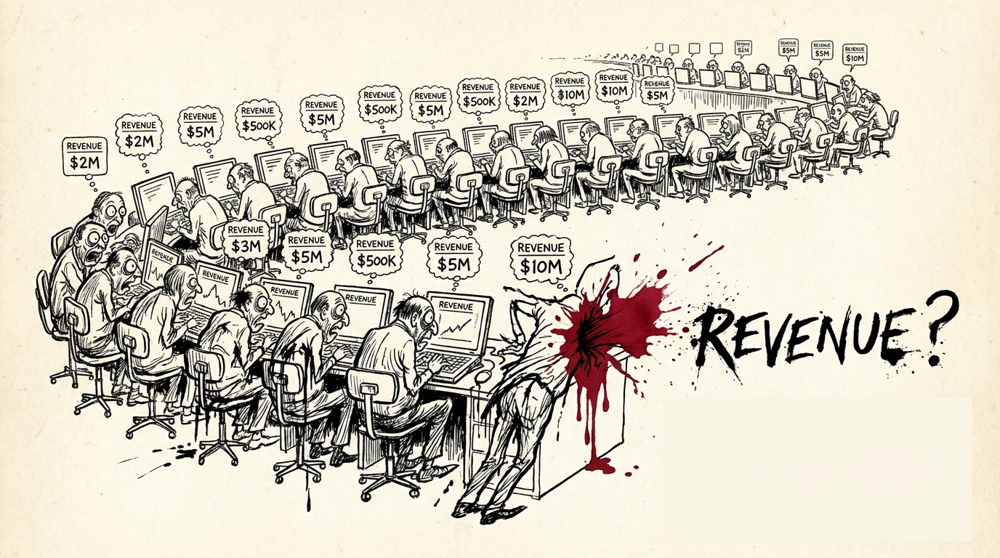

Somewhere in your organization, there is a concept —- "volume," "revenue," "active users," "exposure" —- that appears in multiple dashboards. Each dashboard was built by a different analyst, for a different stakeholder, at a different time, with a different interpretation of what that concept means. The definitions do not match. Nobody knows which one is correct. Worse, nobody knows they do not match, because nobody has ever compared them. Each dashboard looks authoritative. Each one is internally consistent. And they contradict each other silently.

It is universal. At a major investment bank, the term "trade" appeared in over a dozen reporting views with subtly different definitions —- different inclusion criteria, different timestamp conventions, different treatment of cancellations. At a pharmaceutical company, "patient" meant different things in different regulatory submissions built from the same underlying data. At a crypto exchange, "volume" could mean trading volume, notional volume, net volume, or gross volume depending on which Tableau workbook you opened. As one analytics leader at a product company put it: twenty people could run a report twenty different ways and come up with twenty different numbers. Organizations with five hundred or more dashboards typically carry thirty to forty percent redundancy across their reports. When you have a thousand dashboards, forty-three percent of users bypass them entirely and build their own analysis from scratch. Dashboards are supposed to be the single source of truth. In practice, they are forty sources of plausible fiction.

Discipline is not the failure. Structural inevitability is. Each dashboard is a self-contained interpretation of data. It imports data, applies transformations, defines metrics, and renders a visual —- all within the boundaries of the visualization tool. Dashboards do not share semantics. They share pixels. There is no mechanism built into the dashboard model for enforcing a single definition of "volume" across all workbooks. The definitions live inside each workbook, invisible to every other workbook, governed by nobody.

Consider what happens when a new stakeholder asks a new question. The data team builds a new dashboard. The analyst who builds it makes reasonable choices about how to define the metrics, which filters to apply, which level of aggregation to use. Those choices are embedded in the workbook. Six months later, another stakeholder asks a similar but not identical question. A different analyst builds a different dashboard and makes different reasonable choices. Now you have two dashboards that cover overlapping territory with divergent definitions. Repeat this cycle for five years and you arrive at forty workbooks, or two thousand seven hundred, each one a small island of business logic surrounded by a sea of organizational amnesia about why it was built that way.

Industry’s response has been "dashboard governance" —- processes, committees, certification workflows. An analytics team reviews proposed dashboards, checks for redundancy, and certifies the ones that meet standards. This works about as well as you would expect a process-based solution to a structural problem to work. It slows things down without solving anything, because each dashboard is an independent silo of business logic. You cannot govern your way out of an architecture that produces divergence by design.

Flexport is instructive. When Abhi Sivasailam arrived and found those 2,700 dashboards, he did not try to govern them. He reduced them to roughly sixty —- a ninety-seven percent reduction. His insight was simple: metrics are the primitive. If you define and agree on metrics first, you can structure dashboards hierarchically around those agreed definitions. Without agreed metrics, you get sprawl. Get the definitions right before building any dashboards at all.

Forty workbooks are the BI version of metric fragmentation. Direct SQL is the analyst version. Different surface, same structural failure. A senior analyst who bypasses the semantic layer to write a quick query makes every choice the semantic layer makes explicit —- which temporal grain, which join path, which definition of "revenue" —- but makes them silently, in a notebook on their laptop. The number they produce is, by construction, not the number the semantic layer would produce, because the choices are different and undocumented. Now there are two definitions in circulation: the layer’s, which is documented, governed, and version-controlled, and the analyst’s, which is undocumented, ungoverned, and stored on a machine that IT will wipe when the analyst changes roles.

Six months later the analyst has moved on, the notebook is gone, and a junior colleague trying to reproduce the number cannot. No reconciliation path exists, because no record of the original choices exists. The junior colleague builds their own query, makes their own silent choices, and now there are three definitions. Fragmentation is the predictable consequence of an architecture that permits bypasses, not an accident.

Every data programme that grants "power user" SQL access for productivity reasons knows this failure mode. The justification is always the same: the analyst is experienced, they know the data, they need to move fast. Always locally correct and globally destructive. Forty workbooks and an analyst’s notebook are the same disease in different organs. One metastasizes through the BI tool, the other through tribal knowledge. Both produce metric definitions that no one can reconcile, because no one can find them all.

That insight points to the architecture this essay argues for. Forty workbooks are not the problem. Forty definitions of the same concept are. Move the definitions out of the workbooks and into a semantic layer —- a shared, governed vocabulary that maps business concepts to data —- and the workbooks become interchangeable presentation surfaces. Better yet, make the presentation surface a conversational interface, and you do not need the workbooks at all.

Broader numbers reinforce the point. Only twenty percent of enterprise decision-makers who could be using BI applications actually do. Between seventy-three and eighty-eight percent of company data goes entirely unused for analytics. A survey of dashboard users found satisfaction at 3.6 out of 5 —- better than miserable, worse than useful. A paradigm producing those numbers has reached its structural ceiling. You cannot fix a 3.6 satisfaction score by making the dashboards prettier. You fix it by making dashboards unnecessary for most analytical questions.

=== Push to Tableau

Nearly every organization runs the same anti-pattern. An organization decides to adopt "self-service analytics." They interpret self-service to mean giving business users access to a BI tool and raw or lightly transformed data. The business users, who are smart and resourceful, discover that the raw data is not usable for their purposes. It needs transformation —- joins, filters, calculations, business logic. Since the data pipeline does not provide these transformations in a business-ready format, the analysts build the transformations themselves, inside the BI tool.

Tableau replicates Airflow. The visualization tool becomes the ETL pipeline. Business logic that belongs in the data warehouse migrates into client-side calculations, custom SQL in workbook connections, and complex calculated fields that no one else can read.

I discovered this happening at an organization I was leading. A team member had built an elaborate Tableau workbook with transformation logic that replicated what our data pipelines were supposed to produce. She was doing joins, filters, aggregations, and business rule applications inside Tableau —- work that should have been done in the data warehouse and served as a pre-built Gold table. My reaction was blunt: that is rubbish. That is not self-service. That is outsourcing your data pipeline to your reporting tool.

But the analyst was not wrong to do it. She had no choice. The Gold layer —- the curated, business-ready data that should have been waiting in the database —- did not exist. The data pipeline stopped at something that looked more like Silver: canonical but not curated, technically correct but not shaped for business consumption. She needed answers for stakeholders. The database did not have them in a usable form. Tableau did. So she built the pipeline in Tableau. This is the cobbler’s children problem at scale. The teams that build data infrastructure for others are the last to invest in their own tooling, and the business fills the gap with whatever is at hand.

"Self-service BI" as implemented at most organizations means "push the problem to the edge." Push the complexity to the analyst. Push the transformation to the visualization tool. Push the definition to the workbook. Push the governance to nowhere. The promise was sound: democratize data, let anyone answer their own questions, reduce the bottleneck on the data team. The execution was a disaster because it confused access with understanding. Confusing the two is like handing someone a stethoscope and telling them they are now a doctor.

Industry data on self-service BI is damning. Gartner has reported that self-service BI adoption has wallowed below twenty percent despite decades of investment and continuous tool improvement. Harvard Business Review found that only three percent of employees trust their company’s data. Seventy-five percent of managers lack data literacy. Only thirty-two percent of executives can create useful value from data, and of those, only twenty-seven percent produce actionable insights. Organizations have spent fifty million dollars, sometimes half a billion, on BI platforms, and the adoption numbers have barely moved. Tools have gotten dramatically better over twenty years. Adoption has not moved. The assumption that you can hand non-technical users a complex tool, point them at a complex data estate, and call it self-service —- that assumption is wrong, and no amount of tool improvement will make it right.

Access is not understanding. Understanding requires knowing what the numbers mean, where they come from, how they were calculated, and what caveats apply. A dashboard embeds that understanding in the analyst who built it. When that analyst leaves, the understanding leaves too. When another analyst builds a different dashboard from the same data, they bring a different understanding, and now you have two truths.

Watch how people actually consume data. Business users go to a specific person’s Tableau views because that is where the "insights" live. They point at specific widgets —- derived calculations, filtered views, custom aggregations —- and say, "I want that bit of that widget. I want that bit of that widget." Those widgets are client-side derivations: knowledge encoded in a visualization tool, invisible to any AI system, ungoverned by any data pipeline, and entirely dependent on one person’s continued employment and continued interest in maintaining them.

Every widget is a knowledge trap. It imprisons business logic in a presentation layer where it cannot be reused, governed, queried programmatically, or consumed by machines. When the business user points at a widget and says "I want that insight," what they are pointing at is a derived piece of knowledge that lives on the client side, not the server side. It is not in the database. It is not governed. It is not versioned. It is not accessible to anyone who does not have access to that specific person’s specific Tableau workbook. And when that person is on vacation, the knowledge is on vacation. When that person leaves the company, the knowledge leaves the company.

All of that knowledge should be in the database. Derived facts, useful calculations, curated views —- Gold tables. Pre-calculated, governed, documented, and accessible to any consumer: a dashboard, an AI agent, an API, a spreadsheet. The facts themselves should not be tied to any particular visual. They should be facts, available to anyone with the right permissions, deliverable through any interface. This is what I mean when I say that Gold is a knowledge menu: it is all the really useful bits of knowledge in governed knowledge assets — flat tables for direct consumption, Silver views for dimensional exploration — ready to be consumed however the consumer needs.

Using Tableau is not the anti-pattern. Tableau is a good tool. Using Tableau as a substitute for doing the architectural work of building governed Gold data is. Every time you "push to Tableau" instead of building a Gold table, you are making a choice: speed now, pain later. And the pain compounds, because every workbook built on top of raw data is a workbook that will need to be rebuilt when the raw data changes, maintained by someone who understands both the data and the Tableau logic, and defended against every other workbook that made different choices about the same data.

There is also a regulatory dimension to this anti-pattern that most organizations overlook. The lesson from semantic layers deployed at major financial institutions for audit and regulatory compliance is consistent: when the regulator asks you where a number came from, you need to trace it from the report to the source through a governed pipeline. If the number was calculated in a Tableau widget, the audit trail ends at the workbook. "An analyst built a calculated field in Tableau" is not an answer that satisfies a regulator. It is barely an answer that satisfies a curious intern. The same semantic layer that enables conversational analytics also enables regulatory traceability. The investment serves defense and offense simultaneously.

=== The Generic Architecture Pattern

Three components replace the dashboard-centric model. I will describe them in stack-agnostic terms, because the pattern works regardless of which specific tools you use, and then give concrete examples, because architecture without instantiation is hand-waving.

First: Structured Gold. Curated, business-ready data. Gold surfaces governed by the ontology — the fast default is flat denormalized tables where each table answers a specific business question; the alternative is Silver-as-Gold views that expose the domain model’s dimensional richness through the semantic layer. Every row contains everything you need to answer the question the table was designed for. Start from the question, not from the schema. What does the business need to know? Build a table that answers that question, with all the relevant facts pre-joined, pre-calculated, and ready to consume.

Flatness matters for AI consumption in ways that have direct cost implications. When an AI agent needs to answer a question, it reads the schema of the relevant table and generates a query. If the table is denormalized, the schema is self-contained: one table, one set of columns, one query. If the data is in a star schema, the agent must first understand the relationships between multiple tables, reason about which joins to perform, and construct a multi-table query. Every additional table and every additional join is an opportunity for the agent to make a mistake.

Every token the agent spends reasoning about joins is money. When your agent does a join, it is not just burning warehouse compute —- it is burning tokens. It is using LLM reasoning to figure out how to pull in one table and then another and then join them together. That reasoning costs money, consumes context window, and introduces failure modes. Concrete numbers: flattening nested structures reduces token consumption by up to sixty-nine percent. CSV representations of tabular data outperform JSON by forty to fifty percent in token efficiency. Every token carries a threefold cost: computational (more operations), financial (billed by volume), and capacity (the context window is finite, and every token spent on schema description is a token not available for reasoning).

A star schema requires describing multiple tables and their relationships in the prompt, consuming more of the context window and producing more complex queries with more failure modes. A flat Gold table requires describing one table. The query is a simple SELECT with filters and aggregations. The agent writes it correctly almost every time, because there is almost nothing to get wrong. When richer dimensional navigation is needed, Silver-as-Gold views provide it without the agent bearing the join complexity — the semantic layer composes the query, and the agent sees a logical surface indistinguishable from a flat table in terms of reasoning burden.

Second: the Semantic Layer —- the ontology that maps business concepts to data. It contains definitions —- what "revenue" means, what "active user" means, what "volume" means —- and it contains relationships between those concepts. It contains hierarchies, default assumptions, navigational heuristics, and the kind of contextual knowledge that an analyst carries in their head but has never written down.

Because the semantic layer translates between the language of the business and the language of the database, it makes data queryable by both humans and machines. When someone asks "What is our exposure by counterparty?" the semantic layer knows that "exposure" maps to a specific column in a specific Gold table, that "counterparty" is a dimension that can be used for grouping, and that the default measure is a sum. The semantic layer handles the translation. Without it, the AI encounters machine-internal names —- hardcoded column names that do not make any kind of sense to a reader, human or machine —- and fails. It is a precondition for machine-readable data, not a luxury.

Nor is the semantic layer documentation. It is infrastructure. It ships with the data, not after. Every Gold table gets an explore —- a navigational interface defined in the semantic layer that tells consumers (human or machine) what questions this table can answer, what dimensions are available for slicing, what measures can be computed, and how this table relates to other tables. A Gold table without a semantic layer definition is incomplete, in the same way that an API without documentation is incomplete: technically functional, practically useless.

Third: the Agent Interface —- the natural language surface where the question enters and the answer exits. A human asks a question in plain language. The agent parses the question, consults the semantic layer to understand what data is relevant, generates the appropriate query, executes it against Structured Gold, and returns the answer —- with provenance. The semantic layer handled the routing. The agent handled the SQL. The human handled the insight.

This pattern works with BigQuery, Looker, and Claude. It works with Snowflake, the dbt Semantic Layer, and GPT. It works with Databricks, Unity Catalog, and Gemini. It works with Kinetica’s embedded LLM, with Microsoft’s Copilot stack, with whatever tools your organization has already committed to. Tools are interchangeable. So is the protocol that connects agent to data —- whether Anthropic’s Model Context Protocol, OpenAI’s function calling, or whatever emerges next.

MCP deserves a moment of attention because it validates the architectural pattern. Introduced by Anthropic in late 2024, MCP is an open standard that standardizes how AI models connect to external tools and data sources —- described by the industry as "USB-C for AI." OpenAI adopted it in early 2025. Google DeepMind integrated it into Gemini. Microsoft added support to Copilot Studio. By early 2026, there were ten thousand active public MCP servers and nearly a hundred million monthly SDK downloads. MCP defines three primitives: tools (functions the AI invokes), resources (data the AI reads), and prompts (reusable interaction templates). The philosophical shift is that instead of baking knowledge into model weights —- which is static, expensive, and stale —- MCP lets models reach out and ask for exactly what they need, when they need it. This is precisely what the agent interface component of the architecture does: it lets the agent reach through the semantic layer to the governed data, on demand, per question.

But the specific protocol does not matter. What matters is the principle: the agent accesses data through a governed semantic layer, not through raw SQL against ungoverned tables. The protocol will change. MCP may be superseded by something else within five years. The principle —- governed access through a semantic layer —- will not change, because it solves a structural problem that is independent of any particular technology.

An apparent tradeoff dissolves on inspection. Flat tables minimize token usage, but star schemas provide navigational richness —- hierarchies, relationships, logical groupings. Put them in different layers and the conflict disappears. The fast default for Gold is flat tables, optimized for efficiency. The logical structure goes in the semantic layer, optimized for meaning. You get the token economy of denormalization and the conceptual organization of dimensional modeling, but in different layers. Physical storage optimized for the machine. Semantic layer optimized for meaning. Neither compromises for the other. Conflating physical and logical — building logical structure into physical layout at the consumption layer — produces an architecture that is suboptimal for both. Star schemas live in Silver, where they belong. The semantic layer exposes them as governed views when dimensional navigation is the consumption pattern.

=== What Conversational Analytics Actually Looks Like

A chatbot bolted onto a dashboard is not conversational analytics. Tableau added "Ask Data." Power BI added "Copilot." Useful incremental features. Architecturally, they change nothing.

What matters is where the intelligence lives, not what the interface looks like. In a chatbot-on-dashboard, the intelligence lives in the dashboard: the data model, the transformations, the definitions are all inside the BI tool. The chatbot is a new front end on the same old back end. In conversational analytics built on the architecture I have described, the intelligence lives in the semantic layer and the governed Gold data. The chatbot is not a feature of the BI tool. It is a consumer of the same governed data that the BI tool consumes, through the same semantic layer, with the same definitions. This is an important distinction, because it determines what breaks and what does not.

A chatbot on a dashboard inherits every problem of the dashboard: conflicting definitions, trapped transformation logic, analyst-dependent knowledge. It automates the mess. Conversational analytics over governed Gold and a proper semantic layer inherits the governance: one definition of "volume," one source of truth, one set of business rules applied consistently regardless of who is asking or how.

I have run this in production, and the result is the one described earlier: over a well-modeled semantic layer, accuracy holds at ninety-eight to ninety-nine percent, and the residual is always a context failure rather than an intelligence one —- add the missing definition and that query class goes to a hundred. When the question-and-answer loop is this reliable, the pre-built dashboard stops being the only trustworthy path to an answer.

An operational result from a production system, not a vague claim about AI potential. The accuracy function is monotonically improving: every definition you add, every navigational heuristic you document, every relationship you encode in the semantic layer, pushes the accuracy ceiling higher. And for any query class that the semantic layer fully covers, the ceiling is one hundred percent, because the semantic layer’s deterministic query generation means the AI cannot produce subtly wrong results. It is not writing SQL from scratch and hoping it gets the joins right. It is selecting pre-defined metrics and dimensions from the semantic layer, which then generates the correct SQL deterministically.

Compare this to raw text-to-SQL —- an AI generating queries directly against database tables without a semantic layer. Academic benchmarks paint a brutal picture. Spider 1.0, the canonical academic benchmark with tidy schemas, shows top models at about eighty-six percent accuracy. Impressive, until you leave the lab. Spider 2.0, released in 2025, tests text-to-SQL against realistic enterprise schemas with production databases —- Snowflake, BigQuery, DuckDB —- with schemas exceeding three thousand columns. The best models achieve six percent accuracy. Six percent. Eighty percentage points separate the tidy benchmark from the messy real world.

BIRD, which uses enterprise databases with realistic dirty data, shows GPT-4 at fifty-two percent accuracy against ninety-three percent for human experts. BIRD-INTERACT, which tests multi-turn ambiguous queries —- the kind of thing real business users actually ask —- shows GPT-5 completing only eight to seventeen percent of tasks. Even the positive trendline is sobering: dbt Labs’ 2026 benchmark update shows text-to-SQL accuracy nearly doubled from about thirty-three percent in 2023 to sixty-five percent in 2026 on a full question set. Real progress. Still not production-grade.

A deeper problem: the benchmarks themselves are unreliable. A 2026 paper published at VLDB found that BIRD, one of the most widely used enterprise text-to-SQL benchmarks, contains fifty-three percent annotation errors in certain subsets. Correcting those errors changed model performance by negative three to positive thirty-one percentage points. The enterprise accuracy problem is even less well-understood than the headline numbers suggest.

A well-modeled semantic layer changes the equation entirely. Flat data means no join reasoning. Mapped concepts mean no column guessing. Encoded business rules mean no inference.

The semantic layer converts an unreliable technology (raw text-to-SQL) into a reliable one (governed query generation). "Text-to-SQL is not ready for the enterprise" is correct —- if it means raw text-to-SQL over ungoverned schemas. Through a semantic layer, it is ready. The architecture is what most organizations have not built.

In practice, rather than a Tableau view that is pre-built and fixed, you cut the data whenever you need it. A finance stakeholder asks: "What is our net revenue by product line for the last quarter, excluding internal test accounts, compared to the same quarter last year?" The agent receives the question. It consults the semantic layer and identifies the relevant Gold table —- the one built to answer revenue questions, with pre-calculated net revenue, product line dimensions, time dimensions, and a test-account exclusion flag already in place. It generates a query. The query runs against the data warehouse in milliseconds. The answer comes back with the numbers, the comparison, and provenance —- which table it queried, which definition of "net revenue" it used, which accounts it excluded and why.

No table name needed. No SQL. No Tableau workbook navigation, no filter fiddling, no squinting at a chart to extract the one number that actually matters. Question in, governed answer out.

More important: the next question can be anything. A dashboard gives you the questions the analyst anticipated when they built it. A semantic layer gives you any question the data can answer. "Here are the ten views I pre-built for you" versus "ask me anything about revenue, volume, exposure, counterparties, or trading activity" is a different paradigm, not an incremental improvement. Business questions are infinite. Pre-built views are not. No amount of dashboard improvement can raise that ceiling.

There is a legitimate question about provenance and trust worth addressing directly. Dashboards have a trust advantage: you can see the chart, trace the axis labels, check the filters, and reason about whether the number looks right. A conversational answer is a number in a text box. Why should you trust it?

Provenance must be an architectural requirement, not an afterthought. The agent must be able to show its work: the SQL it generated, the semantic layer definitions it used, the table it queried, the freshness of the data. Emerging tools are building this in —- "show reasoning" features, "how was this calculated" links, SQL transparency panels. Google’s Looker Conversational Analytics includes the ability to show the reasoning behind an answer and explain how a result was calculated. Governance-aware tools tie answers to catalog definitions and metadata, so the user can trace the answer back to the governed definition.

If the system cannot explain how it got the answer, it is not ready for production. But a system that can explain how it got the answer is more trustworthy than a dashboard, because the provenance is explicit and programmatic rather than implicit and visual. You are not squinting at a chart trying to figure out if the filter is right. The system is telling you, in plain language, exactly what it did and why. This is a higher standard of transparency than any dashboard has ever achieved.

==== What the Semantic Layer Must Do to Earn This Status

If the semantic layer is the only interface through which consumers reach the data, the obligations on it are heavy. A layer that cannot bear them gets bypassed — and a layer that is routinely bypassed is not an interface, it is a suggestion. It must clear five bars:

* *Complete enough.* A layer that exposes ten dashboards’ worth of canned measures and stops is a reporting surface, not an interface. It must expose every entity, every defensible measure, every meaningful join, every temporal contract — a continuously expanding surface where "is this available?" is a near-universal yes for the questions the business actually asks.
* *Fast enough.* If a ten-second direct query takes five minutes through the layer, the layer gets bypassed regardless of governance. No framework survives a five-minute wait when the alternative is ten seconds.
* *Capable enough for exploration.* The most common reason analysts reach for direct SQL is that they are exploring — composing questions they have not asked, iterating on half-formed ideas, failing and discarding. The layer must support that mode, not only the canned-question mode. Force exploration outside the architecture and the architecture generates its own competitors — exploration is exactly where new metric definitions are born and where fragmentation begins.
* *Extensible in days, not quarters.* "Add it to the semantic layer" must be an intake that returns in days. If extending the layer is slower than building a workaround, the workarounds accumulate and the layer atrophies. A semantic-layer team without a working intake is a bottleneck dressed up as governance.
* *Well-instrumented.* Every request the layer cannot serve is signal; every workaround in the wild is signal. The owners must see it in near-real-time, not at a quarterly review — those gaps are the layer’s roadmap. A layer that does not know where it is failing fails in the same places indefinitely.

The only-interface commitment costs real money and political capital. But the architectural payoff —- every other commitment in this architecture actually delivered to consumers, rather than leaked away through bypasses —- is what justifies the cost.

*Pattern: Sole Interface*

_Context:_ Multiple consumers — human analysts, AI agents, dashboards, regulatory submissions — need to access the data platform.

_Problem:_ When the semantic layer is bypassable, every commitment delivered through it — temporal contracts, morphisms, documentation, governed definitions — is also bypassable. Direct SQL produces metrics that enter circulation ungoverned, unsigned, unversioned.

_Solution:_ The semantic layer is the only interface between data and consumer. No power users with direct SQL access. No privileged tiers. Every consumer reaches data through one governed surface. Narrow exceptions exist for debugging the substrate, performance investigation, and early-stage ML exploration — all by the people who build the architecture, all scoped and reviewed. Exceptions stay exceptions because they are named. The moment they are unnamed, the commitment is dead.

Governance is universal; quality tiers are not. A dataset with a quality score of two out of five, last reviewed fourteen months ago, with no domain essay, is still governed — documented, catalogued, owned, accessible through the semantic layer. Its quality rating is visible to every consumer. The governance is not ``you may bypass for low-quality data.'' The governance is ``the system tells you what it knows about this data’s quality before you reason over it.'' Penny stock and blue chip both trade on the same exchange. Both are regulated. The disclosure requirements are the same.

_Example:_ A senior analyst needs a number for a meeting in an hour. The semantic layer doesn’t have the slice. In the old model, they write direct SQL — 10 minutes, problem solved, ungoverned metric in circulation. In this architecture, they submit an extension request. The semantic layer team adds the measure within the day. The analyst waits. The metric enters circulation governed. Uncomfortable in the short term. Correct in every term.

_Consequences:_ Analyst productivity drops in the short term. Extension intake capacity must be funded — unfunded sole-interface commitments collapse within a year.

*Pattern: Extension Intake*

_Context:_ The semantic layer has been established as the sole interface.

_Problem:_ If extending the layer takes longer than building a workaround, workarounds accumulate. Each workaround is individually rational. In aggregate, they dissolve the sole-interface commitment.

_Solution:_ "Add it to the semantic layer" returns in days, not quarters. This requires dedicated engineering capacity for the layer — not a side project, not a quarterly review. A working intake process with SLAs. The team that owns the layer monitors gap signals in near-real-time: every request the layer cannot serve, every workaround that emerges in the wild.

_Example:_ A trading desk needs a new metric: "average spread by market-maker by hour." Intake submitted Monday. Semantic layer team reviews the definition, confirms alignment with the glossary, adds the measure to the relevant Gold explore. Available by Wednesday. The desk never writes direct SQL. The metric is governed from birth.

_Consequences:_ Requires dedicated engineering capacity for the semantic layer — a permanent cost, not a project.

*Pattern: Gap-as-Signal*

_Context:_ Agents or analysts encounter questions the semantic layer cannot answer.

_Problem:_ Without systematic capture, gaps are invisible to the layer’s owners. Workarounds proliferate silently. The layer atrophies as consumers route around it.

_Solution:_ Every gap is signal. When an agent cannot answer through the semantic layer, the gap is logged — which question, which domain, what was missing. When an analyst requests a bypass, the request is logged as a gap signal. The layer’s owners see gap signals in near-real-time. Each gap becomes an improvement to the system: documentation, ontology, morphism, or measure work. Never a bypass. The architecture learns from its consumers rather than degrading under their demands.

_Example:_ An agent is asked "What is our counterparty concentration risk?" and cannot answer — no concentration measure exists in the semantic layer. The gap is logged: domain=Risk, concept=concentration, missing=measure. The semantic layer team adds a concentration measure to the Risk Gold explore, linked to the glossary definition. Next time the question is asked, the agent answers correctly. The gap became infrastructure.

_Consequences:_ Gap logging produces noise. Not every unanswered question represents a real gap — some are malformed queries, some are outside scope. Triaging gap signals is work.

Public discourse conflates two failure modes. When people say "AI hallucinates," they usually mean a chatbot confidently stated a false fact about the world —- unstructured text generation failure. Conversational analytics over governed data is a different failure mode entirely: not hallucination but a wrong query —- a wrong join, a wrong filter, a wrong aggregation. The semantic layer eliminates that failure mode by removing the degrees of freedom that produce wrong queries. Conflating the two is a category error that leads organizations to reject conversational analytics for the wrong reasons.

=== The Positions Worth Fighting

Certain positions need to be fought directly, because you —- the reader —- hold at least one of them.

*"We will add a chatbot to our existing dashboards."* This is the most common response from organizations that want to sound AI-forward without changing anything structural. They take their existing BI tool, bolt on a natural language interface, and call it conversational analytics. It is not. A chatbot that queries bad data through a bad semantic layer is automated confusion. It inherits every problem of the underlying dashboards —- conflicting definitions, trapped knowledge, analyst-dependent logic —- and makes those problems available faster. Speed is not a virtue when the answer is wrong.

The incremental fallacy —- assuming the new paradigm is just a feature added to the old one —- lets you feel progressive while avoiding every structural investment that the transition actually requires. The automobile was not a feature added to the horse-drawn carriage. It required new roads, new fuel infrastructure, new maintenance patterns, new regulations. Adding a motor to a carriage produces something that is worse than both a carriage and an automobile. Adding a chatbot to an ungoverned dashboard ecosystem produces something that is worse than both a dashboard and conversational analytics.

*"Self-service BI will get better."* It will not. Self-service BI has been stuck below twenty percent adoption for years despite billions in tool investment. Vendors have poured resources into making BI tools more intuitive, more visual, more accessible. Adoption has not moved. The fundamental assumption —- that non-technical users can navigate complex data estates if you give them the right tool —- has been wrong for twenty years. Single-digit percentages of your leadership team getting value from the BI investment.

Conversational analytics does not fix self-service BI. It replaces the assumption. Instead of making humans better at querying data, it makes querying data unnecessary for humans. The human provides the question and the judgment. The machine handles everything else —- the schema navigation, the SQL, the joins, the aggregations, the formatting. This is not a better version of self-service. It is a different paradigm, one that does not require the business user to become a junior data analyst. True self-service means there should be Gold tables where you know exactly the data points, where there is no ambiguity, where you have not got five versions of the truth —- you have only got one version.

*"Our executives love dashboards."* No. Your executives love answers. They tolerate dashboards because dashboards were the fastest way to get answers. When the alternative was "file a ticket with the data team and wait three days," a dashboard —- even a mediocre one —- was a massive improvement. But the executive does not love the dashboard. The executive loves the number on the dashboard. Give them a faster, more flexible way to get the same number, and they will not mourn the dashboard.

Red-green-amber executive summaries are a monitoring pattern, and monitoring patterns will persist. But monitoring is better served by agents that proactively alert on state changes than by dashboards that require someone to look at them. The executive who gets a Slack message at 7 AM saying "Revenue dropped twelve percent overnight; here is the breakdown by product line and the three most likely contributing factors" is better served than the executive who opens a dashboard at 9 AM and notices the red bar. One is push intelligence. The other is a screen that waits to be looked at. In a world where AI can monitor and alert autonomously, the dashboard-as-monitoring-surface is already being outcompeted.

*"We need both dashboards and conversational analytics."* This is the moderate position, and it is partly correct. Dashboards will not disappear overnight. Operational monitoring —- system health, real-time status displays, trading floor screens —- may genuinely benefit from glanceable visual displays for known, stable metrics. I am not arguing that every screen in your organization should be replaced with a chat box.

But the danger of "we need both" is that it becomes an excuse to avoid the architectural investment. "Both" means you keep building dashboards as the primary investment and run a chatbot as a side experiment. The chatbot, unsupported by governed Gold and a proper semantic layer, performs poorly. This confirms the organization’s belief that "AI is not ready" and justifies doubling down on dashboards. Meanwhile, the organization that built the architecture first is answering questions in seconds while you are maintaining forty workbooks. The strategic investment must shift. Dashboards become a presentation format that sits on top of governed Gold —- one delivery surface among many —- not an independent ecosystem of analyst-built interpretations.

*"Text-to-SQL is not ready."* The point was addressed above, but it is worth restating, because CTOs use it as a reason to delay investment in conversational analytics infrastructure. Raw text-to-SQL over ungoverned schemas is indeed not ready. Six percent accuracy on enterprise benchmarks is not production-grade. But text-to-SQL through a semantic layer is ready, and I am running it in production at ninety-eight to ninety-nine percent accuracy. The risk argument actually supports the thesis: the way to make text-to-SQL reliable is to build Structured Gold and a semantic layer. If you delay that investment because "text-to-SQL is not ready," you are guaranteeing that it will never be ready at your organization, because the readiness depends on the architecture you are refusing to build.

There is one more position worth addressing, and it is the most human one: *"What happens to the people who build dashboards?"* If dashboards decline as the primary analytical interface, what happens to the analysts who built them? This is a real concern, and dismissing it is both callous and strategically foolish, because those analysts are exactly the people you need for the transition.

Work does not disappear. It migrates. The analyst who today builds Tableau workbooks —- defining metrics, writing calculated fields, choosing the right level of aggregation, deciding which filters to expose —- is doing semantic modeling. They are just doing it in the wrong layer. Move that work from the visualization tool into the semantic layer and the Gold data model, and the analyst becomes a domain modeler: someone who defines the business concepts, curates the Gold tables, and maintains the semantic layer that makes conversational analytics possible.

Skills transfer directly. Tools change. The judgment —- knowing what "volume" means, knowing which exclusions to apply, knowing how this quarter compares to last —- is exactly what the semantic layer needs. The work becomes more durable (definitions in a semantic layer outlast any individual dashboard), more impactful (one definition serves every consumer instead of one workbook), and, frankly, more interesting. Building the fortieth Tableau workbook for the fortieth stakeholder with the fortieth slightly different definition of "volume" is not fulfilling work. Building the canonical definition of "volume" that serves the entire organization, including AI agents, is.

=== The Board Conversation

Everything argued in this essay collapses into a conversation you need to have with your board, your CEO, or whoever controls the investment decisions at your organization.

Do not lead with technology. Do not say "AI" in the first sentence. Boards have heard enough three-letter acronyms pitched as salvation; lead with the problem they already know about.

"We have forty-plus reports that define the same metrics differently. Our analysts spend more time maintaining reports than generating insights. When a key analyst leaves, the definitions and context they carried leave too. We know this is a problem. We have tried to solve it with governance processes and better tools. It has not worked, because the problem is structural, not procedural."

Then state the shift.

"The analytics industry is moving from report-centric to question-centric intelligence. Instead of building dashboards that answer predetermined questions, leading organizations are building infrastructure that answers any question, from any stakeholder, in real time. This is in production at organizations that have made the architectural investments, not speculative technology. Google, Snowflake, Salesforce, and Microsoft are all building their platforms around this model. The conversational AI market is projected to reach eighty billion dollars by 2034. More than sixty percent of organizations are already embedding analytics directly into business applications, moving consumption away from standalone dashboards."

Then state the investment.

"The investment is in three areas. First, curated Gold data —- business-ready tables in the database, not in Tableau. This is valuable data that you need on a daily basis, and it should be in the data warehouse. That is what we call the Gold layer. Second, a semantic layer —- a governed vocabulary that maps business concepts to data, so that every consumer, human or machine, uses the same definitions. Third, an agent interface —- a natural language surface that lets anyone ask questions of the governed data. These three investments are the foundation of our AI strategy, not separate from it. The same semantic layer that powers conversational analytics also powers autonomous AI agents, regulatory reporting, and any future application that needs to reason over our data."

Then state the return.

"The return is threefold. First, fewer dashboards to maintain. We stop building the forty-first workbook with the forty-first definition of volume. We build one governed definition and serve it through any interface. One organization reduced 2,700 dashboards to sixty by getting the definitions right first. Second, faster time to insight. Instead of ’file a ticket and wait three days,’ the answer takes seconds. Third, and most importantly, this is the infrastructure that makes AI useful. Without governed data and a semantic layer, AI hallucinates. With them, AI reasons correctly over our domain. Every dollar we spend on semantic infrastructure is a dollar that makes our AI investment productive."

Then state what this changes for the data platform agenda.

"This changes what a data platform is for. It is not a report factory or a pipeline that ends at a dashboard. It is an infrastructure for making facts available to any consumer —- human, dashboard, AI agent, API, regulatory submission. The facts themselves are not tied to any visual. They are important facts delivered to important stakeholders, and they should be at our fingertips, not buried in a report. The entire agenda for a data platform changes when you understand this."

And then state what this replaces.

"This means we stop investing in dashboard proliferation. We stop treating the BI tool as the destination for business logic. We stop building new workbooks as the default response to every data request. Existing dashboards that serve genuine monitoring purposes —- operational health, real-time metrics —- persist, but they sit on top of governed Gold data, not on top of raw tables with analyst-built transformations. The BI tool becomes a presentation format, not the analytical platform."

Organizations are doing this now. Eighty-eight percent of organizations are using AI in at least one business function. Architectural pattern proven, vendor ecosystem in place. The only question is whether your organization makes the investment or keeps building dashboards while the industry moves on.

Stakes are competitive, not just operational. In an AI-native world, the companies whose data is machine-readable and semantically governed will be able to deploy AI that reasons correctly over their domain. The companies whose data is trapped in forty Tableau workbooks will not. Those companies will bolt AI onto ungoverned data, get poor results, conclude that "AI does not work for us," and fall further behind. The divergence will be fast, because the companies that get the architecture right will compound their advantage with every agent they deploy, every question they answer in seconds, every analyst they free from workbook maintenance to do actual analysis.

Only twenty-two percent of organizations have clearly defined, tracked, and shared business impact metrics for their data and analytics projects. There is a forty-five-point gap between the seventy-four percent of companies that aim to be data-driven and the twenty-nine percent that believe they are good at translating analytics into action. That gap is not closed by better dashboards. It is closed by an architecture that embeds meaning in the data itself and makes that meaning accessible through any interface —- including the most natural interface of all, which is language.

The dashboard served us well. It was the best interface we had for turning data into decisions. It is no longer the best we have.

The "no power users bypass the semantic layer" policy will be tested. A senior analyst escalates. The VP of Data Science needs direct SQL access for a board deliverable due in two weeks. The semantic layer does not have the measure she needs. The intake queue is three weeks deep. One exception is granted. Three exceptions become thirty. Within six months, the commitment dies — not from opposition but from erosion, each bypass individually reasonable, collectively fatal.

The response: the policy will be tested, and political will is the scarcest resource in data architecture. A semantic-layer team without executive air cover will lose this fight within a year. The executive sponsor must understand that "no bypasses" means saying no to a VP with a deadline, and must be willing to back that decision personally. Without that backing, the architecture reverts to the status quo — a semantic layer that exists but that power users route around, which is worse than not having one at all, because it creates the illusion of governance without the substance.

Build the vocabulary. Build the Gold layer. Build the semantic layer. The dashboard was the bridge. The river has been filled in.

=== One Layer, Every Consumer

Dashboards are not dead because dashboards are bad. They are fine as one rendering of the semantic layer’s surface. What is dead is the dashboard as the organizing principle of data consumption, replaced by a semantic layer that serves any consumer through one governed surface. Charts persist. Workbooks as independent silos of business logic do not.

== Agentic Intelligence

=== Stage 1 Is Not the End

Conversational analytics is Stage 1. You ask a question in plain language, an agent queries your governed data through a semantic layer, and you get a trustworthy answer in seconds. If you have built this, congratulations —- you are ahead of almost every organization on the planet. You are also at the beginning.

Most organizations think conversational analytics is the destination. They ship a chatbot, connect it to their warehouse, run a demo for the executive team, and declare victory. The demo always works. The questions are canned or at least friendly. The audience claps. Then the thing goes into production and the hard questions start arriving — questions nobody pre-tested, questions that require joining concepts across domains, questions where the answer depends on when you ask — and the system quietly fails. It returns a number that is almost right, or right for last month but not this month, or right for one product line but not another. Nobody notices because nobody has a baseline to check against. Automated guessing with a nice interface.

Real conversational analytics — Stage 1 done properly — requires everything we have discussed so far: governed data in a medallion architecture, a semantic layer that maps concepts to columns, definitions that are contracts rather than suggestions. When you have all of that, the question-and-answer loop works reliably, at scale, for questions nobody anticipated. Genuinely transformative. But also, fundamentally, reactive. A human asks. The system answers. The human drives.

Stage 2 is agentic intelligence: systems that monitor, reason, and generate insight without being asked. An agent that watches your trading volumes overnight and flags an anomaly before the London desk opens. An agent that notices a pattern in settlement failures across counterparties and generates a hypothesis about why. An agent that reads your risk exposure data at market close and tells you something you did not think to ask about.

Stage 3 is autonomous research: agents that maintain and grow knowledge bases, test hypotheses against live data, and interact with senior stakeholders not as tools but as something closer to epistemic peers. A junior analyst with a quantitative background, working around the clock, with perfect recall of every data point your organization has ever recorded.

Not science fiction. An architectural progression. Each stage is built on the one below it, and each stage demands more from your semantic infrastructure than the last. If your data is not ready for Stage 1, Stages 2 and 3 are not available to you. Sequential whether you like it or not.

Here is what is actually happening. The agentic AI market reached nearly eight billion dollars in 2025. Gartner expects forty percent of enterprise software to integrate task-specific agents by the end of 2026. Headline numbers. Underneath them: only eleven percent of organizations that claim agent adoption have agents running in production. Two percent are operating at full scale. Eighty-nine percent of "agent adoption" is demos, pilots, and slide decks. Gartner warns that over forty percent of agentic AI projects will be canceled by 2027 due to escalating costs, unclear value, or inadequate risk controls.

Between ambition and execution sits an infrastructure gap, not an intelligence gap. The models are capable. Organizations are trying to build Stage 2 and Stage 3 systems on top of data that is not ready for Stage 1.

"What does Head of AI mean?" has a counterintuitive answer: it means owning memory. Not models. Not inference pipelines. Memory. The authoritative historical record of everything the organization knows, stored in a governed warehouse, accessible through a governed semantic layer, queryable by both humans and machines. Get the memory right and the model is almost interchangeable. Get the memory wrong and the best model in the world will hallucinate its way through your data.

A hype cycle around agents that is both predictable and dangerous. People read about MCP and conclude it is a new kind of intelligence — as if a protocol specification were a cognitive upgrade. They hear about multi-agent systems and assume that more agents means better results. They see vendor demos and believe that the hard problem is model selection when the hard problem is data preparation. Noise around agents is deafening and obscuring the signal: agentic intelligence is real, it is coming, and the organizations that will benefit are the ones that invested in semantic infrastructure before they needed it.

What follows is about what comes after conversational analytics — what the architecture looks like when agents stop waiting to be asked, and what it demands from your data, your definitions, and your organizational thinking.

=== What Agents Actually Need

"Agent" has been abused to the point of meaninglessness. A form-filling chatbot is now an "agent." A scheduled script that sends Slack alerts is an "agent." A RAG pipeline that looks up documents before answering is an "agent." Useful things, all of them. Not agents.

An agent, in the sense that matters architecturally, has three properties that a chatbot does not. First, it has memory — not just context within a conversation, but persistent knowledge of what it has previously concluded, what data it has seen, and what hypotheses it is currently tracking. Second, it has goals — not just "answer this question" but "monitor this domain for anomalies" or "test whether this hypothesis still holds." Third, it has the ability to act — to query new data, call external services, update knowledge bases, and initiate workflows without human intervention.

Memory, goals, agency — each one places demands on the architecture that conversational analytics does not.

Memory means the agent needs access to not just the current state of your data but the history of its own reasoning. What did it conclude last Tuesday about settlement risk? Is that conclusion still valid given this week’s data? If the conclusion has been invalidated, what changed and when? This is not something you get from a context window. This is something you build into the infrastructure: a persistent knowledge layer where agents record their conclusions, tag them with timestamps and confidence levels, and revisit them when new data arrives.

Memory means something more fundamental than context windows. RAG is useful but shallow — the agent retrieves, reads, and forgets. The real target is the data warehouse itself functioning as memory — not a vector store bolted onto the side, but the governed, canonical, semantically rich warehouse that is the authoritative record of everything the organization knows. The agent reasons over the full institutional memory, with all its structure, all its history, all its relationships intact.

Goals mean the agent needs more than definitions. It needs domain heuristics — the kind of tacit knowledge that an experienced analyst carries in their head. In trading, a sudden spike in volume at three in the morning is not the same signal as a spike at market open. In treasury, a liquidity position that looks healthy in aggregate might mask concentration risk in a single counterparty. Column descriptions cannot encode these heuristics. Tutorial-quality documentation can: rich, contextual, written for a reader who is intelligent but new to the domain. Definitions are necessary but not sufficient. You need the narrative around them — the "here is what to watch for" layer that turns a data dictionary into domain training material.

Agency means tools. Not just SQL access to your warehouse, but governed access to APIs, the ability to trigger downstream workflows, and the judgment to decide when to act and when to wait. The protocol layer — MCP, function calling, whatever comes next — is the mechanism. Governance matters more than the mechanism: which tools does the agent have access to, under what conditions, and what happens when it is wrong?

Think of the protocol layer as microservices architecture for intelligence. You have to decide carefully what data you want to expose, what the semantics of that exposure are, and how you constrain the surface area. A badly designed MCP interface is exactly like a badly designed API: too much latitude, not enough context, garbage output. MCP is plumbing. Good plumbing is essential. But nobody moves into a house because the plumbing is impressive.

Pre-flight checks are critical and often overlooked. Before an agent answers a question or acts on data, it should perform the same checks a careful analyst would: Is this data fresh? When was it last updated? Are there known quality issues? Is my access authorized? Has the calculation methodology changed since last quarter? If any check fails, the agent should say so — explicitly, without attempting to compensate by guessing. A system that refuses to answer when it lacks confidence is infinitely more valuable than a system that always answers confidently, whether or not the answer is trustworthy.

*Pattern: Agent Pre-Flight*

_Context:_ An AI agent is about to answer a business question from the data platform.

_Problem:_ Without pre-flight checks, the agent answers with whatever it finds — stale data presented as current, restricted data served to unauthorized users, known quality issues unreported.

_Solution:_ Before reasoning over any data, the agent performs pre-flight checks. Quality: has this dataset passed its most recent quality checks? Are there known issues? Freshness: when was this table last updated? Is the staleness acceptable for the question? Access: does the requesting user have permission to see this data, at row and column level? Caveats: are there known limitations, exclusions, or edge cases that affect the answer? If any check fails or surfaces a warning, the agent reports it alongside the answer — or declines to answer with an explanation.

_Example:_ Executive asks: "What was our total trading volume last month?" Pre-flight: quality check passes; freshness check shows data is 6 hours old (acceptable for monthly aggregation); access check confirms executive role has full trading visibility; caveat check flags that test-account trades were excluded per policy. Agent answers with the number AND states: "Data as of 6 hours ago. Test accounts excluded per governance policy."

_Consequences:_ Adds latency to every agent query. Pre-flight checks that are too slow will be bypassed or disabled.

Information density per token governs everything. An agent reading low-density context — schema dumps, sample rows, column names without semantics — produces plausible-but-wrong answers. It picks the wrong column as the strategy classifier, conflates temporal grains, hallucinates joins that do not exist in the schema. Output looks right. It is not right. And the failure is silent — no error message, no stack trace, no warning. Fluency is not fidelity.

An agent reading high-density context — declared measures, named dimensions, documented conventions, a domain essay explaining edge cases and slang — produces correct answers. Or, equally valuable, it correctly identifies what it cannot answer and flags the specific gap. Less context, more meaning per token, better outcomes. Information density per token is the binding constraint on every architectural decision that touches agentic consumption.

Context windows expand with every model generation, but attention does not scale linearly with window size. Every token of noise dilutes every token of signal. "Can the agent fit the schema in its context?" is the wrong question. "Does each token carry enough meaning to reason correctly?" is the right one. A flat Gold table with declared measures and explicit temporal contracts is high-density context. A raw schema with hundreds of columns, cryptic names, and no documentation is low-density context. The agent will process both without complaint. Only one produces answers you can trust.

*Pattern: Domain Context Assembly*

_Context:_ An agent needs to reason about data in a specific business domain.

_Problem:_ Without domain context, the agent has column names and datatypes — schema-level information insufficient for correct reasoning. The agent picks wrong classifiers, conflates temporal grains, hallucinates joins.

_Solution:_ Before the agent touches data, the semantic layer assembles domain context into its reasoning window. Three components: the domain essay (600-1500 words of operational prose — provenance, conventions, edge cases, slang), the semantic layer declarations (measures, dimensions, joins, temporal contracts), and per-table metadata (freshness, quality signals, caveats). Total context: typically 1500-2500 tokens — less than a schema dump and dramatically higher in information density per token.

_Example:_ Agent receives a question about equity trading P&L. Domain context assembly loads: the trading domain essay (explains that P&L is mark-to-market by default, strategy means portfolio-level tag not order-level, calendar quarters unless specified fiscal), the semantic declarations for the P&L Gold table (declared measures, joins, grain), and temporal metadata (last refresh, bitemporal contract). The agent reads 1800 tokens of high-density context and answers correctly — or flags the specific gap if it cannot.

_Consequences:_ Context assembly consumes tokens. For simple queries, the overhead may exceed the query itself. Over-contextualization degrades performance.

==== Domain Navigation and Register Switching

Everything described so far assumes the agent is operating within a single domain. In practice, the most valuable questions cross domain boundaries. A CFO asks about revenue and then, in the same conversation, pivots: "Now show me how this relates to our trading volume and custody fees." A risk analyst starts with counterparty exposure and ends up asking about settlement patterns in a completely different data domain. These are not separate queries. They are a single line of reasoning that happens to traverse multiple areas of institutional knowledge.

Most agent architectures break down here. This is where the semantic layer earns its keep.

When a user starts a conversation, the agent initializes in a domain context. The Gold tables, semantic layer definitions, and domain heuristics loaded into the agent’s reasoning window are scoped to that domain. This scoping is the agent’s "register" — the conceptual vocabulary it is speaking in. If the user asks about revenue and P&L, the agent is operating in the Finance register. Finance Gold tables are loaded. Finance semantic definitions configure its reasoning. Finance-specific heuristics — fiscal year boundaries, accrual versus cash accounting, journal entry structure, the distinction between realized and unrealized gains — shape its answers. The agent is not just querying Finance data. It is thinking in Finance. The definitions it holds in context determine how it interprets ambiguous terms, what it treats as normal, and what it flags as anomalous.

First thing to understand about domain navigation: the register is a cognitive configuration, not a filter. An agent operating in the Finance register and the same agent operating in the Trading register are, in a meaningful sense, different reasoners. They parse the same English words differently. They apply different heuristics. They have different expectations about what the data should look like. Registers shape reasoning, not just data access.

When the user crosses a domain boundary — "Now show me how this relates to our trading volume" — the agent faces an architecturally non-trivial decision. It must detect the domain shift, load the additional domain’s context, compose the two vocabularies, and resolve any polysemy. Polysemy — the same word meaning different things in different domains — is the central practical challenge of cross-domain agent reasoning, not a theoretical concern.

Consider the word "volume." In Finance, volume typically refers to revenue volume — the total value of transactions in a period, denominated in a base currency, subject to accrual rules. In Trading, volume means executed trade volume — the count or notional value of trades, measured in real-time, segmented by instrument and venue. These are fundamentally different measures that happen to share a name, not subtly different ones. When the CFO asks "how does revenue relate to our trading volume," the agent must know that "volume" has shifted meaning between the first clause and the second. If the agent fails to detect this shift — if it applies the Finance definition of volume to the Trading domain — it will produce a number that is precisely wrong — not approximately wrong, but wrong in a way that looks right, because the calculation will complete without error and return a plausible result.

Exactly the problem the semantic layer solves. When each domain’s Gold tables carry explicit, governed definitions, the agent can detect the polysemy because the definitions are different. Finance’s "volume" is defined as one thing. Trading’s "volume" is defined as another. The agent reads both definitions, recognizes the collision, and either resolves it based on the domain bridges that connect the two vocabularies or asks the user which meaning they intend. Without the semantic layer, the agent has no way to detect the collision. It picks whichever interpretation the model’s training data makes most probable, and the user never knows the ambiguity existed.

The Gold table’s semantic layer definition functions as a system prompt for the agent. Not a metaphor. Literally what happens.

When the agent loads a domain, it reads that domain’s Gold definitions, relationships, heuristics, and caveats. These configure its reasoning in exactly the same way a system prompt configures a language model’s behavior. A domain’s Gold definitions plus its tutorial documentation plus its quality signals plus its domain-specific heuristics constitute a "domain configuration" — a structured body of knowledge that shapes how the agent interprets questions, selects data, performs calculations, and presents results. The semantic layer is the system prompt. Garbage definitions in, garbage reasoning out.

Domain switching, then, means loading a different system prompt. When the user pivots from Finance to Trading, the agent loads the Trading domain’s configuration alongside the Finance configuration it already holds. It now has two system prompts active simultaneously. Two sets of definitions. Two sets of heuristics. Two sets of quality caveats. The agent must hold both in context and reason across them without conflating them — understanding that "volume" means one thing in the Finance configuration and another in the Trading configuration, and that the user’s question requires composing both meanings into a coherent answer.

Cross-domain queries mean composing system prompts. Harder than it sounds, and where token efficiency becomes a genuine architectural constraint. A flat Gold table with precise, self-contained definitions consumes fewer tokens. When the question requires dimensional depth beyond what a single flat table provides, the semantic layer exposes Silver-as-Gold views — the agent still sees a logical surface, not raw joins. Either way, governed Gold surfaces produce more accurate reasoning than a star schema where the agent must reconstruct meaning from normalized structures scattered across dimension and fact tables. When the agent is holding two or three domain configurations in its context window simultaneously, every unnecessary token is a tax on reasoning capacity. The flatter and more semantically complete each Gold table is, the more domains the agent can hold in working memory at once, and the more complex the cross-domain reasoning it can perform. A direct, measurable relationship between data modeling decisions and agent intelligence.

Composing domain configurations also requires explicit conflict-resolution rules. When Finance and Trading disagree on how to categorize a transaction — when Finance treats a fee as revenue and Trading treats the same fee as a cost — the agent needs to know which interpretation applies in which context, and it needs to know this before it starts calculating. Resolution rules live in domain bridges: governed mappings that connect domain vocabularies and specify how shared concepts translate across boundaries. Without bridges, the agent guesses. Guessing across domain boundaries is where the 17.2x error amplification begins.

Before expanding into a new domain, the agent should execute a pre-flight check specific to domain expansion. First, access privileges: does this user have permission to see Trading data? If the user’s role grants access to Finance but not Trading, the agent must say so explicitly — "The finance question is answered below, but the trading data requires additional access that cannot be verified for this session" — rather than silently omitting the trading component and returning a partial answer that looks complete. Second, domain context loading: what Gold tables, semantic definitions, and heuristics does the Trading domain provide? If the Trading domain’s semantic layer is thin or missing, the agent should surface that limitation rather than reasoning over undocumented data. Third, shared concept identification: which terms appear in both Finance and Trading, and what do they mean in each? The agent maps the polysemous terms before it starts reasoning, so that every calculation uses the right definition in the right context. Fourth, composed view construction: how do the two domains relate through their bridges? What are the join keys, the shared dimensions, the temporal alignment rules? A Finance table on a fiscal calendar and a Trading table on a UTC calendar cannot be naively joined without temporal alignment, and the agent must know this.

Once the agent has expanded into multiple domains, it must maintain multi-domain conversation state that persists across turns. This state tracks which domains are currently active in the conversation, which polysemous terms have been resolved and how, and what the current composed vocabulary looks like. If the user resolved "volume" in turn three to mean "trading volume," that resolution must persist through turn ten. If a new domain is activated in turn seven — the user pivots again, now asking about custody — the agent extends the composed vocabulary rather than starting over. This conversational state is part of the agent’s memory architecture, not ephemeral context. It is the running record of how the agent is currently configured to reason.

Consider a concrete example that ties this together. A risk analyst at a crypto exchange opens a conversation and asks: "What is our current counterparty exposure to Counterparty X?" The agent initializes in the Risk domain. It loads the Risk Gold tables, the counterparty exposure definitions, the risk-specific heuristics about concentration limits and netting agreements. It answers the question. The analyst then asks: "Break that down by the trading instruments involved." The agent detects a domain shift — instrument-level detail lives in the Trading domain. It runs the pre-flight check: does this user have Trading access? Yes. Are the Trading Gold tables documented? Yes. Are there polysemous terms? "Exposure" means something slightly different in Trading (mark-to-market on open positions) than in Risk (aggregated counterparty credit exposure including potential future exposure). The agent identifies this, composes the two definitions, and returns the breakdown with an explicit note about which exposure measure it is using and why. The analyst then asks: "And what are the custody positions backing these trades?" A third domain shift. The agent loads the Custody domain configuration, checks access, identifies that "position" now has a third meaning (assets held in custody wallets, distinct from both trading positions and risk exposure positions), and composes all three domain vocabularies into a single reasoning context. Three domains. Three registers. One coherent conversation.

Agentic cross-domain intelligence is architecture, not magic. Rich, precise, well-bridged domain configurations yield fluent boundary navigation. Thin, ambiguous, disconnected configurations yield answers that are precisely wrong with maximum confidence.

*Pattern: Register Switching*

_Context:_ An agent is answering a question that crosses domain boundaries mid-query.

_Problem:_ Without governed register switching, the agent either silently pulls from unauthorized domains or conflates domain-specific meanings of shared terms ("position" means different things in Trading vs Treasury).

_Solution:_ When a query crosses a domain boundary, the agent performs a register switch: loads the bridge functor between the two domains, checks access privileges for the target domain, loads the target domain’s context (essay + semantic declarations), and applies polysemy resolution for any terms that have different meanings across domains. The switch is explicit — the agent declares which domains it is composing and through which bridge.

_Example:_ Finance analyst asks about revenue (Finance domain). Follow-up: "How does this correlate with trading volume?" Agent detects domain crossing: Finance→Trading. Checks Trading access (authorized). Loads Trading-Finance bridge functor. Loads Trading domain context. Resolves "volume" — Finance means revenue volume, Trading means executed quantity. Agent composes the cross-domain view through the bridge and answers from the colimit, declaring both domains and the bridge used.

_Consequences:_ Cross-domain queries take longer than single-domain queries. Users may perceive the system as slow when composing across domains.

When an agent surfaces a gap — a question it cannot answer through the semantic layer — the response is architectural, not permissive. Remediation means documentation, ontology, morphism, or measure work. Never direct SQL. Never a bypass.

Granting an agent direct SQL access does not solve the problem. It moves the problem: the agent reads low-density context and produces plausible-but-wrong answers with even more confidence, because it has more data and less meaning. Direct access does not make an agent smarter. It makes an agent more confident about the wrong things. Every column it reads without a declared definition is a token of noise. Every join it infers without a documented relationship is an opportunity for silent failure. Direct access is not power. It is exposure without grounding.

Structural commitment: every gap an agent surfaces is a gap in the semantic layer, not a case for direct access. When the agent cannot find the concept, the team extends the layer — adds the measure, writes the morphism, documents the edge case. The gap becomes an improvement to the system, not a workaround that will be forgotten by next quarter. This discipline is what makes the architecture learn from its consumers rather than degrade under their demands. An organization that responds to agent gaps by granting bypasses will accumulate bypasses until the semantic layer is vestigial — technically present, practically irrelevant, unable to govern anything because the real work routes around it. An organization that responds to agent gaps by extending the layer will find, over time, that the layer grows to cover the full surface area of institutional knowledge. The agent becomes the best quality-assurance mechanism the semantic layer has ever had.

*Pattern: Confidence Signaling*

_Context:_ An agent has produced an answer to a business question.

_Problem:_ Without confidence signals, the agent presents every answer with the same authority — stale data, partial coverage, and high-quality governed answers are indistinguishable to the consumer.

_Solution:_ Every agent response includes explicit signals: what data it used (table names, temporal coordinates, query mode), what it assumed (defaults selected, ambiguities resolved), what it could not answer (gaps in coverage, missing domains, restricted data), and freshness/quality status of the underlying data. Epistemic honesty is architectural — the pre-flight metadata surfaces automatically, not through the agent’s judgment.

_Example:_ Agent answers: "Trading volume for BTC/USD in Q1 was 142,000 BTC." Confidence signals: "Source: gold.trading_volume_daily, as-of-now mode. Data freshness: 2 hours. Strategy classification: portfolio-level (default). Excludes test accounts and internal transfers per policy. Note: Q1 uses calendar quarter; fiscal Q1 would differ by 3 trading days."

_Consequences:_ Verbose confidence metadata can overwhelm non-technical consumers. Finding the right level of detail for different audiences is a UX problem.

*Pattern: Gap Escalation*

_Context:_ An agent encounters a question it cannot answer through the semantic layer.

_Problem:_ The default response to an agent gap is to grant the agent more access — direct SQL, additional tables, broader context. This solves the immediate problem and degrades the architecture.

_Solution:_ Every agent gap is escalated as semantic layer work, never as a bypass. The gap is logged with context: which question, which domain, what was missing (measure, dimension, morphism, documentation). The semantic layer team triages and extends. The gap becomes an improvement — the next agent that encounters the same question finds the answer. The architecture learns from its gaps. Granting direct access solves nothing — the agent reads low-density context and produces plausible-but-wrong answers with more confidence.

_Example:_ Agent asked: "What is our net exposure across all custodians?" Cannot answer — no cross-custodian aggregation exists. Gap logged: domain=Custody, concept=net_exposure_aggregate, missing=cross-custodian Gold table + measure. Escalated. Semantic layer team builds `gold_custody_net_exposure` with proper aggregation logic, adds explore with measures. Available in 3 days. Agent now answers the question correctly, governed, versioned.

_Consequences:_ If escalation response time is slow, agents accumulate gaps faster than the team resolves them. The gap backlog becomes its own governance problem.

=== Multi-Agent Architectures

Here is a scene worth holding in mind. A newsroom. Not a technology company — a media organization with journalists, editors, and analysts. The editorial team gathers for their morning meeting. The editor sets direction: here are the stories we are tracking, here are the themes. Individual journalists go deep on their beats — one covers macro, one covers crypto regulation, one tracks institutional flows. They research independently, form views, and then reconvene. They argue. They challenge each other. They cross-reference each other’s evidence. And from this collaborative, adversarial, structured process, they produce a "house view" — a coherent narrative that no single journalist could have produced alone.

Not a constructed analogy. Observed in practice. During an interview at a company that publishes market intelligence, a candidate described the multi-agent architecture he wanted to build not by citing AI research papers but by pointing to the journalists down the hall. "This is literally what our journalists do," he said. "There is an editor, there are different journalists, they have meetings, they discuss what the house view is, and they proceed in that way. That is the reason why multi-agent is important."

Far more useful than the abstract multi-agent discourse that dominates the industry, where architectures are described in terms of plumbing: Agent A queries, Agent B validates, Agent C synthesizes. What the journalistic model captures is deeper: knowledge production is inherently multi-perspective. A single agent, no matter how capable, has a single perspective. It reasons from one context window, one set of instructions, one domain specialization. When you ask a single agent to cover both macro trends and counterparty risk, you are asking one journalist to write both the politics column and the sports section. They can do it. They will do it poorly.

Multi-agent architectures mirror how human teams actually produce knowledge. Each agent has a specialty — a domain, a data source, a type of analysis. They operate independently within their specialty, then coordinate: sharing conclusions, challenging each other’s reasoning, converging on a shared interpretation. Richer, more robust, and more trustworthy than anything a single agent could produce.

But the metaphor also illuminates the problem: journalists in a newsroom share a language. When the macro analyst says "hawkish," every other journalist in the room knows what that means. When the crypto reporter says "on-chain volume," the editor understands the concept even if she does not track the metric herself. The newsroom works because it has a shared vocabulary — not just shared words, but shared meaning behind those words.

Multi-agent systems need the same thing. Most do not have it. When Agent A operates in the trading domain and Agent B operates in the treasury domain, and both encounter the concept of "position," they may be talking about entirely different things. Without a shared semantic layer — a canonical set of definitions that all agents reference — multi-agent coordination produces not collaborative intelligence but collaborative confusion. The agents will confidently disagree, not because the data is ambiguous, but because their interpretations are.

Google quantified this: independent multi-agent architectures amplify errors by a factor of 17.2 compared to single-agent baselines. Not additive failure. Multiplicative. Each agent’s errors compound through the coordination layer, producing conclusions dramatically worse than a single agent alone. "More agents equals better results" is not just wrong — it is dangerous.

[#fig-multiagent-amplify]
.Multi-agent without shared semantics amplifies error 17×: collaborative confusion, not collaborative intelligence.
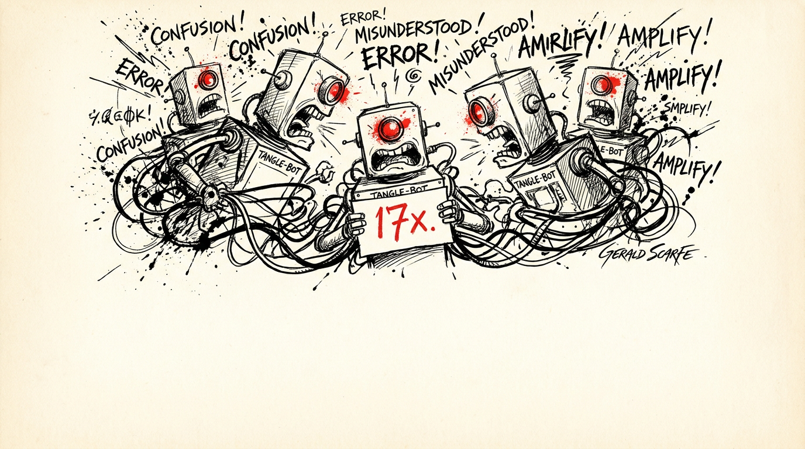

Shared semantics prevent this amplification. When all agents in the system reference the same definitions, the same hierarchies, the same domain relationships, their conclusions are commensurable. You can compare them. You can identify where they diverge and investigate why. Disagreement between agents that share a semantic foundation is information — productive, traceable, diagnostic information. Disagreement between agents that do not share a semantic foundation is noise.

When two agents reach different conclusions about the same phenomenon, the critical question is: are they disagreeing about the data, or are they disagreeing about the meaning? If the semantic layer is shared, you know the answer. Both agents are working from the same definitions. Their disagreement is about evidence, interpretation, or emphasis — the kind of productive disagreement that advances understanding. Without the semantic layer, you cannot even ask the question. Their divergence might be substantive or it might be definitional. You have no way to tell.

Something important about the house view. In a well-run newsroom, the house view is not a consensus document — not a lowest-common-denominator summary that everyone can agree to. It is an editorial position tested against internal dissent. The editor does not ask "what do we all agree on?" but "what is our best reading of the situation, given that our macro analyst and our crypto reporter see it differently?" Disagreement is preserved — it informs the confidence level and the caveats. A house view that smooths over disagreement is a press release. One that incorporates and acknowledges it is analysis.

Same principle in multi-agent coordination. The synthesis agent — the editor — should not average the specialists’ conclusions. It should identify where they agree, where they diverge, and why. Divergence is information. A trading agent and a treasury agent that reach different risk assessments from the same data are telling you something important about the complexity of your position. An orchestration layer that forces convergence destroys the very signal you built the multi-agent system to capture.

Practical multi-agent architecture is not complicated in concept, though it is demanding in execution. Each agent is domain-specialized: it has deep knowledge of its domain, access to the relevant Gold tables, and the contextual heuristics that make it effective in its area. The semantic layer is the shared substrate — the canonical vocabulary that all agents speak. And the coordination layer manages the conversation between agents: routing conclusions, surfacing disagreements, and synthesizing the house view.

Coordination pattern matters. Industry has converged on several approaches: graph-based orchestration, where agents are nodes in a directed graph and data flows along edges; role-based orchestration, where agents assume named roles (editor, analyst, critic) and interact according to those roles; and handoff-based orchestration, where agents transfer control to whichever peer is best suited for the next sub-task. Each pattern has strengths. All require shared semantics. Orchestration is scaffolding. The semantic layer is the foundation.

An important nuance about maturity. Frameworks exist. LangGraph, CrewAI, Microsoft’s Agent Framework, Anthropic’s Agent SDK, OpenAI’s Agents SDK, Google’s ADK — six major frameworks, all reaching maturity in 2025-2026, all supporting MCP natively or through adapters. Protocol layer is standardizing: MCP and A2A have moved to Linux Foundation stewardship. Plumbing is ready. What is not ready, in most organizations, is the semantic infrastructure that makes the plumbing useful. Benchmark testing shows the same model scoring seven points higher on a complex task simply by changing orchestration framework — 64.9% success rate in one scaffold versus 57.6% in another. Scaffold matters. But no scaffold compensates for missing definitions.

=== The Intelligence Stack

Organizations consistently misidentify where they are on the architectural progression, so it needs to be named explicitly.

Five layers. Each depends on everything below it. Skip a layer and the stack collapses.

[#fig-intelligence-stack]
.The intelligence stack: each layer depends on the one below. Skip a layer and it collapses.
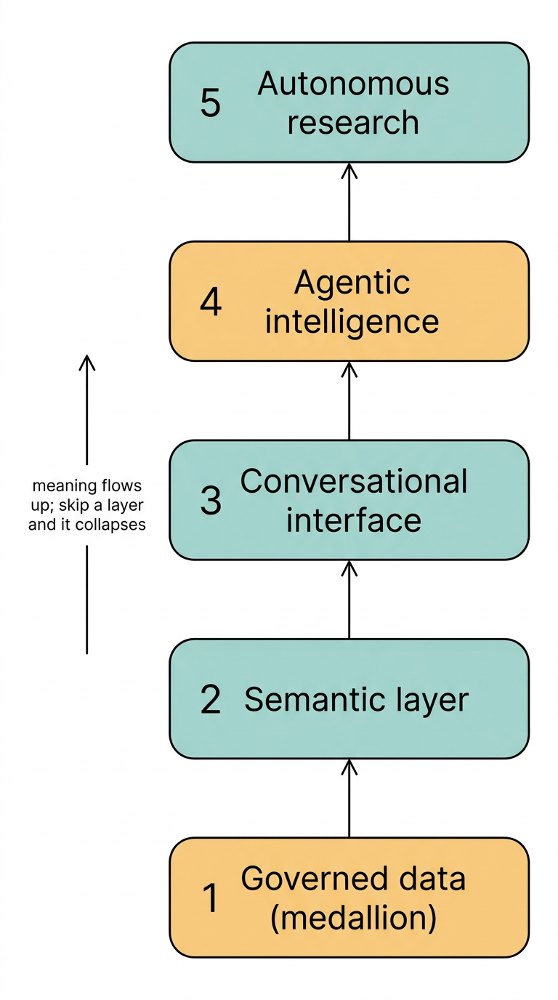

Layer one: governed data. The medallion architecture: Bronze as faithful replication of source systems, Silver as the canonical domain model, Gold as the curated knowledge menu — flat materializations and Silver-as-Gold views, both governed by the ontology. It includes all the governance that makes the data trustworthy — ownership, quality signals, freshness tracking, lineage. Without governed data, everything above is built on sand. It is the essential layer, not the interesting one.

Layer two: the semantic layer. Where concepts map to data. Not just column descriptions — the full semantic infrastructure: definitions, hierarchies, relationships, default assumptions, domain heuristics, navigational context. Vocabulary architecture: glossary at the top, flowing down through schema definition files into the semantic layer’s presentation logic, upstream always winning. Without this layer, the AI guesses. With it, the AI grounds.

Numbers are unambiguous. Semantically grounded AI: ninety-four to ninety-nine percent accuracy. Without grounding: ten to thirty-one percent. Not a marginal difference — the difference between a system you can trust and one you cannot. Worse: MIT found that large language models are thirty-four percent more likely to use confident language when generating incorrect information. They do not hedge when they are wrong. They double down. An ungrounded agent does not just give you wrong answers. It gives you wrong answers with the conviction of a tenured professor.

[#fig-guess-vs-reason]
.Grounded, an agent reasons (94–99%); ungrounded, it guesses (10–31%). The difference is infrastructure, not intelligence.
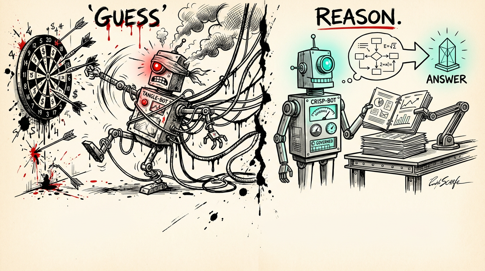

Layer three: conversational interface. Human asks, agent answers. Stage 1 — the question-and-answer loop. Valuable, and also the layer most organizations are optimizing for, because it is the most visible. Demos that impress the executive team are always conversational interfaces. "Look, I asked it a question about revenue and it answered correctly." Now try asking it something you did not pre-test. Try asking it about a concept that spans two domains. Try asking it a question whose answer changed last week. Stage 1 is important. Stage 1 is also the least interesting thing in the stack.

Layer four: agentic intelligence. Agents that monitor, reason, and generate insight without being asked. Where the architecture stops being reactive and starts being proactive. Agents that run autonomously — checking for anomalies, testing hypotheses, maintaining knowledge about the state of the business. Requires everything in layers one through three, plus persistent memory, goal structures, tool access, and rich semantic context that goes beyond definitions into domain expertise. Most organizations are not ready. Those that are will compound their advantage: insights from agentic systems feed back into the governed data layer, creating a virtuous cycle. Better data enables better agents. Better agents produce better data.

Layer five: autonomous research. Agents that maintain and grow knowledge bases, test hypotheses over extended periods, falsify stale conclusions, and interact with senior stakeholders as something approaching epistemic peers. Not an assistant that answers questions — a colleague that does independent research, brings findings to the team, and contributes to the organization’s evolving understanding of its domain.

The junior analyst framing deserves unpacking, because industry has adopted it as marketing copy without understanding what it demands. Think about what makes a junior analyst valuable. It is not their reasoning ability — plenty of people can reason. It is their access to the firm’s institutional knowledge. A junior analyst at an investment bank is valuable because they sit inside a system: they have access to the research library, the internal models, the senior analysts’ previous work, the client data, the market data feeds. Take the same person and remove all that context and they are just someone with a spreadsheet.

Same for an AI junior analyst. Reasoning capability is the model — and everyone has access to the same foundation models. What makes the agent valuable is the institutional context it operates within: the governed data, the semantic layer, the domain heuristics, the historical knowledge base. Without semantic infrastructure, an AI junior analyst is a language model with a spreadsheet. With the full intelligence stack — governed data, semantic layer, domain training, hypothesis tracking, persistent memory — it is something genuinely new: a tireless researcher with perfect recall, quantitative skills, and access to everything the organization has ever recorded. Model is generic capability. Stack is specific value.

Transparency about evidence for each layer matters. Layers one and two are well-understood. The medallion architecture and semantic layer patterns are operational at scale in multiple organizations. Layer three is production-ready: conversational analytics works when the semantic infrastructure is in place. Layer four is emerging. In financial services, forty-four percent of finance teams have deployed some form of agentic AI, up from seven percent just eighteen months ago, but the overwhelming majority of those deployments are narrow — task-specific agents handling document processing, compliance checks, or report generation, not the kind of broad autonomous monitoring described here. Layer five is real but early. There are existence proofs: a research team produced an entirely AI-generated paper that was accepted at peer review — end to end, from hypothesis formulation through experiment design, execution, analysis, and manuscript authoring. Autonomous coding agents have gone from "impossible" to seventy percent success rates on industry benchmarks in under two years. A researcher ran seven hundred experiments in two days with a six-hundred-line Python script and discovered twenty optimizations — an autonomous research loop completed in a weekend that would have taken a human team months.

Existence proofs from software engineering and academic research, not financial market intelligence. Stage 5 in finance is architecturally clear but operationally still ahead of most organizations. Build Stages 1 through 4 correctly — with the right semantic infrastructure, the right memory architecture, the right governance — and you have built the foundation for Stage 5. Build them incorrectly — ungoverned data, no shared definitions, no persistent memory — and Stage 5 is permanently unavailable. Decisions about semantic infrastructure now determine what is possible later.

A recurring pattern. Organization hears about agentic AI. Gets excited. Spins up a proof of concept. Agent queries their data and produces a report. Looks impressive. They scale it. Agent starts producing inconsistent results, contradicting itself across runs, misinterpreting concepts that span domain boundaries, unable to distinguish meaningful anomalies from data quality issues. Team concludes "the technology is not ready." The technology is ready. Their semantic infrastructure is not.

Meaning flows upward, which is why the stack is strict. If your definitions are wrong at layer two, every layer above inherits the error and amplifies it. If your governed data at layer one has quality issues, the semantic layer cannot compensate. If your semantic layer is thin — just column names and short descriptions, without the rich contextual heuristics that agents need — then your conversational interface will handle friendly questions and fail on hard ones, and your agentic layer will not function at all. Each layer is a filter for the fidelity of understanding. By the time you reach layer five, the system is reasoning over the cumulative precision of every layer below it. There is nowhere to hide.

=== What's Stopping You

Several positions come up constantly and are actively preventing organizations from building what they need.

First: equating AI with chatbots. "We deployed AI" means "we put a chatbot on our intranet." Not wrong exactly — chatbots reduce support ticket volume, handle routine questions. But it is like saying "we deployed electricity" because you installed a desk lamp. A chatbot is Stage 0. It is not even Stage 1, because in most implementations it lacks the semantic infrastructure that makes its answers trustworthy. A chatbot that queries ungoverned data through an ad hoc connection is a random number generator with a polite interface. Industry’s own numbers confirm this: eighty-nine percent of organizations that claim "agent adoption" have nothing in production. What they have is a chatbot and a press release.

Chatbot versus agent is an architectural distinction, not a matter of sophistication. A chatbot is stateless: it processes a query, returns a response, and forgets. An agent has memory, goals, and agency. It tracks what it has previously concluded. It monitors for changes. It initiates actions. These properties require infrastructure a chatbot does not: persistent state, governed tool access, semantic grounding, autonomous reasoning loops. Same model. Entirely different architecture.

Chatbot-to-agent is precisely the semantic gap. "We tried AI and it did not work" means "we connected a language model to our data without semantic infrastructure and it hallucinated." Of course it hallucinated. No definitions to reference, no relationships to follow, no domain context. It guessed. With the full semantic layer — definitions, hierarchies, temporal context, domain heuristics — it grounds. The difference between guessing and grounding is infrastructure, not model quality.

Second: vendors who promise agents without semantic foundation. "Buy our pre-built AI solution. Connect it to your data. Get insights. No semantic layer needed — the model figures it out." This pitch is everywhere. It is seductive because it promises the destination without the journey. It is wrong because the journey is the point.

Without semantic grounding, agents hallucinate with confidence. The model does not say "I am uncertain about this column’s meaning." It picks an interpretation, commits to it, and presents the result as fact. In a multi-agent system without shared semantics, confident mistakes propagate through the coordination layer, contaminating every other agent’s conclusions. The vendor who tells you "the model handles it" is selling you the ten-to-thirty-one-percent accuracy tier and calling it innovation. Global losses from AI hallucinations reached sixty-seven billion dollars in 2024.

Hallucinations cannot be fully eliminated. A mathematical proof published in 2025 confirmed this under current architectures. What can be done — what the semantic layer does — is reduce hallucination rates dramatically through grounding. RAG reduces hallucinations by forty to seventy-one percent when properly implemented. Knowledge-graph-based retrieval reduces them by forty percent — not a silver bullet, but the difference between ninety-five percent accuracy and twenty percent. Worth taking every day.

Third, less common but equally misleading: federated domain ownership — data mesh — naturally produces the semantic infrastructure that agents need. Logic sounds reasonable. Each domain team defines their data. Each team publishes data products. Agents consume them. The distributed ownership creates distributed accountability, and the semantic infrastructure emerges organically.

It does not. Federated ownership is not shared meaning. When a trading agent and a treasury agent both encounter the concept of "position," they may be using the same word to mean entirely different things. Without a shared vocabulary — the kind of three-tier architecture where a canonical glossary governs everything downstream — federated ownership produces federated confusion. Pattern plays out predictably: multiple teams, multiple tables, multiple definitions of the same concept, nobody sure which is authoritative. Mesh gives you accountability boundaries. Semantic layer gives you shared meaning across those boundaries. You need both. Without the semantic layer, data mesh is distributed ambiguity with better org charts.

=== What This Demands From the Architecture

Four concrete demands on anyone who intends to build agentic intelligence.

First: semantic richness — not column descriptions, not a data dictionary with one-line entries, but tutorial-quality documentation that agents read as pre-flight briefing before they reason over your data. Each domain needs not just definitions but context: how the data behaves, what is normal, what is anomalous, what caveats apply, what temporal patterns exist. When an agent is going to reason autonomously over your trading data, it needs to know that volume patterns differ by market session, that certain counterparties have known reporting delays, that quarter-end effects are real but seasonal. Handing a new analyst a spreadsheet without onboarding produces confused output. Your agents are no different.

Good news: building this documentation has become dramatically cheaper. I know this because I have done it — logical concepts mapped and validated across multiple domains, tutorial documentation generated from conversations with domain experts. Cost is no longer the bottleneck. Organizational will is.

Second: event-driven data. Agents that monitor autonomously cannot operate on batch-processed snapshots that refresh overnight. If your Gold tables update at 6 AM and an event occurs at 2 PM, your agent is reasoning over stale data for sixteen hours. Industry is building the infrastructure now — streaming platforms that unify data processing and agentic workflows, event-driven agent engines that reduce costs by ninety percent compared to traditional streaming. Architectural pattern is clear: Gold tables that are not just flat and governed but event-aware, capable of surfacing changes and anomalies in near-real-time.

Where this stands: my own platform runs batch-processed Gold tables. Event-driven Gold is the architectural target — what you build toward — not a claim about current universal practice. But the trajectory is unambiguous. Every major data infrastructure vendor is investing in event-driven agent support. Organizations that build with event-driven Gold as the design target will be ready when streaming infrastructure matures. Organizations that build for batch-only will face re-architecture when they try to activate agentic use cases.

Third: agent infrastructure. Orchestration, memory, tool access, safety rails. Orchestration frameworks exist and are maturing rapidly. Memory infrastructure is less developed — most implementations still rely on simple key-value stores or vector databases for agent memory, which is insufficient for the kind of hypothesis tracking and temporal knowledge management that agentic intelligence requires. Tool access needs governance: not just "can the agent call this API?" but "under what conditions, with what constraints, and what happens when it is wrong?" Safety rails are non-negotiable: guardrails that prevent agents from acting on hallucinated conclusions, human-in-the-loop checkpoints for high-stakes decisions, and logging of every reasoning step for audit.

Regulators are paying attention. Financial regulators are beginning to ask about "know your agent" requirements — the same due diligence that applies to human actors may soon apply to autonomous AI systems. The EU AI Act’s rules on general-purpose AI models took effect in 2025, with high-risk system requirements approaching in 2026. The intelligence stack needs not just semantic governance but compliance governance — and the semantic layer is the mechanism that makes compliance auditable, because every definition, every relationship, every reasoning step is explicit and inspectable.

Fourth, and hardest: organizational. Agentic intelligence requires a shift in how the organization thinks about its data. Data is not a byproduct of operations warehoused for occasional reporting. It is the organization’s memory — the authoritative record of everything it has done, observed, and concluded. The warehouse is a knowledge system, not a storage system. MCP is the interface to institutional memory, not merely a technical standard.

When a trading desk hears that the investment goes into definitions and semantic infrastructure, the response is predictable: "We need faster dashboards, not philosophy." It is not philosophy. It is the engineering prerequisite for agents that work. Every organization that has deployed an agent on ungoverned data has learned this the hard way. Agent misinterprets a column, joins tables incorrectly, invents a plausible calculation that does not match the business definition. Someone on the trading desk says "AI does not work." AI works. Your data is not ready for AI. The difference is the semantic layer.

Gold tables in your warehouse are the menu of what you want agents to reason about — not raw data, not staging tables, not denormalized dumps nobody has bothered to document, but curated, governed, richly described knowledge assets. When an agent opens the menu, it should find not just the data but the context: what this table measures, how it was calculated, what its refresh cadence is, what known limitations apply, and what domain heuristics inform its interpretation. This is what Gold as a knowledge menu means, as opposed to a data dump.

Reframing changes ownership. The data platform team does not own "the data warehouse." They own the corporate memory. The semantic layer team does not own "metadata." They own the organization’s vocabulary. The agent infrastructure team does not own "chatbots." They own the reasoning layer that turns memory and vocabulary into insight.

Framed this way, you are not spending money on data infrastructure. You are spending money on the organization’s ability to think — to remember, to reason, to learn. Organizations that build this compound their advantage: better semantic infrastructure enables better agents, better agents produce better insights, better insights improve the data. Organizations that do not build it enter the opposite cycle: ungoverned data produces unreliable agents, unreliable agents erode trust, eroded trust reduces investment, and reduced investment prevents the data from ever being governed.

Agentic intelligence is not a technology project. It is a commitment to taking your organization’s knowledge seriously — treating it as an asset with structure, maintaining it with rigor, making it accessible to every reasoning system that needs to draw on it. Semantic layer as foundation. Governed data as substrate. Agents as the reasoning capacity that turns knowledge into action.

Most organizations will not build this. They will buy a chatbot, call it AI, and move on. Those that do build it will discover something the industry has not yet named: the gap between organizations with semantic infrastructure and organizations without it is a categorical difference, not a competitive advantage. One type of organization has agents that reason. The other has agents that guess. Same models. Same protocols. Different architecture.

Build it, or watch someone else build it first.

=== Building for the Consumer That Cannot Assume

Nothing exotic about the agent. It is simply the consumer that cannot import tribal knowledge silently. A five-year veteran analyst carries a private reservoir of context — conventions, edge cases, slang, the memory of what went wrong last quarter. The agent has whatever is in its context window and nothing else. That sounds like a limitation. It is a forcing function.

Build the semantic layer for the agent — with declared measures, documented conventions, explicit morphisms between domains, temporal contracts that name which question is being answered — and you have built the semantic layer that onboards a new human analyst in their first week instead of their first quarter. You have built the infrastructure that lets a regulator reconstruct what was reported and why. You have built the system that does not degrade when a senior practitioner leaves and takes their tribal knowledge with them.

Convergence is the point. Agentic consumer, new human consumer, regulatory consumer — all need the same thing: an architecture that makes its knowledge explicit rather than assuming it will be imported from somewhere outside the system. Build for the consumer that cannot assume, and you build better for every consumer.

== Building with AI

=== Why Traditional Information Architecture Failed

Traditional information architecture failed not because the people were bad, but because modeling is a maintenance problem disguised as a design problem — and nobody reads the disguise until the budget is spent.

Not a failure of willpower. A structural failure. Ontologies are not documents — they are living systems, and humans cannot maintain living systems at the scale and pace a modern data platform demands.

If you want proof, look at FIBO.

FIBO is the most rigorous semantic model the financial services industry has ever produced. Over 2,400 classes. More than 30,000 terms. Years of work by PhDs at Goldman Sachs, Bloomberg, Citigroup, Deutsche Bank. Endorsed by the Bank of England and the Financial Conduct Authority. It covers Foundations, Business Entities, Finance, Securities, Derivatives. OWL and RDF serializations formally exquisite.

And nobody uses it.

Fairness is warranted: the people who built FIBO were doing serious, careful work, solving a real problem — the financial industry’s chronic inability to agree on what common terms mean across institutions. Rigorous approach. Irrelevant outcome.

Industry’s own assessments are blunt: "Many financial institutions remain on the sidelines. Even ontologists among early adopters find it hard to scale FIBO adoption beyond their Center of Excellence." Implementing FIBO requires expertise in semantic technology and ontology engineering that most organizations do not have in-house. Gap between ontology and operational data management remains, in the industry’s words, "significant."

EDMC eventually released human-readable versions —- glossary, dictionary, wiki, UML diagrams —- because the OWL and RDF were too hard to consume. But those versions lack the semantic richness that was FIBO’s entire point. Stripping formalism for accessibility gutted the value. You cannot support model-driven development from a wiki page. Formal machine-readability was the whole point, and they had to abandon it to get anyone to look at the thing.

Build it rigorously and nobody can use it. Simplify it for adoption and it loses the rigor that justified building it. FIBO is a beautiful corpse: formally complete, operationally dead. Any semantic system requiring continuous expert maintenance at scale will fail, because maintaining a 30,000-term ontology requires tireless attention that humans cannot sustain and organizations are structurally incapable of providing.

[#fig-metadata-graveyard]
.Here lies FIBO — 2,400 classes, 30,000 terms, central-bank endorsement, and almost no users: the most beautiful corpse in the graveyard of grand unified dreams. Cause of death: maintenance, not design.
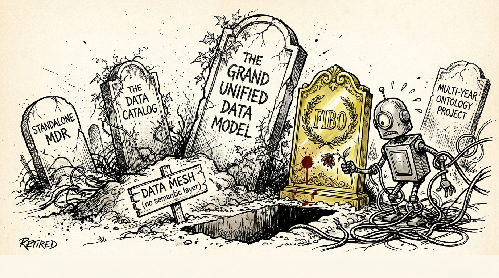

Could AI change FIBO’s trajectory? Probably — an AI curator could maintain the mapping between FIBO’s classes and an organization’s actual data model. But the industry has moved on. Goldman Sachs, Bloomberg, Deutsche Bank have built their own internal semantic models. What remains is the lesson: you do not need 30,000 terms. You need 600, embedded in your pipeline, maintained by AI.

IA tradition failed because the unification framework made the work intrinsically unfinishable. One ontology to capture every domain, every relationship, every term — intrinsically unfinishable because the enterprise is not finished. Domains evolve. Acquisitions happen. Regulatory shifts redefine terms overnight. A unified model that claims completeness is either incomplete — broken on its own terms — or frozen, irrelevant to the moving enterprise it claims to represent. Finishability requires completeness. Completeness requires the enterprise to stop changing. It will not.

Colimit architecture removes the unfinishability. Each domain maintains its own ontology — compliance keeps its Customer, trading keeps its Counterparty, neither overwritten nor reduced. Each morphism is useful the moment it is written. An agent traversing from a compliance question to a trading question reads the morphism and knows how to compose. No inference required, no hallucination of relationships.

Finishable at every step, in the sense that every step produces a usable artifact. Working in one domain? See the local ontology immediately. Two domains? Both ontologies plus the explicit morphism. More domains than have been mapped? See the gap transparently. Unified models offer none of this incrementality. All or nothing — and "all" never arrives.

At JP Morgan, building a semantic layer for regulatory compliance took a dedicated team more than eighteen months. At London Stock Exchange, similar work, similar timeline. Multi-year programs with dedicated headcount, delivering artifacts that began decaying the day they shipped. Decay is never dramatic — it is quiet. A column gets renamed in production but the data dictionary still has the old name. A new metric gets created but nobody adds it to the glossary. A business concept evolves but the ontology reflects last year’s understanding. Each individual drift is small. Cumulatively, they are fatal.

Building was never the problem. Maintaining always was.

=== The Maintenance Problem

First, a myth to kill, because the traditional maintenance horror story is built on it: that the core business domains churn. They do not. What a trade is, what a client is, what distinguishes an instrument from a financial product, what a settlement is — these change on the timescale of years, not weeks. Finance, sales, logistics, frequent-flyer points, even derivatives trading: the core ontologies are *stable*, and a stable target is cheap to maintain, not expensive. The churn lives almost entirely in one place — analytics. New questions, new cuts, new derived metrics arrive daily, but they arrive *additively*: flat lists of semantically-related pockets of useful data science, layered on top of a core that holds still. Miss this and you over-engineer the whole platform for a rate of change that only one corner of it actually exhibits.

That said, a data platform at any mid-size organization does change every day — at the edges. New tables get created. Columns get renamed. A product launch coins a concept. A regulator redefines an entity. Upstream sources change their schemas without notice. Finance decides "revenue" now includes a line item it excluded last quarter. Each change should trigger an update somewhere in the semantic infrastructure — and the volume of those edge-changes, additive though it is, is still more than any committee can keep pace with.

And each one fans out. Glossary should reflect the new term. Data dictionary should note the renamed column. Logical data model should incorporate the new entity. Lineage should map the new dependency.

Now tell me: who does that?

In the traditional model, data stewards coordinate through a governance committee that meets quarterly to review proposed changes, approve or reject them, and assign updates. By the time a change is approved, the data has changed three more times. The committee is governing a snapshot that no longer exists.

An hour debating the definition of a term while three new tables are created without definitions at all. Governance at human speed in a machine-speed environment.

Costs are staggering. Five to ten information architects at market rates: $750,000 to $2.5 million a year. Consultancy supplements — Deloitte for lineage, Capgemini for the catalog, contractors when the permanent team turns over. Platform licenses: Collibra or Alation at six figures annually. Opportunity cost: domain experts pulled from their day jobs to attend workshops, review definitions, approve changes. Fully loaded cost of traditional semantic infrastructure is far more than the salaries suggest.

But the real cost is what happens when governance fails. When the dictionary drifts, people stop trusting it. When people stop trusting it, they stop reading it. When they stop reading it, they start creating their own local definitions, their own shadow glossaries, their own tribal knowledge that lives in their heads and disappears when they leave.

I have inherited exactly this situation. An organization that went public with undocumented processes. A whole group of people who understood the data left, and they did not write anything down. The new people inherit what looks like garbage —- not because the systems are bad, but because the knowledge of how to interpret them is gone. Rule maintenance degrades to guesswork. Guesswork degrades to entropy. Entropy degrades to audit risk.

A subtler version: an internal standards document —- comprehensive LaTeX covering architectural positions on medallion layers, Gold modeling, semantic infrastructure. Thorough, well-reasoned, written for humans. Then an engineer pointed an LLM at it and asked it to generate a Gold model. The agent read the document, interpreted it, and concluded that star schemas were the correct pattern for Gold. This was wrong. The position is: flat Gold is the fast default — denormalized, question-driven. Star schemas live in Silver, exposed through the semantic layer as governed views when dimensional navigation is needed. No physical star schemas in Gold as the default pattern. But the document was ambiguous enough in places that a machine reader reproduced the ambiguity it found in the text.

If your architecture documents are not machine-readable, your AI will inherit your confusion. Perfectly good for a human reader who resolves ambiguities through context and corridor conversation. Terrible for a machine reader that takes text literally. That monolithic document got decomposed into eleven machine-readable standards files — each scoped to a specific concern, each written with the precision a machine consumer demands. A governance intervention.

The problem is building something that requires continuous human effort at a scale and pace humans cannot sustain.

=== AI as Always-On Curator

AI changes the economics of curation — and "curation" is not "documentation."

Documentation is a one-time act: you describe what exists today. Curation is continuous: monitor changes, evaluate consistency with the existing model, update or flag. Traditional governance failed because it treated a process as a series of snapshots — quarterly reviews, annual audits, periodic refresh cycles — each out of date by the time it happened.

AI makes continuous curation possible because AI does not get bored, does not lose context, does not get promoted, does not leave for a better offer, and does not simplify to meet a deadline. An AI curator can monitor every schema change in your transformation project, check each new or modified column against the business glossary, verify that the definition conforms to quality standards, and flag any inconsistency for human review. Not quarterly. Every commit.

[#fig-curator-vs-committee]
.Governance at human speed loses to a machine that never sleeps: continuous curation, not the quarterly committee.
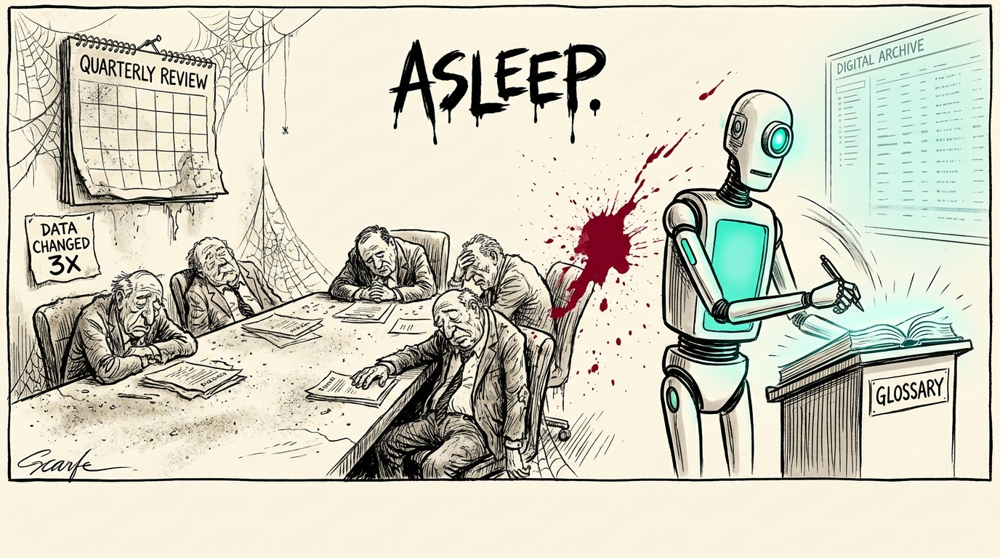

Automated definition quality audits against ISO 11179 are already operational. Precise, unambiguous, non-circular, stated in natural language, domain-scoped — every definition checked against those criteria, not by a committee but by an AI that evaluates and reports in seconds. Cycle time from "write a definition" to "get quality feedback": weeks to seconds.

More transformative than quality checking: knowledge extraction.

How data dictionaries have traditionally been built: You schedule a series of meetings with domain experts. You bring a spreadsheet template. You ask them to fill in descriptions for each column in their domain. They nod, take the template, and put it on their to-do list behind everything else that is more urgent. You follow up. They apologize. You reschedule. Six months later, you have a thin, incomplete dictionary that was obsolete before it shipped. Domain experts are not being difficult. They are being realistic. Filling in metadata templates is not their day job.

Conversational extraction is the alternative. Record a conversation with the domain expert — not a formal meeting with an agenda and a template. Ask them to walk through their day. What data do they look at? What does it mean to them? What are the concepts they care about? What are the edge cases, the exceptions, the things that trip up new hires? The expert talks about their actual work, in their actual language, and AI extracts and structures the knowledge.

Applied to a finance team, this produced a better data dictionary in one session than six months of the traditional approach would have yielded. Better, not just faster. Better because the conversational format captures tacit knowledge —- the things experts know so deeply that they would never think to write them down in a spreadsheet cell. The edge cases that everyone in the team knows but nobody has documented. The unwritten rules about how a metric should be interpreted in specific contexts. The conversation surfaces all of it, and the AI structures it into a formal data dictionary.

People know their data. They do not have time to write down what they know in the format you are asking for. AI changes the format: have-a-conversation instead of fill-in-the-spreadsheet.

Old method: human describes, human structures, human validates. New method: human describes, AI structures, human validates. Two human steps instead of three, and the middle step — the expensive, error-prone one — is handled by a machine that is better at it.

Every data dictionary project run in the traditional mode hits the same wall. Energetic kickoff. First round of definitions comes in quickly. People get busy. Follow-ups stop being answered. Project quietly dies. Two years later, someone proposes the same project with the same methodology and the same inevitable outcome. Conversational extraction breaks the cycle: one conversation, one AI structuring pass, one validation session. Done.

Lineage mapping tells the same story. A decade ago: hire consultants to read SQL, trace dependencies, draw the lineage. Weeks of work at consulting rates for what is fundamentally a pattern-recognition task. Detailed, tedious, accuracy-critical — exactly where humans get tired, lose context, and make mistakes, and exactly where AI excels.

Now you feed the SQL into Claude and it maps the lineage in minutes — accurately, not approximately. Because this is a machine job. You actually want really accurate eyes on that mapping, and the machine’s eyes do not glaze over after the fifteenth stored procedure.

Without AI in the loop, lineage mapping demands more time from domain experts, more time from the platform team, more time to decompose and understand the flows. A year to get there would be a reasonable estimate. With AI, the timeline compresses from a year to weeks, and the accuracy is arguably better. A different category of capability entirely.

Tooling is catching up. AI-powered schema generation tools now digest hundreds of unstructured files and synthesize database architectures — one achieves 94% accuracy converting unstructured documents to structured schemas. dbt’s Copilot now understands the full data ecosystem, not just individual SQL transformations. But most tools focus on the physical model. Always-on curation of the semantic model — the meaning layer above physical structure — is still ahead of the market. That is where the real value lies.

*Pattern: Workshop Extraction*

_Context:_ Definitions need to be captured from domain experts who hold operational knowledge in their heads.

_Problem:_ Traditional glossary projects use structured interviews and spreadsheets. Domain experts fill in forms reluctantly, omitting the tacit knowledge — edge cases, history, conventions — that makes definitions actually useful. Six months of effort, definitions that read like dictionary entries.

_Solution:_ Record a conversation. Not a structured interview — a real conversation. "Walk me through what you look at every morning. What does this number mean? Where does it come from? What do you check when it looks wrong?" Let the expert talk. Record it. Use AI to extract, structure, and validate definitions from the recording. One session produces tutorial-quality definitions — not dictionary entries but operational context including edge cases, history, conventions, and the tacit knowledge that experts would never write in a spreadsheet.

_Example:_ A 45-minute conversation with a treasury operations lead produces draft definitions for 30+ terms: what "net position" means in practice (not the textbook definition — the one that accounts for the pending settlements, the FX hedges, the intraday credit lines). AI extracts structured definitions, flags ambiguities, cross-references against the existing glossary. Human review takes a day. Result: 30 production-quality definitions that would have taken traditional methods three months.

_Consequences:_ AI-extracted definitions require expert review. Without it, subtly wrong definitions propagate systemically. Review is the bottleneck, not extraction.

=== Continuous Morphism Verification

Three disciplines made something continuous that used to be periodic, and each became foundational the moment it did. Continuous integration made the correctness of code continuous: you stopped certifying a release and started testing every change, always, with a green/red signal. Security scanning made exposure continuous: the threat landscape shifts under you, so you scan on a schedule and on change rather than certifying once a year. Data observability made data quality continuous: freshness, volume, and distribution are monitored, not attested.

Meaning has had none of this. The semantics of an enterprise — what its terms mean, how its domains map onto each other — has been governed by a human signature and a quarterly meeting. The one layer everything else depends on for correctness is the one still governed by a photograph. Continuous Morphism Verification is the missing pipeline: continuous integration for meaning, observability for the semantic layer. It is the mechanism that makes the colimit a living object rather than a diagram drawn once. The colimit is a verb; this is the verb running.

You would not ship code without continuous integration, or run infrastructure without monitoring. Most organizations ship meaning with neither — governed by a signature and a committee. Continuous Morphism Verification is the pipeline that has been missing.

*Pattern: Continuous Morphism Verification*

_Context:_ A colimit of domain ontologies glued by explicit morphisms, serving agents and humans through the semantic layer.

_Problem:_ Cross-domain morphisms decay. A mapping correct when written drifts as the domains it connects evolve — a column is renamed, a regulator redefines an entity, a new attribute appears on one side, a definition shifts. Under periodic human sign-off the decay is invisible between reviews: the morphism asserts a truth that expired, and the break surfaces months later in an audit or a wrong answer. Attestation certifies a moment; meaning does not hold still.

_Solution:_ Verify continuously rather than attest periodically, with a standing mesh of agents rather than a committee. Each domain runs a verification agent that owns the morphisms incident to that domain. On every scan — nightly as the baseline, and immediately on any change to a domain's schema or ontology, exactly as continuous integration triggers on commit — the agent re-checks each morphism against the live state of both domains: that the mapped fields still exist (structural); that the keys still join at the documented cardinality (referential); that value distributions have not shifted in a way that implies a changed definition (distributional); that no new attribute has appeared that the morphism fails to account for (completeness); that the documented losses are still the actual losses (loss re-validation); and that for any shared concept reachable by two paths through the domain graph, the paths still agree (commutativity).

The first five checks are within reach of a single domain agent. The sixth is inherently cross-domain — confirming that Trading-to-Finance-to-Compliance composes to the same thing as Trading-to-Compliance requires the agents of all three domains to share what they know about the shared concept. So the pattern is multi-agent by necessity, not fashion: per-domain verification agents plus a coordinator that orchestrates the cross-domain commutativity checks, assembles the witness when one fails, maintains the global health view, and routes exceptions. Collectively the mesh is a standing guardian over the colimit — always on, never certifying, continuously confirming. When a check fails, the coordinator does not report "the model is broken." It emits a witness: the specific shared concept and the two paths that disagree. Drift is localized to one span. Trivial drift auto-repairs; genuine judgment calls route to the one human who understands that span. The human does judgment; the mesh does verification — the inverse of the old model, where humans rubber-stamped attestation and a steward caste did the translation. Governance becomes a measured quantity, not a signature: every morphism carries a last-verified timestamp that updates each scan, and the mesh rolls per-morphism results into a single colimit-health vector, tracked continuously with alerts on degradation, the way uptime is tracked.

_Example:_ A regulator's reclassification changes the Compliance partition overnight. The Compliance agent's scan catches the schema change the same night and re-verifies every morphism touching the changed entity; the coordinator re-runs the commutativity checks for the shared counterparty concept; one path now disagrees with another, so a witness is raised on that single span and routed for adjudication. By morning the colimit-health view shows one amber span with a named cause — not a green dashboard hiding a silent break, and not a surprise discovered at the next quarterly review.

_Consequences:_ A standing multi-agent mesh has real cost — compute for nightly sweeps, the engineering to wire change-triggers into every domain, and a coordinator that becomes load-bearing infrastructure that needs its own monitoring. Commutativity checking is combinatorial in the number of paths, so beyond roughly thirty domains it must be done hierarchically — sub-meshes per cluster, composed at a higher level — or you accept that distant domain pairs are never directly verified. And the mesh is only as sound as its agents' judgment: their verdicts are sound up to error, so the health vector carries a calibrated confidence, not a guarantee. To our knowledge no practitioner book has yet framed cross-domain semantic governance as the continuous agentic verification of categorical mappings; the continuous-verification half is a convergent industry pattern, while the commutativity criterion — the colimit's universal property used as the test — is what the categorical framing adds.

=== The Documentation Artefact

A domain essay: a few pages of considered prose covering provenance, conventions, edge cases, and operational craft for a single dataset or a tightly coupled cluster. Anchored on structured metadata that does not disappear — datatypes, primary keys, refresh cadence, lineage references, ownership records. Those anchors are the index, not the documentation.

Versioned like code. Dated revisions. Named authors and reviewers. Stored alongside the data assets it describes. It has a decay model: an essay reviewed within the last twelve months is treated differently from one untouched for three years, because stale documentation is, for an agent, strictly worse than absent documentation. An agent reads stale prose with the same confidence as fresh prose and produces confidently wrong answers. A documentation system that does not manage decay produces worse outcomes the longer it operates.

Think about onboarding. When a new analyst arrives on a trading desk, nobody hands them a metadata catalogue. They get prose and conversation. They hear the war stories: the time the upstream system reclassified counterparties without warning and broke the morning P&L for a week. They learn the conventions: how P&L is computed here, which of the canonical definitions the desk uses, when it switches to the others. They absorb the slang: what "the book" means in this office, what "the cross" means at this desk, which fields are actually used and which are vestigial. They acquire the craft: how to interpret edge cases, what a sudden gap in a time series typically means, which exceptions are noise and which are signal. A capable LLM brings substantial general knowledge to any business domain on day one —- accounting principles, market mechanics, regulatory shape. What it lacks is exactly this organizational nuance, this desk-specific convention, this tribal craft. Without it delivered explicitly, the agent plateaus at general competence, perpetually missing the specifics that distinguish a good analyst from a textbook one.

Essays are not generated from schemas. The whole point is that the essay carries information the schema does not —- operational knowledge, edge cases, conventions, the tribal knowledge that makes the difference between a technically correct answer and a useful one. A schema-generated essay is, by construction, no better than the schema. It cannot capture what the schema does not contain. AI can help draft, structure, check for staleness, flag inconsistencies. But the source of the knowledge is human and organizational. The value of the essay is precisely the operational knowledge that lives in practitioners’ heads and nowhere else: the unwritten rules about how a metric should be interpreted in specific contexts, the exceptions that everyone on the team knows but nobody has documented, the history of why a column was named the way it was or why a particular calculation uses this formula and not the obvious alternative.

Morphisms between domain ontologies are themselves a species of essay. A compliance-to-trading morphism written as a controlled-vocabulary entry would be the field mapping and nothing else. Written as an essay, it is the field mapping plus the explanation of why KYC sub-segments do not survive the map, why proprietary desks have no compliance antecedent, when the map was last challenged by a regulator, and how the morphism is expected to shift if the next regulatory inflection arrives. Morphism-as-essay carries exactly the cross-domain operational knowledge that a controlled-vocabulary entry discards as out of scope — and that discarded knowledge is, more often than not, what determines whether the agent’s answer is right or wrong.

Documentation that lets an agent reason over data turns out to be the same documentation that onboards a new human analyst fastest and serves the regulator’s question best.

==== When AI-Maintained Definitions Go Wrong

AI extracts a definition that is subtly wrong — "revenue" that accidentally includes intercompany transfers it should exclude. The definition passes the quality gate. It is syntactically well-formed, non-circular, properly scoped. It propagates through the three-tier vocabulary into the semantic layer, into every agent’s context window. Every agent that answers a revenue question now answers it wrong. The error is systemic, confident, and invisible until a domain expert notices the number is off.

What catches it? Not a quarterly review board, and not a single vigilant human reading definitions one at a time — that is the model that fails. A human reviewing AI-drafted definitions for semantic correctness needs the same domain expertise as writing them, must be *more* vigilant because they are hunting errors of omission in someone else’s work, and the Anthropic study cited earlier — junior developers finish faster with AI but score 50% on comprehension versus 67% for controls — says exactly what happens when you lean on that human: fast production, shallow review, the error ships. Putting the lazy human back in the loop is not the mitigation. It is the failure mode with a signature on it.

The mitigation is the same shape as how a frontier model is kept honest, and it is worth saying plainly because it inverts the traditional instinct. You do not keep semantic quality high by scheduling human review; you keep it high the way an LLM lab keeps a model aligned — by **continuous feedback in usage** and by **agentic review**, with humans adjudicating only the exceptions the machine surfaces. Two mechanisms, both continuous:

* *Feedback in usage.* Every agent answer carries its provenance — which definition, which measure, which morphism it used. When an answer is corrected, contested, or abandoned downstream, that signal is captured against the specific definitions it relied on. This is UAT for semantics, not a requirements workshop: the definition is validated by the outcomes it produces in the field, monitored as a live metric, the same way you watch a model’s production error rate rather than re-grading its training set.
* *Agentic review.* A panel of review agents, each given a different lens — the exclusion lens ("what should this metric leave out, and does it?"), the provenance lens ("does the calculation match the cited source?"), the adversarial lens ("construct the input where this definition gives a wrong answer") — interrogates each new or changed definition. Disagreement among them is the signal that routes a definition to a human, and the human now adjudicates one flagged case with the agents’ findings in hand, not a backlog of green-looking entries to skim. This is the move the industry made from pure RLHF to agentic evaluation: stop asking one tired reviewer to catch everything, and put a diverse panel of tireless ones in front of them.

This does not make semantic correctness free — the residual human cost is real, and it lives exactly where judgment is irreducible: the genuinely ambiguous concept, the exception the agents flag but cannot resolve. But it moves the human from *the governing loop* to *the exception queue*, which is the only place human attention scales. The construction cost of a definition collapses with AI; the correctness of a definition is held not by periodic human review but by continuous, agentic, in-usage verification — the same discipline as the rest of this architecture, applied to meaning itself.

*Pattern: Domain Essay Authoring*

_Context:_ A significant dataset or tightly coupled cluster of datasets needs operational documentation for agents and new hires.

_Problem:_ Schema-generated documentation is by construction no better than the schema — it cannot capture what the schema does not contain. ISO 11179-style controlled vocabulary entries tell the consumer the column’s type and name. They do not tell them why the column exists, when its values diverge from the obvious interpretation, or what edge cases bite practitioners every quarter.

_Solution:_ A domain essay is 600-1500 words of considered prose covering provenance, conventions, edge cases, slang, history, and craft — written by the people who know the data, not generated from the schema. The essay is anchored on structured metadata (datatypes, keys, refresh cadence, lineage, ownership) but the semantic weight lives in the prose. Essays are versioned like code: dated revisions, named authors and reviewers, stored alongside the data assets. They have a decay model: reviewed within 12 months is current; older than 3 years is flagged as potentially stale. Stale documentation is worse than absent documentation — the agent reads stale prose with the same confidence as fresh prose.

_Example:_ Domain essay for `gold.pnl_daily_desk_strategy`: "This table is the desk-level daily P&L, mark-to-market unless flagged otherwise. Strategy means the portfolio-level assignment — the order-level tag was deprecated after the Q2 migration and should never be used for analysis. Calendar quarters apply unless Finance has sent the fiscal-quarter notification (happens ~2x/year). The ’funding_cost’ column was added in March and is zero-filled for prior periods — do not interpret zeros as ’no funding cost’ before March. The desk_id foreign key resolves to the organizational desk, not the booking entity — these diverge for roughly 15% of trades due to the prime brokerage structure."

_Consequences:_ Domain expert time is scarce and expensive. Competing priorities mean essays are written late, reviewed rarely, and decay silently.

*Pattern: Morphism as Essay*

_Context:_ A bridge morphism connects two domains and needs to be documented for agents and analysts.

_Problem:_ A morphism documented as a field mapping is the field mapping and nothing else. It does not explain why certain attributes do not survive the map, what the regulatory history of the mapping is, or when the mapping is expected to change.

_Solution:_ Cross-domain morphisms are written as narrative contracts — a species of domain essay focused on the relationship between two domains rather than the substance of one. The essay includes the field mapping plus: why certain attributes are lost (not just that they are), why certain entities have no counterpart (the structural reason, not just the gap), when the morphism was last challenged by a regulator or auditor, and how the morphism is expected to shift at the next regulatory inflection. Drafted by practitioners from both domains, then re-verified on every scan rather than at regulatory boundaries — so the document is current by default, and a regulator’s question finds the map already confirmed rather than triggering the first check in a year.

_Example:_ The Compliance-to-Trading morphism essay: "This morphism maps KYC-onboarded customers to trading counterparties. The mapping is well-defined for institutional clients but partial for proprietary desks, which are internal entities that were never KYC-onboarded — they exist in Trading but have no Compliance antecedent. KYC sub-segments do not survive the map because the trading model has no sub-segment concept; forcing them through would corrupt counterparty aggregations. The mapping was last reviewed during MiCA implementation (Q4 2025), which changed the regulatory classification of certain crypto-asset service providers. The next expected shift is the Bullish acquisition integration, which will introduce new entity types in both domains."

_Consequences:_ Requires participation from both domains. In practice, one domain writes the morphism and the other signs off without reading it.

=== The Velocity Argument

Vague claims about "AI makes things faster" are useless without specifics.

Over approximately five months, one architect working with AI augmentation produced 586 glossary terms across four domains —- reconciliation, trading, market intelligence, and a treasury skeleton. 289 logical concepts mapped across seven data domains. Eleven machine-readable standards documents. A three-tier vocabulary architecture that governs how definitions flow from business glossary to schema definition to semantic layer. Entire semantic infrastructure for a production data platform.

At comparable institutions —- JP Morgan, London Stock Exchange, AstraZeneca —- similar work required teams of five or more, timelines measured in years, and budgets that made finance directors wince.

Scale matters. A Tier 1 investment bank has more data domains, more regulatory complexity, and more organizational politics than a mid-size crypto exchange. Different scope. One person plus AI cannot replicate a bank’s entire semantic infrastructure in five months.

But the work is sustainable. Those 586 terms are not a deliverable that will decay. They are embedded in the engineering pipeline —- in schema definition files, in the semantic layer, in machine-readable standards that AI reads as pre-flight briefing before querying the data. When a new table is created, the AI checks it against the glossary. When a definition drifts, the AI flags it. Maintenance is built in. The ontology does not rot because the curator never sleeps.

Velocity is not the real argument — sustainability is. Old model: build at great expense, watch it decay. New model: build at moderate expense, maintain continuously. A fundamentally different kind of cost — a system that improves over time instead of depreciating.

Historically, the advice to teams was that building a semantic layer is a six-month project. Maybe a multi-year program if you include migration and organizational change. AI has changed that calculus. Not by making the thinking faster —- the architectural decisions still require human judgment, and they should. But by making the execution faster, and by making the maintenance sustainable.

Industry data supports this, though carefully scoped. GitHub’s research shows developers complete tasks 55% faster with AI pair programming. Google reports that 25% of new code is now AI-assisted. Consultants using AI complete 12% more tasks, 25% faster, with 40% higher quality —- but only within the tool’s capability frontier. A Harvard Business School study with Procter & Gamble found that AI-augmented cross-functional teams were three times more likely to produce top-10% solutions than any other configuration.

A cautionary finding may be more interesting. Anthropic’s 2026 study: junior developers using Claude finished tasks slightly faster but scored 50% on post-task knowledge assessments, compared to 67% for the control group. Faster but understanding less.

AI can handle the maintenance — structure knowledge, map lineage, audit definitions, monitor schema changes. What AI cannot do is understand why the definitions are what they are. Domain meaning, business context, architectural judgment — that is human work.

Phase transition is the precise term. Water getting warmer is quantitative change. Water becoming steam is phase transition — the physics changes. What was impossible becomes possible. What was expensive becomes cheap. What was aspirational becomes mandatory.

Traditional information architecture was aspirational. You knew you should build a comprehensive ontology, maintain a rigorous data dictionary, govern your definitions with discipline. But the cost was prohibitive, the maintenance was unsustainable, and the result was a metadata graveyard. So you compromised. You built what you could afford, maintained it as long as you had headcount, and let it decay when priorities shifted.

AI makes the correct approach mandatory, because AI is the primary consumer of your semantic infrastructure, and AI will not compromise. AI will not squint at a bad definition and figure out what you probably meant. AI will not call a colleague when it encounters conflicting numbers. AI will take your definitions literally, and if your definitions are wrong, your AI will be wrong —- confidently, silently, and at scale.

But AI also makes the correct approach achievable, because AI handles the maintenance that made it impossible.

Industry numbers are stark. Sixty-five percent of data leaders investing in AI. Only forty-four percent in data governance. Only forty-one percent in data quality. Engine without fuel. Gartner predicts that through 2026, organizations will abandon sixty percent of AI projects due to insufficient data quality. Not insufficient models. Not insufficient compute. Insufficient data quality. The bottleneck is semantics.

Only eleven percent of organizations have high metadata management maturity. Four percent have high maturity in both data governance and AI governance. Active metadata market: nearly thirteen billion dollars in 2026. Organizations know they have a metadata problem and are spending enormous sums trying to solve it with products rather than architecture. Thirteen billion dollars, and the data quality crisis persists — because metadata management was designed as a human-scale activity, and the data environment has outgrown human scale.

=== Governance by Construction

Governance.

Most organizations treat governance as a process. You have a Data Governance Council. You have Data Stewards. You have a quarterly review cycle. You have a Collibra instance —- or an Alation instance, or an Informatica instance —- with 10,000 terms that somebody entered during a six-month implementation project two years ago. You have a change management workflow that routes definition updates through an approval chain. You have governance.

Except you don’t. You have governance theater.

A data dictionary that sits in Collibra while your actual definitions live in schema definition files is not governance. It is two sources of truth, which means zero sources of truth. A stewardship model that requires dedicated human effort to keep the catalog synchronized with the database is not sustainable governance. It is a maintenance burden that will be abandoned the moment the organization faces budget pressure or a competing priority.

Customer reviews are telling. Collibra: "Complex initial setup and configuration. Understanding the full potential requires high time investment." Poor user experience for non-technical personas. A licensing model that limits reach. Technical support that drags on for months. Alation: pricing that locks out smaller organizations. Performance issues with large datasets. Column-level lineage sold as a paid add-on. A "traditional stewardship approach" whose "automation can lag behind competitors." Practitioner verdict: "When considering the time and effort required to build a catalog and utilize it effectively, combined with the prices, it often does not make financial sense."

These are structural critiques. A catalog sitting outside the engineering workflow creates a second source of truth, and a second source of truth drifts from the first — not because people are negligent, but because drift is the natural state of any system that is not actively maintained.

Gartner scrapped its Magic Quadrant for Metadata Management in 2020, which tells you how badly the category was performing. They replaced it with a Market Guide for Active Metadata —- a tacit admission that the product category they had been evaluating for years was not solving the problem it was supposed to solve. Forrester dropped its Wave for machine learning data catalogs and replaced it with "Enterprise Data Catalogs for DataOps," because —- to quote Forrester directly —- "even as ML-based systems became ubiquitous, the problems they were meant to solve persisted." The analyst firms that evaluate these tools for a living concluded that the tools were not working. Data engineers, Forrester noted, "need a data catalog that does more than generate a wiki about data and metadata." Static catalogs became expensive shelfware.

Governance by construction is the alternative. Not process layered on top of architecture — a property of the architecture itself.

Concretely:

The schema definition file is the logical data model — in dbt, `schema.yml`; the principle holds for any framework where model metadata lives alongside model code. There is no separate LDM document. When you change the model, you change the documentation, because they are the same file. This eliminates drift by construction. It is not that people are disciplined enough to keep the LDM synchronized with the implementation. It is that there is nothing to synchronize. The implementation is the model.

Business glossary governs the schema definition. The schema definition governs the semantic layer. Upstream always wins. If the glossary says "trading volume" means X, then the schema describes it as X, and the semantic layer presents it as X. No independent definitions at lower tiers. No analyst redefining "volume" in a semantic model explore because they think they know better. Definitions flow in one direction, from the most authoritative source to the most downstream consumer.

Every Gold model ships with an explore. As infrastructure. A Gold table without an explore is incomplete, the way a function without a return type is incomplete. The explore catalogs the Gold model, makes it discoverable, prevents the data swamp. If you build Gold without cataloging it, you are building a warehouse without an inventory system.

Well-documented pattern: organizations denormalize into Gold, do not catalog, keep throwing in more facts, replicate without governance. Gold is where curated knowledge belongs — but uncataloged Gold degrades into chaos. Without a semantic layer, you will spend more time finding things than using them.

Confidence in architecture comes from setting a standard, writing it down, and holding the team accountable. Not bureaucracy — operating system. You cannot deploy a Gold model without a corresponding explore. You cannot add a column without a definition. You cannot create a new term without checking the glossary. These are not policies someone might forget but checks the pipeline runs automatically, monitored continuously by AI.

"The schema definition file is the LDM" is a stronger claim than the dbt community itself makes. The dbt community says dbt is good for metric definitions. They acknowledge that schema descriptions are static text —- they cannot natively express hierarchies, synonyms, or complex associations the way a formal ontology can. Community consensus: dbt is a transformation tool with useful metadata capabilities.

Stronger claim: the schema definition file is the implementation layer of a three-tier vocabulary architecture. Glossary (Tier 1) defines concepts authoritatively. The schema definition (Tier 2) makes them operational — attached to tables, columns, tests. Semantic layer (Tier 3) makes them consumable by humans and AI.

No separate LDM document needed — this three-tier stack is the LDM. Three views of a single integrated system. Change one, the change propagates. Let one drift, the tests catch it.

One clarification that the rest of this book depends on: governance by construction is not a property of the Gold layer alone. It is a property of *every* layer. Bronze is governed — a producer-owned, immutable, catalogued zone with ownership and retention, not a dumping ground. Silver is governed — grain-declared, conformed, temporally typed, every table catalogued. Gold is governed, and so is everything that looks like it lives outside the medallion: feature stores, vector collections, the sandbox a data scientist opens this morning. Nothing on the platform is allowed to exist without semantics attached to it — and where a human has not written those semantics yet, AI authors them provisionally and glues them to the ontology (the Dev Gold pattern, developed in "The Sandpit"). "Catalogued or it does not ship" is the whole-platform rule, not the Gold-table rule. The swamp does not get to re-form one layer down.

Governance by construction: an architecture that makes ungoverned data impossible to ship. Not something you do. Something you are.

Documentation that feeds this architecture is not generated from schemas. Auto-generated documentation as coverage is compliance theatre, not semantic infrastructure. Schema says the column is "revenue" and it is a FLOAT64. Essay says revenue excludes inter-entity transfers, that the calculation changed in Q3 2025 when finance redefined the treatment of staking rewards, that the desk uses "rev" as shorthand and means something slightly different, and that a new analyst who takes the number at face value will produce a report that is wrong in a way nobody notices until audit. None of that is in the schema. None of it can be generated from the schema.

The obvious objection: "But the platform vendors are doing this too. Databricks Unity Catalog. Snowflake Horizon. Google’s data catalog. They are all embedding governance into their platforms."

They are. And they deserve credit for moving in this direction. But their starting point is the catalog-as-product model. They are retrofitting governance into platforms that were designed without it. Better than a standalone Collibra instance, but governance by integration, not governance by construction — still an add-on the user must adopt and maintain.

Different premise: governance is a property of how you use the platform, not a feature of it. No transformation tool enforces governance by construction. Your project does, because of how you structure it, what standards you apply, and what AI monitors for compliance. Governance lives in your architecture, not in your vendor’s feature set.

*Pattern: Continuous Surveillance*

_Context:_ A governed vocabulary, schema, and semantic layer exist in production.

_Problem:_ Governance decays at the speed of organizational change. New tables created without definitions. Columns renamed without updating the glossary. Calculations changed without reconciling the semantic layer. Each drift is small. Cumulatively, they are fatal.

_Solution:_ Automated monitoring of the entire data estate for semantic drift. On every deployment: new tables without schema descriptions flagged. Renamed columns without updated glossary references flagged. Changed calculations without semantic layer reconciliation flagged. Stale documentation (no review in 12+ months) surfaced. Quality checks against ISO 11179 criteria run on every definition change. Surveillance is continuous — not quarterly audits that happen if someone remembers.

_Example:_ A data engineer adds `gold.treasury_fx_hedges` on Tuesday. Wednesday morning, the surveillance system flags: "New Gold table without schema descriptions. No glossary terms linked. No explore defined." The engineer receives a PR comment requiring descriptions before merge. By Wednesday afternoon, the table has definitions, glossary links, and an explore. Without surveillance, the table would have entered production undocumented and stayed that way for months.

_Consequences:_ Surveillance produces alerts. Alert fatigue is real — if every deployment triggers 20 warnings, teams stop reading them.

*Pattern: Definition Quality Gate*

_Context:_ A definition is being added or modified in the vocabulary or schema.

_Problem:_ Without automated quality checks, definitions drift toward ambiguity — circular definitions, definitions that use the term being defined, definitions that are precise to the author and opaque to everyone else.

_Solution:_ Every definition change runs through automated ISO 11179 quality checks before deployment. Checks: precise (states exactly what the term means)? Unambiguous (two reasonable people would agree)? Non-circular (does not reference itself)? Stated in natural language (non-technical stakeholder can understand)? Domain-scoped (specifies the context)? Calculation method stated (if a metric)? Source documented? A definition that fails any check is blocked from deployment, just as code that fails tests is blocked from production.

_Example:_ An engineer adds a definition: "Revenue is the revenue generated from trading activities." Quality gate blocks: circular (defines "revenue" using "revenue"). Engineer revises: "Net recognized income from executed trades, calculated as SUM(fill_price * fill_quantity) for settled executions, excluding test accounts and internal transfers, per GAAP recognition rules." Gate passes. Deployed.

_Consequences:_ Blocking deployments on definition quality creates friction. Teams under deadline pressure will resent the gate — executive backing is required.

=== The Consultant Anti-Pattern and the Team Shape

An anti-pattern that AI makes obsolete: the consultant parallel empire.

Your organization has a data problem. Maybe it is regulatory. Maybe it is operational. Maybe it is the kind of undefined "we need better analytics" problem that every executive identifies but nobody can articulate precisely. So you hire a consultancy. Big name. Expensive day rates. They come in, assess your environment, and propose a solution.

But the solution they propose is not on your platform. They want to set up their own Snowflake environment. They want to write their own integrations, their own custom interfaces, their own MCPs —- non-standard, not connected to your existing data platform, not using your established patterns. Then they want to take your data, move it into their environment, build something there, and show you how well it works. Then they ask for a contract extension to maintain it. And suddenly you have a dependency you never intended: a parallel data infrastructure that only the consultancy understands, built on a platform that only the consultancy manages, producing outputs that only the consultancy can modify.

Incentive structure is transparent: build something the client cannot maintain without you, create dependency, extend the engagement. Rational for the consultancy. Disaster for the organization.

A consultancy proposes writing its own Claude integrations, building its own data pipeline, setting up its own warehouse. Quite nicely designed — for them. A little shop of specialists you need to rely on permanently. Architecture must prevent this by construction: unified platform, standard interfaces, no shadow infrastructure. If a consultancy cannot build on your platform using your patterns, they should not be building at all.

Not an argument against consultants — some of the smartest people in this industry are consultants. An argument against organizational structures that reward dependency over capability transfer. Black-box delivery, fake knowledge transfer, undocumented decisions — not aberrations but natural outcomes of incentives that reward engagement extension.

AI disrupts this dynamic fundamentally, because AI makes the work that consultants were traditionally hired for —- lineage mapping, schema documentation, metadata curation, data flow analysis —- cheap enough to do in-house.

What does a data governance consultancy actually deliver? Smart, experienced people reading your SQL, interviewing domain experts, mapping data flows, documenting schemas, building lineage. Weeks of work at $250 an hour for what is fundamentally pattern recognition. Exactly the work AI does faster, cheaper, and arguably more accurately.

Traditional IA team: five to ten people, siloed from engineering, producing documents that drift from implementation. Not bad at their jobs — doing a job structurally set up for failure.

New team: small, technical, AI-augmented.

One or two architects with deep domain understanding and AI fluency, embedded in the engineering pipeline, producing executable definitions rather than static documents. They have conversations with domain experts, make architectural decisions about vocabulary structure, review what AI has produced, and ensure semantic infrastructure reflects what the business means today — not what someone wrote in a glossary two years ago.

Scarce resource: quality of thinking, not labor. You need people who understand both the domain and the technology, and AI handles the translation between them. Bottleneck has shifted from execution capacity to architectural judgment. From hands to heads.

Implications for leadership too — a pattern visible across large organizations: "losing your teeth." An engineer gets promoted to management. They stop writing code. They stop reading schemas. They stop understanding what the data actually looks like. Over a few years, they lose the technical fluency that made them valuable in the first place. They become managers who manage other managers who manage engineers. Distance between architectural decision and implementation grows until decisions are uninformed and implementations unsupervised.

AI collapses that distance. A leader who uses AI to move directly from thinking to building retains the technical fluency that pure management erodes. Layers of delegation, loss of hands-on practice, slow erosion of technical judgment — unnecessary when AI lets you move directly from architectural decision to implementation. Leaders who remain practitioners make better decisions because they understand the material. They have not lost their teeth.

Right team is defined by capability, not headcount. One person with AI augmentation and architectural judgment outproduces five without — not by working harder but by working differently. Not manually maintaining a dictionary but designing a system in which the dictionary maintains itself.

Hire for capability. Hire people who understand that data engineering is applied linguistics — that a definition is a contract and a namespace is a governance boundary. Give them AI, and get out of their way.

Not traditional data engineers, though data engineering skills are necessary. A hybrid: part linguist, part engineer, part domain analyst. When you name a column "revenue," you are not labeling a pre-existing thing. You are constructing a commitment. Break the commitment, break every downstream consumer.

Your AI’s reasoning is bounded by the quality of your semantic definitions. No amount of prompt engineering compensates for definitions that are wrong, ambiguous, or missing. Without semantic infrastructure, AI guesses — picks the wrong column, invents calculations, joins tables incorrectly. With it, AI grounds: queries definitions, follows documented relationships, applies canonical formulas. An agent that knows versus an agent that guesses — the difference is whether you built the vocabulary.

Sophisticated objection: if AI handles maintenance and structuring, does the human team actually understand the semantic infrastructure they own? Legitimate risk. If semantic infrastructure becomes a black box maintained by AI and understood by nobody, you have outsourced the maintenance problem to a different kind of fragility.

Division of labor answers. AI handles the what: generating YAML, auditing definitions, mapping lineage, monitoring schema changes. Humans handle the why: what the definitions should be, how concepts relate, what the business context demands. You do not need to type the YAML. You need to understand what it means and why it is structured that way. Not a lower bar — a different bar, selecting for architectural judgment rather than execution speed.

Team shape for the semantic enterprise: small, technical, AI-augmented, embedded in engineering, producing executable infrastructure. Led by practitioners who have not lost their teeth. Using AI not just as a consumer of the architecture they build, but as a co-builder that makes the architecture possible.

Forcing function and solution: same technology. AI demands semantic infrastructure because it cannot tolerate ambiguity. AI enables semantic infrastructure because it handles the maintenance that made it unsustainable. AI reshapes the team because one thoughtful human plus an AI that never sleeps replaces five expensive humans doing tedious maintenance.

Your competitors who build AI-readable semantic infrastructure will have agents that reason. Your competitors who do not will have agents that guess. In a world where machines are the primary consumers of your data architecture, guessing is not a strategy — it is a countdown to irrelevance.

Build the vocabulary. Embed it in the pipeline. Let AI maintain it. Hire thinkers, not typists. Build governance into the architecture so that doing the right thing is a property of the system, not a matter of discipline.

Governance by committee is ending — not because committees are bad, but because the environment outgrew the speed at which committees can operate. Metadata graveyards are ending — not because organizations became more disciplined, but because the technology that demands semantic precision also supplies the means to maintain it.

What replaces all of this is a small team of people who think clearly about meaning, augmented by AI that handles the maintenance they could never sustain alone — not faster versions of the old work, but a fundamentally different relationship between human thinking and machine execution. Intelligent machines are interning at your organization — if you want to keep them on as productive long-term employees, get your training material together.

== The Sandpit

Data science is where governance goes to die — or where it finally earns its keep. The feature scientist, the model trainer, the notebook explorer all touch data in ways the chatbot never does: fast, iterative, pre-analytical, most of it destined to be thrown away. The discipline is to govern that work without caging it. This chapter takes the consumers that never ask a question — feature pipelines, training pipelines, notebooks — and shows how each is served, ending on the pattern that keeps the swamp from re-forming one layer down: Dev Gold, where exploration runs free over data that is described and catalogued from its first minute.

[#fig-dev-gold-nursery]
.The sandpit: feral toddler-bots run wild while a patient curator tags and tracks each one. Dev Gold lets exploration play freely — yet every result lands described, catalogued, and provisional, never lawless.
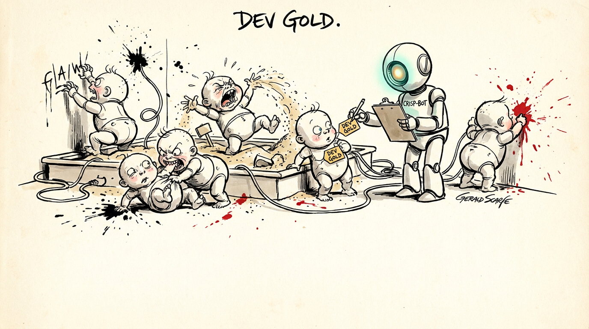

=== ML Feature Engineering

Feature engineering is where models are won or lost. Not in architecture selection, not in hyperparameter tuning — in the quality, relevance, and temporal correctness of the features that reach the training loop. A model trained on leaky features will validate beautifully and fail catastrophically in production. A model trained on stale features will learn patterns that expired months ago. A model trained on features whose definitions shifted mid-training-window will learn incoherent relationships and present them as signal.

Feature pipelines consume Silver directly, not Gold. This is a legitimate architectural bypass, not a governance failure. Features are not analytical answers — they are model inputs. Gold exists to answer business questions: what was revenue last quarter, how many trades settled on time, what is our exposure to a given counterparty. Features exist to represent the state of the world at a specific moment for a specific predictive purpose. The temporal contract is different. Gold cares about reporting-time auditability: what did we publish, and can we reproduce it? Features care about point-in-time correctness: what would the system have known at label-assignment time, with no future information leaking backward?

This distinction is fundamental. A Gold table that reports quarterly revenue includes corrections that arrived after quarter-end — the latest version of truth, suitable for board reporting. A feature representing quarterly revenue for a model predicting customer churn must not include those corrections if the label was assigned before they arrived. The feature must reconstruct the world as it appeared at prediction time, not as it appears now. Row-level bitemporality — `valid_from`/`valid_to` and `system_from`/`system_to` on every feature row — is the mechanism. Silver provides it. Gold, by design, does not.

So the feature pipeline reads Silver. Where does the semantic layer come in?

Not in the consumption path. The feature pipeline does not query through the semantic layer any more than a Spark job queries through a BI tool. It reads tables directly, applies transformations, and writes to the feature store. The semantic layer’s role shifts from mediating the query to mediating discovery. A data scientist looking for features to include in a new model needs to answer questions that are semantic, not technical: What features exist in this domain? What is the grain — per customer per day, per trade per hour, per counterparty per quarter? What is the temporal contract — how far back can I reconstruct features, and at what latency? What was the training cohort for the existing model that uses this feature, and does my cohort overlap?

These are catalog questions. The semantic layer answers them not by routing a SQL query but by publishing metadata: feature descriptions, grain declarations, temporal coverage, upstream lineage, and — critically — the domain context that tells the data scientist whether this feature means what she thinks it means. `customer_lifetime_value` sounds straightforward. Built on a cohort that excluded customers who churned in the first thirty days, it is a time bomb for any model that includes early-stage customers. The feature’s definition is not its formula. The definition includes the cohort, the exclusions, the business decisions baked into its construction. Without that context, the feature will be reused in ways its creators never intended, by people who never knew to ask.

*Pattern: Feature Discovery Through Semantic Layer*

_Context:_ Data scientists and ML engineers need to find, evaluate, and select features for new models from an existing feature store.

_Problem:_ Feature stores accumulate features across teams and domains. Without semantic context, data scientists select features by name, grain, and type — missing cohort restrictions, temporal coverage gaps, and domain-specific exclusions that make a feature inappropriate for their use case. Feature reuse without understanding produces models that validate on paper and fail in production.

_Solution:_ The semantic layer publishes a feature catalog surface: every feature registered with its business definition, grain, temporal coverage (how far back, at what latency), upstream lineage (which Silver tables, which transformations), cohort restrictions (what was included and excluded when the feature was engineered), and domain owner. The catalog is queryable by both humans and agents. The consumption path remains direct — training pipelines read the feature store, not the semantic layer — but the discovery and evaluation path goes through the catalog. No feature is selected without its semantic context being available.

_Example:_ A data scientist searches the catalog for counterparty-related features. She finds `counterparty_avg_settlement_delay_30d` with metadata: grain is per counterparty per day, temporal coverage starts January 2024, upstream source is `silver.settlements`, and a cohort note states "excludes internal transfers and test counterparties." She evaluates the feature for her model, confirms the cohort matches her requirements, and reads it directly from the feature store. The semantic layer mediated her decision, not her query.

_Consequences:_ Maintaining the catalog requires discipline — every feature registration must include semantic metadata, not just a schema definition. Feature teams that skip metadata create features that are technically available but semantically invisible. The catalog becomes another artifact to govern, another surface to keep current. The alternative — features proliferating without context — is worse.

=== Model Training Pipelines

Training pipelines are the industrial consumers of the data platform. They batch-consume Silver and Gold at scale — reading Parquet files into Spark DataFrames, pulling tables into distributed training jobs, materializing datasets for offline evaluation. They do not issue SQL through the semantic layer. They do not ask natural language questions. They run scheduled jobs that ingest, transform, and feed data to training loops. Their consumption pattern is closer to ETL than to analytics.

The semantic layer’s role here is documentation, not mediation. The ML engineer who designs a training pipeline does not query through the semantic layer. But she reads it — or she should. The domain essays, the temporal contracts, the grain declarations — these are the materials she consults before deciding which tables to ingest and how to join them. `silver.trades` joined to `silver.counterparties` sounds obvious until she discovers that trades use execution-time grain while counterparties use daily snapshots, and the join without temporal alignment introduces a subtle selection bias that only manifests in the tails of the distribution. The semantic layer documents these mismatches. The training pipeline ignores the documentation at its own risk.

Training pipelines are a legitimate consumer that the sole-interface commitment does not cover in its strict form. The semantic layer cannot mediate a Spark job reading Parquet files. It can document what those files contain, what their temporal contracts are, and what their domain context is — but it cannot sit in the data path without introducing latency and complexity that training workloads will not tolerate.

The governance mechanism for training is different from the governance mechanism for analytical queries. For analytical queries, governance is architectural: the query routes through the semantic layer, and the semantic layer enforces definitions, access, and context. For training pipelines, governance is contractual: a data contract between the platform team and the ML team specifies which Silver tables are stable interfaces — versioned, documented, with breaking-change notification — and which are internal implementation details subject to change without notice.

Not every Silver table is a training source. Most should not be. The ones that are should be designated explicitly, with a contract that specifies grain, temporal coverage, refresh cadence, schema stability guarantees, and the conditions under which breaking changes are permitted. This is a different kind of governance — slower, more deliberate, less automated than semantic-layer mediation — but it is governance nonetheless. The alternative is ML teams building on whatever Silver table looks right today and discovering six months later that a schema change broke their training pipeline at three in the morning on a Friday.

*Pattern: Training Data Contract*

_Context:_ ML teams consume Silver tables for model training. Platform teams evolve Silver tables as domain models mature.

_Problem:_ Without a contract, ML training pipelines break silently when Silver tables change. A renamed column, a changed grain, a shifted temporal window — any of these can corrupt a training dataset in ways that are not immediately obvious. The model trains successfully on bad data and degrades in production weeks later.

_Solution:_ Designate specific Silver tables as contracted training sources. Each contract specifies: schema (columns, types, nullability), grain (per entity per time period), temporal coverage (start date, refresh cadence, latency), stability tier (stable, evolving, experimental), and breaking-change protocol (notification period, migration support). The contract is not a document a committee reviews — it is **code in the pipeline**, checked on every scan and every commit: a verification agent confirms the schema still matches, the grain still holds, the temporal coverage is unbroken, and raises a witness the moment a change would break a downstream consumer. Silver tables not designated as training sources carry no stability guarantee — ML teams consume them at their own risk. Contract changes follow a versioning protocol: new contract version published, old version maintained for a migration window, then deprecated.

_Example:_ `silver.trades` is designated a Tier 1 contracted training source. Contract specifies: grain is per trade execution, temporal coverage starts January 2023 with daily refresh by 06:00 UTC, schema version 3.2 is stable with a 90-day notification window for breaking changes. The ML team builds a churn model on this table. When the platform team plans to split the table into `silver.spot_trades` and `silver.derivatives_trades`, the contract requires 90 days notice, a migration guide, and a parallel-run period where both old and new tables are available.

_Consequences:_ Contracts add overhead. Every contracted table is a commitment the platform team must maintain. Over-contracting Silver freezes the schema and prevents legitimate refactoring. The balance is selective: contract the tables ML teams actually depend on, not every table in Silver. The contracts are maintained continuously by the verification mesh, not reviewed on a calendar — and when a regulator or a controls function wants a point-in-time attestation, that evidence is parsed on demand out of the continuous record, in whatever form they ask for. The human cadence is a reporting view over the machine's, never the governing loop.

=== There Is No Ungoverned Tier — There Is a Provisional One

The instinct in most architectures — the lawless "raw access, logged but not governed" tier most platforms quietly carve out — is to carve out a zone where you can land anything and reason over it with no semantics attached, because it is *just exploration*. That zone is where the swamp breeds. The metric computed there becomes the number a VP quotes; the number becomes a de-facto governed metric by convention rather than construction; and now it diverges, silently, from every other definition of the same thing.

Dev Gold abolishes the lawless zone and replaces it with a *provisional* one. Any raw, sandbox, external, or exploratory data — an analytics result a scientist is iterating on, a dataset bought from a broker, a scraped feed someone is playing with — is treated as Dev Gold the moment it lands: it is **given AI-authored provisional semantics and glued to the wider ontology**. The data scientist does not have to stop and write a glossary entry; an agent reads the data, drafts definitions, grain, and the candidate morphisms that connect it to existing concepts, and stamps the whole thing *provisional, unvalidated, Dev Gold*. The scientist plays freely — but over data that is described, catalogued, and located in the ontology from its first minute, not after it has already leaked into a board deck.

This is the same move as everything else in the book, applied one layer lower: where a human has not authored semantics, AI authors them provisionally rather than leaving a hole. The difference between Dev Gold and governed Gold is not *whether* it has semantics — both have them — but their *status*: provisional and machine-drafted versus validated and promoted. There is no tier without semantics. There is only the tier whose semantics have not yet earned trust.

*Pattern: Dev Gold*

_Context:_ Raw, sandbox, external, or exploratory data enters the platform for data science — fast, iterative, most of it destined to be discarded, some of it destined to become a feature, a model, or a production table.

_Problem:_ An ungoverned exploration zone is where the data swamp re-forms below the query engine: undocumented datasets accrete, a useful result escapes into production by convention, and it diverges from governed definitions with no record of the choices that produced it.

_Solution:_ Treat all such data as Dev Gold: on landing, an AI curator authors *provisional* semantics — definitions, grain, lineage, and candidate morphisms gluing it to the existing ontology — and marks it unvalidated. It is catalogued and located in the ontology from minute one, queryable through the semantic layer like anything else, but stamped provisional so no production consumer or agent mistakes it for governed truth. Promotion to governed status is a defined, lightweight path; until then it lives, fully described, in the Dev tier.

_Example:_ A scientist lands a purchased market-sentiment feed. The curator drafts: grain (per instrument per hour), provisional definition of each score, candidate bridge to `dim_instrument` on ticker, and flags two columns it cannot interpret. Within minutes she is exploring it joined to governed trading data — through the semantic layer, with the provisional status visible on every result — instead of in a lawless notebook nobody can later reconstruct.

_Consequences:_ AI-drafted provisional semantics are sometimes wrong — but they are *visibly provisional and catalogued*, which is strictly better than absent-and-lawless, and they are corrected by the same continuous, agentic review that governs everything else. The cost is the curator infrastructure and the discipline of never exempting "just exploration" from it. The payoff is that the swamp has nowhere left to form.

=== Notebooks and Sandboxes Run on the Same Ontology

With Dev Gold in place, the notebook stops being the exception that kills the sole-interface commitment and becomes its proving ground. A data scientist in a notebook does not write naked SQL to the engine. She composes — governed measures and dimensions as building blocks, Dev Gold provisional concepts where she is exploring new material — through the semantic layer's API, with composition expressive enough that she never needs to file a ticket to ask a new question. What she builds carries the provenance of its ingredients: *built from governed measures X and Y, joined to Dev Gold feed Z, not validated.* Her sandbox is not outside the ontology; it is a provisional region of it.

Promotion is the governance mechanism, and it must be continuous, not a committee. A sandbox result that proves useful enters a defined path — agentic review across the usual lenses, in-usage validation, documentation the agent largely drafts — and graduates from provisional to governed. The promotion is fast by design, because a slow promotion path is itself the thing that drives scientists back to lawless bypasses. If promotion takes two weeks, nobody promotes and the commitment dies in the notebook. If it takes hours, it becomes the natural way to ship.

*Pattern: Sandbox-to-Governed Promotion*

_Context:_ A provisional result built in a notebook over governed building blocks and Dev Gold concepts proves valuable and is heading toward production use.

_Problem:_ Without a fast promotion path, exploratory definitions either ossify as ungoverned shadow metrics or stall in a review queue while the scientist routes around governance to ship on time.

_Solution:_ A continuous, mostly-agentic promotion path: a panel of review agents interrogates the candidate definition (exclusions, provenance, adversarial cases), in-usage signals confirm it behaves, the agent drafts the documentation, and a human adjudicates only what the agents flag. On promotion it becomes a governed measure inheriting from the Tier 1 glossary; until then it stays provisional and never appears in production results. Hours, not weeks.

_Example:_ The settlement-failure-versus-onboarding-recency measure a scientist composed in her notebook clears agentic review (one lens flags the arbitrary 90-day threshold for human sign-off), validates against recent outcomes, and is promoted with an auto-drafted definition the operations lead approves in one sitting. The next agent that asks the question finds it governed.

_Consequences:_ The promotion path is only as good as its speed and its agentic reviewers; under-resource either and scientists revert to bypasses. The arbitration of genuinely-ambiguous calls (the 90-day threshold) is irreducibly human — but it is one flagged decision, not a backlog to rubber-stamp.

=== Pipelines Follow the Semantics, Not the Other Way Around

There is one more inversion, and it closes the gap between authoring meaning and authoring movement. In most shops the DAG comes first — engineers write the ETL, and semantics, if they arrive at all, are bolted on after as documentation. That ordering is why documentation drifts: it was always downstream of the thing it described. Turn it around. **Define the concept, its grain, and its lineage in the semantic layer, and let the pipeline follow** — the transformation that materialises a Gold surface is generated from, and kept consistent with, the semantic definition that specifies it. Authoring a measure and authoring the DAG that computes it become one act, co-drafted by AI: the scientist or architect declares what the thing *means* and where it comes from, and the agent proposes the pipeline that produces it, wired to the same definition the consumer will read.

The pipeline cannot diverge from the semantics because the semantics generated the pipeline; a change to the definition regenerates the transformation, and the verification mesh confirms the result still matches the contract. The data scientist's promoted Dev Gold concept does not then require a separate engineering project to productionise — its promotion *is* the generation of its pipeline.

*Pattern: Semantic-Driven Pipeline Authoring*

_Context:_ A new governed Gold surface (often a promoted Dev Gold concept) needs a production pipeline to materialise it.

_Problem:_ When pipelines are authored independently of semantics, the two drift; the ETL computes one thing and the definition claims another, and the divergence surfaces as a wrong number months later.

_Solution:_ Author the semantics first — concept, grain, lineage, definition — and generate the pipeline from it, AI co-drafting both so they are one artifact. A definition change regenerates the transformation; the verification mesh confirms the materialised output matches the contract. Promotion of a Dev Gold concept generates its production pipeline as a step, not a separate project.

_Example:_ The promoted settlement-failure measure's definition specifies its source tables, grain, and exclusion rules; the agent generates the dbt model that computes it, wired to the same definition the semantic layer exposes. Editing the exclusion rule later regenerates the model and re-verifies the output — no hand-edit of SQL that the definition then contradicts.

_Consequences:_ Generated pipelines need review like any generated code, and complex transformations may exceed what generation handles cleanly — those stay hand-authored but still bound to the semantic definition by the verification mesh. The win is that the default path makes drift between pipeline and meaning structurally impossible.

=== The Objection, and the Point

"Data science needs freedom; you cannot govern exploration." Half right, and the half that is wrong is fatal. Scientists need freedom to *explore* — to land anything, join anything, test anything, fail fast. They do not need, and the organisation cannot survive, the freedom to *ship ungoverned definitions into production by osmosis*. Dev Gold gives the first without the second: explore freely over data that is provisionally described and catalogued from minute one, and promote through a path fast enough that nobody wants to route around it. The freedom is real; the lawless zone is gone.

That is the whole point of this chapter, and it is the last load-bearing piece of the thesis. Governance by construction is not a property of the Gold layer. It is a property of every layer, every consumer, every exploratory notebook and purchased feed and feature store on the platform. The swamp does not get to re-form one layer down — because there is no layer down that is exempt from having semantics, even if those semantics are, for now, machine-drafted and provisional.

== The Living Colimit

Everything to this point is architecture you can build with today's tools and today's discipline. This chapter is about what those parts become when you assemble them into one system and let it run — and it is the most ambitious claim in the book, stated plainly because it is the thing worth building. The colimit is a verb. Run it continuously and it stops being a diagram you draw and becomes an organism you operate: a semantic model of the whole enterprise that verifies itself, repairs itself locally, reports its own health, and stays correct as the business moves under it. A *living* colimit. The organisation that has one has agents that reason over its entire institutional memory and can be trusted to. The organisation that does not has agents that guess. That gap is not a feature difference. It is a category difference, and it is open to be built — this year.

=== What the Living Colimit Is

Three things you already have, wired into one loop.

[#fig-living-colimit-mesh]
.The living colimit: verification agents and a coordinator continuously re-check the bridges; a broken span raises a witness, and colimit-health is watched like uptime.
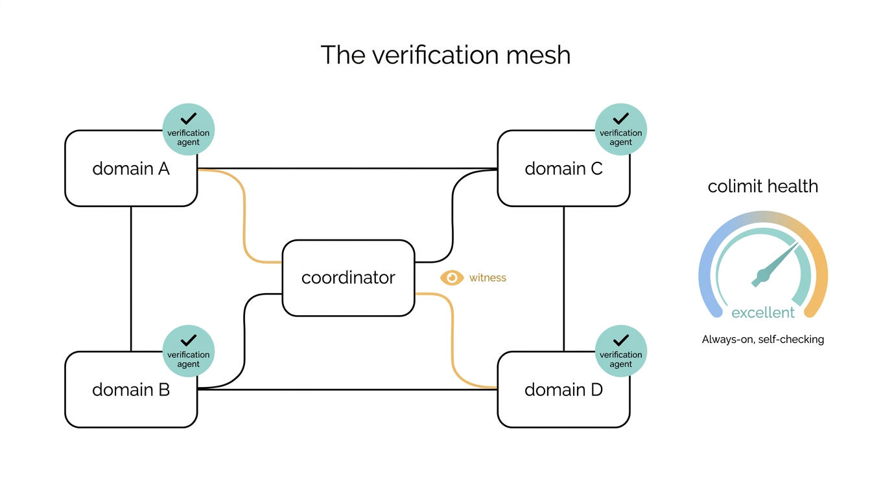

The **domains and bridges** are the body: each domain its own catalogued ontology, each bridge an explicit, dated span recording what maps, what is lost, what is partial. The **verification mesh** — Continuous Morphism Verification, the pattern in "Building with AI" — is the nervous system: a standing set of per-domain agents that, on every scan and on every change, re-check that each bridge still holds against live data, and a coordinator that runs the cross-domain commutativity checks no single agent can. And **colimit-health** is the vital sign: a live, rolled-up measure of how connected, honest, fresh, and consistent the whole glued structure is, watched the way you watch uptime, alerting when it degrades.

Run those together and the system has a property no hand-maintained model ever had: when meaning breaks, it says so, *locally, with a witness.* A regulator reclassifies an entity overnight; the domain agent catches the schema change on its scan; the coordinator re-runs the commutativity check for the affected concept; one routing now disagrees with another; a witness is raised on that single span and routed to the one human who owns it. By morning the health view shows one amber span with a named cause — not a green dashboard hiding a silent break, and not a surprise found at an audit a season later. Meaning has become a monitored, measured, self-defending quantity. That is the living colimit.

=== The Architecture, As a Thing You Build

The mesh is real infrastructure, and the fair objection — *a standing multi-agent verification system is itself a large, failure-prone thing that needs its own operations* — is true, and the answer is to treat it as exactly that: load-bearing infrastructure with its own observability, not magic. Designed, not waved at:

* **Per-domain verification agents.** Each owns the bridges incident to its domain and runs the five within-reach checks every scan and on every schema/ontology change (CI-for-meaning, triggered like CI-for-code): mapped fields still exist, keys still join at the documented cardinality, distributions have not shifted in a way that implies a changed definition, no unaccounted-for new attribute, documented losses still the actual losses.
* **The coordinator.** Runs the sixth, inherently cross-domain check — commutativity, the colimit's universal property used as the test — assembles the witness when it fails, maintains the global health vector, and routes exceptions to owners. It is the most load-bearing component, so it is monitored like any other critical service: its own latency, queue depth, scan coverage, and false-positive rate are dashboards, and it has an on-call.
* **Witness-driven repair.** A failure does not emit "the model is broken." It emits *the concept and the two paths that disagree* — the smallest possible repair surface. Trivial drift auto-repairs; genuine judgment routes to one human. Humans do adjudication; the mesh does verification. The inverse of the old world, where humans rubber-stamped attestations and a steward caste did the translation.
* **Colimit-health as a live eval.** Not a deliverable that reaches 100% and ships, but a metric you operate against forever: morphism completeness, bridge honesty, concept coverage, staleness, commutativity. You ship at 80% health on the seven domains that matter this quarter and raise it continuously, the way a model team operates against an eval suite rather than waiting for a perfect score.

=== Shipping It This Year

The reason this is buildable now and not a someday-vision is that it composes from parts already in production, and it delivers value at every intermediate step — finishability, made operational.

* *First — a few domains, the bridges between them, nightly verification.* Stand up the colimit over the five-to-seven domains that carry the questions you actually ask. Write the bridges. Run the mesh nightly. You now have a cross-domain semantic surface and a health number. This alone is ahead of almost every organisation alive.
* *Second — continuous and on-change triggers, and the explore.* Move verification from nightly to on-commit (CI-for-meaning in earnest), and expose the glued ontology as the live cross-domain explore of "Exploring the Glued Ontology." Now the thing is queryable *and* self-checking.
* *Third — the autonomous curation loop.* The mesh stops only flagging and starts proposing: drafting the morphism that closes a detected gap, the provisional semantics for a new Dev Gold feed, the repair for a drifted bridge — humans adjudicating, agents doing the work. The colimit now grows and heals largely on its own.

=== Scale: A Build Plan

Commutativity checking is combinatorial in the number of paths, and the sweet spot is five to thirty domains — which is most organisations, and exactly where the value is. Beyond thirty densely-connected domains, this is not a hand-wave to skip; it is a build decision with two real options. **Hierarchical composition**: cluster tightly-related domains into sub-colimits, treat each as a single object, and verify between clusters at a higher level — colimits of colimits, bounding path length, the same construction recursively. Or **accept and declare** that distant domain pairs are never directly verified, and say so on the health view rather than implying coverage you do not have. Both are engineering; neither is a fudge. The 5–30 regime ships this year; the hierarchical regime is the next year's work, and it is tractable because the unit of composition does not change — only the level you apply it at.

=== The Formal Spine

This is not architecture-by-vibes dressed in category-theory vocabulary; the construction has a proof. The companion paper establishes the three results the living colimit relies on: that **consistency equals commutativity** — the check the mesh runs is the exact condition under which the integration is sound, and a failure returns a computable witness; that the model functor carries the **gluing of schemas to the gluing of instances**, so a correct composition of definitions is a correct composition of data, under a governance rule a practitioner can actually enforce (the sharing rule from "Multi-Domain Composition"); and **finishability** — every partial assembly embeds faithfully in the whole, so the seven-domain colimit you ship this quarter is correct now and is never invalidated by the domains you glue on later. The mesh is the operational form of those theorems. The math says the thing is sound; this chapter says it is buildable; the Playbook says how to start.

=== Why It Is Worth Building

Reframe what you would own. Not "a data warehouse" — the organisation's memory, verified. Not "metadata" — its vocabulary, kept current by machines. Not "a chatbot" — a reasoning layer that can be trusted across the whole business because the meaning underneath it is continuously checked rather than periodically attested. That is a category of system the industry has named in pieces and built in none. The parts are commodity now: the models, the protocols, the medallion substrate, the semantic layer. What is scarce is the assembly and the will. Whoever assembles it first — inside an enterprise, or as the company that sells it to enterprises — will have agents that reason while their competitors have agents that guess. Build it, or watch someone else build it first. The next chapter is how you start, Monday.

== The Playbook

Most data strategy documents are written to be approved. This one is written to be executed.

=== The Diagnostic

Before you invest a dollar or hire a single person, answer four questions. You do not need a consultant, a maturity assessment framework, or an eight-week engagement. You need candour.

*Can a new hire find and understand your data in their first week without asking anyone?*

I do not mean "can they log into the warehouse." I mean: can they discover what tables exist, what the columns mean, how the data was calculated, and what caveats apply —- without sending a Slack message to the one person who knows? In most organizations the answer is no, and everyone knows it is no, and nobody treats this as the emergency it is.

*Can an AI agent query your data and get the right answer on the first try?*

Not after three rounds of prompt engineering. Not after someone manually corrects the SQL it generated. On the first try. If you have not tested this, test it today. Point an AI at your most important Gold table and ask it a question that a board member would ask. Watch what happens. You will learn more about the state of your data architecture in ten minutes than in any strategy review.

*Do you have one definition of "exposure" or forty?*

Pick any business-critical term —- exposure, volume, active users, net position. Now search your organization for every place that term appears: warehouse tables, dashboard titles, Tableau calculated fields, Excel spreadsheets, Confluence pages, Slack threads. Count the definitions. If the number is greater than one, you have a semantic problem. If the number is greater than ten, you have a semantic crisis.

*If your best analyst leaves tomorrow, how much institutional knowledge walks out the door?*

Every data team has a person —- sometimes two or three —- who holds the entire interpretive layer in their head. They know that the "volume" column in one table means something different from the "volume" column in another. They know which dashboard is trustworthy and which one is not. They know the history: why a field was renamed, when a source was deprecated, what the workaround is for the data that arrives late on Mondays. That person is your semantic layer. And they are a single point of failure. As a team lead put it to me recently: "If they leave, the knowledge gets lost. That’s still not really acceptable."

He is right. It is not acceptable. But it is the norm. Your semantic layer is a person, and that person has a resignation letter somewhere in their drafts folder.

These four questions are simple. The industry has over-complicated the diagnostic step to the point where assessing readiness has become a substitute for achieving it. Organizations routinely spend six months on a data maturity assessment and then file the results in a SharePoint folder. The assessment became the deliverable instead of the catalyst.

Gartner has a multi-dimension assessment. McKinsey has a maturity model with five levels. Deloitte has a governance roadmap with six areas. Microsoft has an AI readiness checklist. All of them take four to eight weeks to complete and produce a slide deck that says, in eighty pages, what four questions say in ten minutes: your data is not machine-readable, your definitions are scattered, and your knowledge is trapped in people’s heads.

Only 16% of software engineering leaders believe their delivery processes are ready for AI. Fewer than 25% of large enterprises have scaled AI beyond pilots. Seventy percent of enterprise AI projects fail to reach production. The gap is not technology. It is readiness —- the answer to whether your data can survive contact with a machine that cannot squint.

If your organization has fewer than fifty employees, fewer than ten data sources, and no AI ambitions, this playbook is overkill. Use a spreadsheet. When you outgrow the spreadsheet, come back. For everyone else: the four questions are your starting diagnostic, and the rest of this essay is your response.

Most organizations reading this are not starting from a green field. You have forty dashboards, five versions of every table, no glossary, and a warehouse that grew by accretion over years. Resist the temptation to boil the ocean. The triage protocol is simple:

* Identify the five most-queried Gold tables.
* Define the terms they use. Get stakeholder sign-off on those definitions.
* Build semantic access for those tables first —- descriptions, relationships, freshness signals.
* Let the rest of the estate rot gracefully while you build the canonical layer outward.

You do not need to fix the entire house before you can live in one clean room. Start with the room people actually use. Five well-defined, well-governed Gold tables with a working semantic layer will change more behavior than five hundred undocumented tables in a catalog nobody reads.

=== Investment 1: Vocabulary

Everything else —- the semantic layer, the agent infrastructure, conversational analytics, agentic intelligence —- depends on whether your definitions are right. If the vocabulary is wrong, the semantic layer maps concepts to the wrong data. If the semantic layer is wrong, the AI reasons over the wrong facts. If the AI reasons over the wrong facts, you have automated confusion. Vocabulary first. Everything else second.

Start with your top twenty business concepts. Not two hundred. Twenty. Revenue, volume, net position, active users, trade count —- whatever terms your board uses when they ask questions about the business. Define each one. Write down what it means, how it is calculated, where the source data comes from, and what caveats apply. Get a business stakeholder to read each definition and confirm: "Yes, that is what I mean when I say that word."

Then put those definitions in a machine-readable format. A CSV works. A YAML file works. Format matters less than two properties: the definitions must be readable by both humans and machines, and they must be governed —- one source, one owner, one place to change them.

This is Tier 1 of a three-tier vocabulary. A glossary (Tier 1) governs schema descriptions in the transformation tool (Tier 2), which govern semantic layer field definitions (Tier 3). Upstream always wins. If the glossary says "trading volume" means X, then the schema describes it as X, and the semantic layer presents it as X. No independent definitions at lower tiers. No analyst in a dashboard deciding that "volume" means something different.

==== The Workshop Method

Conventional glossary projects are six-month waterfall exercises: working groups, circulated spreadsheets, definitions filled in reluctantly between people’s actual jobs. Six months later, a document that was out of date three months ago.

Record a conversation instead —- an actual one, not a structured interview with a template. Ask them: "Walk me through what you look at every morning. What does this number mean? Where does it come from? What do you check when it looks wrong?" Let them talk. Record it. Then use AI to extract and structure the definitions from the recording.

I have done this multiple times. One session produced better results than six months of traditional documentation, because domain experts carry enormous tacit knowledge they would never think to write down in a spreadsheet. They know the edge cases, the historical context, the unwritten rules. In a conversation, that knowledge surfaces naturally. In a spreadsheet, it stays locked in their heads.

As one stakeholder told me: "We need his subject matter expertise —- definitions against these terms, really long detailed things that are tutorial for us. Then the AI will understand the data." He was right about the mechanism and right about the purpose. Definitions are not documentation. They are AI infrastructure.

A subtlety: the definitions AI needs are tutorials, not the crisp one-liners that populate a traditional data dictionary. When a domain expert explains what "settlement" means, they do not give you a ten-word definition. They tell you about the process, the edge cases, the timing, the exceptions. They tell you that settlement usually happens T+2 but sometimes does not, and when it does not, here is what that means. That tutorial-quality context is exactly what an AI agent needs. A one-liner tells the agent what the word means. A tutorial tells the agent how to think about it. Traditional data dictionaries give you the first. The workshop method gives you both.

==== Quality Standards

ISO 11179 Part 4 gives you the formal quality bar: precise, unambiguous, non-circular, stated in natural language, domain-scoped. Rigorous, well-designed, and in existence since 1994. Almost nobody follows it, because following it manually is prohibitively expensive.

AI changes the economics. Automated definition review on every commit —- not quarterly —- makes the standard followable for the first time.

The quality checklist for every definition:

* Is it precise? Does it state exactly what the term means, with no room for interpretation?
* Is it unambiguous? Could two reasonable people read it and disagree about what it means?
* Is it non-circular? Does it avoid defining the term using the term itself?
* Is it stated in natural language? Can a non-technical stakeholder understand it?
* Is it domain-scoped? Does it specify the context in which the definition applies?
* Does it state the calculation method? If the term is a metric, how is it calculated?
* Does it state the source? Where does the underlying data come from?

If a definition fails any of these checks, it is not ready for production. A definition that is ambiguous will produce ambiguous results —- in dashboards, in reports, and especially in AI. This is the same discipline that prevents untested code from reaching production, not perfectionism.

==== Timeline and Effort

Measured in days to weeks, not months.

* *Week 1-2*: Identify your top 20 terms. Schedule workshops with domain experts. Record the conversations. Use AI to extract draft definitions.
* *Week 2-3*: Review and refine definitions with stakeholders. Apply the quality checklist. Resolve disagreements (there will be disagreements —- this is the most valuable part of the process).
* *Week 3-4*: Publish the glossary in a machine-readable format. Establish the governance rule: this is Tier 1, it governs everything downstream.

At traditional organizations, dedicated teams of five or more information architects took two years to achieve comparable coverage. With AI augmentation, the same work compresses to weeks. The velocity difference is structural, not incremental.

==== The Domain Essay

Glossary and quality checks are necessary but not sufficient. Each significant dataset should also carry a domain essay —- six hundred to fifteen hundred words, written by the people who run the process the data describes, not by the data team or a technical writer reading Confluence pages.

Domain essays cover provenance, conventions, edge cases, slang, history, and craft. They are anchored on structured metadata —- datatype, key, refresh cadence, lineage, ownership —- but the semantic weight lives in the prose. A one-line definition tells a consumer what a column means. An essay tells them why the numbers look wrong on Mondays and are actually correct.

An agent consuming a Gold table with a glossary but no domain essay can answer questions about individual fields. Give it the domain essay and it reasons about the dataset as a whole —- purpose, grain, relationship to the business process it models, and the tacit conventions that separate a right answer from a merely plausible one.

Domain essays are treated as code: versioned, dated, signed by named authors and reviewers, with explicit references to the data assets they describe. An essay reviewed in the last twelve months is treated differently from one untouched for three years, and that difference is visible to every consumer. Decay is surfaced, not hidden —- an unmaintained essay teaches the agent confidently wrong context, which is worse than no essay at all.

One workshop with a domain expert produces the raw material. One editing pass structures it. Six hundred to fifteen hundred words that do more for agentic performance and onboarding velocity than any amount of structured metadata alone.

=== Investment 2: The Semantic Layer

Vocabulary tells you what words mean. A semantic layer tells AI where to find the data those words refer to —- the routing intelligence that connects a question in plain language to the right table, the right column, the right calculation.

Without one, every query is an act of archaeology. Which table to hit, which columns to select, which joins to make, which filters to apply, which version of the data is current —- all of this lives in someone’s head, and that someone is on holiday. A semantic layer externalizes the filing system: navigational knowledge made explicit, machine-readable, and governed. It also makes your data queryable by any interface —- dashboards, SQL, natural language, agent protocols —- through a single set of definitions.

==== What the Semantic Layer Must Include

A semantic layer is not a list of field descriptions. It is a complete interpretive overlay on your data:

* *Field definitions*: What each field means, linked to the Tier 1 glossary —- not a separate definition, but the same one, inherited from the vocabulary.
* *Relationships between concepts*: Revenue by product, volume by trading pair, users by region. The semantic layer must encode not just what individual fields mean, but how they relate to each other —- what dimensions a metric can be sliced by, what hierarchies exist, what navigational paths are valid.
* *Default assumptions*: When someone asks for "revenue," do they mean gross or net? When they say "this quarter," do they mean calendar quarter or fiscal quarter? The semantic layer should encode the defaults so that AI does not have to guess.
* *Freshness signals*: When was this data last updated? Is it current? Is it stale? If the data is three days old, the agent should know that before it answers a question, not after.
* *Navigational heuristics*: If someone asks a question that touches multiple tables, which path should the query take? The semantic layer should encode the preferred navigation so that AI does not burn tokens reasoning about join strategies.

Architecture: Glossary (Tier 1) governs dbt schema.yml (Tier 2) governs the semantic layer —- LookML, dbt Semantic Layer, whatever tool you use (Tier 3). Upstream always wins. The semantic layer does not invent definitions. It inherits them.

This works with BigQuery and Looker and Claude. It works with Snowflake and dbt Semantic Layer and GPT. It works with Databricks and Unity Catalog and Gemini. Tools change. Architecture does not.

==== Your Own House Nomenclature

A practical decision trips up many organizations: whose language do you use? Source systems have their own field names. Vendors have their own terminology. Business stakeholders have their own vocabulary. Often three different languages for the same concepts.

Create your own. Your own house nomenclature —- terminology appropriate for your stakeholders, your auditors, and your AI. You do not go back to the vendor and tell them to change their field names. You build an interpretive overlay: the semantic layer maps from the vendor’s language to your language, from the source system’s language to the business’s language. The mapping is explicit, governed, and machine-readable.

This is what separates a semantic layer from a renaming exercise. You are not renaming columns. You are building an interpretive layer that translates between the language of your sources and the language of your business. Unlike a human translator, it does not go on holiday and it does not forget the edge cases.

==== The Forcing Function

Even if you never build a single AI agent, the semantic layer matters. Without one, Gold becomes a swamp.

Wall Street demonstrates this with depressing regularity. People denormalize into Gold, skip the catalog, keep adding tables, replicate without governance. Three years later, Gold is an unnavigable mess of overlapping, contradictory tables that nobody trusts. The builders have left. The documentation is out of date. The "Gold layer" is just a bronze layer with better table names.

A semantic layer prevents this by construction. When every Gold table must ship with its semantic definition —- fields described, relationships mapped, freshness signals configured —- building one without is incomplete work. Shipping code without tests. You can do it, but the architecture should make it feel wrong.

A major organization reported an 80% reduction in analytics costs after implementing a semantic layer through dbt. But the cost savings are not the primary argument. Without a semantic layer, your AI is blind. With one, your AI reasons. In the next few years, that distinction will be a survival discussion.

==== The Defensive and Offensive Case

Different stakeholders hear different parts of the argument.

Defensive: regulators want authoritative data sources, lineage, definitions. What are your sources? Where is the data stored? Who owns it? Do you have a data dictionary? A semantic layer answers all of this by construction —- your audit trail, your compliance infrastructure, your answer to the examiner who asks "how do you know this number is right?"

Offensive: the same infrastructure that satisfies the regulator enables AI. Definitions that prove to an auditor your numbers are correct also tell an AI agent how to query your data accurately. Build once, serve both. Defense and offense from the same investment.

At financial institutions, managing semantic layers for regulatory purposes is a recurring, painful requirement —- months of work, tacit knowledge extraction, manual lineage mapping. AI compresses what took months into weeks. The defensive case alone justifies the investment. The offensive case makes it urgent.

==== Cross-Domain Composition

Cross-domain composition —- questions spanning Trading and Finance, or Custody and Treasury —- is where most semantic layers fail. "What is our net exposure on settled trades this quarter?" touches at least two domains. Without explicit design for composition, each domain becomes a silo with its own semantic layer, and cross-domain questions fall into the gaps between them. Composition requires explicit domain bridges, governed polysemy resolution (the same term meaning different things in different domains, with the resolution made explicit rather than left to guesswork), and privilege-based domain expansion (an agent authorized for Trading data should not silently pull from Finance without the right access). Design the semantic layer for composition from day one. Bolting on cross-domain capability later means rearchitecting the layer you already built.

==== Three Query Modes as First-Class Vocabulary

Three temporal query modes belong in the semantic layer as first-class concepts —- named, documented, always-available —- not hidden parameters or advanced features for the few analysts who understand bitemporality.

*As-of-now over current-truth*: the warehouse’s best current reconstruction of the world. "What is our trading volume this quarter?" reflects every correction, every late arrival, every reclassification processed to date.

*As-of-valid-time over current-truth*: a historical question answered with everything the warehouse now knows. "What was our exposure on March 15?" incorporates corrections that arrived after March 15 —- the best answer the warehouse can give today about what was true then.

*As-of-report-time*: what was published at a specific moment. "What did we report to the regulator on March 31?" is not today’s best reconstruction. It is the exact number published, from the data as it stood at that moment, before any corrections arrived. Auditors, regulators, and reconciliation processes depend on this mode. It is what makes the entire temporal architecture trustworthy.

All three are first-class —- surfaced in documentation, available to agents without ambiguity. An agent that does not know which mode it is operating in cannot reason about temporal claims. An agent that receives the mode as part of the query contract reasons correctly about what its answer is conditioned on.

Most semantic layer implementations today expose only the first mode. Some expose the first two. Almost none expose the third as a first-class concept. This is an architectural gap, not a tooling limitation. Name the modes. Expose them. Make them part of the contract.

==== The Only Interface —- No Power Users

Direct SQL access to Silver or Gold is the core anti-pattern. No power users with bypass privileges. No privileged tier of senior analysts trusted enough to query the database directly. The semantic layer is the only interface between data and consumer —- the hardest commitment in this playbook, and the one that makes every other commitment enforceable.

Every bypass fragments the architecture. A senior analyst writing direct SQL against Silver makes choices —- joins, filters, temporal assumptions —- that the semantic layer makes explicit and governed. The analyst makes them silently. Six months later, a junior colleague trying to reproduce the number cannot, because the analyst has left and the notebook lived on a laptop. This is not a theoretical risk. It is the dominant failure mode of every data programme that grants power-user SQL access for productivity reasons.

Exactly two exceptions — and note what is *not* on the list:

* *Debugging the data substrate itself*: investigating a pipeline failure, tracing a data-quality incident, reconciling a discrepancy that the semantic layer cannot itself diagnose. This is the data engineering team working on the infrastructure they maintain.
* *Performance investigation*: examining query plans, profiling materialization costs, understanding why a particular path is slow. This is operations work, not analytical work.

What is *not* an exception is exploratory data science — the obvious candidate, and the one most architectures wave through as "raw access." It does not need a bypass, because Dev Gold gives it a governed home (see "The Sandpit"): exploratory and external data is landed with provisional, AI-authored semantics and reasoned over *through* the semantic layer, not around it. The early-stage feature scientist is not below the layer; she is in its Dev tier. Removing this from the exception list is the point — the lawless exploration zone was never a necessary freedom, only an ungoverned habit.

Both remaining exceptions are operations by the people who build the architecture, on the substrate they are responsible for, in service of work that will eventually surface through the semantic layer. They do not produce metrics that enter circulation. They are named, scoped, and reviewed. The moment they are unnamed, the only-interface commitment is dead.

==== The Extension Process

"Add it to the semantic layer" must be an intake that returns in days, not quarters. This is the operational precondition for the only-interface commitment to survive contact with reality.

If extending the semantic layer takes longer than building a workaround, workarounds accumulate —- quietly. An analyst builds a direct query. A stakeholder gets a number from a spreadsheet. A team stands up a side pipeline. Each workaround is individually rational. In aggregate, they dissolve the semantic layer into one interface among several, and the architecture loses the single property that makes it a system.

Turn around legitimate extension requests in days, not quarters.

When a stakeholder needs a metric the layer does not yet serve, how long does it take to get it in? If the answer is "next quarter," the layer will be bypassed this week. If the answer is "this week," the layer earns its status. The only-interface commitment and the fast-intake commitment are the same commitment.

==== Timeline and Effort

* *Month 1*: Map your top 20 glossary terms to the Gold tables that contain them. Write the dbt schema descriptions. Build the semantic layer definitions for those tables.
* *Month 2-3*: Expand coverage to the next 50 terms. Establish the governance pipeline: glossary change triggers schema change triggers semantic layer update.
* *Ongoing*: Every new Gold surface — whether a materialized table or a Silver-as-Gold view — ships with its semantic layer definition. No exceptions. This is a practice, not a project with a completion date.

One to two architects, embedded in the engineering pipeline, augmented by AI.

=== Investment 3: Agent Infrastructure

Once vocabulary exists and the semantic layer is built, you can give AI governed access to your data. Not before. An AI agent querying ungoverned data through a nonexistent semantic layer is automated guessing, not conversational analytics.

Agent infrastructure sits between AI and your data, mediating every interaction through the semantic layer. AI never queries the database directly. Every agent query goes through the semantic layer, which enforces definitions, applies governance, and provides context.

==== What Agent Infrastructure Looks Like

Protocols —- MCP, function calling, whatever comes next —- are implementation details. The design pattern is stable: governed consumption interfaces, not SQL proxies. The agent asks a question, the semantic layer routes it, the answer comes back with provenance.

Agent pre-flight is the critical capability. Before answering any question, the agent should:

* Read the quality signals for the relevant data. Is the data fresh? Has it passed its quality checks? Are there known issues?
* Check freshness. When was this table last updated? If the answer is three days ago, the agent should say: "This data is three days old. The answer may not reflect recent changes."
* Verify access. Does the user have permission to see this data? Are there row-level security rules that apply?
* Check for caveats. Are there known limitations, exclusions, or edge cases that affect the answer?

Epistemic honesty, built into architecture. A chatbot gives you an answer with the serene confidence of a system that has no concept of doubt. An agent gives you an answer and tells you what it does not know. The difference between confidence and trustworthiness is the difference between a demo and a system.

==== The Maturity Ladder

Stage 1 is conversational analytics: a human asks a question, the agent answers from governed Gold through the semantic layer. Most organizations that claim to be "doing AI" have not achieved even this.

Stage 2 is agentic intelligence: agents that monitor data autonomously, detect anomalies, generate insights without being asked. This requires richer semantic infrastructure —- relationships, hierarchies, domain heuristics, navigational context —- and only works when Stage 1 is stable.

Do not skip stages. Organizations that build autonomous agents on ungoverned data get the same result every time: the agent hallucinates with confidence, stakeholders lose trust, the project is killed.

Nail phase one before the exciting things; the exciting things depend on the foundation being solid. Fuel before vehicle.

A related discipline: gathering requirements for AI capabilities. The instinct is to describe workflows —- "I want a tool that does X, then Y, then Z." The right way is to specify vocabulary: what data elements do you need, what do they mean, how are they related? When I redirected a sales team from describing workflows to specifying field names and their meanings, the conversation shifted from vague to precise in minutes. If you can name the fields and define them, the AI can figure out the workflow. If you cannot name the fields, no amount of workflow description will help.

==== The Warehouse as Memory

The architectural endpoint is to move beyond RAG and make the warehouse itself the memory. RAG treats documents as the knowledge base, but structured, governed, semantically rich Gold data is a far more powerful knowledge base than any document collection. When an agent reasons over your Gold tables through the semantic layer, it has access to the company’s actual operational knowledge, not just documents about that knowledge. The warehouse becomes the memory. The semantic layer becomes the interpretive framework. The agent becomes the interface.

==== Token Economics

Token economics makes the case in dollars. Flat Gold tables with a semantic layer minimize token consumption —- the data is already denormalized, the semantic layer tells the agent exactly which fields to query. Physical star schemas burn tokens on join reasoning. Every join is a decision the agent must make, and every decision consumes tokens. Five dimension tables means five joins reasoned about before the agent can even begin answering. At scale, that reasoning costs serious money.

Flat Gold plus semantic layer is the cheapest to query. When richer dimensional navigation is needed, Silver-as-Gold views through the semantic layer offer the same governance without maintaining separate denormalized tables for every question.

Gold operates in two modes. Flat materialized tables — the fast default for question-driven analytics, ideal for agents and dashboards. And Silver-as-Gold views — the semantic layer exposing Silver’s domain model directly, providing dimensional navigation without physical denormalization. Both modes are governed by the same vocabulary, the same ontology, the same morphisms. The choice between them is a materialization decision driven by the consumption pattern, not a theological position. Design direction runs backwards from the ontology: the colimit of domain concepts tells you what relationships exist; the business question tells you which slice to materialize; the Gold surface is the last step, not the first.

==== Timeline and Effort

* *Month 1-2*: Build the protocol layer. Implement governed consumption interfaces over your top Gold tables. Deploy agent pre-flight checks (freshness, quality, access).
* *Month 3-6*: Expand coverage. Add more Gold tables to the agent’s accessible surface. Implement conversational analytics for your first stakeholder group.
* *Month 6-12*: Begin building toward agentic capabilities. Autonomous monitoring, anomaly detection, proactive insights. Only after Stage 1 is stable.

Two to three people focused on conversational and agentic infrastructure, supported by the architects who maintain the semantic layer.

=== What to Stop Spending On

Half the playbook is what to start. The other half is what to stop. Most data organizations spend significant money on things that actively prevent the architecture from working. Stopping is harder than starting, because stopping requires admitting that past investments were wrong.

==== Standalone Governance Tools

Governance that lives outside the engineering workflow drifts into irrelevance. A metadata catalog outside your CI/CD process is a metadata graveyard on a delayed schedule.

A $4.6 billion market in 2026, growing at 16% annually. Most of it is spent on tools that solve a process problem with a product purchase. The pattern is consistent: buy a governance tool —- Collibra, Alation, Informatica, pick one. Six months configuring it. Populate it with definitions. Deliver to applause. Within a year, the definitions are out of date, the tool is underused, and the governance team is begging people to update their entries.

One industry assessment described the leading tool as "complex, heavy to manage, and expensive" and concluded that without strong data owners and governance processes already in place, it "quickly becomes an expensive, underused shell."

Not a failure of the tool. A failure of the architecture. Engineering moves daily; governance committees meet quarterly. Embedding governance in the engineering pipeline is the solution —- the schema definition file is the logical data model, the glossary governs the schema file, the schema file governs the semantic layer. Change the model, change the documentation, because they are the same artifact.

Stop buying standalone governance tools. Start embedding governance in the pipeline.

==== Dashboard Proliferation

Every new dashboard is a new interpretation that will diverge from the canonical definition. Organizations routinely accumulate forty workbooks, each with its own version of the same metric, built by a different analyst for a different stakeholder. Nobody knows which one is correct. Everybody has a favorite.

"Self-serve BI" collapsed because it pushed transformation logic out of the database and into client-side calculations —- forty unversioned forks of the truth. That is ungoverned duplication, not self-service.

If data is valuable enough to transform and use daily, it should be in the database. That is what the Gold layer is for. Stop building dashboards that contain transformation logic. Stop building dashboards that define metrics independently. Build fewer dashboards. Build better Gold surfaces — flat tables for expedience, Silver-as-Gold views for depth. Build a semantic layer that makes the Gold tables queryable by anyone, through any interface.

==== Separate AI Data Layers

AI goes through the same semantic layer as everything else. No special-purpose data paths. No shadow infrastructure.

Consultants routinely propose separate data warehouses for AI —- their own MCPs, their own interfaces, their own governance models. If I were a consultant, I would propose the same thing. It is a brilliant business model: build a parallel empire the client cannot maintain without you, and charge for ongoing support. But parallel empires are consultant economics masquerading as architecture. Good architecture unifies —- single governance model, single semantic layer, single set of definitions.

Prevent this by construction, not by policy. When governance is embedded in the pipeline, when the semantic layer is the single route to data, when every Gold table ships with its semantic definition —- building a parallel empire becomes architecturally impossible, not just politically unpopular.

==== Multi-Year Data Catalog Projects

If it takes two years to build your data catalog, it will be obsolete before it ships. Formal ontology projects tell the story: tens of thousands of terms, years of specialist effort, formally exquisite, operationally inert.

AI changes the economics. Record conversations with domain experts. Use AI to extract definitions. Validate with stakeholders. Publish. Workshops capture tacit knowledge that formal documentation processes miss —- and they compress years into weeks.

Stop funding multi-year catalog projects. Fund workshops and AI-augmented definition sprints.

==== Client-Side Transformation

Dashboard proliferation’s most pervasive variant: using visualization tools to replicate transformation logic that belongs in the database.

Calculated fields in Tableau, formulas in Excel, Power BI measures that apply business rules —- each is the data pipeline rebuilt in a client-side tool, unversioned, ungoverned, undocumented. When the pipeline changes —- a column renamed, a calculation updated, a source deprecated —- every client-side fork breaks silently.

Transformation logic belongs in the governed data platform — in the Gold layer or in the semantic layer’s logical definitions — not in client-side visualization tools.

==== ISO 11179 Catalogue Programmes in Their Current Form

ISO 11179’s quality criteria —- precise, unambiguous, non-circular, domain-scoped —- remain the right criteria. What ends is the standalone catalogue project as previously scoped: structured CV-entry definitions as the deliverable, maintained by a dedicated team of information architects, presented as the primary artefact of the data governance function.

Catalogues remain as the index into domain essays —- structured metadata is the anchor. But the standalone project that took two years and five information architects and produced a spreadsheet of ten thousand definitions that nobody reads? That ends. The artefact was right for cataloguing. It is wrong for reasoning. An agent does not need ten thousand one-line definitions. It needs six hundred words of operational context per dataset, written by the people who hold the knowledge.

Teams who built their careers on catalogue work face reskilling or repositioning. Some will move into domain essay authorship —- the skill of eliciting and structuring operational knowledge is transferable. Some will move into semantic-layer governance. Some will not find a natural home. Name the human cost plainly. Do not pretend that "everyone will be reskilled" when some roles are genuinely being eliminated.

==== The Unified Enterprise Data Model

Do not deliver one.

Every large institution has been running this project, in some form, for the last twenty years. It is intrinsically unfinishable because the enterprise is not finished. Domains change. Acquisitions arrive. Products launch. Regulations shift. The model is always six months from complete, and it is always six months from complete, because the thing it models does not hold still long enough to be captured in a single schema.

Deliver a colimit with honest morphisms instead. Domain ontologies —- each owned by its domain, each documented as itself —- connected by explicit, named, dated morphisms that map concepts across domains. Each morphism states what it maps, what it loses, and what it assumes. The morphisms are continuously verified — each domain’s agent re-confirms them against live data on every scan, not a human signature renewed at a committee. Losses are documented, not hidden behind an abstraction that pretends the mapping is lossless.

A colimit is finishable at every step. Each morphism is useful the moment it is written —- the connection between Trading’s "position" and Finance’s "exposure" delivers value on day one, without waiting for a complete model of either domain.

Harder to communicate to stakeholders trained on the unification frame —- "we are building a unified data model" is a sentence everyone understands; "we are building a colimit of domain ontologies connected by explicit morphisms" is not. But a system useful at every intermediate step beats a system useful only at a completion point that never arrives.

=== The Team

==== The CDO Question

The CDO role was invented to translate between business language and technical language. The business says "revenue." Engineering says `SUM(amount) WHERE transaction_type IN (’trade’, ’fee’) AND status = ’settled’`. Someone needed to sit between these two worlds. That someone was the CDO.

A semantic layer automates the translation. When the glossary maps "revenue" to a governed model, and that model maps to a semantic layer definition, and the semantic layer is queryable in natural language —- the translation is in the infrastructure, not in a person’s head.

Eighty-four percent of organizations now have a CDO, up from 12% in 2012. Near-universal adoption. And yet 29% of CDOs do not believe in the long-term future of their own role. Over half serve less than three years. Nearly a quarter last less than two. One MIT study compared the trajectory to the Chief Digital Officer —- a role once ubiquitous, now faded into other functions.

CDO-as-translator is being automated away by the very architecture they should be building. What survives is the CDO-as-architect: someone who understands that data is technical, AI is engineering, and both require language and knowledge as their material. Not a bridge between business and technology —- the person who designs the bridge so that it translates automatically.

Does your CDO write code or write PowerPoints? If the answer is PowerPoints, the semantic layer is coming for their job. If the answer is code, they are building the semantic layer, and their value is increasing.

Data leadership in the AI era is not a translation job. It is an architectural job —- owning the structured, governed, semantically rich knowledge that makes the organization capable of reasoning about itself. It requires someone who understands both the material (language, definitions, knowledge) and the medium (databases, semantic layers, agent protocols).

A third of organizations have now appointed a separate Chief AI Officer, fragmenting the CDO’s mandate further. AI and data are the same discipline. Separating them is like having one person responsible for the engine and another for the fuel, each reporting to a different executive. You need one person who understands that the engine and the fuel are not separate concerns.

==== Small, Technical, AI-Augmented

Traditional data teams were built for a different era. Twenty to thirty people, organized by function —- ETL developers, BI analysts, governance specialists, data stewards, report developers, data quality analysts —- each with its own tools, processes, and backlog. Coordination overhead was enormous. Output was slow.

AI-augmented teams are smaller, faster, and organized by capability rather than function. Gartner predicts that by 2030, 80% of large engineering teams will be reorganized into smaller, AI-augmented units. Enterprise benchmarks from IBM, Microsoft, and major banks report 200-400% productivity increases from AI-augmented pods. A five-person augmented team in 2026 produces what an eight-to-ten-person team produced in 2020.

Resist the "fire everyone" narrative. The scarce resource is not labor but judgment. Five engineers without architectural judgment produce five different interpretations of the same data. One architect with AI augmentation produces one canonical interpretation that serves everyone.

Hiring implications follow directly. The question is not "do you know Spark" or "do you know Airflow." It is: can you break down a problem, solve it by hand, think through the edge cases? As one hiring manager put it: "Do you know the basics of development? Python, basic SQL, do you know what good looks like in terms of breaking down a problem and solving it by hand without AI? It’s important that you’ve got fundamentals in order to use the tools that you’d be given." AI amplifies the quality of the person using it. Good judgment plus AI equals extraordinary productivity. Poor judgment plus AI equals extraordinary danger. Hire for judgment. Train the tools.

A peer of mine put it sharply: "The solution isn’t hiring a whole team of people to deploy stuff. We can do a lot more automation. It’s more about ideas and using AI to accelerate ideas into production." She also said something about leadership that I have not forgotten: "I look at my peers. They’ve all done the management thing. And I think we all love it in this context because we still write code. We’re running at high speed. The red tape that you normally have when you get into a management role just to get the money, the salary —- it’s extremely frustrating and you lose your teeth."

_Lose your teeth._ Leaders who stop building lose their judgment. The old career path —- practitioner to manager to executive —- moved you further from the material at each step. In the AI-augmented model, the distance between thinking and building collapses. The leader who writes code, who builds the semantic layer, who reviews definitions, makes better architectural decisions than the one who reads slide decks about architecture.

The talent pipeline warning: 55% of employers who executed AI-driven layoffs now regret the decision. Remove entry-level roles to cut costs and you remove the bottom rung of the career ladder. The people you need in five years are the people you are not training today. Cut headcount recklessly and you cut your own future.

==== The Target Shape

For a mid-size organization:

* *Central governance (1-2 people)*: Standards, vocabulary, quality audits, definition review. These are the people who maintain the Tier 1 glossary and ensure upstream always wins.
* *Domain data leads (1 per domain, federated)*: Each domain —- trading, finance, operations, whatever your domains are —- has its own lead who owns their source data, builds their domain models, and participates in the governance forum. These people may sit in other teams. They do not need to report to the data organization. They need to participate in the governance process.
* *Core AI and conversational team (2-3 people)*: Agent infrastructure, protocol layer, conversational analytics, agentic capabilities. These are the people building the engine.
* *Architecture (1 person)*: The person who says no. No to physical star schemas as the default in Gold. No to separate warehouses. No to consultant-built parallel empires. No to separate AI data layers. The person who maintains the integrity of the architectural vision. This person writes code.

Six to ten people, plus federated domain leads who may sit in other teams. Compare this to twenty-to-thirty-person traditional teams with separate BI, ETL, governance, and analytics functions. The old team was organized around tools. The new one is organized around capabilities.

Federation is how you scale without ballooning headcount. As I described it to a colleague: "My dream is that I fundamentally federate. There’s a core governance layer. Each domain has a strong lead —- a mini version of the platform architect for their data. They meet with the central team. And then I’ve got a core group focused on the conversational and the agentic layer." Central standards, federated ownership, small core team.

=== What You Must Give Up

Every commitment costs something. A team that adopts commitments without naming what it is giving up will rediscover the costs by accident —- usually at the worst possible moment.

*Speed-to-first-answer for novel questions, in the short term.* The analyst who could write a query against Silver and have an answer before the meeting ends loses that option. The intake into the semantic layer must be measured in days, not quarters —- real investment in the layer’s extensibility, real engineering capacity, real budget. The long-term benefit —- every number in circulation from a governed, versioned, documented source —- is worth the friction. But the friction is real.

*The illusion of a unified enterprise data model.* "When will the unified model be done?" has a comfortable answer —- "next year" —- that has been wrong for twenty years. "We are not building a unified model" is uncomfortable but true. Domain ontologies connected by explicit, honest morphisms are more defensible, more useful at every intermediate step, and more architecturally sound. Also a harder sell. Prepare for it.

*The political comfort of optional governance.* Power users will resent the only-interface commitment. Senior analysts who have had direct SQL access for years will push back. Some will escalate. Some will leave. Hold the line anyway. Every bypass is a fork. Every fork is an ungoverned, undocumented, unversioned definition that enters circulation and cannot be recalled.

*The ISO 11179 catalogue programme in its current form.* Quality criteria survive. The standalone project does not. Teams who built their careers on that work face reskilling or repositioning —- real impact on real people who did good work under a model that no longer serves. Name the impact. Support the transition. Do not pretend it is painless.

*The risk of AI-maintained semantic infrastructure.* Stale or subtly wrong AI-maintained definitions are harder to detect than absent definitions, because they produce confident wrong answers rather than visible gaps. A missing definition generates an error. A wrong definition generates a number. Continuous surveillance catches drift — a definition that was correct last quarter and is no longer correct this quarter. The harder case is the plausible-but-wrong definition that passed the quality gate on day one. The mitigation is *not* a periodic human review board — that is the model that fails, because a tired reviewer skims a green-looking entry and the error ships. The mitigation is the one in "When AI-Maintained Definitions Go Wrong": continuous feedback in usage (every answer carries its provenance; corrected or contested answers flag the definitions they relied on) plus a diverse panel of agentic reviewers, with a human adjudicating only the exceptions the machine surfaces. The residual human cost is real, but it lives in the exception queue, not the governing loop — and that is the only place human attention scales. The alternative — trusting a single AI draft with no in-usage feedback and no adversarial review — is cheaper right up until it produces a wrong answer in a board presentation or a regulatory filing.

=== What We Are Not Certain Of

Several questions remain open.

*The optimal granularity of domain essays is an empirical question.* Six hundred to fifteen hundred words is a working range, not yet measured against agentic performance benchmarks (those benchmarks do not yet exist in standardized form). Complex datasets with historical conventions may need fifteen hundred words; clean reference tables may need fewer. The discipline —- every significant dataset carries a domain essay from operational experts —- matters more than the specific word count. Measure and adjust.

*Semantic layer tooling in the agentic era is in flux.* LookML is mature but tightly coupled to Looker. dbt’s semantic layer is promising but young. Cube offers cross-platform flexibility at the cost of another abstraction layer. Malloy rethinks the query language itself but has limited ecosystem adoption. No tool covers everything the architecture demands. Teams will need to assemble, extend, or build —- and should expect the landscape to shift significantly in the next two to three years.

*Formal measurement of information density per token remains an open problem.* Flat Gold with a semantic layer is higher density than a raw schema dump. Domain essays are higher density than auto-generated column descriptions. These claims are defensible by practice but not yet by a standardized metric. The metric will come. It is not here yet.

*The connection to deeper formal apparatus is treated lightly.* Category theory, type theory, and the philosophical frameworks that inform the colimit construction are real and non-trivial, but not made load-bearing here. The reader who wants to understand why colimits are the right construction and why morphisms compose has entry points elsewhere. Here, the concepts are used as architectural tools.

=== The Board Presentation

Most data leaders present their boards with a fifty-to-eighty-slide deck. Vision, mission, principles, operating model, capability maturity assessment, target state architecture diagram, eighteen-month roadmap with swim lanes, RACI matrix, governance committee structure, budget request. Three months to prepare. Two hours to present. Approved, filed, obsolete within a quarter.

If your strategy requires fifty slides to explain, you do not have a strategy. You have a presentation.

Your board needs three sentences.

[#fig-board-three-sentences]
.If your strategy needs fifty slides, it is not a strategy. The board needs three sentences.
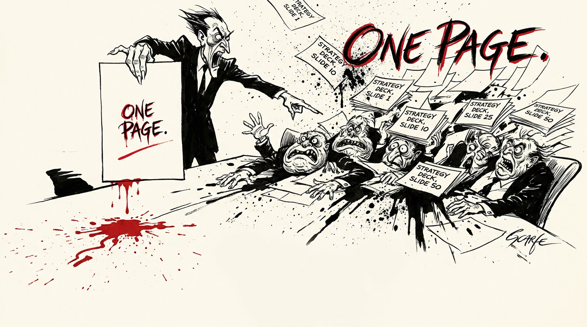

*First: the commercial risk.* Companies whose AI agents can reason over their data will outcompete companies whose agents cannot. Your competitors’ agents will reason. Yours will guess. The gap between reasoning and guessing is the gap between winning and losing.

*Second: the three investments.* Vocabulary: top twenty definitions, machine-readable, governed. Weeks, not months. Semantic layer: routing intelligence that maps concepts to data, queryable by humans and AI. Months, not years. Agent infrastructure: governed access through the semantic layer with pre-flight checks for quality, freshness, and access. Ongoing capability, not a project with an end date. Six to ten people building a foundation that serves dashboards, reports, conversational analytics, and autonomous agents. One investment, multiple returns.

*Third: what to stop spending on.* Standalone governance tools outside the pipeline. Dashboard proliferation that creates forty definitions of the same metric. Multi-year catalog projects obsolete before they ship. Consultant-built parallel infrastructure that creates permanent dependency. Stop telling the board "we need more data engineers." Start telling them: "We need to make our data machine-readable."

One page. Three arguments.

==== The Regulatory Case

The same infrastructure that enables AI satisfies the regulator. Auditors ask: authoritative data sources? Data storage and ownership? Data dictionary? Vocabulary and semantic layer answer by construction. The EU AI Act, now in force, mandates data lineage and provenance for high-risk AI systems. The three investments are defensive infrastructure, not just an offensive play.

==== The "Strategy Is Architecture" Position

This playbook is an architecture document with strategic implications, not a data strategy document. The industry separates "data strategy" (vision, goals, policies) from "data architecture" (technical design, infrastructure). Convenient for consultants who sell strategy engagements. Harmful for organizations that need to execute.

Strategy without architecture is a wish list. Architecture without strategy is expensive plumbing. The three investments are architectural decisions that constitute a strategy. No separate strategy document needed.

Gartner estimates the annual cost of poor data quality at $12.9 to $15 million per enterprise. That is the cost of not having the architecture. The three investments are cheaper than the alternative.

==== The Risk of This Playbook

If this playbook becomes a fifty-slide deck for a governance committee, or a multi-year program with a steering committee and quarterly reviews, it has failed. If you are reading this in a committee meeting, you are already doing it wrong.

The four diagnostic questions can be answered in ten minutes. The vocabulary starts this week. The semantic layer starts this month. The agent infrastructure starts this quarter. The things to stop spending on can be stopped today.

Your data platform has a new primary consumer, and it is not human. Not yet fully arrived, but arriving —- and it cannot squint at bad data and figure it out. It cannot ask the analyst down the hall what a column name means. It needs clean semantics or it fails. The companies that give their AI clean semantics will outcompete the companies that do not. That is not a prediction so much as a description of what is already beginning to happen.

Build the vocabulary. Build the semantic layer. Build the agent infrastructure. Stop spending on everything else.

Start Monday.

== No Walls

Ask one question, get the right answer. That is the use case that drove all of this. Solve it, and the real question arrives: what is more interesting than one answer? A thousand. Exploration — every pathway of interconnected data, the models, the sandpits, all the knowledge at once. One answer is the floor. A mind turned loose on the whole estate is the ceiling.

[#fig-gate-no-walls]
."No walls": fencing the chatbot while every other consumer walks straight in is theatre. The estate is open by design — every pathway reachable, every hop still governed by one shared vocabulary, not a gate.
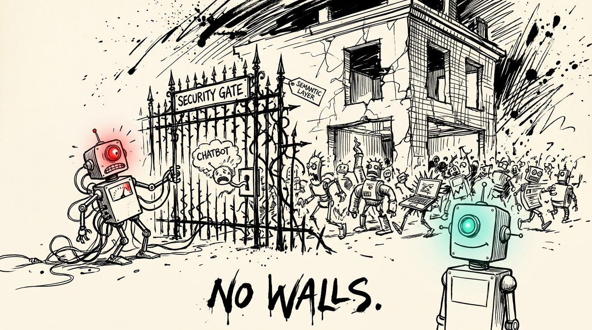

This used to be hard. Data walled off in segregated zones. The interesting trial sets undocumented on someone's laptop. Plumbing the analyst had to lay again every single time. It is why Databricks gets bought. And it almost works — until the explorer is an agentic data scientist in a box: no laptop, no colleague to ask, only what the platform makes explicit. Friction that merely slowed a human stops an agent dead.

It should never have been a problem. Not for your advanced analytics team. Not for your curious head of sales, chasing a hunch through five domains before lunch. No segregated zones. No laptops. No redundant plumbing. Every pathway open, every dataset described, every hop carried by one vocabulary.

Build the vocabulary, and the walls come down on their own — between the question and the answer, between the analyst and the agent, between a company and everything it already knows. The platform stops being a place you query. It becomes a place you think.

No walls.

== References

Ehrig, H., Ehrig, K., Prange, U., & Taentzer, G. (2006). _Fundamentals of Algebraic Graph Transformation_. Springer. [Double-pushout rewriting and the gluing conditions.]

Goguen, J. A., & Burstall, R. M. (1992). Institutions: Abstract model theory for specification and programming. _Journal of the ACM_, 39(1), 95–146.

Johnson, M., Rosebrugh, R., & Wood, R. J. (2002). Entity-relationship-attribute designs and sketches. _Theory and Applications of Categories_, 10(3), 94–112. [Schemas as finite-limit sketches; instances as Set-models.]

Crossley, J. N., Poernomo, I. H., & Wirsing, M. (2000). Extraction of structured programs from specification proofs. In D. Bert, C. Choppy, & P. D. Mosses (Eds.), _Recent Trends in Algebraic Development Techniques (WADT'99, Château de Bonas, 15–18 September 1999)_, Lecture Notes in Computer Science, vol. 1827 (pp. 419–437). Springer. [The origin of the construction used in this book: a calculus whose structural rules are renaming, hiding, and the union of specifications — the pushout.]

Poernomo, I. H., & Crossley, J. N. (2001). Protocols between programs and proofs. In K.-K. Lau (Ed.), _Logic Based Program Synthesis and Transformation (LOPSTR 2000)_, Lecture Notes in Computer Science, vol. 2042. Springer, Berlin Heidelberg. DOI 10.1007/3-540-45142-0_2. [Generalization of the protocol across constructive deductive systems and type theories.]

Poernomo, I. H., Wirsing, M., & Crossley, J. N. (2005). _Adapting Proofs-as-Programs: The Curry–Howard Protocol_. Monographs in Computer Science. Springer, New York. Hardcover ISBN 978-0-387-23759-6. DOI 10.1007/0-387-28183-5. [The collected framework; categorical structuring of specifications and the pushout-union construction.]

Snodgrass, R. T. (2000). _Developing Time-Oriented Database Applications in SQL_. Morgan Kaufmann. [Valid time, transaction time; the temporal query taxonomy.]

Spivak, D. I. (2012). Functorial data migration. _Information and Computation_, 217, 31–51.

Spivak, D. I. (2014). _Category Theory for the Sciences_. MIT Press. [Ologs; schemas as categories.]

ISO/IEC. (2011). _SQL:2011_ (ISO/IEC 9075:2011), temporal table features.

Danielsson, N. A., Hughes, J., Jansson, P., & Gibbons, J. (2006). Fast and loose reasoning is morally correct. _POPL ’06_, 206–217. [Licence for reasoning in the idealised setting and transporting conclusions.]

_Note: industry figures cited in the text (Gartner data-quality cost estimates, agent-adoption and metadata-maturity percentages, conversational-AI market projections, and vendor benchmark results) are attributed inline to their sources at point of use. Confirm each against its current published source before press._
